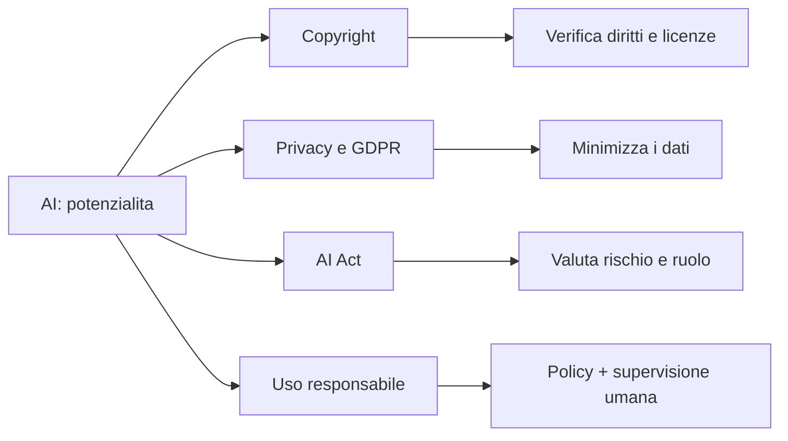
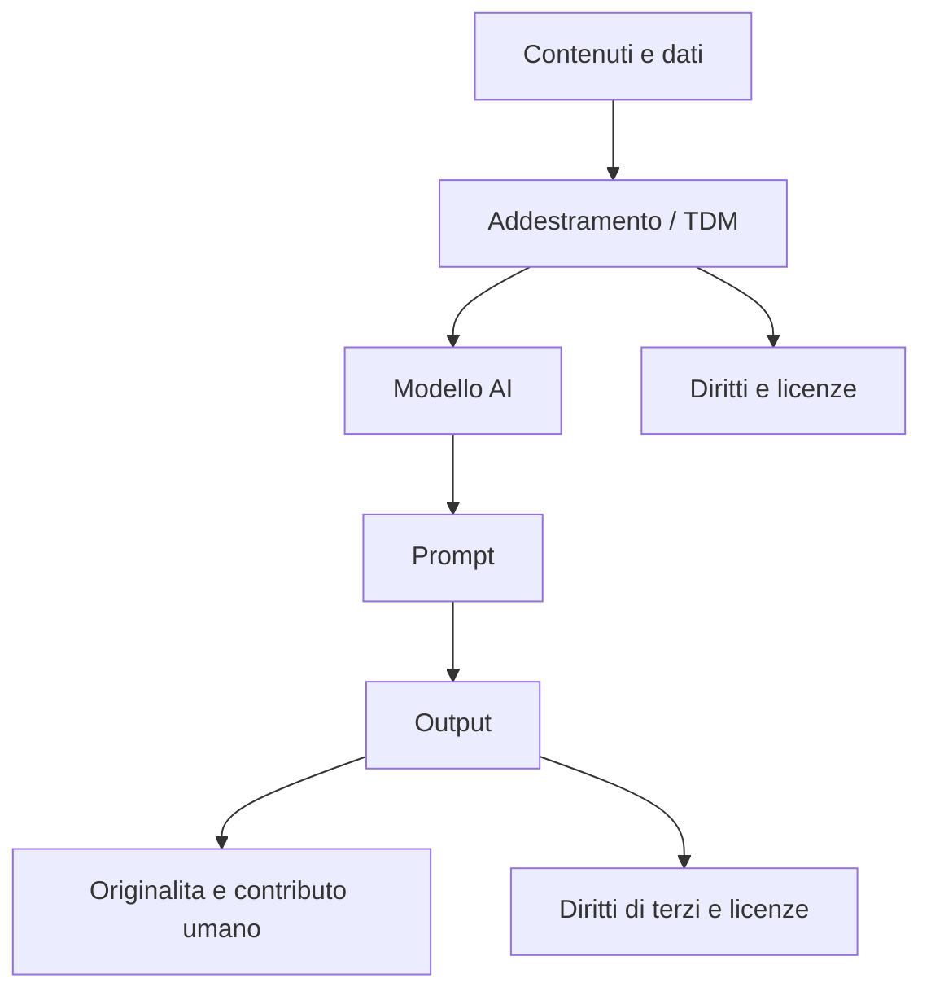
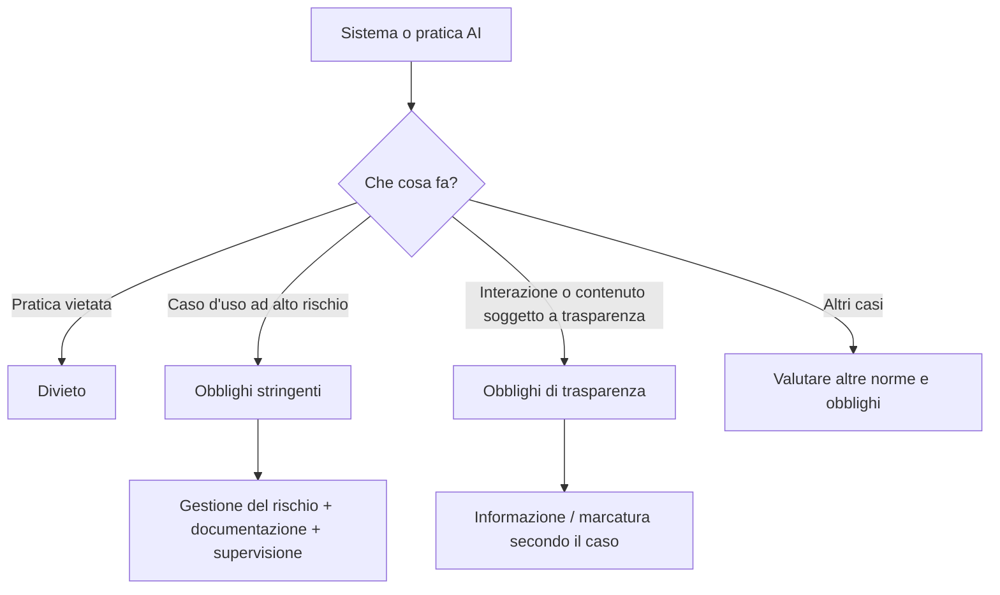
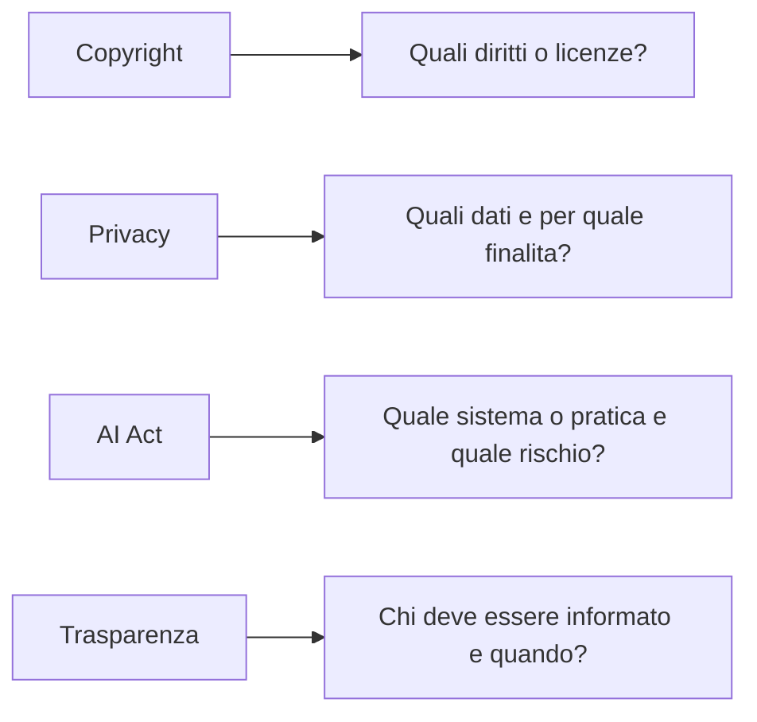
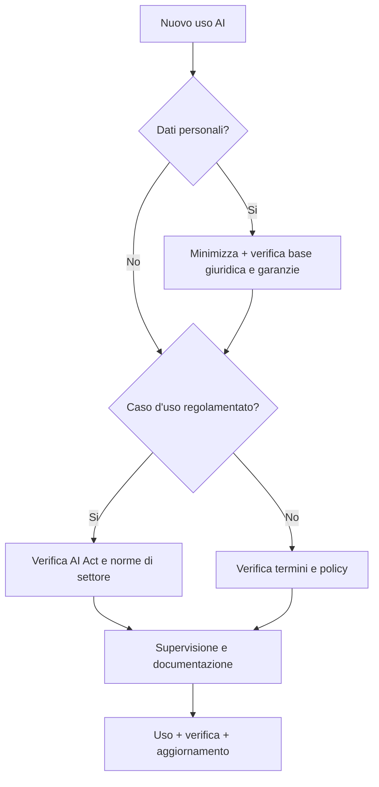

# 📘 Modulo 3: Etica e Normativa
**Livello Base — Master in Intelligenza Artificiale | GCProf Academy**

> **Nota di aggiornamento:** contenuti normativi verificati rispetto alle fonti ufficiali UE disponibili a settembre 2026. Le date e gli obblighi possono essere soggetti a ulteriori aggiornamenti.

🕒 Tempo stimato: 4-5 ore · 🎯 Difficoltà: Base

---

## 📑 Indice del Modulo

1. [Introduzione](#1-introduzione)
2. [Obiettivi](#2-obiettivi)
3. [Prerequisiti](#3-prerequisiti)
4. [Lezioni](#4-lezioni)
5. [Esempi](#5-esempi)
6. [Laboratorio](#6-laboratorio)
7. [Best Practice](#7-best-practice)
8. [Errori Comuni](#8-errori-comuni)
9. [Riepilogo](#9-riepilogo)
10. [Glossario](#10-glossario)
11. [Quiz](#11-quiz)
12. [Project Work](#12-project-work)
13. [Materiale Scaricabile](#13-materiale-scaricabile)
14. [Bibliografia](#14-bibliografia)
15. [Sitografia](#15-sitografia)

---

## 1. Introduzione

<!-- INFOGRAFICA MERMAID: mappa del modulo -->

Nei primi due moduli hai imparato **cos'è** l'Intelligenza Artificiale e **come comunicare** efficacemente con un LLM tramite il prompting. Ma sapere *come si usa* uno strumento non basta: bisogna sapere anche **quando, come e con quali limiti** è opportuno usarlo.

L'AI non è un territorio senza regole. È un ambito in rapidissima evoluzione normativa: l'Unione Europea sta applicando progressivamente il **Regolamento (UE) 2024/1689**, meglio noto come **AI Act**, il primo quadro normativo organico dell'UE dedicato all'intelligenza artificiale. Conoscerne i principi non è un esercizio teorico: è una competenza utile per scuole, aziende e pubbliche amministrazioni.

In questo modulo affronterai quattro grandi aree:
- **Copyright**: quali questioni possono emergere per i dati di addestramento e per gli output generati o assistiti dall'AI.
- **Privacy e GDPR**: come valutare il trattamento dei dati personali quando usi un chatbot o un servizio AI.
- **AI Act europeo**: il quadro normativo che classifica determinati sistemi e pratiche AI in base al rischio e stabilisce obblighi diversi per provider e deployer.
- **Linee guida pratiche**: come impostare un uso responsabile dell'AI a scuola e in azienda, con policy chiare e sostenibili.

Alla fine del modulo non sarai un avvocato, ma saprai **riconoscere i principali rischi**, **fare le domande giuste**, distinguere **obblighi, buone pratiche e aree ancora in evoluzione** e muoverti con maggiore consapevolezza.

[🔝 Torna all'indice del modulo](#top)

---

## 2. Obiettivi

Al termine di questo modulo sarai in grado di:

- ✅ Spiegare le principali problematiche di **copyright** legate a contenuti generati dall'AI e al training dei modelli.
- ✅ Descrivere i principi fondamentali del **GDPR** e come si applicano quando usi strumenti di intelligenza artificiale.
- ✅ Riconoscere la **classificazione del rischio** prevista dall'AI Act (pratiche vietate, sistemi ad alto rischio, obblighi di trasparenza e altri sistemi) e collocarvi esempi concreti.
- ✅ Distinguere il ruolo di **provider** (chi sviluppa/fornisce un sistema AI) da quello di **deployer** (chi lo utilizza nella propria organizzazione).
- ✅ Individuare le **scadenze normative** rilevanti dell'AI Act e distinguere le disposizioni già applicabili da quelle soggette a periodi transitori.
- ✅ Redigere una checklist essenziale per un uso etico dell'AI a scuola o sul lavoro.
- ✅ Valutare in autonomia se un caso d'uso AI rientra in una "zona rossa" da evitare.

[🔝 Torna all'indice del modulo](#top)

---

## 3. Prerequisiti

- Aver completato **Modulo 1 (Fondamenti di AI)** e **Modulo 2 (Prompt Engineering)**.
- Nessuna conoscenza giuridica pregressa richiesta.
- Nessuna competenza di programmazione richiesta (questo modulo è ancora Livello Base).
- Curiosità verso il funzionamento delle istituzioni europee: aiuta, ma non è obbligatoria.

[🔝 Torna all'indice del modulo](#top)

---

## 4. Lezioni

### 4.1 — Copyright e Intelligenza Artificiale

<!-- INFOGRAFICA MERMAID: copyright a monte e a valle -->

L'AI generativa pone due problemi distinti, spesso confusi tra loro:

**A) Il problema "a monte" — i dati di addestramento**
I grandi modelli linguistici vengono addestrati su enormi quantità di testo, immagini e codice raccolti dal web. Buona parte di questo materiale è protetto da copyright. Editori, autori e artisti in tutto il mondo hanno avviato cause legali contro le principali aziende AI, sostenendo che l'addestramento senza autorizzazione violi i loro diritti. Non esiste ancora una posizione giuridica unanime: alcuni ordinamenti (come gli USA) valutano caso per caso se si tratti di *fair use*, altri (come l'UE) prevedono eccezioni specifiche per il *text and data mining*, con la possibilità per i titolari dei diritti di "riservarsi" l'uso dei propri contenuti (opt-out).

**B) Il problema "a valle" — i contenuti generati**
Chi possiede i diritti su un testo, un'immagine o un codice generato da un'AI? La risposta cambia da paese a paese:
- Negli **Stati Uniti**, l'ufficio copyright (US Copyright Office) ha più volte affermato che un'opera priva di un contributo creativo umano sostanziale non è tutelabile da copyright.
- In **Italia e nell'UE**, la tutela del diritto d'autore dipende dai requisiti previsti dalla normativa applicabile e dal contributo creativo umano. Un output generato senza un apporto creativo umano significativo non va quindi considerato automaticamente protetto dal diritto d'autore; la valutazione concreta può dipendere dal caso e dall'ordinamento.
- Il consiglio pratico: se un output AI riproduce in modo riconoscibile un'opera, un personaggio, un testo, un'immagine o codice protetto da diritti o licenze, **non considerarlo automaticamente libero da vincoli**. Verifica origine, licenza, modalità d'uso e destinazione del contenuto.

> 💡 Perché ti riguarda da insegnante: se usi materiale generato dall'AI nelle tue lezioni o lo fai produrre ai tuoi studenti, è buona norma dichiararne l'origine e verificare che non riproduca opere esistenti in modo troppo simile.

### 4.2 — Privacy e GDPR: le basi

<!-- INFOGRAFICA SVG: ciclo minimo di valutazione privacy -->
<svg xmlns="http://www.w3.org/2000/svg" viewBox="0 0 900 250" role="img" aria-label="Ciclo di valutazione privacy prima di usare un servizio AI">
  
  <defs><marker id="a" markerWidth="10" markerHeight="10" refX="9" refY="3" orient="auto"><path d="M0,0 L10,3 L0,6 z" fill="#64748b"/></marker></defs>
  <rect class="box" x="20" y="80" width="155" height="90" rx="12"/><text class="title" x="98" y="112" text-anchor="middle">1. Dato</text><text class="txt" x="98" y="140" text-anchor="middle">È personale?</text>
  <rect class="box" x="195" y="80" width="155" height="90" rx="12"/><text class="title" x="273" y="112" text-anchor="middle">2. Finalità</text><text class="txt" x="273" y="140" text-anchor="middle">È necessaria?</text>
  <rect class="box" x="370" y="80" width="155" height="90" rx="12"/><text class="title" x="448" y="112" text-anchor="middle">3. Fornitore</text><text class="txt" x="448" y="140" text-anchor="middle">Come tratta i dati?</text>
  <rect class="box" x="545" y="80" width="155" height="90" rx="12"/><text class="title" x="623" y="112" text-anchor="middle">4. Garanzie</text><text class="txt" x="623" y="140" text-anchor="middle">Sicurezza e trasferimenti</text>
  <rect class="box" x="720" y="80" width="155" height="90" rx="12"/><text class="title" x="798" y="112" text-anchor="middle">5. Decisione</text><text class="txt" x="798" y="140" text-anchor="middle">Uso / modifica / stop</text>
  <path class="arrow" d="M175 125 H195"/><path class="arrow" d="M350 125 H370"/><path class="arrow" d="M525 125 H545"/><path class="arrow" d="M700 125 H720"/>
</svg>

Il **GDPR** (Regolamento Generale sulla Protezione dei Dati, Regolamento UE 2016/679) è la legge europea che disciplina il trattamento dei dati personali. Non è nato per l'AI, ma si applica pienamente a essa, perché ogni volta che un dato personale (nome, email, foto, voce, comportamento) entra in un sistema AI, quel trattamento deve rispettarne i principi.

I principi chiave da conoscere:

| Principio | Cosa significa in pratica |
|---|---|
| **Liceità e trasparenza** | Le persone devono sapere che i loro dati vengono trattati da un sistema AI, e su quale base giuridica |
| **Minimizzazione** | Si raccolgono solo i dati strettamente necessari, non "tutto quello che si può" |
| **Limitazione della finalità** | Un dato raccolto per uno scopo non può essere riusato liberamente per un altro |
| **Esattezza** | I dati devono essere corretti e aggiornati — un problema serio con i modelli AI, che possono "allucinare" informazioni false su persone reali |
| **Diritto all'oblio e accesso** | Le persone possono chiedere la cancellazione o la consultazione dei propri dati, anche quelli usati per addestrare o alimentare un modello |

**Un caso pratico per la scuola**: se carichi elaborati, foto o altri dati riferibili a studenti minorenni su un servizio AI online, puoi effettuare un trattamento di dati personali soggetto al GDPR e alle ulteriori regole applicabili. Serve quindi attenzione: leggere l'informativa privacy del servizio, verificare ruoli e garanzie contrattuali, capire come vengono trattati e conservati i dati ed evitare di caricare dati identificativi non necessari. La sola pseudonimizzazione non elimina automaticamente gli obblighi GDPR se la persona resta reidentificabile.

### 4.3 — L'AI Act europeo: architettura e stato dell'arte

<!-- INFOGRAFICA MERMAID: approccio basato sul rischio -->

Il **Regolamento (UE) 2024/1689**, noto come **AI Act**, è il quadro normativo dell'Unione Europea sull'intelligenza artificiale. È entrato in vigore il 1° agosto 2024; essendo un regolamento, è direttamente applicabile negli Stati membri secondo le date e le disposizioni previste dal regolamento stesso e dai successivi atti applicabili.

L'impianto si basa su un **approccio basato sul rischio** (*risk-based approach*): più un sistema AI può incidere sui diritti fondamentali delle persone, più stringenti sono gli obblighi.

**Le principali categorie di rischio e obblighi:**

1. 🔴 **Pratiche di IA vietate.** Comprendono determinate pratiche considerate incompatibili con i diritti e i valori dell'UE, con divieti applicabili dal **2 febbraio 2025**.
2. 🟠 **Sistemi ad alto rischio — fortemente regolamentati.** Comprendono specifici sistemi e casi d'uso, anche in ambiti come occupazione, istruzione, accesso a servizi essenziali e infrastrutture critiche. Gli obblighi dipendono dalla specifica categoria e dalla data di applicazione prevista.
3. 🟡 **Sistemi soggetti a obblighi di trasparenza.** Per esempio, le persone devono essere informate quando interagiscono con determinati sistemi AI; per determinati contenuti sintetici sono previsti obblighi di marcatura o informazione.
4. 🟢 **Altri sistemi AI.** Non tutti i sistemi non vietati sono soggetti allo stesso livello di obblighi: possono comunque applicarsi altre norme UE o nazionali, oltre a buone pratiche e obblighi specifici in base al contesto.

**Due ruoli fondamentali da distinguere:**
- **Provider**: chi sviluppa e immette sul mercato un sistema AI (es. le aziende che creano i grandi modelli).
- **Deployer**: chi utilizza un sistema AI nella propria organizzazione (es. una scuola che usa un chatbot AI per gli studenti, un'azienda che integra un LLM nei propri processi).

Gli obblighi cambiano a seconda del ruolo, del tipo di sistema e del caso d'uso: **provider** e **deployer** possono avere responsabilità differenti e, in determinati contesti, obblighi specifici. Essere deployer non significa essere esenti dagli obblighi.

**Il calendario di applicazione (aggiornato a settembre 2026):**

| Data | Cosa entra in vigore |
|---|---|
| 2 febbraio 2025 | Divieto dei sistemi a rischio inaccettabile |
| 2 agosto 2025 | Obblighi per i modelli di AI per finalità generale (GPAI) — riguarda direttamente chi usa LLM come Claude, GPT o Gemini in produzione |
| 2 agosto 2026 | Applicazione generale del regolamento, con le eccezioni previste, e applicazione degli obblighi di trasparenza dell'art. 50 |
| 2 dicembre 2026 | Per determinati sistemi già immessi sul mercato prima del 2 agosto 2026, termine transitorio relativo alla marcatura/rilevabilità dei contenuti sintetici; da questa data si applicano inoltre specifici nuovi divieti previsti dal quadro aggiornato |
| 2 dicembre 2027 / 2 agosto 2028 | Applicazione delle regole sui sistemi ad **alto rischio** dell'allegato III e, rispettivamente, dei sistemi ad alto rischio integrati in prodotti regolamentati (allegato I), secondo il calendario aggiornato dall'AI Omnibus |

> ⚠️ **Nota per il docente/formatore**: le scadenze sull'alto rischio sono state posticipate dal pacchetto di semplificazione "Digital Omnibus/AI Omnibus" nel corso del 2026. Le date qui riportate riflettono lo stato a luglio 2026, ma trattandosi di una normativa in evoluzione attiva, è buona pratica verificare periodicamente eventuali aggiornamenti sul sito ufficiale della Commissione Europea prima di ogni erogazione del corso.

Resta già applicabile l'obbligo di **AI literacy** (alfabetizzazione all'AI): provider e deployer devono adottare misure per garantire, per quanto possibile, un livello sufficiente di competenza e consapevolezza tra il personale e le altre persone che operano o utilizzano sistemi AI per loro conto. È uno dei motivi per cui una formazione strutturata sull'AI è oggi particolarmente rilevante.

### 4.4 — Linee guida per un uso responsabile a scuola e in azienda

<!-- INFOGRAFICA SVG: ciclo operativo uso responsabile -->
<svg xmlns="http://www.w3.org/2000/svg" viewBox="0 0 900 300" role="img" aria-label="Ciclo operativo per l'uso responsabile dell'intelligenza artificiale">
  
  <defs><marker id="m" markerWidth="10" markerHeight="10" refX="9" refY="3" orient="auto"><path d="M0,0 L10,3 L0,6 z" fill="#64748b"/></marker></defs>
  <rect class="box" x="30" y="95" width="150" height="105" rx="14"/><text class="n" x="105" y="128" text-anchor="middle">1. Scopo</text><text class="t" x="105" y="157" text-anchor="middle">Definisci uso</text><text class="t" x="105" y="178" text-anchor="middle">e responsabilita</text>
  <rect class="box" x="210" y="95" width="150" height="105" rx="14"/><text class="n" x="285" y="128" text-anchor="middle">2. Dati</text><text class="t" x="285" y="157" text-anchor="middle">Minimizza e</text><text class="t" x="285" y="178" text-anchor="middle">proteggi</text>
  <rect class="box" x="390" y="95" width="150" height="105" rx="14"/><text class="n" x="465" y="128" text-anchor="middle">3. Strumento</text><text class="t" x="465" y="157" text-anchor="middle">Verifica servizio,</text><text class="t" x="465" y="178" text-anchor="middle">termini e policy</text>
  <rect class="box" x="570" y="95" width="150" height="105" rx="14"/><text class="n" x="645" y="128" text-anchor="middle">4. Output</text><text class="t" x="645" y="157" text-anchor="middle">Controllo umano</text><text class="t" x="645" y="178" text-anchor="middle">e verifica</text>
  <rect class="box" x="750" y="95" width="120" height="105" rx="14"/><text class="n" x="810" y="128" text-anchor="middle">5. Policy</text><text class="t" x="810" y="157" text-anchor="middle">Registra e</text><text class="t" x="810" y="178" text-anchor="middle">aggiorna</text>
  <path class="a" d="M180 147 H210"/><path class="a" d="M360 147 H390"/><path class="a" d="M540 147 H570"/><path class="a" d="M720 147 H750"/>
</svg>

Non basta conoscere la norma: serve tradurla in comportamenti quotidiani. Alcuni principi guida trasversali:

- **Trasparenza dichiarata**: quando una norma, una policy interna o il contesto lo richiede, indica l'uso dell'AI e applica le modalità di informazione previste.
- **Verifica umana (human-in-the-loop)**: non fidarti ciecamente di un output AI, specialmente su fatti, numeri, citazioni o decisioni che riguardano persone (es. valutazioni, selezioni, diagnosi).
- **Minimizzazione dei dati**: prima di caricare qualsiasi documento o dato su un servizio AI, chiediti se contiene informazioni personali o riservate non necessarie.
- **Policy scritta**: sia a scuola che in azienda, è buona pratica avere una policy interna semplice che indichi quali strumenti AI sono ammessi, per quali usi, quali dati non vanno condivisi e chi decide in caso di dubbio.
- **Formazione continua**: la normativa e gli strumenti cambiano rapidamente; una policy deve quindi essere riesaminata e aggiornata periodicamente.

[🔝 Torna all'indice del modulo](#top)

---

## 5. Esempi

<!-- INFOGRAFICA MERMAID: quattro casi, quattro domande -->

**Esempio 1 — Copyright**
Uno studente chiede a un LLM di "scrivere una storia nello stile di Harry Potter, con Hermione come protagonista". Anche se il testo è tecnicamente "nuovo", riproduce personaggi e ambientazione protetti da copyright: non va pubblicato o diffuso come se fosse un'opera originale libera da diritti.

**Esempio 2 — Privacy in classe**
Un docente vuole usare un chatbot AI per correggere automaticamente i compiti in classe. Prima di farlo dovrebbe: verificare l'informativa privacy del servizio, evitare di caricare nome e cognome completi degli studenti (usare codici numerici), controllare se il fornitore usa i dati caricati per riaddestrare i propri modelli.

**Esempio 3 — Classificazione del rischio AI Act**
Un sistema AI utilizzato per la selezione o valutazione delle persone nell'accesso al lavoro può rientrare tra i sistemi **ad alto rischio**, a seconda della specifica funzione e dei requisiti dell'AI Act: la classificazione va verificata sul caso concreto. Un filtro AI che suggerisce prodotti simili in un e-commerce, invece, non rientra automaticamente nella stessa categoria di rischio; possono comunque applicarsi altre norme.

**Esempio 4 — Trasparenza**
Un'azienda pubblica un video promozionale con un testimonial generato tramite AI. Gli obblighi di trasparenza dell'AI Act dipendono dalla natura del contenuto e dal modo in cui viene utilizzato; per i **deepfake** sono previste specifiche informazioni al pubblico, con eccezioni e condizioni previste dall'art. 50. È quindi necessario verificare il caso concreto anziché applicare un'etichetta unica a ogni contenuto AI.

[🔝 Torna all'indice del modulo](#top)

---

## 6. Laboratorio Pratico

<!-- INFOGRAFICA SVG: metodo del laboratorio -->
<svg xmlns="http://www.w3.org/2000/svg" viewBox="0 0 900 230" role="img" aria-label="Metodo in quattro passaggi per classificare un caso d'uso AI">
  
  <defs><marker id="q" markerWidth="10" markerHeight="10" refX="9" refY="3" orient="auto"><path d="M0,0 L10,3 L0,6 z" fill="#64748b"/></marker></defs>
  <rect class="c" x="30" y="65" width="190" height="100" rx="14"/><text class="h" x="125" y="100" text-anchor="middle">1. Identifica</text><text class="p" x="125" y="128" text-anchor="middle">Sistema, scopo,</text><text class="p" x="125" y="148" text-anchor="middle">contesto e attori</text>
  <rect class="c" x="250" y="65" width="190" height="100" rx="14"/><text class="h" x="345" y="100" text-anchor="middle">2. Classifica</text><text class="p" x="345" y="128" text-anchor="middle">Divieto, alto rischio,</text><text class="p" x="345" y="148" text-anchor="middle">trasparenza o altro</text>
  <rect class="c" x="470" y="65" width="190" height="100" rx="14"/><text class="h" x="565" y="100" text-anchor="middle">3. Motiva</text><text class="p" x="565" y="128" text-anchor="middle">Indica la norma o</text><text class="p" x="565" y="148" text-anchor="middle">il criterio rilevante</text>
  <rect class="c" x="690" y="65" width="180" height="100" rx="14"/><text class="h" x="780" y="100" text-anchor="middle">4. Verifica</text><text class="p" x="780" y="128" text-anchor="middle">Confronta fonti</text><text class="p" x="780" y="148" text-anchor="middle">e discuti divergenze</text>
  <path class="ar" d="M220 115 H250"/><path class="ar" d="M440 115 H470"/><path class="ar" d="M660 115 H690"/>
</svg>

**Obiettivo:** applicare la classificazione del rischio dell'AI Act a casi reali.

**Attività (individuale o a coppie, 30-40 minuti):**

1. Ti viene fornita una lista di 10 casi d'uso AI (vedi materiale scaricabile: `casi_uso_ai_act.md`).
2. Per ciascun caso, assegna la fascia di rischio corretta (inaccettabile / alto / limitato / minimo) motivando la scelta in 2-3 righe.
3. Per ogni caso classificato come "alto rischio" o "inaccettabile", indica chi ricopre il ruolo di **provider** e chi di **deployer** nello scenario descritto.
4. Confronta le tue risposte con un compagno o in plenaria: dove sono emerse divergenze? Perché?

**Estensione (facoltativa):** scrivi una bozza di **policy AI** di una pagina per la tua scuola o il tuo contesto di lavoro, includendo almeno: strumenti ammessi, dati mai condivisibili, obbligo di dichiarazione dell'uso AI, referente per eventuali dubbi.

[🔝 Torna all'indice del modulo](#top)

---

## 7. Best Practice

<!-- INFOGRAFICA MERMAID: checklist decisionale -->

- ✅ Prima di usare un nuovo servizio AI, leggi (almeno in sintesi) l'informativa privacy e i termini di servizio.
- ✅ Valuta il luogo e le modalità di trattamento dei dati, le garanzie contrattuali, i trasferimenti internazionali e le misure di sicurezza; la sola localizzazione nell'UE non è, da sola, una garanzia sufficiente.
- ✅ Documenta sempre quando un contenuto è stato generato o assistito dall'AI, anche internamente.
- ✅ Mantieni sempre un controllo umano finale sulle decisioni che impattano le persone.
- ✅ Aggiorna periodicamente la tua conoscenza della normativa: l'AI Act è in evoluzione attiva, come dimostra il pacchetto di semplificazione "AI Omnibus" del 2026.
- ✅ In ambito scolastico, coinvolgi sempre la dirigenza e, se necessario, il DPO (Responsabile della Protezione dei Dati) dell'istituto prima di adottare strumenti AI su larga scala.

[🔝 Torna all'indice del modulo](#top)

---

## 8. Errori Comuni

- ❌ **"L'AI Act non mi riguarda, non sono un'azienda tech."** Errato: anche chi utilizza sistemi AI nella propria organizzazione può rientrare nel ruolo di *deployer* e può essere soggetto a obblighi specifici in base al sistema e al caso d'uso.
- ❌ **"Se lo genera l'AI, è automaticamente libero da copyright."** Falso: dipende da cosa riproduce l'output, non da come è stato creato.
- ❌ **"Il GDPR riguarda solo i dati finanziari o sanitari."** Falso: il GDPR riguarda i **dati personali** in senso ampio; dati finanziari e sanitari sono solo esempi, e i dati sanitari appartengono inoltre a categorie particolari soggette a protezioni specifiche.
- ❌ **"Le scadenze normative sono fisse e definitive."** Attenzione: il calendario è stato modificato nel tempo e contiene periodi transitori; verifica sempre il testo vigente e le fonti ufficiali prima di decisioni importanti.
- ❌ **Confondere "rischio inaccettabile" con "alto rischio".** Il primo è vietato per legge, il secondo è permesso ma fortemente regolamentato.

[🔝 Torna all'indice del modulo](#top)

---

## 9. Riepilogo

<!-- INFOGRAFICA SVG: i tre pilastri del modulo -->
<svg xmlns="http://www.w3.org/2000/svg" viewBox="0 0 900 260" role="img" aria-label="Tre pilastri dell'uso responsabile dell'intelligenza artificiale">
  
  <rect class="b" x="45" y="55" width="245" height="145" rx="16"/><text class="h" x="168" y="95" text-anchor="middle">1. Diritti</text><text class="p" x="168" y="126" text-anchor="middle">Copyright</text><text class="p" x="168" y="149" text-anchor="middle">Privacy e GDPR</text><text class="p" x="168" y="172" text-anchor="middle">Diritti fondamentali</text>
  <rect class="b" x="328" y="55" width="245" height="145" rx="16"/><text class="h" x="450" y="95" text-anchor="middle">2. Regole</text><text class="p" x="450" y="126" text-anchor="middle">AI Act</text><text class="p" x="450" y="149" text-anchor="middle">Rischio e trasparenza</text><text class="p" x="450" y="172" text-anchor="middle">Provider / Deployer</text>
  <rect class="b" x="610" y="55" width="245" height="145" rx="16"/><text class="h" x="733" y="95" text-anchor="middle">3. Pratica</text><text class="p" x="733" y="126" text-anchor="middle">Minimizzazione</text><text class="p" x="733" y="149" text-anchor="middle">Supervisione umana</text><text class="p" x="733" y="172" text-anchor="middle">Policy e formazione</text>
</svg>

In questo modulo hai imparato che l'uso dell'AI non è solo una questione tecnica, ma anche **etica e giuridica**. Hai visto come il copyright si applichi sia ai dati usati per addestrare i modelli sia ai contenuti che generano; come il GDPR regoli ogni trattamento di dati personali effettuato tramite sistemi AI; come l'**AI Act europeo** classifichi i sistemi in quattro fasce di rischio, con obblighi diversi per *provider* e *deployer* e un calendario di applicazione tuttora in evoluzione. Infine, hai visto come tradurre questi principi in comportamenti concreti attraverso linee guida pratiche per scuola e azienda.

Questa consapevolezza normativa è il terzo e ultimo pilastro del Livello Base, insieme ai fondamenti di AI (Modulo 1) e al prompt engineering (Modulo 2). Nel Project Work di fine livello, unirai tutte e tre le competenze per costruire una raccolta di prompt professionali pronta per l'uso aziendale.

[🔝 Torna all'indice del modulo](#top)

---

## 10. Glossario

| Termine | Definizione |
|---|---|
| **AI Act** | Regolamento (UE) 2024/1689: prima legge organica al mondo sull'intelligenza artificiale, basata su un approccio per livelli di rischio |
| **GDPR** | Regolamento (UE) 2016/679 sulla protezione dei dati personali |
| **Provider** | Soggetto che sviluppa e immette sul mercato un sistema AI |
| **Deployer** | Soggetto che utilizza un sistema AI nella propria organizzazione |
| **Rischio inaccettabile** | Categoria di usi AI vietati per legge (es. social scoring) |
| **Alto rischio** | Categoria di sistemi AI ammessi ma soggetti a obblighi stringenti |
| **GPAI** | *General Purpose AI*: modelli di intelligenza artificiale per finalità generale (es. i grandi LLM) |
| **Human-in-the-loop** | Approccio in cui una persona mantiene un ruolo di supervisione, controllo o verifica nel processo che utilizza l'AI |
| **AI literacy** | Misure volte a garantire un livello sufficiente di competenza e consapevolezza sull'uso dei sistemi AI, secondo l'art. 4 dell'AI Act |
| **Text and data mining** | Estrazione automatizzata di informazioni da grandi quantità di testo o dati, rilevante per l'addestramento dei modelli |
| **Opt-out (riserva dei diritti)** | Facoltà per un titolare di diritti d'autore di escludere i propri contenuti dall'uso per addestramento AI |

[🔝 Torna all'indice del modulo](#top)

---

## 11. Quiz di Autovalutazione

*(Formato compatibile con il parser Quiz Markdown della piattaforma)*

**1. Qual è la base giuridica dell'AI Act?**
- A) Direttiva UE, da recepire in ogni Stato membro
- B) Regolamento UE, direttamente applicabile senza recepimento nazionale ✅
- C) Trattato internazionale volontario
- D) Legge italiana adottata autonomamente

**2. In quale fascia di rischio rientra un sistema di social scoring?**
- A) Rischio minimo
- B) Rischio limitato
- C) Alto rischio
- D) Rischio inaccettabile (vietato) ✅

**3. Chi è il "deployer" secondo l'AI Act?**
- A) Chi sviluppa il sistema AI
- B) Chi utilizza il sistema AI nella propria organizzazione ✅
- C) Chi ne vieta l'uso
- D) L'organo di controllo europeo

**4. Il GDPR si applica a un sistema AI solo se tratta dati sanitari o finanziari.**
- A) Vero
- B) Falso: si applica a qualsiasi dato che identifica una persona ✅

**5. Un contenuto generato da un'AI è automaticamente libero da copyright.**
- A) Vero
- B) Falso: dipende da cosa l'output riproduce, non da come è stato creato ✅

**6. Cosa richiede l'obbligo di trasparenza per i chatbot previsto dall'AI Act?**
- A) Nulla, i chatbot sono a rischio minimo
- B) Che l'utente sappia di star interagendo con un sistema AI ✅
- C) Il divieto assoluto dei chatbot
- D) Una licenza governativa

**7. Cosa si intende per "AI literacy" nell'AI Act?**
- A) Un esame obbligatorio per usare l'AI
- B) L'obbligo di promuovere competenza e consapevolezza sull'AI nelle organizzazioni ✅
- C) Un certificato rilasciato solo alle aziende tech
- D) Un divieto di formazione sull'AI

[🔝 Torna all'indice del modulo](#top)

---

## 12. Project Work del Modulo

**Consegna:** Scegli un contesto reale (la tua scuola, il tuo posto di lavoro, o un'attività immaginaria coerente con il tuo settore) e produci un documento di 1-2 pagine intitolato **"Linee Guida per l'Uso Responsabile dell'AI"**, che includa:

1. Un elenco degli strumenti AI ammessi e per quali usi.
2. Una sezione su quali dati non vanno mai condivisi con servizi AI esterni.
3. Un riferimento esplicito ad almeno due principi del GDPR applicati al contesto scelto.
4. Una classificazione del rischio (secondo l'AI Act) di almeno un caso d'uso concreto del tuo contesto.
5. Una procedura semplice per dichiarare quando un contenuto è stato generato con l'AI.

Questo documento confluirà, insieme ai lavori dei Moduli 1 e 2, nel **Project Work di fine Livello Base**: la raccolta di prompt professionali.

[🔝 Torna all'indice del modulo](#top)

---

## 13. Materiale Scaricabile

- 📄 `casi_uso_ai_act.md` — I 10 casi d'uso per il laboratorio di classificazione del rischio
- 📄 `template_policy_ai.md` — Template vuoto per la policy AI (scuola/azienda)
- 📄 `checklist_privacy_ai.md` — Checklist rapida GDPR prima di usare un servizio AI
- 📊 `tabella_scadenze_ai_act.md` — Tabella riepilogativa delle scadenze normative, aggiornabile

*(I file sono disponibili nella sezione risorse del modulo sulla piattaforma)*

[🔝 Torna all'indice del modulo](#top)

---

## 14. Bibliografia

- Regolamento (UE) 2024/1689 del Parlamento europeo e del Consiglio del 13 giugno 2024 (AI Act)
- Regolamento (UE) 2016/679 del Parlamento europeo e del Consiglio del 27 aprile 2016 (GDPR)
- Floridi, L. — *Etica dell'Intelligenza Artificiale*, Raffaello Cortina Editore
- Pizzetti, F. — *Intelligenza artificiale, protezione dei dati personali e regolazione*, Giappichelli

[🔝 Torna all'indice del modulo](#top)

---

## 15. Sitografia

- Commissione Europea — Sito ufficiale AI Act: https://digital-strategy.ec.europa.eu/it/policies/regulatory-framework-ai
- Commissione Europea — Obblighi di trasparenza dell'articolo 50: https://digital-strategy.ec.europa.eu/it/faqs/transparency-obligations-under-article-50-ai-act
- Garante per la Protezione dei Dati Personali (Italia): garanteprivacy.it
- European Data Protection Board: edpb.europa.eu
- EUR-Lex (testo integrale dei regolamenti UE): eur-lex.europa.eu

> ⚠️ Ricorda: la normativa AI è in continua evoluzione. Verifica sempre le fonti ufficiali per gli aggiornamenti più recenti prima di prendere decisioni operative.

[🔝 Torna all'indice del modulo](#top)

---

**[👉 Prosegui con il Livello Successivo]**
