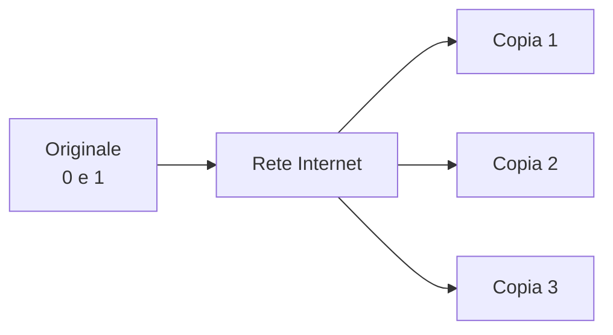
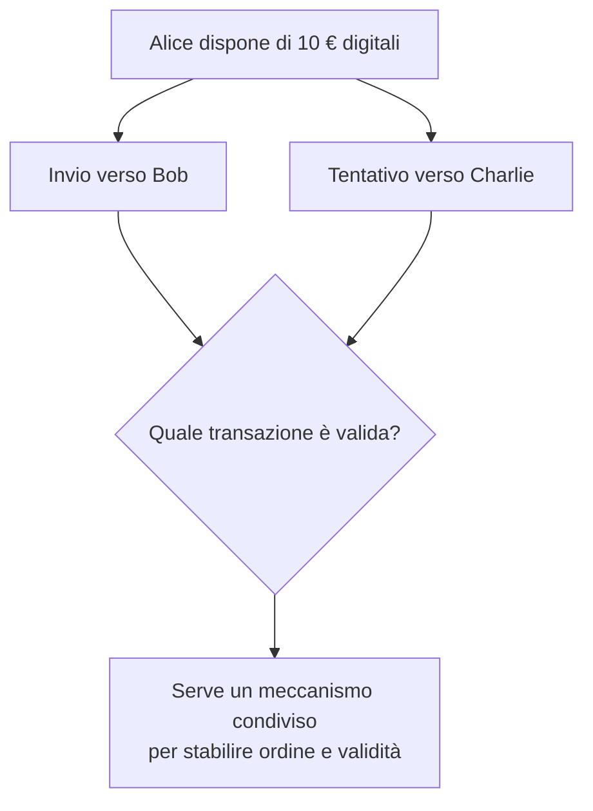
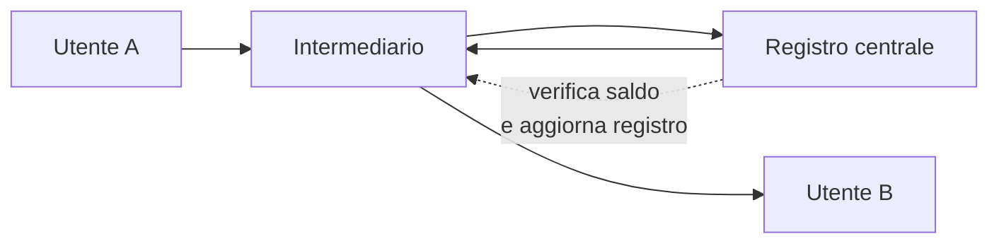
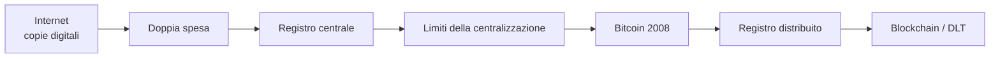
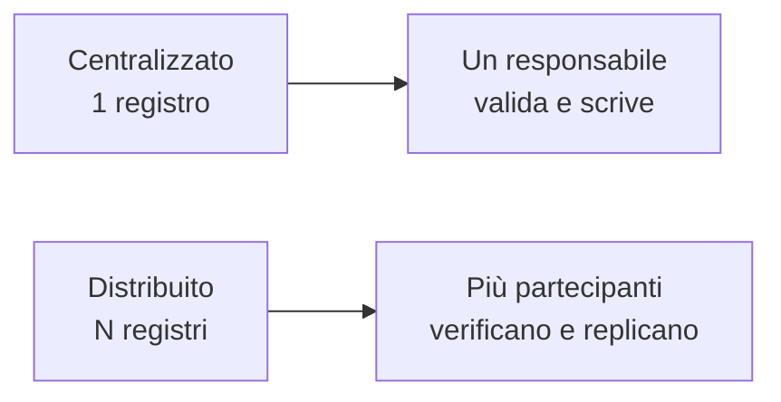

# ⛓️ Modulo 1 — Perché nasce la Blockchain

> **Corso:** Master in Blockchain & Web3: Da Zero a Blockchain Developer  
> **Piattaforma:** GCProf Academy  
> **Livello:** 🟢 Base (Fase 1 — Fondamenti della Blockchain)  
> **Target:** Studenti delle scuole superiori, universitari, docenti, sviluppatori e appassionati  
> **Prerequisiti:** Nessuno  
> **Obiettivo Didattico:** Comprendere le radici storiche, economiche e informatiche della Blockchain, analizzare il problema della doppia spesa, i limiti dei sistemi centralizzati e la nascita di Bitcoin nel 2008.

---

# 📑 Indice del Modulo 1

1. [Capitolo 1 — L'evoluzione della fiducia nella storia dell'uomo](#capitolo-1)
2. [Capitolo 2 — L'Internet dell'Informazione ed il Paradosso della Copia](#capitolo-2)
3. [Capitolo 3 — Il Problema della Doppia Spesa (Double Spending)](#capitolo-3)
4. [Capitolo 4 — L'Intermediario Centralizzato: Soluzione e Limiti](#capitolo-4)
5. [Capitolo 5 — Il Contesto Storico: La Crisi Finanziaria del 2008](#capitolo-5)
6. [Capitolo 6 — 31 Ottobre 2008: La Rivoluzione di Satoshi Nakamoto](#capitolo-6)
7. [Capitolo 7 — Dalla Moneta alla Tecnologia: L'Internet del Valore](#capitolo-7)
8. [Capitolo 8 — Sintesi, Laboratorio Concettuale e Autoverifica](#capitolo-8)

---

## 1. Capitolo 1 — L'evoluzione della fiducia nella storia dell'uomo

Per comprendere le ragioni profonde che hanno portato all'invenzione della Blockchain, occorre fare un passo indietro e porsi una domanda fondamentale: **come si scambiano beni e valore gli esseri umani?**

La storia del commercio umano è una storia di progressiva astrazione del concetto di **fiducia**:

* **Fiducia Diretta (Baratto):** Nelle società primitive, gli scambi avvenivano direttamente tra individui che si conoscevano (es. io ti do un sacco di grano, tu mi dai una pecora). Non servivano intermediari né registri, perché la transazione era simultanea e basata sulla fiducia interpersonale o sul controllo visivo.
* **Fiducia nella Merce (Moneta Merce):** Con l'espansione dei commerci, il baratto diventò inefficace. Si iniziarono a utilizzare beni dotati di valore intrinseco o di scarsità riconosciuta (sale, conchiglie, metalli preziosi come oro e argento).
* **Fiducia nell'Autorità Centrale (Moneta Fiduciaria o Fiat):** Con la diffusione della moneta fiat e il progressivo abbandono dei sistemi monetari legati all'oro, il valore della moneta non dipende più dalla convertibilità in una merce preziosa. Oggi banconote e saldi bancari funzionano all'interno di un sistema istituzionale e giuridico sostenuto dallo Stato, dalle banche centrali e dalla fiducia degli utilizzatori.

### Il ruolo del registro (Ledger)
Con la crescita dell'economia, il denaro fisico da solo non è più bastato. È diventato indispensabile annotare gli scambi su **registri contabili** (*ledger*). Chi possiede il registro e chi ne garantisce l'esattezza detiene, di fatto, il controllo sull'economia e sulle transazioni finanziarie.

[🔙 Torna all'indice](#indice)

---

## 2. Capitolo 2 — L'Internet dell'Informazione ed il Paradosso della Copia

Con la nascita di ARPANET e la successiva diffusione del World Wide Web tra gli anni '80 e '90, l'umanità ha assistito a una rivoluzione senza precedenti: la digitalizzazione delle informazioni.

L'Internet tradizionale (spesso definita **Web 1.0 e Web 2.0**) è stata progettata come una rete di trasmissione di dati il cui scopo primario è **la duplicazione e la condivisione dell'informazione**.

### Come funziona l'invio di informazione su Internet?
Quando invii un'email, un'immagine JPEG, un messaggio WhatsApp o un file PDF:
1. Il file originale rimane conservato sul tuo dispositivo (computer o smartphone).
2. Viene creata una **copia esatta** di bit (0 e 1).
3. La copia viene inviata attraverso la rete al destinatario.

Al termine dell'operazione, la stessa informazione esiste contemporaneamente in due o più luoghi diversi. Il costo marginale per creare una copia digitale aggiuntiva è praticamente pari a zero.

**Informazione:** la copia è una caratteristica fondamentale del digitale.  
**Valore:** un trasferimento deve invece stabilire chi può controllare o spendere quel valore.

### Il Paradosso applicato al Valore
Questa proprietà di **infinita duplicabilità** è straordinaria per la conoscenza, la cultura e le notizie. Tuttavia, risulta **catastrofica se applicata al denaro o al valore**.

Se invii 100 € digitali a un amico, non puoi limitarti a inviargli una copia del file mantenendo l'originale nel tuo portafoglio. Se così fosse, potresti inviare gli stessi 100 € a decine di altre persone. Il valore, per sua natura, richiede **scarsità e unicità**.

[🔙 Torna all'indice](#indice)

---

## 3. Capitolo 3 — Il Problema della Doppia Spesa (Double Spending)

In informatica, l'impossibilità intrinseca dei sistemi digitali tradizionali di garantire la non-duplicabilità di un dato senza un controllore prende il nome di **Problema della Doppia Spesa** (*Double Spending Problem*).

[ Alice ] ---- (Invia 10€ digitali) ----> [ Bob ]
|
+-------- (Può inviare gli STESSI 10€?) --------> [ Charlie ]

Senza un meccanismo di controllo:
* Alice possiede un file digitale rappresentante 10 €.
* Alice invia il file a Bob.
* Se Alice conserva il file originale o può riutilizzarlo, può inviare lo stesso file a Charlie.
* Bob e Charlie credono entrambi di aver ricevuto 10 €, ma il valore iniziale è stato "duplicato" arbitrariamente.

Per oltre trent'anni, informatici, matematici e crittografi si sono interrogati su come creare una moneta digitale pura (senza supporto fisico) in grado di impedire la doppia spesa su una rete aperta senza ricorrere a un'autorità centrale.

**Il punto centrale:** la rete deve stabilire quale transazione accettare quando due richieste tentano di spendere lo stesso valore.

[🔙 Torna all'indice](#indice)

---

## 4. Capitolo 4 — L'Intermediario Centralizzato: Soluzione e Limiti

Prima dell'avvento della Blockchain, l'unico modo per risolvere il problema della doppia spesa nel mondo digitale è stato l'introduzione di un **Intermediario Centralizzato di Fiducia** (*Trusted Third Party*).

### Come funciona il modello centralizzato?
Quando effettui un bonifico bancario o usi carte di credito/debito e servizi come PayPal, Apple Pay o Satispay:
1. Non stai trasferendo direttamente oggetti o token digitali tra utenti.
2. Invii una richiesta di transazione all'intermediario (la Banca o la piattaforma di pagamento).
3. L'intermediario controlla il proprio **database centrale (registro privato)** per verificare se possiedi saldo sufficiente.
4. L'intermediario sottrae l'importo dal tuo conto e lo accredita sul conto del destinatario.

[ Utente A ] -------> [ DATABASE CENTRALE (Banca) ] -------> [ Utente B ]
(Controllo e Scrittura)

In questo modello, il problema della doppia spesa è risolto perché l'autorità centrale è il solo soggetto autorizzato a modificare il registro contabile.

Il vantaggio è la semplicità del controllo; il rovescio della medaglia è la dipendenza dall'autorità centrale.

### I limiti del modello centralizzato
Sebbene sia efficace, questo modello presenta criticità e vulnerabilità strutturali profonde:

* **Single Point of Failure (Punto unico di vulnerabilità):** Se il database o i server centrali vanno offline per un guasto, un incendio o un attacco hacker, l'intero servizio si blocca.
* **Potere di Censura e Controllo:** L'ente centrale ha l'autorità incontestabile di congelare conti, bloccare trasferimenti o escludere utenti dal sistema finanziario senza preavviso.
* **Costi ed Efficienza Ridotta:** Per mantenere infrastrutture di sicurezza complesse e la burocrazia correlata, gli intermediari applicano commissioni (particolarmente elevate nei trasferimenti transfrontalieri) e tempi di regolamento lunghi.
* **Vulnerabilità dei Dati e Privacy:** La concentrazione dei dati presso un intermediario può creare un bersaglio di grande valore per attacchi informatici e data breach. Il livello di visibilità e profilazione dipende dalle informazioni raccolte e dalle regole dell'organizzazione.

[🔙 Torna all'indice](#indice)

---

## 5. Capitolo 5 — Il Contesto Storico: La Crisi Finanziaria del 2008

L'assetto centralizzato ha retto per decenni, sostenuto dalla convinzione che le grandi istituzioni finanziarie fossero "troppo grandi per fallire" (*Too Big to Fail*).

Tuttavia, nel settembre del **2008**, il sistema finanziario mondiale ha subito il più violento shock dal 1929: la crisi dei mutui subprime e il crollo della banca d'affari **Lehman Brothers**.

### Le conseguenze del crollo:
1. **Perdita di fiducia globale:** Milioni di cittadini in tutto il mondo hanno perso risparmi, posti di lavoro e case a causa di speculazioni spregiudicate condotte dagli stessi intermediari fidati.
2. **Salvaggi Statali (Bail-out):** I governi di tutto il mondo hanno stampato enormi quantità di moneta fiat per salvare le banche private in difficoltà, svalutando il potere d'acquisto dei cittadini tramite l'inflazione.
3. **Punto di svolta culturale ed economico:** È diventato evidente che affidare la totale gestione della moneta e della fiducia a un ristretto gruppo di entità centrali riservasse rischi sistemici enormi per l'intera società.

[🔙 Torna all'indice](#indice)

---

## 6. Capitolo 6 — 31 Ottobre 2008: La Rivoluzione di Satoshi Nakamoto

È esattamente in questo clima di crisi sistemica e sfiducia nelle istituzioni che, il **31 ottobre 2008**, un utente (o gruppo di utenti) fino ad oggi anonimo sotto lo pseudonimo di **Satoshi Nakamoto** pubblica un documento tecnico di 9 pagine nella mailing list di crittografia *Cypherpunk*.

Il documento è intitolato:  
**"Bitcoin: A Peer-to-Peer Electronic Cash System"**

### Il Whitepaper di Satoshi Nakamoto
Nakamoto non ha inventato da zero ogni singola tecnologia, ma ha combinato componenti già esistenti — tra cui funzioni di hash, firme digitali, reti peer-to-peer e proof-of-work — in un protocollo coordinato per affrontare il problema della doppia spesa **senza un'autorità centrale che gestisca il registro**.

Nel celebre incipit del Whitepaper, Satoshi scrive:
> *"A purely peer-to-peer version of electronic cash would allow online payments to be sent directly from one party to another without going through a financial institution."*  
> *(Una versione puramente peer-to-peer di denaro elettronico permetterebbe di inviare pagamenti online direttamente da una parte all'altra senza passare attraverso un'istituzione finanziaria).*

### Il Blocco Genesis e il messaggio per la storia
Il 3 gennaio 2009, Nakamoto avvia ufficialmente la rete Bitcoin minando il primo blocco in assoluto (il **Blocco Genesis** o *Block 0*). All'interno del codice di questo primo blocco, Satoshi inserisce in modo indelebile un messaggio di testo tratto dalla prima pagina del quotidiano britannico *The Times*:

`The Times 03/Jan/2009 Chancellor on brink of second bailout for banks`

Questo messaggio è diventato un elemento simbolico della nascita di Bitcoin e richiama il contesto della crisi bancaria del 2008. Il significato politico o economico attribuito al messaggio è interpretativo; il dato storico è che il Genesis Block contiene effettivamente quel testo.

[🔙 Torna all'indice](#indice)

---

## 7. Capitolo 7 — Dalla Moneta alla Tecnologia: L'Internet del Valore

Sebbene Bitcoin sia nato come sistema di moneta elettronica peer-to-peer, la struttura sottostante ideata da Satoshi Nakamoto ha gettato le basi per una vera e propria nuova architettura tecnologica: **la Blockchain**.

### Cos'è concettualmente la Blockchain?
La Blockchain è un **Registro Pubblico Distribuito** (*Distributed Ledger Technology - DLT*):

* **Registro:** È un libro mastro organizzato in blocchi ordinati cronologicamente che contengono le transazioni.
* **Distribuito:** Non risiede su un unico server centrale, ma è replicato in modo identico su migliaia di computer (chiamati **Nodi**) connessi in una rete Peer-to-Peer (P2P).
* **Resistente alla modifica:** Una volta che un blocco è stato accettato dalla rete e collegato al precedente tramite hash, modificarne i dati richiederebbe anche ricostruire la catena successiva e rispettare le regole di consenso. Nel contesto Bitcoin si parla quindi di **immutabilità pratica** o forte resistenza alla modifica.

### Il Passaggio da Web 2.0 a Web 3.0 (L'Internet del Valore)

| Caratteristica | Web 1.0 (1990-2000) | Web 2.0 (2000-2020) | Web 3.0 (Blockchain Era) |
| :--- | :--- | :--- | :--- |
| **Natura** | Read-Only (Solo Lettura) | Read-Write (Lettura e Scrittura) | Read-Write-Own (Lettura, Scrittura e Proprietà) |
| **Modello** | Pagine statiche | Piattaforme centralizzate | Rete decentralizzata P2P |
| **Oggetto dello scambio** | Informazioni | Dati e Contenuti | **Valore e Asset Digitali** |
| **Gestione della Fiducia** | Nessuna (Siti web) | Piattaforme (Big Tech / Banche) | **Regole del protocollo, crittografia e consenso** |
<svg xmlns="http://www.w3.org/2000/svg" viewBox="0 0 900 250" role="img" aria-label="Evoluzione da informazione a valore digitale">
  <rect x="20" y="35" width="250" height="170" rx="18" fill="none" stroke="currentColor" stroke-width="3"/>
  <rect x="325" y="35" width="250" height="170" rx="18" fill="none" stroke="currentColor" stroke-width="3"/>
  <rect x="630" y="35" width="250" height="170" rx="18" fill="none" stroke="currentColor" stroke-width="3"/>
  <text x="145" y="80" text-anchor="middle" font-size="24" font-weight="700">WEB 1.0</text>
  <text x="145" y="120" text-anchor="middle" font-size="19">READ</text>
  <text x="145" y="155" text-anchor="middle" font-size="16">Informazione pubblicata</text>
  <text x="450" y="80" text-anchor="middle" font-size="24" font-weight="700">WEB 2.0</text>
  <text x="450" y="120" text-anchor="middle" font-size="19">READ + WRITE</text>
  <text x="450" y="155" text-anchor="middle" font-size="16">Piattaforme + contenuti</text>
  <text x="755" y="80" text-anchor="middle" font-size="24" font-weight="700">WEB3</text>
  <text x="755" y="120" text-anchor="middle" font-size="19">READ + WRITE + OWN</text>
  <text x="755" y="155" text-anchor="middle" font-size="16">Asset + stato condiviso</text>
  <path d="M270 120 H325 M575 120 H630" stroke="currentColor" stroke-width="4"/>
  <path d="M315 110 L325 120 L315 130 M620 110 L630 120 L620 130" fill="none" stroke="currentColor" stroke-width="4"/>
</svg>

La Blockchain introduce un modello in cui una rete può mantenere un registro condiviso dello **stato e del controllo di asset digitali**, secondo regole comuni, senza richiedere necessariamente un singolo intermediario centrale. Le caratteristiche dipendono dall'architettura della specifica rete.

[🔙 Torna all'indice](#indice)

---

## 8. Capitolo 8 — Sintesi, Laboratorio Concettuale e Autoverifica

### 🧭 La catena concettuale del Modulo

### 💡 Punti Chiave del Modulo 1
1. **Internet tradizionale (Web 2.0)** è eccellente per duplicare informazioni, ma inadatta a trasferire valore poiché soggetta al **Problema della Doppia Spesa**.
2. **I sistemi centralizzati** (banche, istituzioni) risolvono la doppia spesa controllando un registro privato, ma introducono rischi di censura, costi elevati, attacchi informatici e punti di fallimento unici (*Single Point of Failure*).
3. **La crisi del 2008** ha dimostrato la fragilità del sistema basato sulla fiducia cieca negli intermediari finanziari.
4. **Satoshi Nakamoto** nel 2008 propone Bitcoin e la Blockchain: la prima soluzione decentralizzata, immutabile e peer-to-peer per il trasferimento di valore.
5. **La Blockchain** inaugura il **Web3 (L'Internet del Valore)**, sostituendo la fiducia nelle istituzioni con la verifica matematica e crittografica.

---

### 🧪 Laboratorio Concettuale: "Il Gioco del Registro della Classe"

**Obiettivo:** Comprendere la differenza tra registro centralizzato e registro distribuito senza l'ausilio di computer.

* **Fase 1 (Modello Centralizzato):** 
  * Un solo studente (rappresentante la "Banca Centralizzata") possiede un foglio di carta (il Registro).
  * Quando lo studente A vuole dare 1 punto allo studente B, deve chiedere al responsabile di cancellare 1 punto dal conto A e aggiungerlo al conto B.
  * *Riflessione:* Cosa succede se il responsabile perde il foglio? O se decide di cambiare un voto a suo favore?

* **Fase 2 (Modello Distribuito - Blockchain):**
  * Tutti gli studenti della classe ricevono un foglio identico.
  * Quando lo studente A vuole inviare 1 punto allo studente B, lo dichiara ad alta voce a tutta la classe.
  * Ogni studente verifica che A abbia il punto da spendere e scrive la transazione sul proprio foglio.
  * *Riflessione:* Se uno studente disonesto prova a modificare il proprio foglio in segreto per darsi 100 punti, gli altri studenti confrontano i propri fogli, notano la discrepanza e scartano la modifica falsa.

---

### ❓ Quiz di Autoverifica

**Domanda 1:** Qual è la principale differenza tra l'invio di un file PDF e l'invio di un pagamento in denaro digitale?  
- A) Il file PDF usa la crittografia, il denaro digitale no.  
- B) Il file PDF viene duplicato, mentre il denaro digitale richiede unicità per evitare la doppia spesa.  
- C) Il denaro digitale può essere inviato solo tramite email.  
- D) Non c'è alcuna differenza informatica.

**Domanda 2:** Cosa si intende per "Single Point of Failure"?  
- A) Un errore nel codice di un programma.  
- B) Un punto di vulnerabilità centrale il cui malfunzionamento compromette l'intero sistema.  
- C) Il momento in cui la rete Bitcoin si blocca.  
- D) Una transazione rifiutata dal wallet.

**Domanda 3:** Quale evento storico ha fortemente influenzato la nascita di Bitcoin nel 2008?  
- A) La nascita dei social network.  
- B) La crisi finanziaria dei mutui subprime e il crollo di Lehman Brothers.  
- C) L'invenzione dello smartphone.  
- D) L'introduzione dell'Euro.

**Domanda 4:** Nel contesto della Blockchain, qual è il ruolo principale della crittografia e della matematica?  
- A) Sostituire la necessità di fidarsi di un intermediario centralizzato.  
- B) Impedire la lettura delle transazioni da parte degli utenti.  
- C) Rendere la rete più veloce nell'invio di video.  
- D) Aumentare il costo dei bonifici online.

---

[🔙 Torna all'indice](#indice)

---

### ✅ Soluzioni rapide del Quiz

| Domanda | Risposta |
| :--- | :--- |
| 1 | **B** — La copia digitale dell'informazione non equivale al trasferimento unico del valore. |
| 2 | **B** — È un punto centrale il cui malfunzionamento può compromettere il sistema. |
| 3 | **B** — La crisi finanziaria globale del 2008 costituisce il contesto storico immediatamente precedente alla pubblicazione del whitepaper. |
| 4 | **A** — Nel modello descritto, crittografia, matematica e consenso riducono la necessità di affidarsi a un unico intermediario. |

[🔙 Torna all'indice](#indice)

