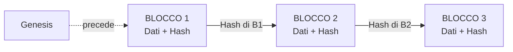
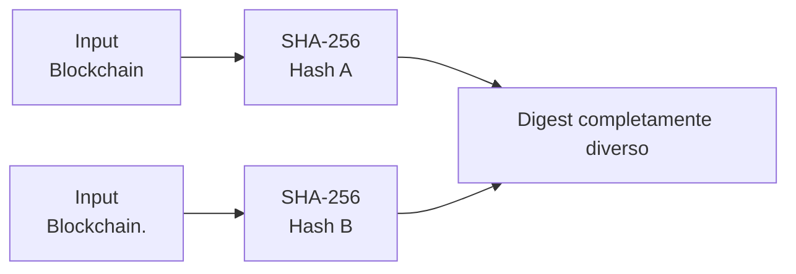
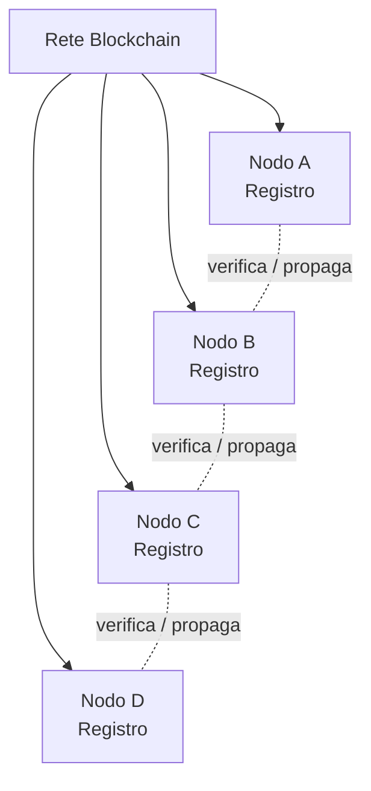
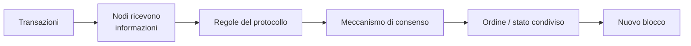
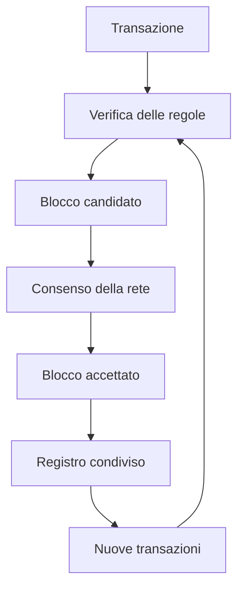

# ⛓️ Modulo 2 — Come funziona una Blockchain

> **Corso:** Master in Blockchain & Web3: Da Zero a Blockchain Developer  
> **Piattaforma:** GCProf Academy  
> **Livello:** 🟢 Base (Fase 1 — Fondamenti della Blockchain)  
> **Target:** Studenti delle scuole superiori, universitari, docenti, sviluppatori e appassionati  
> **Prerequisiti:** Modulo 1 — Perché nasce la Blockchain  
> **Obiettivo Didattico:** Comprendere la struttura interna di un blocco, il ruolo della funzione di hash, il meccanismo che rende una Blockchain immutabile, il concetto di registro distribuito e il problema del consenso tra nodi sconosciuti.

---

<a id="indice"></a>
# 📑 Indice del Modulo 2

1. [Capitolo 1 — Anatomia di un Blocco](#capitolo-1)
2. [Capitolo 2 — La Funzione di Hash: l'impronta digitale dei dati](#capitolo-2)
3. [Capitolo 3 — Dal Blocco alla Catena: come nasce l'immutabilità](#capitolo-3)
4. [Capitolo 4 — L'Effetto Valanga: cosa succede se qualcuno bara](#capitolo-4)
5. [Capitolo 5 — Il Registro Distribuito: una copia per ogni nodo](#capitolo-5)
6. [Capitolo 6 — Il Problema del Consenso](#capitolo-6)
7. [Capitolo 7 — I Meccanismi di Consenso: una prima panoramica](#capitolo-7)
8. [Capitolo 8 — Sintesi, Laboratorio "Carta e Post-it" e Autoverifica](#capitolo-8)

---

<a id="capitolo-1"></a>
## 1. Capitolo 1 — Anatomia di un Blocco

Nel Modulo 1 abbiamo scoperto che la Blockchain è un **Registro Pubblico Distribuito** organizzato in blocchi concatenati. Ma cosa contiene, esattamente, un blocco?

Immagina un blocco come una **pagina di un libro mastro digitale**. Ogni pagina non contiene solo le transazioni, ma anche alcune informazioni tecniche indispensabili per garantire sicurezza e ordine cronologico.

### Gli elementi fondamentali di un blocco

* **Dati (Transazioni):** L'elenco delle operazioni registrate in quel blocco (es. "Alice invia 2 monete a Bob").
* **Timestamp:** Un'indicazione temporale associata al blocco. Non va intesa come una prova dell'istante fisico esatto di creazione, perché il significato e i vincoli del timestamp dipendono dal protocollo.
* **Hash del blocco corrente:** Un valore deterministico calcolato dai dati rilevanti del blocco secondo le regole della specifica Blockchain, usato come identificatore crittografico del blocco.
* **Hash del blocco precedente:** Il codice che collega il blocco a quello immediatamente prima nella catena — è questo elemento a creare fisicamente il "concatenamento" della Blockchain.
* **Nonce (*number used once*):** Un campo variabile utilizzato in alcuni protocolli, in particolare nel Proof of Work, che il miner modifica per cercare un hash che soddisfi il requisito di difficoltà. Non tutte le Blockchain utilizzano un nonce con questa funzione.

```
┌─────────────────────────────┐
│           BLOCCO N           │
├─────────────────────────────┤
│  Timestamp: 04/08/2026 10:15 │
│  Dati: [Alice → Bob: 2 BTC]  │
│  Nonce: 8452193               │
│  Hash blocco precedente: 7f3a…│
│  Hash blocco corrente:  9c1e… │
└─────────────────────────────┘
```

Ogni blocco, quindi, non è un contenitore isolato: porta con sé un riferimento crittografico al blocco che lo precede. È proprio questo riferimento, insieme alle regole del protocollo, a trasformare una semplice lista di blocchi in una **catena**.

### 🔗 Infografica — Anatomia e collegamento dei blocchi



> **Idea chiave:** l'hash precedente è il collegamento crittografico; le regole del protocollo stabiliscono come il blocco viene costruito e accettato dalla rete.


[🔙 Torna all'indice](#indice)

---

<a id="capitolo-2"></a>
## 2. Capitolo 2 — La Funzione di Hash: l'impronta digitale dei dati

Per comprendere davvero come funziona una Blockchain, dobbiamo prima capire cos'è una **funzione di hash**. Non preoccuparti: non servono conoscenze di matematica avanzata, torneremo su questo argomento con maggiore rigore nel Modulo 3. Per ora ci basta comprenderne il comportamento.

### Cos'è una funzione di hash?

Una funzione di hash è un algoritmo che prende in ingresso un dato di **qualsiasi dimensione** (una parola, una frase, un intero libro) e restituisce in uscita una stringa di **lunghezza fissa**, apparentemente casuale, chiamata **hash** o **digest**.

```
INPUT (qualsiasi lunghezza)          OUTPUT (lunghezza fissa)
─────────────────────────            ──────────────────────────
"Ciao"                    ──hash──►  a1b2c3d4e5f6...
"Ciao!"                   ──hash──►  9f8e7d6c5b4a...
"Il testo completo del                
 Modulo 2 del corso"      ──hash──►  4e2f1a9c8b7d...
```

### Le tre proprietà che rendono l'hash utile alla Blockchain

* **Deterministica:** Lo stesso input produce sempre esattamente lo stesso output. Se calcoli l'hash della parola "Ciao" oggi o tra dieci anni, il risultato non cambia.
* **Effetto Valanga (Avalanche Effect):** Una minima modifica dell'input — anche una singola lettera o uno spazio — produce un hash completamente diverso e imprevedibile. Non esiste alcuna somiglianza visibile tra l'hash del testo originale e quello del testo modificato.
* **Unidirezionalità (One-Way Function):** È computazionalmente facile calcolare l'hash a partire da un dato, ma è praticamente impossibile risalire al dato originale partendo solo dall'hash.

### Un esempio concreto (algoritmo SHA-256)

| Input | Hash (SHA-256) |
|---|---|
| `Blockchain` | `2f6c2f... (esempio illustrativo)` |
| `Blockchain.` | `a91d4e... (completamente diverso)` |

Basta aggiungere un semplice punto al testo per ottenere un hash totalmente diverso e non riconducibile visivamente all'originale. Questa proprietà sarà la chiave per comprendere, nel prossimo capitolo, perché la Blockchain è considerata immutabile.

### 🧬 Infografica — L'effetto valanga



La funzione di hash non "capisce" il significato del testo: applica una trasformazione matematica deterministica. La sicurezza deriva dalle proprietà crittografiche dell'algoritmo utilizzato.


[🔙 Torna all'indice](#indice)

---

<a id="capitolo-3"></a>
## 3. Capitolo 3 — Dal Blocco alla Catena: come nasce l'immutabilità

Ora che conosciamo la funzione di hash, possiamo capire il meccanismo che dà alla Blockchain il suo nome e la sua caratteristica più importante: l'**immutabilità**.

### Il concatenamento tramite hash

Ogni blocco, come visto nel Capitolo 1, contiene al suo interno **l'hash del blocco precedente**. Questo significa che l'hash del Blocco 2 dipende non solo dai dati contenuti nel Blocco 2, ma anche dall'hash del Blocco 1. A sua volta, l'hash del Blocco 3 dipende dall'hash del Blocco 2, e così via.

```
┌───────────┐      ┌───────────┐      ┌───────────┐
│ BLOCCO 1  │      │ BLOCCO 2  │      │ BLOCCO 3  │
│           │      │           │      │           │
│ Hash prec:│      │ Hash prec:│      │ Hash prec:│
│  GENESIS  │◄─────│  H(B1)    │◄─────│  H(B2)    │
│           │      │           │      │           │
│ Hash: H(B1)│─────►│ Hash: H(B2)│─────►│ Hash: H(B3)│
└───────────┘      └───────────┘      └───────────┘
```

Il primo blocco della catena, che non ha un predecessore, viene chiamato **Blocco Genesis** (lo avevamo già incontrato nel Modulo 1 a proposito di Bitcoin).

### Perché questo meccanismo crea immutabilità

Ogni blocco "certifica" matematicamente tutti i blocchi che lo precedono. Se il Blocco 1 viene alterato anche di un solo carattere, il suo hash cambia completamente (per l'effetto valanga visto nel Capitolo 2). Ma il Blocco 2 conteneva il **vecchio** hash del Blocco 1 come riferimento: la catena si "spezza" e la manomissione diventa immediatamente rilevabile.

Questo concatenamento crittografico rende estremamente difficile — non impossibile in assoluto — modificare retroattivamente la storia di una Blockchain. Il livello di difficoltà dipende anche dal meccanismo di consenso, dalla sicurezza della rete e da quante conferme hanno seguito il blocco.

[🔙 Torna all'indice](#indice)

---

<a id="capitolo-4"></a>
## 4. Capitolo 4 — L'Effetto Valanga: cosa succede se qualcuno bara

Approfondiamo con un esempio pratico il meccanismo di rilevamento delle manomissioni, che sarà anche il cuore del laboratorio pratico di fine modulo.

### Uno scenario di manomissione

Immagina che un utente disonesto, chiamiamolo Marco, voglia modificare i dati del Blocco 2 per attribuirsi fondi che non gli appartengono.

1. Marco modifica i dati contenuti nel Blocco 2.
2. Poiché l'hash è deterministico e sensibile a ogni variazione, l'hash del Blocco 2 cambia automaticamente e completamente.
3. Il Blocco 3, però, contiene ancora il **vecchio** hash del Blocco 2 come "hash del blocco precedente".
4. Confrontando il vecchio riferimento con il nuovo hash calcolato, chiunque verifichi la catena può accorgersi immediatamente dell'incoerenza.

```
PRIMA della manomissione:
BLOCCO 2 (Hash: 9c1e...) ──riferito da──► BLOCCO 3 (Hash prec: 9c1e...) ✅ Coerente

DOPO la manomissione:
BLOCCO 2 (Hash: 4a7f...) ──riferito da──► BLOCCO 3 (Hash prec: 9c1e...) ❌ Incoerente!
```

### La strategia di Marco (e perché fallisce comunque)

Un attaccante sufficientemente determinato potrebbe pensare di ricalcolare anche l'hash del Blocco 3, del Blocco 4, e così via fino all'ultimo blocco della catena, per "far tornare i conti". Tecnicamente è possibile — ma, come vedremo nel Capitolo 6 e più approfonditamente nel Modulo 6 dedicato al mining, ricalcolare tutti i blocchi successivi su una rete che possiede **migliaia di copie identiche della catena** distribuite su tutto il pianeta è un'operazione così onerosa in termini di tempo e risorse computazionali da risultare, nella pratica, irrealizzabile.

Questo ci porta dritti al prossimo argomento: perché esistono così tante copie della stessa catena?

### 🧩 Infografica — Una catena, più copie



Le copie e le funzioni dei nodi non sono necessariamente identiche in ogni Blockchain: esistono architetture con nodi completi, nodi parziali e ruoli differenti.


[🔙 Torna all'indice](#indice)

---

<a id="capitolo-5"></a>
## 5. Capitolo 5 — Il Registro Distribuito: una copia per ogni nodo

Fino a questo punto abbiamo ragionato come se esistesse un'unica catena di blocchi. In realtà, la caratteristica che distingue una Blockchain da un semplice database concatenato è proprio la sua **natura distribuita**.

### Cos'è un nodo?

Un **nodo** è un qualsiasi computer che partecipa alla rete Blockchain, mantenendo una copia completa (o parziale, a seconda del tipo di nodo) del registro. Chiunque, in linea di principio, può scaricare il software necessario e diventare un nodo della rete.

```
        [Nodo A]         [Nodo B]         [Nodo C]
       Copia completa   Copia completa   Copia completa
        della catena      della catena     della catena
            │                 │                │
            └────────────┬────┴────────────────┘
                          │
                  Rete Peer-to-Peer (P2P)
                          │
            ┌─────────────┴─────────────┐
        [Nodo D]                    [Nodo E]
       Copia completa               Copia completa
        della catena                 della catena
```

### Perché la distribuzione conta

* **Riduzione del punto unico di guasto:** Se un nodo va offline, gli altri partecipanti possono continuare a conservare e verificare il registro; il comportamento complessivo dipende però dall'architettura e dal numero di nodi della specifica rete.
* **Verifica indipendente:** Ogni nodo può verificare autonomamente, senza fidarsi ciecamente di nessun altro, che una transazione o un blocco rispettino le regole del protocollo.
* **Resistenza alla censura:** In una rete sufficientemente decentralizzata, non esiste un singolo soggetto che possa modificare unilateralmente il registro per tutti i partecipanti; il livello di resistenza dipende dalla distribuzione effettiva del controllo.

A questo punto, però, sorge una domanda naturale: se migliaia di nodi sconosciuti, sparsi per il mondo, mantengono ciascuno una propria copia del registro, **come fanno ad essere tutti d'accordo su quale sia la versione corretta e aggiornata della catena?**

[🔙 Torna all'indice](#indice)

---

<a id="capitolo-6"></a>
## 6. Capitolo 6 — Il Problema del Consenso

Il problema che abbiamo appena posto ha un nome preciso in informatica: il **Problema del Consenso Distribuito** (in parte collegato al celebre *Problema dei Generali Bizantini*, uno dei quesiti classici dell'informatica teorica).

### Il quesito centrale

In una rete P2P **senza autorità centrale**, dove i partecipanti sono sconosciuti tra loro, potenzialmente disonesti, e non tutti ricevono le informazioni esattamente nello stesso istante, come si può garantire che:

1. tutti i nodi concordino su un'**unica versione valida** della catena;
2. nessun partecipante possa imporre unilateralmente le proprie transazioni fraudolente;
3. la rete continui a funzionare correttamente anche se una parte dei nodi è offline, in ritardo o addirittura malevola.

### Perché non basta "la maggioranza vince"

Potrebbe sembrare una soluzione semplice: fa fede la versione della catena posseduta dalla maggior parte dei nodi. Ma in una rete aperta, dove chiunque può creare un numero arbitrario di identità digitali false (un attacco noto come **Sybil Attack**), un solo attaccante potrebbe simulare migliaia di nodi fittizi e "vincere" artificialmente la maggioranza.

Serviva quindi un meccanismo che rendesse **costoso** o **rischioso** provare a barare, indipendentemente dal numero di identità create. È qui che entrano in gioco i **Meccanismi di Consenso**.

### ⚖️ Infografica — Perché serve il consenso


---

[🔙 Torna all'indice](#indice)

<a id="capitolo-7"></a>
## 7. Capitolo 7 — I Meccanismi di Consenso: una prima panoramica

I meccanismi di consenso sono gli algoritmi che permettono a una rete decentralizzata di nodi sconosciuti di accordarsi su quale sia la versione corretta e condivisa del registro, senza bisogno di fidarsi l'uno dell'altro.

In questo modulo ci limitiamo a una panoramica introduttiva: approfondiremo il funzionamento tecnico e gli aspetti economici di ciascun meccanismo rispettivamente nel **Modulo 6 (Proof of Work)** e più avanti nel percorso.

| Meccanismo | Principio di base | Esempio di rete |
|---|---|---|
| **Proof of Work (PoW)** | I nodi ("miner") competono risolvendo un complesso puzzle crittografico; vince chi lo risolve per primo, spendendo energia elettrica reale. | Bitcoin |
| **Proof of Stake (PoS)** | I validatori vincolano una quantità di criptovaluta (*stake*); il protocollo usa lo stake e altre regole per determinare partecipazione e selezione dei validatori, prevedendo possibili penalità per comportamenti scorretti. | Ethereum (dal 2022) |

### L'idea comune a tutti i meccanismi di consenso

Al di là dei dettagli tecnici, molti meccanismi di consenso introducono incentivi e/o penalità per rendere economicamente meno conveniente violare le regole. Nel PoW il costo principale per partecipare alla competizione è legato alle risorse computazionali ed energetiche; nei sistemi PoS possono esistere capitale vincolato e penalità (*slashing*) secondo le regole della rete.

### 🧭 Infografica SVG — Due approcci introduttivi al consenso

<svg viewBox="0 0 900 300" role="img" aria-labelledby="consensus-title consensus-desc" xmlns="http://www.w3.org/2000/svg">
  <title id="consensus-title">Confronto concettuale tra Proof of Work e Proof of Stake</title>
  <desc id="consensus-desc">Il Proof of Work utilizza lavoro computazionale e consumo di risorse; il Proof of Stake utilizza capitale vincolato e regole di validazione.</desc>
  <rect x="40" y="45" width="360" height="190" rx="18" fill="none" stroke="currentColor" stroke-width="3"/>
  <rect x="500" y="45" width="360" height="190" rx="18" fill="none" stroke="currentColor" stroke-width="3"/>
  <text x="220" y="85" text-anchor="middle" font-size="24" font-family="sans-serif" font-weight="700">PROOF OF WORK</text>
  <text x="680" y="85" text-anchor="middle" font-size="24" font-family="sans-serif" font-weight="700">PROOF OF STAKE</text>
  <text x="220" y="125" text-anchor="middle" font-size="18" font-family="sans-serif">lavoro computazionale</text>
  <text x="220" y="158" text-anchor="middle" font-size="18" font-family="sans-serif">+ risorse energetiche</text>
  <text x="220" y="198" text-anchor="middle" font-size="16" font-family="sans-serif">Bitcoin</text>
  <text x="680" y="125" text-anchor="middle" font-size="18" font-family="sans-serif">stake vincolato</text>
  <text x="680" y="158" text-anchor="middle" font-size="18" font-family="sans-serif">+ regole e penalità</text>
  <text x="680" y="198" text-anchor="middle" font-size="16" font-family="sans-serif">Ethereum</text>
</svg>


[🔙 Torna all'indice](#indice)

---

<a id="capitolo-8"></a>
## 8. Capitolo 8 — Sintesi, Laboratorio "Carta e Post-it" e Autoverifica

### 💡 Punti Chiave del Modulo 2

1. Un **blocco** contiene dati, timestamp, un nonce, il proprio hash e l'hash del blocco precedente.
2. La **funzione di hash** è deterministica, sensibile a ogni minima variazione dell'input (effetto valanga) e unidirezionale.
3. Il **concatenamento tramite hash** tra blocchi consecutivi è ciò che rende la Blockchain immutabile e ogni manomissione immediatamente rilevabile.
4. La Blockchain è un **registro distribuito**: migliaia di nodi mantengono copie identiche e sincronizzate del registro, eliminando il punto unico di vulnerabilità.
5. Il **Problema del Consenso** riguarda come far concordare nodi sconosciuti e potenzialmente disonesti su un'unica versione valida della catena.
6. I **meccanismi di consenso** (come Proof of Work e Proof of Stake) risolvono il problema rendendo economicamente svantaggioso tentare di barare.

---

### 🧪 Laboratorio Concettuale: "La Catena di Post-it"

**Obiettivo:** Costruire manualmente una mini-blockchain con carta e penna per comprendere concretamente il concatenamento tramite hash, senza usare alcun computer.

* **Materiale necessario:** post-it (o fogli di carta), penna.

* **Fase 1 — Creazione del Blocco Genesis:**
  * Su un post-it, scrivi: `BLOCCO 0 (Genesis) | Dati: "Inizio catena" | Hash precedente: nessuno | Hash: 0000`
  * Il valore "0000" rappresenta, in modo semplificato, l'hash del blocco genesis.

* **Fase 2 — Aggiunta dei blocchi successivi:**
  * Su un secondo post-it, scrivi una transazione a piacere (es. "Alice paga 5 punti a Bob") e riporta nel campo "Hash precedente" il valore scritto nel post-it precedente (`0000`).
  * Come hash del nuovo blocco, usa una regola semplificata concordata in classe: ad esempio, somma il numero di lettere della transazione al numero di lettere dell'hash precedente.
  * Ripeti l'operazione per un terzo e un quarto blocco, collegando sempre ogni nuovo post-it a quello precedente tramite il campo "hash precedente".

* **Fase 3 — Simulazione dell'attacco:**
  * Uno studente, senza farsi vedere dagli altri, modifica il testo della transazione scritta sul secondo post-it.
  * Ricalcolando l'hash con la regola concordata, il gruppo dovrà notare che il nuovo hash del Blocco 2 non corrisponde più al valore "hash precedente" scritto sul Blocco 3.
  * *Riflessione:* Cosa dovrebbe fare l'attaccante per "coprire" la propria manomissione senza farsi scoprire? (Risposta attesa: dovrebbe ricalcolare e riscrivere anche tutti i post-it successivi, un'operazione via via più difficile quanto più la catena è lunga e quante più persone possiedono una copia della sequenza.)

---

### 🧠 Infografica — Dalla transazione al registro condiviso



Questa sequenza riassume il percorso concettuale del modulo: **dati → verifica → blocco → consenso → registro condiviso**.

---

### ❓ Quiz di Autoverifica

**Domanda 1:** Quale elemento, contenuto in ogni blocco, permette fisicamente di "concatenare" un blocco a quello precedente?  
- A) Il timestamp.  
- B) Il nonce.  
- C) L'hash del blocco precedente.  
- D) L'indirizzo IP del nodo che lo ha creato.

**Domanda 2:** Cosa si intende per "effetto valanga" (avalanche effect) in una funzione di hash?  
- A) La velocità con cui la rete elabora le transazioni.  
- B) Il fatto che una minima modifica dell'input produca un hash completamente diverso.  
- C) L'aumento del numero di nodi nel tempo.  
- D) La perdita di dati durante il calcolo dell'hash.

**Domanda 3:** Perché la modifica di un blocco "vecchio" nella catena viene rilevata dagli altri partecipanti della rete?  
- A) Perché ogni transazione è firmata da un notaio digitale.  
- B) Perché il nuovo hash del blocco modificato non corrisponde più all'"hash precedente" registrato nel blocco successivo.  
- C) Perché i nodi comunicano via email ogni modifica.  
- D) Perché la Blockchain invia una notifica automatica a tutti gli utenti.

**Domanda 4:** Cosa rappresenta, in sintesi, il "Problema del Consenso"?  
- A) Come far accordare nodi sconosciuti e potenzialmente disonesti su un'unica versione valida del registro, senza autorità centrale.  
- B) Come scegliere il colore dell'interfaccia grafica di un wallet.  
- C) Come velocizzare la connessione Internet dei nodi.  
- D) Come stabilire il prezzo di una criptovaluta.

---

[🔙 Torna all'indice](#indice)