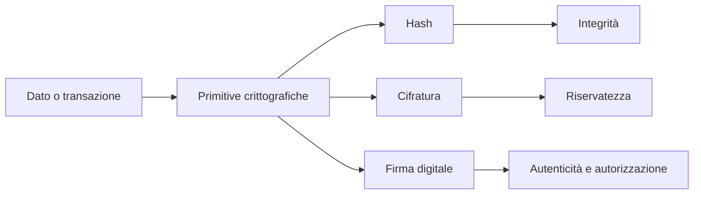
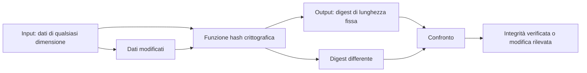
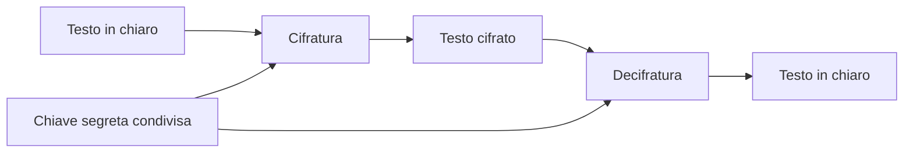
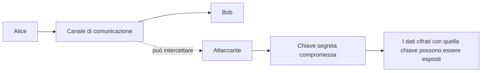
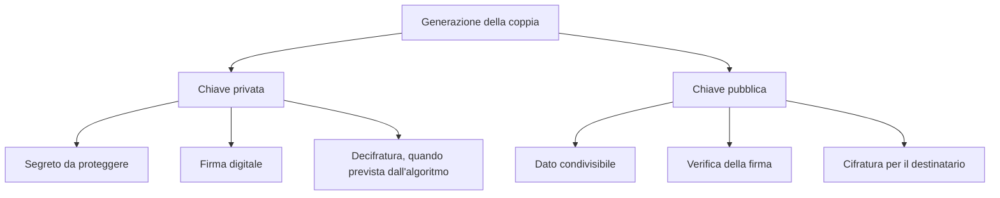
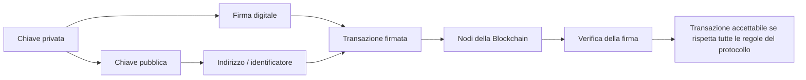
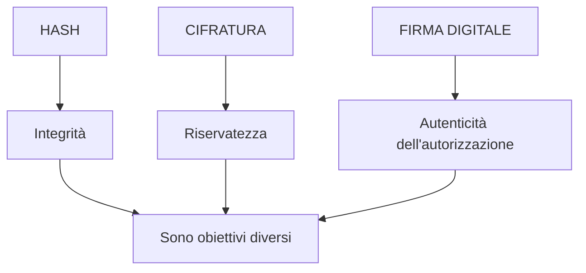

# ⛓️ Modulo 3 — Crittografia per tutti

> **Corso:** Master in Blockchain & Web3: Da Zero a Blockchain Developer  
> **Piattaforma:** GCProf Academy  
> **Livello:** 🟢 Base (Fase 2 — Crittografia e Sicurezza Digitale)  
> **Target:** Studenti delle scuole superiori, universitari, docenti, sviluppatori e appassionati  
> **Prerequisiti:** Modulo 1 — Perché nasce la Blockchain, Modulo 2 — Come funziona una Blockchain  
> **Obiettivo Didattico:** Comprendere in modo intuitivo e senza formule intimidatorie i concetti di hashing, crittografia simmetrica e crittografia asimmetrica, e capire perché queste tecnologie costituiscono il fondamento matematico della sicurezza in Blockchain.

---

<a id="indice"></a>

# 📑 Indice del Modulo 3

1. [Capitolo 1 — Perché la Crittografia è il Cuore della Blockchain](#capitolo-1)
2. [Capitolo 2 — L'Hashing come Funzione One-Way: un ripasso formale](#capitolo-2)
3. [Capitolo 3 — Crittografia Simmetrica: una chiave per tutto](#capitolo-3)
4. [Capitolo 4 — Il Limite della Crittografia Simmetrica: lo scambio delle chiavi](#capitolo-4)
5. [Capitolo 5 — Crittografia Asimmetrica: la coppia di chiavi](#capitolo-5)
6. [Capitolo 6 — Cifratura e Firma Digitale: due usi della crittografia asimmetrica](#capitolo-6)
7. [Capitolo 7 — La Crittografia Asimmetrica nella Blockchain](#capitolo-7)
8. [Capitolo 8 — Sintesi, Laboratorio "Lucchetto e Cassetta Postale" e Autoverifica](#capitolo-8)

---

<a id="capitolo-1"></a>

## 1. Capitolo 1 — Perché la Crittografia è il Cuore della Blockchain

Nei moduli precedenti abbiamo usato più volte parole come "hash", "firma" e "chiave" senza soffermarci troppo sul loro significato tecnico. È arrivato il momento di aprire questa "scatola nera" e comprendere davvero cosa rende sicura una Blockchain.

### La crittografia non è un dettaglio tecnico: è il fondamento

Se togliessimo la crittografia da una Blockchain, rimarrebbe una rete distribuita, ma verrebbero meno alcune delle principali garanzie matematiche utilizzate per proteggere l'integrità dei dati e autorizzare le transazioni. In particolare, senza firme digitali un sistema pubblico non potrebbe verificare in modo affidabile che una transazione sia stata autorizzata dal possessore della relativa chiave privata.

La crittografia e le primitive crittografiche rispondono a tre esigenze fondamentali, che affronteremo nel modulo:

* **Integrità:** Come possiamo verificare che un dato non sia stato alterato? *(→ Hashing)*
* **Riservatezza:** Come possiamo proteggere un'informazione affinché solo il destinatario legittimo possa leggerla? *(→ Crittografia simmetrica e, in determinati sistemi, asimmetrica)*
* **Autenticità e autorizzazione:** Come possiamo dimostrare che una transazione è stata autorizzata dal possessore della chiave privata, senza rivelare il segreto? *(→ Firma digitale, che vedremo nel dettaglio anche nel Modulo 4)*

> **⚠️ Distinzione importante:** in molte Blockchain pubbliche, come Bitcoin ed Ethereum, le transazioni non sono normalmente cifrate per mantenerle segrete. Hash e firme servono soprattutto a garantire integrità, autenticità e controllo delle autorizzazioni; la riservatezza è un problema distinto.

### 🔐 Infografica — Tre obiettivi della crittografia



Non servirà alcuna formula matematica complessa: ogni concetto verrà spiegato attraverso analogie visive ed esempi pratici, così come promesso nella presentazione del corso.

[🔙 Torna all'indice](#indice)

---

<a id="capitolo-2"></a>

## 2. Capitolo 2 — L'Hashing come Funzione One-Way: un ripasso formale

Nel Modulo 2 abbiamo già incontrato la funzione di hash come strumento per concatenare i blocchi. Ora la inquadriamo più precisamente all'interno delle primitive crittografiche.

### Hashing: integrità, non segretezza

È importante chiarire subito un equivoco molto comune: **l'hashing non serve a nascondere un'informazione**, ma a **verificarne l'integrità**. L'hash di un documento non è una versione "cifrata" del documento: è un'impronta di lunghezza fissa calcolata sul contenuto, utile per rilevare modifiche.

```text
DOCUMENTO ORIGINALE ──────► FUNZIONE DI HASH ──────► IMPRONTA (hash)

"Contratto di vendita"                                  a3f9c2...

Se anche solo una virgola cambia nel documento, l'impronta
risultante cambia in modo sostanziale e imprevedibile.
```

### Un'analogia: l'impronta digitale umana

Così come un'impronta digitale può essere utilizzata per distinguere una persona da un'altra, l'hash può essere utilizzato come identificatore compatto del contenuto. L'analogia però non è perfetta: una funzione di hash ammette teoricamente **collisioni**, cioè input diversi che producono lo stesso output. Per una funzione crittografica moderna, l'obiettivo è rendere computazionalmente impraticabile trovare collisioni utili.

Per questo motivo, l'hashing viene utilizzato in Blockchain non solo per concatenare i blocchi, ma anche per:

* generare **determinati identificatori o indirizzi** a partire da chiavi pubbliche o altri dati, secondo le regole della specifica Blockchain (Modulo 4);
* verificare l'**integrità di dati e strutture** utilizzate dalla rete;
* costruire strutture dati avanzate come il **Merkle Tree**, che approfondiremo nei moduli dedicati a Bitcoin.

### 🧩 Infografica — Come leggere una funzione di hash



Con questo ripasso completato, possiamo ora affrontare il secondo grande pilastro della crittografia: la protezione della riservatezza di un'informazione.

[🔙 Torna all'indice](#indice)

---

<a id="capitolo-3"></a>

## 3. Capitolo 3 — Crittografia Simmetrica: una chiave per tutto

La **crittografia** (a differenza dell'hashing) serve a trasformare un'informazione in una forma che possa essere resa nuovamente leggibile utilizzando una chiave appropriata. La forma più intuitiva è quella **simmetrica**.

### Il principio della crittografia simmetrica

Nella crittografia simmetrica esiste **un'unica chiave segreta condivisa**, utilizzata dall'algoritmo per **cifrare** e **decifrare** i dati.

```text
MITTENTE                                      DESTINATARIO

"Ciao Bob"                                      │
    │                                            │
    ▼                                            │
Cifratura con CHIAVE SEGRETA "X7k9"             │
    │                                            │
    ▼                                            │
"h#94kd..." ──────── (canale) ───────────────► "h#94kd..."
                                                 │
                                                 ▼
                                      Decifratura con la
                                      stessa chiave "X7k9"
                                                 │
                                                 ▼
                                            "Ciao Bob"
```

### 🔑 Infografica — Crittografia simmetrica



### Un esempio storico e intuitivo: il Cifrario di Cesare

Uno degli esempi più semplici di cifrario a sostituzione è il **Cifrario di Cesare**, in cui ogni lettera del messaggio viene sostituita con quella che si trova un numero fisso di posizioni più avanti nell'alfabeto (ad esempio, spostando di 3 posizioni, la "A" diventa "D").

Chi conosce il numero di posizioni (la "chiave" del semplice cifrario didattico) può applicare la trasformazione inversa. Gli algoritmi moderni di crittografia simmetrica, come **AES** (*Advanced Encryption Standard*), sono incomparabilmente più complessi e progettati per resistere ad attacchi crittanalitici moderni, ma condividono il principio di fondo dell'uso di una chiave segreta condivisa.

### Il grande vantaggio: la velocità

La crittografia simmetrica è generalmente molto efficiente dal punto di vista computazionale ed è per questo ampiamente utilizzata per cifrare grandi quantità di dati, come file, dischi e comunicazioni. Tuttavia, presenta un problema strutturale: mittente e destinatario devono disporre della stessa chiave segreta e devono poterla proteggere.

[🔙 Torna all'indice](#indice)

---

<a id="capitolo-4"></a>

## 4. Capitolo 4 — Il Limite della Crittografia Simmetrica: lo scambio delle chiavi

### Il problema: come condividere la chiave in sicurezza?

Immagina che Alice voglia inviare un messaggio cifrato a Bob usando la crittografia simmetrica. Prima di tutto, Alice deve trovare un modo per comunicare a Bob **quale sia la chiave segreta**. Ma come può farlo in modo sicuro?

* Se invia la chiave via email o messaggio non protetto, un intercettatore potrebbe copiarla e utilizzarla per decifrare i dati protetti con quella chiave.
* Se i due si incontrano di persona per scambiarsi la chiave, il sistema funziona, ma diventa **poco pratico su scala globale**, con grandi numeri di utenti che non si sono mai incontrati.

```text
    Alice                                      Bob
      │                                          │
      │  "La chiave segreta è X7k9"              │
      └──────────► (canale intercettabile) ──────┘
                         │
                   👁️ Attaccante
                         │
                  intercetta la chiave
```

### ⚠️ Infografica — Il problema dello scambio della chiave



### Perché questo è un problema critico per la Blockchain

Una Blockchain pubblica, come Bitcoin o Ethereum, coinvolge una rete aperta di partecipanti che possono non avere alcuna relazione preesistente. Non sarebbe quindi pratico basare l'autorizzazione delle transazioni sulla preventiva condivisione di una chiave segreta comune tra ogni coppia di utenti.

La crittografia a chiave pubblica, sviluppata a partire dai lavori di **Whitfield Diffie e Martin Hellman** e dai successivi sistemi come **RSA**, ha introdotto un modello nel quale alcune operazioni possono essere svolte usando una chiave pubblica, mentre il segreto rimane nella chiave privata.

> **Nota tecnica:** la crittografia asimmetrica non elimina ogni problema di sicurezza e non sostituisce sempre la crittografia simmetrica. Nei protocolli moderni è frequente usare entrambe: la crittografia asimmetrica per autenticazione o accordo di chiavi e la simmetrica per cifrare efficientemente i dati.

[🔙 Torna all'indice](#indice)

---

<a id="capitolo-5"></a>

## 5. Capitolo 5 — Crittografia Asimmetrica: la coppia di chiavi

### Il principio rivoluzionario: due chiavi, non una

La crittografia asimmetrica (o **crittografia a chiave pubblica**) si basa sull'idea che ogni utente disponga di una **coppia di chiavi matematicamente correlate**:

* **Chiave Pubblica:** può essere condivisa liberamente. Viene utilizzata, a seconda dell'algoritmo e del protocollo, per cifrare dati destinati al proprietario oppure per verificare firme digitali.
* **Chiave Privata:** deve rimanere segreta e sotto il controllo del proprietario. Viene utilizzata, a seconda dell'algoritmo, per decifrare dati oppure per generare firme digitali.

```text
              ┌─────────────────────────┐
              │    Coppia di chiavi     │
              │   generate insieme      │
              └─────────────────────────┘
                         │
             ┌───────────┴───────────┐
             ▼                       ▼
      🔑 CHIAVE PRIVATA       🔓 CHIAVE PUBBLICA
      Segreta                 Condivisibile
      Mai divulgata           Utilizzabile per verifica
      Protetta dal titolare   o per cifratura, secondo il sistema
```

### 🔐 Infografica — Pubblica vs privata



### La proprietà matematica alla base del sistema

Le due chiavi sono generate secondo proprietà matematiche specifiche dell'algoritmo. Tra le famiglie più note troviamo RSA e gli algoritmi basati su curve ellittiche. Nei sistemi blockchain moderni sono particolarmente importanti le firme basate su curve ellittiche o su altre costruzioni crittografiche.

L'idea fondamentale è che conoscere la chiave pubblica non consenta, con le risorse considerate realistiche dal modello di sicurezza dell'algoritmo, di ricavare la chiave privata.

> **Attenzione a una semplificazione frequente:** non tutti gli algoritmi asimmetrici funzionano nello stesso modo. La relazione "cifrare con la pubblica → decifrare con la privata" descrive un modello di cifratura a chiave pubblica; la firma digitale segue invece un meccanismo specifico di generazione e verifica della firma.

Grazie a questa proprietà, Alice può pubblicare la propria chiave pubblica senza rivelare la chiave privata. La sicurezza dipende però dalla corretta generazione, conservazione e protezione del segreto privato.

[🔙 Torna all'indice](#indice)

---

<a id="capitolo-6"></a>

## 6. Capitolo 6 — Cifratura e Firma Digitale: due usi della crittografia asimmetrica

La coppia di chiavi pubblica/privata può essere utilizzata per scopi differenti. È fondamentale non confondere **cifratura** e **firma digitale**.

### Uso 1 — Cifratura di un messaggio riservato

Se Alice vuole inviare un messaggio segreto a Bob utilizzando un sistema di cifratura a chiave pubblica, utilizza la **chiave pubblica di Bob** secondo le regole dell'algoritmo. Il destinatario utilizza quindi la corrispondente **chiave privata** per recuperare il messaggio.

```text
Alice cifra con la CHIAVE PUBBLICA di Bob

        │
        ▼
Messaggio cifrato ───────────────► Bob
                                      │
                                      ▼
                         Decifratura con la
                         CHIAVE PRIVATA di Bob
                                      │
                                      ▼
                                "Ciao Bob"
```

### Uso 2 — La Firma Digitale: dimostrare il possesso della chiave privata

Nel caso della firma digitale, Alice utilizza la **propria chiave privata** per produrre una firma associata ai dati, ad esempio a una transazione. La rete utilizza la corrispondente **chiave pubblica** per verificare matematicamente la firma.

```text
Alice
  │
  │ Transazione + chiave privata
  ▼
Generazione della firma
  │
  ▼
Transazione + Firma ─────────────► Rete Blockchain
                                      │
                                      ▼
                            Verifica con chiave pubblica
                                      │
                           ┌──────────┴──────────┐
                           ▼                     ▼
                     ✅ Firma valida       ❌ Firma non valida
```

> **Punto fondamentale:** una firma digitale non dimostra automaticamente l'identità civile di una persona. Dimostra, secondo il modello di sicurezza del sistema, che la firma è stata prodotta dalla corrispondente chiave privata. Collegare quella chiave a una persona reale richiede un ulteriore meccanismo di identificazione.

Questo meccanismo permette a una Blockchain di verificare **chiave privata → autorizzazione della transazione**, senza che una banca debba custodire la chiave privata dell'utente.

[🔙 Torna all'indice](#indice)

---

<a id="capitolo-7"></a>

## 7. Capitolo 7 — La Crittografia Asimmetrica nella Blockchain

### Dalle chiavi agli indirizzi wallet

Nel Modulo 4 vedremo nel dettaglio come viene utilizzato un wallet, ma possiamo già anticipare il collegamento tra i concetti di questo modulo.

Un **indirizzo wallet non è universalmente "l'hash della chiave pubblica"**: il metodo dipende dalla Blockchain e dal formato di indirizzo. In alcuni sistemi l'indirizzo deriva direttamente o indirettamente dalla chiave pubblica attraverso una o più funzioni di hash e codifiche; in altri sistemi il processo è differente.

Per una rappresentazione didattica semplificata possiamo quindi usare:

```text
Chiave Privata ──► Chiave Pubblica ──► trasformazione prevista dal protocollo ──► Indirizzo
   (segreta)         (condivisibile)                                      (pubblico)
```

### 🔗 Infografica — Dalla chiave privata alla transazione



### Perché questo sistema è importante per la Blockchain

Grazie alla combinazione di hashing, firme digitali e altre primitive crittografiche, una Blockchain pubblica può offrire:

* **Pseudonimato:** le transazioni possono essere associate ad indirizzi o identificatori crittografici anziché direttamente a nomi o documenti d'identità. Questo non significa necessariamente anonimato.
* **Verificabilità pubblica:** chiunque possa accedere ai dati della rete può verificare una firma secondo le regole del protocollo, senza conoscere la chiave privata.
* **Autorizzazione senza un intermediario che custodisca la chiave:** la rete può verificare matematicamente che una transazione sia stata autorizzata dalla chiave richiesta dal protocollo.

Questo è il motivo per cui, come vedremo nel prossimo modulo, **la sicurezza dei fondi dipende in modo critico dalla custodia della chiave privata**: chiunque riesca a controllarla può, in molti sistemi, produrre firme valide per autorizzare operazioni. Non esiste però una regola universale per cui una chiave privata compromessa renda sempre impossibile ogni forma di recupero: dipende dall'architettura e dagli strumenti utilizzati.

### 🧭 Infografica SVG — Il percorso della sicurezza

<svg xmlns="http://www.w3.org/2000/svg" viewBox="0 0 900 250" role="img" aria-labelledby="title desc">
  <title id="title">Percorso crittografico di una transazione blockchain</title>
  <desc id="desc">La chiave privata produce una firma, la chiave pubblica consente la verifica e la rete controlla la transazione secondo le regole del protocollo.</desc>
  <defs>
    <marker id="arrow" viewBox="0 0 10 10" refX="9" refY="5" markerWidth="7" markerHeight="7" orient="auto-start-reverse">
      <path d="M 0 0 L 10 5 L 0 10 z" fill="currentColor"/>
    </marker>
  </defs>
  <g fill="none" stroke="currentColor" stroke-width="2">
    <rect x="35" y="70" width="180" height="105" rx="16"/>
    <rect x="265" y="70" width="180" height="105" rx="16"/>
    <rect x="495" y="70" width="180" height="105" rx="16"/>
    <rect x="725" y="70" width="140" height="105" rx="16"/>
    <path d="M215 122 H265" marker-end="url(#arrow)"/>
    <path d="M445 122 H495" marker-end="url(#arrow)"/>
    <path d="M675 122 H725" marker-end="url(#arrow)"/>
  </g>
  <g font-family="sans-serif" text-anchor="middle" fill="currentColor">
    <text x="125" y="105" font-size="19" font-weight="700">🔑 Chiave privata</text>
    <text x="125" y="135" font-size="15">Segreta</text>
    <text x="125" y="157" font-size="15">Genera la firma</text>
    <text x="355" y="105" font-size="19" font-weight="700">✍️ Firma digitale</text>
    <text x="355" y="135" font-size="15">Autorizza i dati</text>
    <text x="355" y="157" font-size="15">senza rivelare il segreto</text>
    <text x="585" y="105" font-size="19" font-weight="700">🔓 Chiave pubblica</text>
    <text x="585" y="135" font-size="15">Condivisibile</text>
    <text x="585" y="157" font-size="15">Verifica la firma</text>
    <text x="795" y="105" font-size="19" font-weight="700">🌐 Rete</text>
    <text x="795" y="135" font-size="15">Controlla</text>
    <text x="795" y="157" font-size="15">le regole</text>
  </g>
</svg>

[🔙 Torna all'indice](#indice)

---

<a id="capitolo-8"></a>

## 8. Capitolo 8 — Sintesi, Laboratorio "Lucchetto e Cassetta Postale" e Autoverifica

### 💡 Punti Chiave del Modulo 3

1. L'**hashing** serve principalmente a verificare l'integrità dei dati: una funzione hash crittografica è progettata per essere deterministica e resistente a proprietà come la ricerca di preimmagini e collisioni.
2. La **crittografia simmetrica** utilizza una chiave segreta condivisa per cifrare e decifrare: è efficiente, ma richiede una gestione sicura delle chiavi.
3. La **crittografia asimmetrica** utilizza una coppia di chiavi correlate: una pubblica e una privata.
4. La **cifratura a chiave pubblica** può fornire riservatezza, mentre la **firma digitale** consente di verificare l'autorizzazione associata a una chiave privata. Sono meccanismi diversi.
5. In Blockchain, il formato e la derivazione di un **indirizzo wallet** dipendono dalla specifica rete; la protezione della **chiave privata** è comunque un elemento fondamentale nei sistemi che usano firme basate su chiavi private.

---

### 🧪 Laboratorio Concettuale: "Il Lucchetto e la Cassetta Postale"

**Obiettivo:** Comprendere in modo tangibile la differenza tra crittografia simmetrica e asimmetrica e distinguere la cifratura dalla firma digitale, senza usare alcun computer.

* **Fase 1 — Simulazione della Crittografia Simmetrica (una sola chiave):**

  * In coppia, uno studente (Alice) scrive un messaggio segreto in una scatola e la chiude con un lucchetto.
  * Per far leggere il messaggio a Bob, Alice deve consegnargli **anche la chiave** del lucchetto.
  * *Riflessione:* Se qualcuno intercetta la chiave durante il tragitto, quale rischio introduce? Come si può risolvere il problema senza incontrarsi di persona?

* **Fase 2 — Simulazione della Crittografia Asimmetrica (cassetta postale):**

  * Immagina una cassetta postale con una fessura per inserire lettere (aperta a tutti, rappresenta concettualmente la **chiave pubblica**) e uno sportello posteriore apribile solo con una chiave in possesso del proprietario (rappresenta concettualmente la **chiave privata**).
  * Chiunque può inserire una lettera nella fessura, ma solo il proprietario può aprire la cassetta e leggerla.
  * *Riflessione:* In questo modello, perché non è necessario consegnare a ogni mittente una chiave segreta condivisa?

* **Fase 3 — Simulazione della Firma Digitale:**

  * Uno studente scrive un breve messaggio e appone un "sigillo" personale unico e riconoscibile (rappresenta concettualmente la firma con la chiave privata), noto alla classe attraverso un catalogo di riferimento (rappresenta la chiave pubblica).
  * Gli altri studenti verificano il sigillo rispetto al riferimento pubblico, senza che l'autore debba rivelare il proprio segreto.
  * *Riflessione:* Qual è la differenza tra rendere un messaggio segreto e dimostrare che è stato autorizzato dal possessore della chiave?

### 🧠 Infografica — Le tre idee da non confondere



---

### ❓ Quiz di Autoverifica

**Domanda 1:** Qual è la funzione principale dell'hashing all'interno della crittografia?  

- A) Nascondere completamente il contenuto di un messaggio.
- B) Verificare l'integrità di un dato, rilevando eventuali modifiche.
- C) Generare automaticamente le chiavi private degli utenti.
- D) Velocizzare la trasmissione dei dati in rete.

**Domanda 2:** Qual è il principale problema pratico della crittografia simmetrica in un sistema aperto come la Blockchain?  

- A) È troppo lenta per essere utilizzata su larga scala.
- B) Richiede una gestione e uno scambio sicuro della chiave segreta tra utenti che potrebbero non conoscersi.
- C) Non permette di cifrare messaggi più lunghi di poche parole.
- D) Non è compatibile con gli algoritmi di hashing.

**Domanda 3:** Cosa si ottiene, in un sistema di cifratura a chiave pubblica, cifrando un messaggio con la chiave pubblica del destinatario?  

- A) Un messaggio leggibile dal possessore della corrispondente chiave privata: riservatezza.
- B) Una firma digitale verificabile da chiunque.
- C) Un hash del messaggio originale.
- D) Nessun effetto, poiché la chiave pubblica non può essere usata per cifrare.

**Domanda 4:** Da cosa deriva, in una Blockchain, l'indirizzo pubblico di un wallet?  

- A) Da un numero assegnato casualmente da un'autorità centrale.
- B) Da una procedura definita dal protocollo della specifica Blockchain, che può includere chiavi pubbliche, hashing e codifiche.
- C) Dall'indirizzo IP del dispositivo utilizzato.
- D) Dal nome utente scelto in fase di registrazione.

---

[🔙 Torna all'indice](#indice)
