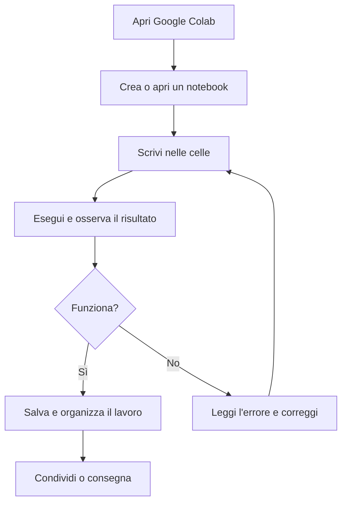
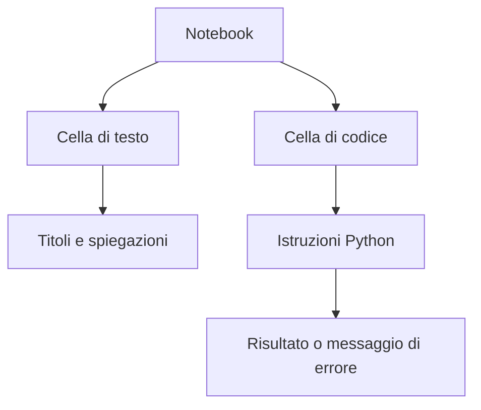
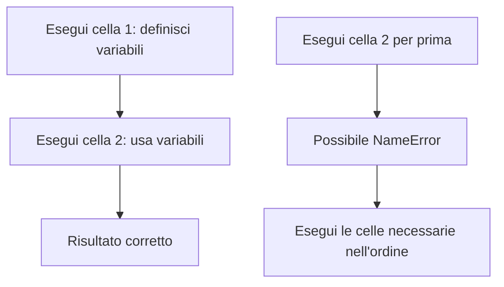
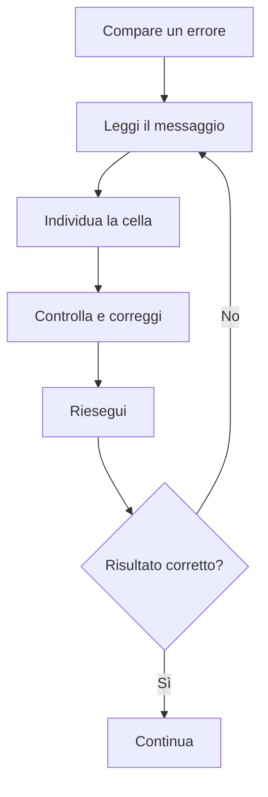

<a id="inizio"></a>

# ☁️ Google Colab — Mini corso pratico
**L’ambiente online per scrivere, eseguire e condividere programmi Python in GCProf Academy.**

Benvenuto nel minicorso **Google Colab**, una guida operativa pensata per accompagnarti nei primi passi con Python e per aiutarti a lavorare in modo ordinato durante le attività di **Python 1°**.

Google Colab permette di scrivere ed eseguire codice Python nel browser, organizzando il lavoro in un notebook composto da celle. In questo minicorso imparerai ad aprire un notebook, eseguire codice, salvare il lavoro su Google Drive, leggere gli errori più comuni e consegnare le attività.

Non è richiesta alcuna esperienza precedente. Segui i passaggi nell’ordine proposto e prova direttamente ogni esempio.

> **Nota:** l’interfaccia di Google Colab può cambiare nel tempo. I nomi o la posizione di alcuni comandi potrebbero quindi essere leggermente diversi.

---

## 🏗️ L’Architettura del Mini corso

Il percorso è suddiviso in **3 macro-fasi** progressive:

| Fase | Livello | Cosa saprai fare al termine |
|---|---|---|
| **1. Orientarsi e iniziare** | Base | Aprire Colab, creare un notebook e riconoscere celle di codice e testo |
| **2. Eseguire e organizzare** | Base | Eseguire istruzioni, gestire le celle, salvare e riprendere il lavoro |
| **3. Lavorare in autonomia** | Operativo | Risolvere problemi frequenti, condividere il notebook e consegnare un’attività |

### Il percorso in breve



---

## 👥 A chi è rivolto

- 🎓 Studenti che iniziano il percorso di **Python 1°**
- 💻 Studenti che vogliono eseguire Python senza installare un ambiente sul proprio computer
- 👨‍🏫 Docenti che utilizzano notebook per lezioni, dimostrazioni ed esercitazioni
- 🚀 Chiunque desideri imparare a usare Colab in modo semplice e ordinato

**Requisiti:** un browser aggiornato e una connessione Internet. Per salvare i notebook su Google Drive e gestirne la condivisione è normalmente necessario accedere con un account Google.

---

<a id="indice"></a>
## 📑 Indice Navigabile

**LIVELLO BASE: Primi passi**
* [Modulo 1: Che cos’è Google Colab](#modulo-1)
* [Modulo 2: Aprire Colab e creare un notebook](#modulo-2)
* [Modulo 3: Conoscere l’interfaccia e le celle](#modulo-3)

**LIVELLO OPERATIVO: Scrivere e lavorare**
* [Modulo 4: Scrivere ed eseguire codice Python](#modulo-4)
* [Modulo 5: Ordine di esecuzione e stato del notebook](#modulo-5)
* [Modulo 6: Salvare, rinominare e ritrovare il lavoro](#modulo-6)
* [Modulo 7: Errori comuni e come affrontarli](#modulo-7)

**LIVELLO AUTONOMO: Condividere e applicare**
* [Modulo 8: Condividere e consegnare un notebook](#modulo-8)
* [Modulo 9: Buone pratiche e checklist](#modulo-9)
* [Modulo 10: Laboratorio guidato e verifica finale](#modulo-10)

---

## 📚 Dettaglio dei Moduli

### LIVELLO BASE

<a id="modulo-1"></a>
[🔙 Torna all’indice](#indice)

### Modulo 1: Che cos’è Google Colab

Google Colab (Colaboratory) è un ambiente online per creare ed eseguire notebook, senza dover installare Python localmente. È particolarmente utile per le attività didattiche perché permette di alternare spiegazioni, codice e risultati nello stesso documento.

Un **notebook** è un documento interattivo formato da celle. Puoi eseguire una cella, osservare il risultato e continuare con le successive.

**Concetti chiave**
- **Browser:** il programma con cui accedi a Colab.
- **Notebook:** il documento di lavoro.
- **Cella:** una sezione del notebook, di codice o di testo.
- **Runtime (ambiente di esecuzione):** la sessione che esegue il codice. Può essere avviata, disconnessa o riavviata.
- **Google Drive:** spazio online in cui puoi conservare i notebook.

**Al termine saprai:** descrivere a cosa serve Colab e distinguere notebook, celle e runtime.

---

<a id="modulo-2"></a>
[🔙 Torna all’indice](#indice)

### Modulo 2: Aprire Colab e creare un notebook

1. Apri il browser e visita [Google Colab](https://colab.research.google.com/).
2. Se richiesto, accedi con il tuo account Google.
3. Dalla schermata iniziale scegli l’opzione per creare un **nuovo notebook**. In alternativa, apri un notebook già disponibile.
4. Fai clic sul titolo del notebook, in alto, per assegnargli un nome chiaro.
5. Verifica di avere una cella di codice in cui poter scrivere.

Puoi anche aprire un notebook salvato su Google Drive oppure caricare un file notebook `.ipynb`, se l’attività lo richiede.

**Suggerimento per il corso:** usa nomi riconoscibili, ad esempio `Python1_Modulo01_CognomeNome`. Evita nomi generici come `Untitled1`.

**Al termine saprai:** aprire Colab, creare un notebook e assegnargli un nome significativo.

---

<a id="modulo-3"></a>
[🔙 Torna all’indice](#indice)

### Modulo 3: Conoscere l’interfaccia e le celle

Un notebook combina contenuti diversi. Le due tipologie fondamentali di celle sono:

| Tipo di cella | A cosa serve |
|---|---|
| **Codice** | Contiene istruzioni Python da eseguire |
| **Testo** | Contiene spiegazioni, titoli, elenchi e formule in Markdown |

Una cella di codice mostra il risultato dell’esecuzione sotto la cella stessa. Una cella di testo, invece, viene visualizzata come contenuto formattato.



**Operazioni utili**
- Aggiungi una cella di codice o di testo tramite i comandi dell’interfaccia.
- Fai clic in una cella per modificarne il contenuto.
- Usa i comandi disponibili nella barra della cella per spostarla, eliminarla o aggiungerne altre.
- Se una cella è selezionata, osserva i comandi visualizzati: l’interfaccia può variare.

**Al termine saprai:** riconoscere le celle e scegliere quella adatta al contenuto che vuoi inserire.

---

### LIVELLO OPERATIVO

<a id="modulo-4"></a>
[🔙 Torna all’indice](#indice)

### Modulo 4: Scrivere ed eseguire codice Python

Nella cella di codice inserisci un’istruzione Python. Per eseguirla, seleziona la cella e premi il pulsante **Esegui** (▶) oppure usa la scorciatoia indicata nell’interfaccia, comunemente `Shift + Enter`.

Prova questo esempio:

```python
# Il primo programma in Google Colab
print("Ciao, Python!")
print("Sto usando Google Colab.")
```

Dopo l’esecuzione, l’output apparirà sotto la cella.

Ora prova un calcolo:

```python
# Python può eseguire anche operazioni matematiche
a = 12
b = 5

somma = a + b
print("La somma è:", somma)
```

**Ricorda:** il codice va scritto in una cella di codice, non in una cella di testo.

**Al termine saprai:** inserire istruzioni, eseguirle e leggere l’output.

---

<a id="modulo-5"></a>
[🔙 Torna all’indice](#indice)

### Modulo 5: Ordine di esecuzione e stato del notebook

Le celle non sono semplici paragrafi: ogni esecuzione modifica lo stato della sessione. Le variabili create in una cella possono essere utilizzate da altre celle, purché siano state definite nella sessione corrente e non siano state cancellate o perse con il riavvio del runtime.

Esempio:

```python
# Esegui prima questa cella
prezzo = 15
quantita = 3
```

```python
# Poi esegui questa cella
totale = prezzo * quantita
print(totale)
```

Se esegui la seconda cella prima della prima in una sessione nuova, Python non conoscerà ancora le variabili.



**Attenzione al runtime**
- Se il runtime si disconnette o viene riavviato, le variabili in memoria possono andare perse.
- Il notebook salvato conserva il codice e il testo, ma non garantisce che tutte le variabili siano ancora disponibili in memoria.
- Per verificare che il lavoro funzioni dall’inizio, esegui nuovamente le celle in ordine.

**Al termine saprai:** spiegare perché l’ordine di esecuzione è importante e riconoscere la differenza tra codice salvato e stato della sessione.

---

<a id="modulo-6"></a>
[🔙 Torna all’indice](#indice)

### Modulo 6: Salvare, rinominare e ritrovare il lavoro

Colab può salvare i notebook su Google Drive. Controlla sempre il titolo e lo stato di salvataggio mostrato nell’interfaccia.

**Procedura consigliata**
1. Assegna al notebook un nome descrittivo.
2. Se il notebook è in Drive, attendi il completamento del salvataggio automatico.
3. Verifica che il documento compaia nella posizione prevista di Google Drive.
4. Per riprendere il lavoro, apri il notebook da Drive o dalla schermata di Colab.
5. Se utilizzi un file `.ipynb` scaricato o caricato, verifica dove si trova la copia che stai modificando.

**Distinzione importante:** salvare il notebook conserva il documento; non equivale a mantenere attivo per sempre il runtime o le variabili in memoria.

**Al termine saprai:** dare un nome al notebook, riconoscere dove viene conservato e riaprirlo.

---

<a id="modulo-7"></a>
[🔙 Torna all’indice](#indice)

### Modulo 7: Errori comuni e come affrontarli

Un errore non significa che hai sbagliato tutto: è un’informazione utile per capire cosa correggere. Leggi il messaggio, individua la cella interessata e controlla il codice.

| Messaggio o problema | Possibile causa | Cosa controllare |
|---|---|---|
| `SyntaxError` | Sintassi non valida | Parentesi, virgolette, due punti e indentazione |
| `NameError` | Nome non definito | Hai eseguito la cella che crea la variabile? Il nome è scritto uguale? |
| `TypeError` | Operazione non adatta ai tipi coinvolti | Stai combinando tipi compatibili? |
| La cella sembra non terminare | Ciclo lungo o infinito, oppure calcolo impegnativo | La condizione del ciclo cambia? Serve interrompere l’esecuzione? |
| Variabile non più disponibile | Runtime riavviato o sessione nuova | Riesegui le celle che definiscono i dati |

**Metodo di debug in 5 passi**
1. Leggi l’ultima riga del messaggio di errore.
2. Individua la cella e la riga segnalata.
3. Controlla nomi, parentesi, virgolette e indentazione.
4. Correggi una cosa alla volta.
5. Riesegui la cella e verifica il risultato.



**Al termine saprai:** affrontare gli errori più comuni con un metodo ordinato, senza cancellare tutto o ricominciare inutilmente.

---

### LIVELLO AUTONOMO

<a id="modulo-8"></a>
[🔙 Torna all’indice](#indice)

### Modulo 8: Condividere e consegnare un notebook

Per lavorare con il docente o consegnare un’attività, segui le istruzioni specifiche del corso. Se devi condividere un notebook tramite Google Drive:

1. Apri il notebook corretto.
2. Usa il comando **Condividi**.
3. Imposta l’accesso richiesto dal docente o dall’organizzazione. Non rendere il file accessibile a chiunque se non è necessario.
4. Copia il link e invialo nel canale di consegna indicato.
5. Verifica di aver condiviso il notebook giusto e che il destinatario disponga dei permessi necessari.

In alternativa, se richiesto, puoi scaricare il notebook in formato `.ipynb` e caricare quel file nella piattaforma e-learning.

**Buona pratica:** prima della consegna, riavvia o azzera il runtime se previsto dall’attività, quindi esegui tutte le celle in ordine e controlla che il notebook produca i risultati attesi. Non eliminare output o contenuti richiesti dal docente.

**Al termine saprai:** condividere o esportare il notebook seguendo le indicazioni di consegna.

---

<a id="modulo-9"></a>
[🔙 Torna all’indice](#indice)

### Modulo 9: Buone pratiche e checklist

Un notebook ordinato è più facile da leggere, correggere e riprendere.

**Buone pratiche**
- Dai al notebook un nome chiaro e coerente con il modulo.
- Inserisci celle di testo per titolo, obiettivo e spiegazioni essenziali.
- Mantieni ogni cella di codice breve e dedicata a un compito.
- Aggiungi commenti quando chiariscono il ragionamento.
- Esegui le celle in ordine, soprattutto dopo modifiche o riavvii.
- Non condividere dati personali, password o informazioni riservate.
- Segui sempre le indicazioni del docente per nome file e consegna.

**Checklist prima di terminare**

- [ ] Il notebook ha un nome riconoscibile.
- [ ] Ho scritto il codice nelle celle corrette.
- [ ] Ho eseguito le celle necessarie in ordine.
- [ ] Ho letto e corretto eventuali errori.
- [ ] Ho controllato gli output.
- [ ] Il notebook è salvato nella posizione prevista.
- [ ] Ho seguito le istruzioni di condivisione o consegna.

**Al termine saprai:** controllare la qualità e la completezza del tuo lavoro prima di consegnarlo.

---

<a id="modulo-10"></a>
[🔙 Torna all’indice](#indice)

### Modulo 10: Laboratorio guidato e verifica finale

#### 🧪 Laboratorio: il mio primo notebook

**Obiettivo:** creare un notebook ordinato che esegua un piccolo programma Python.

**Consegna**
1. Crea un nuovo notebook in Google Colab.
2. Rinominalo `Python1_Colab_PrimoNotebook_CognomeNome`.
3. Aggiungi una cella di testo con il titolo `Il mio primo notebook` e una breve descrizione.
4. Aggiungi una cella di codice con il seguente programma ed eseguila.

```python
# Laboratorio: calcolo del costo totale
prodotto = "Quaderno"
prezzo = 2.50
quantita = 4

totale = prezzo * quantita

print("Prodotto:", prodotto)
print("Prezzo unitario:", prezzo, "euro")
print("Quantità:", quantita)
print("Totale:", totale, "euro")
```

5. Aggiungi una seconda cella di codice che stampi il messaggio `Esercitazione completata!`.
6. Controlla l’output, verifica il salvataggio e segui le istruzioni del docente per la consegna.

#### ✍️ Sfida facoltativa

Modifica il programma per calcolare il costo di un secondo prodotto. Stampa anche il totale complessivo dei due prodotti.

## 🧩 Verifica finale

### Quiz di autovalutazione

Verifica le competenze acquisite scegliendo una sola risposta per ogni domanda.

---

**1. Che cos’è un notebook Colab?**

- A. Un documento interattivo composto da celle
- B. Una cartella di immagini
- C. Un programma da installare obbligatoriamente

**2. Dove va inserita un’istruzione Python da eseguire?**

- A. In una cella di testo
- B. In una cella di codice
- C. Nel titolo del notebook

**3. Perché l’ordine di esecuzione delle celle può essere importante?**

- A. Perché le celle successive possono usare variabili definite prima
- B. Perché Colab esegue sempre soltanto l’ultima cella
- C. Perché le celle di testo creano automaticamente variabili

**4. Che cosa può accadere quando il runtime viene riavviato?**

- A. Il codice del notebook viene sempre cancellato
- B. Le variabili in memoria possono andare perse
- C. Il notebook diventa automaticamente pubblico

**5. Prima di condividere un notebook, che cosa è opportuno verificare?**

- A. Che il link e i permessi siano quelli richiesti
- B. Che il file sia accessibile a chiunque
- C. Che tutte le celle siano state eliminate

---

### 📊 Soluzioni

<details>
<summary>Mostra le risposte corrette</summary>

1. A — Un documento interattivo composto da celle.
2. B — In una cella di codice.
3. A — Le celle successive possono usare variabili definite prima.
4. B — Le variabili in memoria possono andare perse.
5. A — Link e permessi devono essere quelli richiesti.

</details>

### 🎯 Valuta il tuo risultato

- **5 risposte corrette:** ottima padronanza dei concetti fondamentali.
- **3–4 risposte corrette:** buona base, ma ripassa gli argomenti meno sicuri.
- **0–2 risposte corrette:** ripercorri i moduli e riprova il quiz.

---

## 🛠️ La Nostra Metodologia Formativa

In **GCProf Academy** impari facendo: ogni argomento viene accompagnato da indicazioni operative ed esercitazioni da svolgere direttamente nell’ambiente di lavoro.

La struttura del minicorso è:

*Introduzione ➔ Obiettivi ➔ Spiegazione guidata ➔ Esempi eseguibili ➔ Laboratorio pratico ➔ Buone pratiche ➔ Errori comuni ➔ Verifica ➔ Riepilogo*

### Tipologie di attività

- 📖 **Guida Markdown:** istruzioni e concetti organizzati in sezioni navigabili.
- 💻 **Esempi Python:** codice pronto da copiare ed eseguire nelle celle di Colab.
- 🧪 **Laboratorio pratico:** attività guidata con un risultato verificabile.
- 🧩 **Quiz di autovalutazione:** controllo immediato dei concetti fondamentali.

---

## 🏆 Risultato finale

Al termine del minicorso avrai creato un notebook che contiene testo, codice Python e output. Saprai inoltre:

- aprire e organizzare un notebook;
- eseguire codice e comprendere il ruolo del runtime;
- riconoscere e correggere alcuni errori frequenti;
- salvare, condividere o esportare il lavoro secondo le indicazioni ricevute.

### ☁️ Pronto a iniziare?

Apri [Google Colab](https://colab.research.google.com/), crea il tuo primo notebook e segui il laboratorio. Da questo momento potrai utilizzare Colab come ambiente di lavoro per gli esempi e gli esercizi del corso **Python 1°**.

[🔙 Torna all’indice](#indice)
