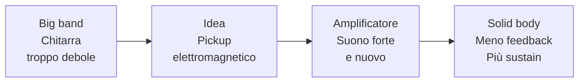
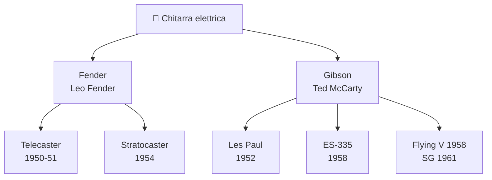
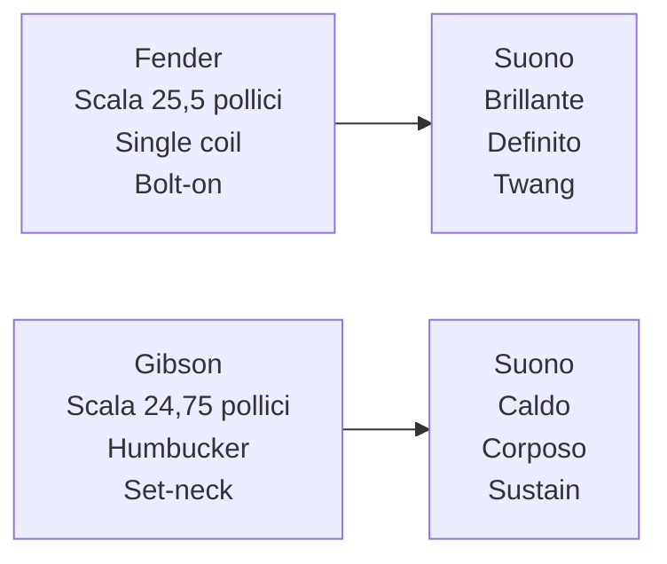
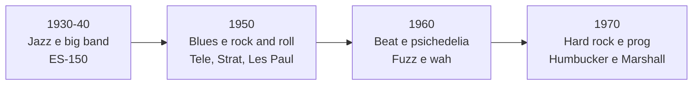
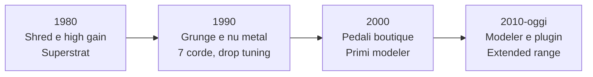
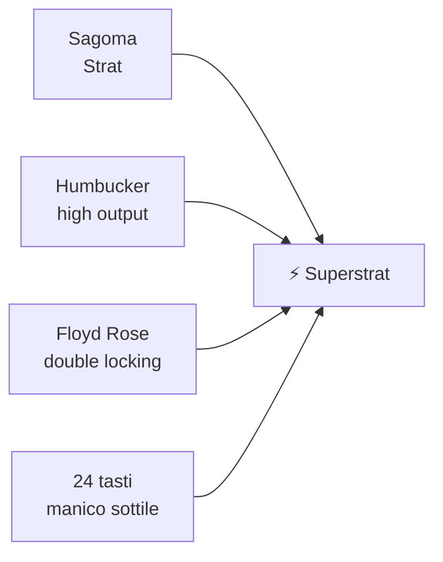
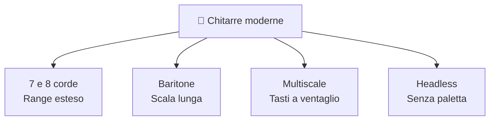
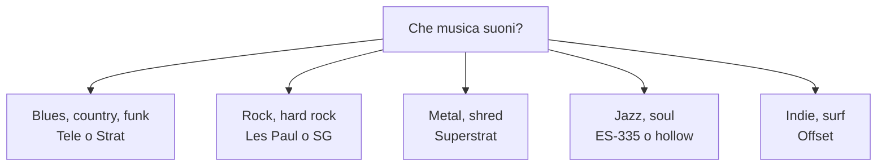

<a id="indice-modulo"></a>
# Modulo 1: Storia della Chitarra Elettrica
*Fase 1 · Strumento e Storia (Livello Medio) — Guitar Master, GCProf Academy*

📑 [Introduzione](#intro) · [Obiettivi](#obiettivi) · [Prerequisiti](#prerequisiti) · [Lezioni](#lezioni) · [Esempi](#esempi) · [Laboratorio](#laboratorio) · [Best Practice](#best-practice) · [Errori comuni](#errori) · [Riepilogo](#riepilogo) · [Glossario](#glossario) · [Quiz](#quiz) · [Materiale scaricabile](#materiale) · [Bibliografia](#bibliografia) · [Sitografia](#sitografia)

---

<a id="intro"></a>
## 1. Introduzione

Ogni volta che accendi l'ampli e colpisci una corda, stai usando una tecnologia nata da un problema molto concreto: **nessuno sentiva la chitarra**. Da lì è partita una delle storie più affascinanti della musica moderna, fatta di inventori testardi, marchi rivali, esperimenti falliti che sono diventati leggende e strumenti che hanno cambiato il modo in cui suona il mondo.

Perché studiare la storia, se vuoi soprattutto suonare meglio? Perché **ogni chitarra racconta una scelta di suono**. Sapere *perché* una Telecaster suona brillante, perché una Les Paul ha quel corpo caldo o perché una superstrat nasce per la velocità ti permette di scegliere lo strumento giusto per il tuo stile, di riconoscere i suoni dei tuoi idoli e di costruire il tuo timbro con consapevolezza.

In questo modulo viaggiamo dagli anni '30 a oggi: dalle prime lap steel elettrificate alle chitarre a 8 corde, dai pickup a barra ai modeler digitali. Alla fine guarderai la tua chitarra con occhi nuovi.

Il modulo apre la Fase 1 del corso ed è pensato per chitarristi di livello medio: non serve teoria avanzata, serve orecchio curioso.

---

<a id="obiettivi"></a>
## 2. Obiettivi

Al termine di questo modulo saprai:

- Spiegare **perché** è nata la chitarra elettrica e come funziona, a grandi linee, l'amplificazione tramite pickup.
- Ricostruire le **tappe fondamentali** dal 1931 a oggi, collocando ogni modello nel suo periodo.
- Riconoscere i **modelli storici** (Telecaster, Stratocaster, Les Paul, SG, Flying V, ES-335, offset, superstrat) e le loro caratteristiche distintive.
- Collegare **strumenti, suoni e generi musicali** decennio per decennio.
- Descrivere le evoluzioni moderne: **7/8 corde, baritone, multiscale, headless** e l'arrivo dei modeler digitali.
- **Scegliere consapevolmente** la chitarra giusta per il tuo stile, con criteri chiari e non solo per il "nome sulla paletta".

---

<a id="prerequisiti"></a>
## 3. Prerequisiti

- **Serve:** saper suonare i primi accordi aperti, la pentatonica di base e leggere una tablatura. Una chitarra elettrica (qualsiasi) e un ampli o un'interfaccia audio per il laboratorio.
- **Non serve:** nessuna conoscenza di liuteria, elettronica o teoria avanzata. Il modulo è quasi interamente **concettuale e d'ascolto**: i dettagli costruttivi arrivano nel Modulo 2 e quelli sui pickup nel Modulo 13.

---

<a id="lezioni"></a>
## 4. Lezioni

### 4.1 Dalla chitarra acustica al problema del volume

All'inizio del Novecento la chitarra era soprattutto uno strumento **ritmico e di accompagnamento**. Negli anni '20-'30, con l'esplosione delle big band jazz, arrivò il problema: tra ottoni, sax e batteria, una chitarra acustica non si sentiva.

I liutai provarono a risolverlo in modi meccanici:

- **Archtop** (corpo cavo con fori a effe, come le Gibson L-5 del 1922): più proiezione, ma ancora non abbastanza.
- **Chitarre resonator** (National, fine anni '20): un cono metallico amplificava il suono acusticamente.

La svolta arrivò con un'idea diversa: **trasformare la vibrazione delle corde in un segnale elettrico** e amplificarlo. Nasce così il **pickup elettromagnetico**.

- Il pickup è composto da **magneti e una bobina di filo di rame** sottilissimo.
- Una corda d'acciaio che vibra sopra il magnete **disturba il campo magnetico**.
- Quel disturbo genera nella bobina una **piccolissima corrente elettrica**, che l'amplificatore rende udibile.

*Perché ti serve: capire il principio del pickup ti spiega perché le corde di nylon non funzionano, perché la posizione del pickup cambia il timbro e perché il rumore di fondo è un tema costante (lo approfondiremo nel Modulo 13).*

**📊 Infografica: dal problema alla soluzione**



### 4.2 I primi pickup: lap steel, ES-150 e Charlie Christian

- **1931-32 — Rickenbacker "Frying Pan":** la lap steel A-22, con corpo in alluminio e un pickup a ferro di cavallo, è generalmente considerata la **prima chitarra elettrica prodotta commercialmente**. La musica hawaiana e la lap steel erano popolarissime: fu il primo terreno di prova dell'amplificazione.
- **1936 — Gibson ES-150:** la prima chitarra elettrica "spagnola" (cioè da suonare in posizione normale) di successo. Il suo pickup a barra sarebbe stato ribattezzato "Charlie Christian pickup".
- **Fine anni '30 — Charlie Christian:** con il sestetto di Benny Goodman porta la chitarra elettrica **in primo piano come strumento solista**, con linee melodiche a note singole "alla maniera di un sax". Dopo di lui, la chitarra non è più solo accompagnamento.

*Perché ti serve: quando fraseggi su un blues o su un jazz, stai usando una tradizione che nasce proprio da questa idea: la chitarra che risponde ai fiati.*

### 4.3 Il sogno della solid body: Les Paul, Bigsby e Leo Fender

Le chitarre elettriche a corpo cavo avevano un difetto: con l'ampli forte **entravano in feedback** (il fischio incontrollato) e perdevano sustain. La soluzione? Un corpo **pieno**, che vibra molto meno e lascia che siano le corde e il pickup a fare il suono.

- **Inizio anni '40 — "The Log" di Les Paul:** un esperimento fatto con un blocco di legno massiccio e un manico, con pickup applicati, per studiare sustain e feedback.
- **1948 — Bigsby-Travis:** Paul Bigsby costruisce per Merle Travis una delle prime solid body funzionanti.
- **1950-51 — Fender Esquire/Broadcaster/Telecaster:** **Leo Fender**, riparatore di radio in California, pensa la chitarra come un prodotto industriale: **corpo in frassino o ontano, manico avvitato (bolt-on)**, parti facilmente sostituibili. Il nome "Broadcaster" viene abbandonato dopo poco e diventa **Telecaster**, la prima solid body prodotta in serie di grande successo.

Nasce l'idea della chitarra come strumento **robusto, riparabile, costruibile in quantità**: ed è ancora la filosofia di tanti strumenti di oggi.

### 4.4 L'età d'oro (1952-1961): Fender contro Gibson

Con il successo della Telecaster, **Gibson** risponde. Comincia la più celebre rivalità della storia della chitarra elettrica.

- **1952 — Gibson Les Paul:** sviluppata con Les Paul e con il presidente Gibson **Ted McCarty**. Corpo in mogano con top in acero scolpito, **manico incollato (set-neck)**, inizialmente con pickup P-90. Dal **1954** arriva il ponte **Tune-o-matic**.
- **1954 — Fender Stratocaster:** **tre pickup**, tremolo sincronizzato, corpo sagomato per l'ergonomia. Nasce con selettore a **3 posizioni**: quello a 5 posizioni diventa standard solo dal **1977**, dopo anni in cui i chitarristi bloccavano il selettore tra due posizioni per ottenere i suoni intermedi.
- **1957 — Humbucker (Seth Lover, Gibson):** doppia bobina contro il ronzio dei single coil, con un suono più **caldo, spesso e potente**. Il celebre "PAF" (Patent Applied For) equipaggia le Les Paul dalla fine degli anni '50.
- **1958 — ES-335:** la prima **semi-hollow** di successo, con un **blocco centrale** di legno che unisce corpo cavo e sustain, riducendo il feedback.
- **1958 — Flying V ed Explorer:** forme futuribili in legno *korina*, inizialmente poco vendute e poi diventate icone.
- **1958-62 — Jazzmaster e Jaguar (Fender):** le "offset" pensate per il jazz, adottate dal surf rock e più tardi dall'alt/indie.
- **1961 — Gibson SG:** la Les Paul viene ridisegnata con un corpo sottile a doppio corno; il modello prenderà poi il nome SG.

**📊 Infografica: due scuole, un albero genealogico**



### 4.5 Perché Fender e Gibson suonano diversi

Non è una regola assoluta, ma esistono **tendenze** che nascono dalle scelte costruttive (le approfondiremo nel Modulo 2 e nel Modulo 13):

- **Lunghezza di scala:** 25,5" (Fender) contro 24,75" (Gibson). Più è lunga, più le corde sono tese e "brillanti"; più è corta, più sono morbide e facili da piegare.
- **Attacco del manico:** bolt-on (Fender) contro set-neck (Gibson): attacco e sustain diversi.
- **Pickup:** single coil (Fender) contro humbucker (Gibson): timbro cristallino contro timbro più spesso.

**📊 Infografica: il DNA del suono (tendenze, non regole)**



*Perché ti serve: quando pensi "voglio un suono più caldo" o "più definito", ora sai *dove* cercare il cambiamento: pickup, legni, scala, ampli.*

### 4.6 Decade per decade: strumenti e suoni

Ogni epoca ha una sua **firma sonora**, legata a strumenti, amplificatori ed effetti.

**📊 Infografica: 1930-1970**



- **Anni '30-'40:** suono pulito e caldo, jazz e swing.
- **Anni '50:** blues elettrico di Chicago, country, rock and roll. Il "twang" della Telecaster e i primi ampli valvolari Fender.
- **Anni '60:** la British Invasion e la psichedelia. Nascono il **fuzz** (Maestro Fuzz-Tone, 1962), il **wah** (metà anni '60) e gli ampli **Marshall** e **Vox**. Hendrix impugna una Stratocaster, Clapton registra con Les Paul e Marshall.
- **Anni '70:** hard rock e progressive: Les Paul o SG con humbucker e stack Marshall, assoli lunghi, suono pieno e distorto. Alla fine del decennio arrivano il debutto di **Eddie Van Halen** (1978), il tremolo **Floyd Rose** e il pedale **Tube Screamer**.

**📊 Infografica: 1980-oggi**



- **Anni '80:** shred, hair metal, effetti rack (chorus, delay), pickup ad alto output ed elettronica attiva. Nasce la **superstrat**.
- **Anni '90:** grunge, alternative rock, nu metal. Ritornano le offset (Jaguar, Jazzmaster, Mustang), arrivano le **7 corde** e le accordature ribassate.
- **Anni 2000:** boom dei pedali boutique e dei primi modeler (Line 6 POD, 1998).
- **Dal 2010 a oggi:** modeler professionali (Kemper, Fractal, Helix), plugin, chitarre a 7/8 corde e strumenti multiscale e headless.

### 4.7 L'era shred: la superstrat

Negli anni '80 nasce una nuova categoria: la **superstrat**, una Stratocaster "potenziata" per velocità e precisione. Marchi come **Charvel, Jackson, Kramer e Ibanez** (con la serie RG del 1987) diventano protagonisti.

**📊 Infografica: la "ricetta" superstrat**



- **Sagoma Strat**, ma spesso con **humbucker al ponte** per un suono più potente.
- **Floyd Rose:** tremolo a doppio bloccaggio che mantiene l'accordatura anche con dive bomb estremi.
- **24 tasti e manico sottile e piatto**, per assoli veloci sulle note alte.
- Il simbolo dell'epoca: la "Frankenstrat" di **Eddie Van Halen**, una Strat-style assemblata con un humbucker al ponte.

### 4.8 Oltre le sei corde: le chitarre moderne

Oggi la chitarra elettrica ha molte forme, spesso pensate per i generi estremi e per la scrittura moderna.

**📊 Infografica: le famiglie moderne**



- **7 e 8 corde:** aggiungono note gravi (si o fa# basso). Già il jazzista George Van Eps usava una settima corda; il metal la rende popolare, e il modello Ibanez Universe (1990) con Steve Vai è una pietra miliare. Band come i Meshuggah sono tra i nomi legati alle 8 corde.
- **Baritone:** scala più lunga (spesso 27" e oltre) per accordature più basse mantenendo tensione e definizione.
- **Multiscale / fanned fret:** i tasti a ventaglio (idea di Ralph Novak) danno **scala lunga sulle corde gravi** e **più corta sulle acute**, per tensione bilanciata ed ergonomia.
- **Headless:** senza paletta, meccaniche sul ponte o vicino al corpo. Lo strumento è più corto e leggero (Steinberger, poi molti costruttori moderni).

### 4.9 La rivoluzione digitale

Dagli anni '90 la simulazione digitale entra in gioco: dal **POD di Line 6 (1998)** ai **profiler e modeler** attuali, oggi è possibile avere in un solo dispositivo ampli, cabinet ed effetti. Ne parleremo a fondo nel **Modulo 16**, ma tieni a mente questo punto: **i modeler non hanno sostituito gli ampli, hanno ampliato le opzioni** (e hanno reso professionale il suono di casa).

### 4.10 Come scegliere la tua chitarra oggi

Il criterio migliore non è il nome, ma la domanda: **che suono e che feeling voglio?**

**📊 Infografica: una bussola per la scelta**



- **Suonabilità prima di tutto:** manico, peso, forma. Se non ti piace in mano, non ti piacerà sul palco.
- **Prova con orecchio e mani**, anche con ampli diversi.
- **Budget realistico:** oggi strumenti di fascia media sono molto validi. Meglio uno strumento ben regolato (Modulo 3) che uno "famoso" ma trascurato.
- **Non farti bloccare dagli stereotipi:** una Les Paul può suonare metal, una Strat può suonare jazz.

---

<a id="esempi"></a>
## 5. Esempi

**Esempio 1 — La lunghezza di scala sul manico.** La "scala" è la distanza tra capotasto e ponte: il 12° tasto si trova **esattamente a metà**.

```
Capotasto |=========== 12° tasto ===========| Ponte

Fender  (scala 25,5" = 648 mm)  → 12° tasto a circa 12,75"
Gibson  (scala 24,75" = 629 mm) → 12° tasto a circa 12,375"
```

* **Commento:** con la stessa accordatura e lo stesso calibro, la scala più lunga ha corde più tese (più "definite"), quella più corta più morbide (bending più facili). Le corde sono le stesse, il feeling no.

**Esempio 2 — Il selettore dei pickup.** Ogni modello ha una logica diversa:

| Modello | Selettore | Posizioni disponibili |
|---|---|---|
| **Stratocaster** | 5 posizioni | ponte · ponte+centrale · centrale · centrale+manico · manico |
| **Telecaster** | 3 posizioni | ponte · ponte+manico · manico |
| **Les Paul** | 3 posizioni | manico · manico+ponte · ponte (levetta in alto = manico) |

* **Commento:** le posizioni "intermedie" della Strat hanno un suono cavo e sbarazzino ("quack"), noto negli assoli di Mark Knopfler.

**Esempio 3 — Riconoscere un suono a orecchio.**

* **Telecaster, pickup al ponte:** timbro secco, brillante e "twang", tipico di country e rock.
* **Stratocaster, posizioni intermedie:** suono cavo e croccante ("quack").
* **Les Paul, pickup al manico:** suono rotondo, grasso e caldo, perfetto per assoli lirici.
* **SG con pickup al ponte e ampli Marshall:** grinta e attacco, come in *Back in Black* degli AC/DC.
* **Superstrat con Floyd Rose:** attacco preciso, dive bomb e tapping alla Van Halen.

---

<a id="laboratorio"></a>
## 6. Laboratorio

**Attività: "Il tuo identikit sonoro"** (chitarra e ampli, nessuna teoria avanzata richiesta)

1. **Ascolto guidato.** Ascolta con attenzione questi brani (o altri equivalenti a tua scelta) e concentrati sul suono della chitarra:
   - Jimi Hendrix — *Little Wing* (Stratocaster)
   - Jimmy Page — assolo di *Stairway to Heaven* (Telecaster)
   - AC/DC — *Back in Black* (Gibson SG)
   - Guns N' Roses — assolo di *Sweet Child O' Mine* (Les Paul)
   - Larry Carlton — *Room 335* (Gibson ES-335)
   - Van Halen — *Eruption* (superstrat "Frankenstrat")
2. **Annota per ogni brano:** timbro (brillante/caldo), quantità di gain (clean, crunch, high gain), carattere (twang, spesso, morbido, aggressivo) e decennio.
3. **Prova sulla tua chitarra.** Suona questo **lick di confronto** in La minore pentatonica (posizione 1, 5ª tastiera) prima con il pickup al manico e poi al ponte, con il tono aperto e poi ridotto. Ascolta come cambia il timbro.

```
Corde   5     6     7     8      Tasti
 e  |--[A]---------------(C)--|    [X] = tonica (La)
 B  |--(E)---------------(G)--|    (x) = altra nota della scala
 G  |--(C)-------(D)----------|
 D  |--(G)-------[A]----------|
 A  |--(D)-------(E)----------|
 E  |--[A]---------------(C)--|
```

@@TAB@@

   * **Come si legge:** parti dalla 6ª corda (E) al tasto 5 e sali, due note per corda. Suona lentamente e con un metronomo a 60 BPM, con note da un quarto.
4. **Compila la tua scheda d'identità** (puoi copiarla in Google Docs):

| Campo | La mia chitarra |
|---|---|
| Modello "di riferimento" (Strat-style, LP-style, superstrat...) | |
| Pickup (single coil, humbucker, P90) | |
| Lunghezza di scala | |
| Ponte (fisso, tremolo, Floyd Rose) | |
| Suono che mi piace di più | |
| Suono che vorrei ottenere | |

*Obiettivo:* allenare l'orecchio a **riconoscere le firme sonore dei modelli storici** e a capire come il tuo strumento si colloca nella storia. La scheda sarà la base del Project Work di fine Fase 1.

---

<a id="best-practice"></a>
## 7. Best Practice

- **Ascolta prima di leggere.** Ogni volta che scopri un modello, cerca un brano che lo rappresenta e ascoltalo con le cuffie.
- **Associa sempre modello, suono e contesto.** "Strat + Hendrix + anni '60" è più utile che memorizzare una data.
- **Prova gli strumenti dal vivo** (in negozio o da amici): la suonabilità non si legge in una scheda tecnica.
- **Non giudicare uno strumento dal solo pickup.** Ampli, effetti e tocco pesano quanto le specifiche.
- **Annota le tue scoperte** in un quaderno sonoro: ti servirà nei moduli su suono e pedali.

---

<a id="errori"></a>
## 8. Errori comuni

- ❌ *"La Telecaster è la prima chitarra elettrica."* → La prima elettrica prodotta commercialmente è la lap steel Rickenbacker "Frying Pan" (1931-32); la Telecaster è tra le prime **solid body** di successo (1950-51).
- ❌ *"Les Paul ha inventato la chitarra solid body da solo."* → Ha sperimentato molto (The Log), ma la produzione in serie di successo parte da Fender; il modello Gibson Les Paul arriva nel 1952.
- ❌ *"Fender = sempre brillante, Gibson = sempre caldo."* → Sono tendenze. Pickup, legni, ampli e setup possono ribaltare il carattere.
- ❌ *"Il suono dipende solo dalla chitarra."* → Dipende da tutta la catena: dita, chitarra, cavi, pedali, ampli, cabinet.
- ❌ *"I modeler hanno reso inutili gli ampli."* → Sono strumenti diversi, spesso complementari; la scelta dipende da uso, budget e feeling.

---

<a id="riepilogo"></a>
## 9. Riepilogo

| Concetto | In una riga |
|---|---|
| Pickup | Magneti e bobina che trasformano la vibrazione delle corde in segnale elettrico |
| Lap steel | Prima chitarra elettrica commerciale (Rickenbacker, 1931-32) |
| ES-150 | Prima elettrica "spagnola" Gibson di successo (1936) |
| Solid body | Corpo pieno: meno feedback, più sustain |
| Telecaster | Fender, 1950-51: prima solid body di successo, bolt-on |
| Les Paul | Gibson, 1952: mogano e acero, set-neck, poi humbucker |
| Stratocaster | Fender, 1954: tre pickup e tremolo sincronizzato |
| Humbucker | Doppia bobina di Seth Lover (1957): meno rumore e suono più caldo |
| ES-335 | Gibson, 1958: semi-hollow con blocco centrale |
| SG / Flying V | Gibson, 1958-61: forme e corpi sottili iconici |
| Superstrat | Strat "potenziata" per la velocità (anni '80) |
| Extended range | Chitarre a 7/8 corde per gamma estesa |
| Modeler | Dispositivi che simulano ampli, cabinet ed effetti |

---

<a id="glossario"></a>
## 10. Glossario

- **Archtop** — chitarra a corpo cavo con top curvo e fori a effe, tipica del jazz.
- **Baritone** — chitarra a scala lunga, pensata per accordature più basse.
- **Bolt-on** — manico avvitato al corpo (tipico di Fender).
- **Extended range** — chitarra con più di sei corde (7, 8, 9...).
- **Fanned fret (multiscale)** — tasti a ventaglio che danno lunghezze di scala diverse per ogni corda.
- **Floyd Rose** — tremolo a doppio bloccaggio, tipico delle superstrat.
- **Headless** — chitarra senza paletta, con meccaniche spostate sul corpo o sul ponte.
- **Humbucker** — pickup a doppia bobina che riduce il ronzio e dà un suono più spesso.
- **Lap steel** — chitarra suonata in orizzontale con una barra, tra i primi strumenti elettrificati.
- **Lunghezza di scala** — distanza tra capotasto e ponte, che influenza tensione e feeling.
- **Modeler** — dispositivo digitale che simula ampli, cabinet ed effetti.
- **Offset** — famiglia di chitarre dalle forme asimmetriche (Jazzmaster, Jaguar).
- **Pickup** — trasduttore elettromagnetico che trasforma la vibrazione delle corde in segnale elettrico.
- **Semi-hollow** — chitarra con corpo cavo e blocco centrale solido (es. ES-335).
- **Set-neck** — manico incollato al corpo (tipico di Gibson).
- **Single coil** — pickup a bobina singola, brillante e definito, più soggetto a ronzio.
- **Solid body** — chitarra a corpo pieno, senza casse di risonanza.
- **Superstrat** — chitarra di derivazione Stratocaster, ottimizzata per velocità e suoni ad alto gain.

---

<a id="quiz"></a>
## 11. Quiz

**1.** Vero o Falso: la prima chitarra elettrica prodotta commercialmente fu la Fender Telecaster.
`Falso — fu la lap steel Rickenbacker "Frying Pan" (1931-32); la Telecaster arriva nel 1950-51.`

**2.** Perché è nata la chitarra elettrica?
- a) Per suonare più velocemente
- b) Per farsi sentire nelle big band, dove la chitarra acustica era coperta ✅
- c) Per sostituire il pianoforte
- d) Per eliminare le corde

**3.** Chi portò la chitarra elettrica in primo piano come strumento solista nel jazz alla fine degli anni '30?
- a) Jimi Hendrix
- b) Charlie Christian ✅
- c) Eddie Van Halen
- d) Muddy Waters

**4.** Metti in ordine cronologico: Stratocaster, Telecaster, SG, Flying V.
`Telecaster (1950-51) → Stratocaster (1954) → Flying V (1958) → SG (1961)`

**5.** Qual è la lunghezza di scala tipica di una Stratocaster?
- a) 24,75"
- b) 25,5" ✅
- c) 27"
- d) 22"

**6.** Vero o Falso: la ES-335 è una chitarra semi-hollow con blocco centrale per ridurre il feedback.
`Vero.`

**7.** L'humbucker fu sviluppato principalmente per:
- a) Aumentare il volume delle corde
- b) Ridurre il ronzio (hum) dei single coil e dare un suono più spesso ✅
- c) Sostituire il ponte
- d) Ridurre il peso della chitarra

**8.** Vero o Falso: la Stratocaster è nata con il selettore a 5 posizioni.
`Falso — nasce a 3 posizioni; il selettore a 5 posizioni diventa standard dal 1977.`

**9.** Quali sono i quattro elementi che caratterizzano una superstrat?
`Sagoma Strat, humbucker high output (spesso al ponte), tremolo Floyd Rose, 24 tasti con manico sottile e veloce.`

**10.** Perché conviene scegliere una chitarra in base al suono e al feeling che vuoi, e non solo in base al modello famoso?
`Perché scala, pickup, legni, ponte e setup determinano timbro e suonabilità; il nome del modello non garantisce che quello strumento sia adatto al tuo stile e alle tue mani.`

---

<a id="materiale"></a>
## 13. Materiale scaricabile

- 📄 Cheat-sheet "Modelli storici a colpo d'occhio" (1 pagina, da produrre in PDF)
- 📊 Timeline illustrata della chitarra elettrica (da produrre come infografica)
- 🎧 Playlist di ascolto guidato per modello e decennio
- 📝 Slide riassuntive del modulo (da produrre in formato .pptx)

---

<a id="bibliografia"></a>
## 14. Bibliografia

- Bacon, T., Day, P. — *The Ultimate Guitar Book*
- Wheeler, T. — *American Guitars: An Illustrated History*
- Duchossoir, A. R. — *The Fender Stratocaster* e *Gibson Electrics: The Classic Years*
- Smith, R. R. — *Fender: The Sound Heard 'Round the World*

---

<a id="sitografia"></a>
## 15. Sitografia

- Sito ufficiale Fender — sezione storia dei modelli
- Sito ufficiale Gibson — storia del marchio e dei modelli
- Premier Guitar — archivio articoli su storia e tecnica
- Reverb Learn — guide storiche ai modelli e agli strumenti

[🔙 Torna all'indice del modulo](#indice-modulo)