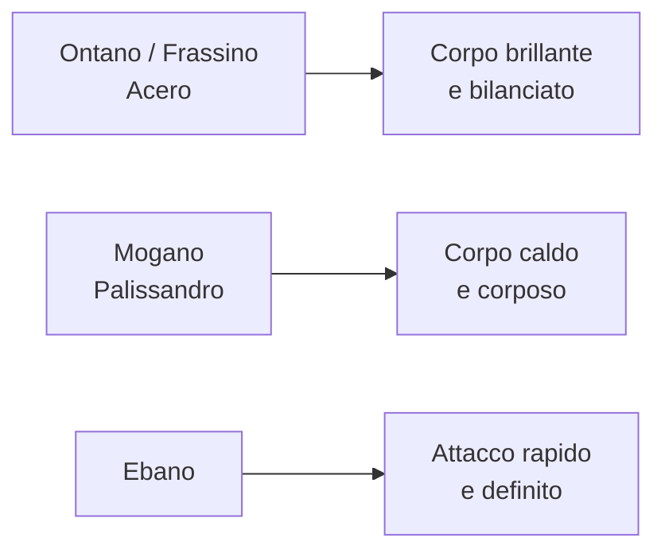
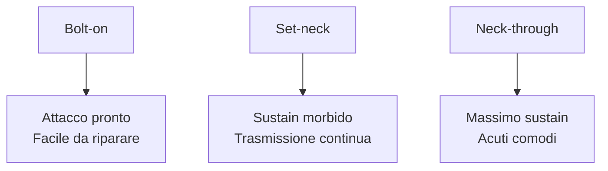

<a id="indice-modulo"></a>
# Modulo 2: Liuteria: Anatomia e Costruzione
*Fase 1 · Strumento e Storia (Livello Medio) — Guitar Master, GCProf Academy*

📑 [Introduzione](#intro) · [Obiettivi](#obiettivi) · [Prerequisiti](#prerequisiti) · [Lezioni](#lezioni) · [Esempi](#esempi) · [Laboratorio](#laboratorio) · [Best Practice](#best-practice) · [Errori comuni](#errori) · [Riepilogo](#riepilogo) · [Glossario](#glossario) · [Quiz](#quiz) · [Materiale scaricabile](#materiale) · [Bibliografia](#bibliografia) · [Sitografia](#sitografia)

---

<a id="intro"></a>
## 1. Introduzione

Nel Modulo 1 hai imparato *perché* Fender e Gibson suonano diverso. Ora scopriamo *come*: apriamo la chitarra come un liutaio, pezzo per pezzo, e vediamo come ogni scelta costruttiva — un legno, un raggio di tastiera, un tipo di ponte — cambia suono, suonabilità e feeling sotto le tue dita.

Questo è uno dei moduli più "tecnici" della Fase 1, ma è pensato per essere pratico: non serve diventare liutai, serve **saper leggere una scheda tecnica** e capire cosa cercare quando provi o acquisti uno strumento. È anche la base indispensabile per il Modulo 3 (Setup), dove metterai le mani sulla tua chitarra.

Ogni componente sarà illustrato con diagrammi precisi del manico e del corpo, perché in liuteria — più che altrove — "vedere" aiuta a capire.

---

<a id="obiettivi"></a>
## 2. Obiettivi

Al termine di questo modulo saprai:

- Nominare e localizzare **tutte le parti** della chitarra elettrica, su corpo e manico.
- Spiegare come **i legni** di corpo, manico e tastiera influenzano il timbro.
- Distinguere i tre **tipi di attacco del manico** (bolt-on, set-neck, neck-through) e i loro effetti su sustain e accesso agli acuti.
- Leggere **lunghezza di scala e raggio della tastiera** e capirne l'impatto su tensione e suonabilità.
- Riconoscere **profili del manico**, dimensioni dei tasti e materiali.
- Distinguere le principali famiglie di **ponti** (fissi, tremolo sincronizzato, Floyd Rose, Bigsby) e il loro funzionamento.
- Descrivere il ruolo di **meccaniche, capotasto ed elettronica** (potenziometri, condensatori, selettori, cablaggi).
- Valutare **l'acquisto o la modifica** di uno strumento leggendone le specifiche tecniche.

---

<a id="prerequisiti"></a>
## 3. Prerequisiti

- **Serve:** aver completato il Modulo 1 (storia e modelli storici), avere una chitarra elettrica a disposizione da osservare durante il laboratorio.
- **Non serve:** esperienza di liuteria, falegnameria o elettronica. Qui costruiamo il **vocabolario e la comprensione**; le regolazioni pratiche arrivano nel Modulo 3.

---

<a id="lezioni"></a>
## 4. Lezioni

### 4.1 Anatomia completa: la mappa dello strumento

Prima di entrare nei dettagli, fissiamo i nomi. Ecco la chitarra elettrica vista per intero, con ogni parte al suo posto:

```
                    PALETTA (headstock)
                 ┌───────────────────┐
                 │  ◯ ◯ ◯      ◯ ◯ ◯  │  ← Meccaniche (tuners)
                 └─────────┬─────────┘
                       CAPOTASTO (nut)
                           │
     ┌─────────────────────────────────────────┐
     │ |  |  |  |  |  |  |  |  |  |  |  |  |  | │  ← Tasti (frets)
     │ |  |  |  |  |  |  |  |  |  |  |  |  |  | │     su TASTIERA (fretboard)
     │ |  |  |  |  |  |  |  |  |  |  |  |  |  | │     sopra il MANICO (neck)
     └─────────────────────────────────────────┘
                           │
        ╔══════════════════════════════════════╗
        ║            CORPO (body)               ║
        ║   ⊙        ⊙        ⊙                 ║  ← Pickup (manico/centrale/ponte)
        ║        [selettore]   (manopole)        ║  ← Controlli: volume, tono
        ║                                    ║═══║  ← Ponte (bridge)
        ╚════════════════════════════════════╝═══╝
                                              jack output
```

- **Paletta (headstock):** ospita le meccaniche; può essere 6-in-line (Fender) o 3+3 (Gibson) — lo vedremo nella sezione 4.7.
- **Capotasto (nut):** la "guida" delle corde all'inizio della tastiera, in osso, plastica o materiali sintetici (Graph Tech).
- **Manico (neck) e tastiera (fretboard):** dove suoni; spesso due legni diversi incollati o un unico blocco.
- **Corpo (body):** sostiene pickup, ponte ed elettronica; la sua forma e il suo legno influenzano peso e risonanza.
- **Pickup, ponte, controlli, jack:** li vedremo nel dettaglio nelle prossime sezioni (l'elettronica anche nel Modulo 13).

*Perché ti serve: quando leggerai una scheda tecnica online, ogni termine di questo modulo tornerà — capirla ti farà risparmiare tempo e soldi.*

### 4.2 I legni: corpo, manico e tastiera

Il legno non è solo estetica: **massa, densità e rigidità** modellano attacco, sustain e frequenze dominanti.

**Legni per il corpo:**

- **Ontano (alder):** leggero, bilanciato, medi presenti — lo storico legno Fender.
- **Frassino (ash):** più brillante e risonante; lo "swamp ash" leggero è ricercato per il sustain.
- **Mogano (mahogany):** denso e caldo, molti bassi e medi — tipico Gibson, spesso abbinato a un top in acero.
- **Acero (maple):** duro e brillante, spesso usato come top decorativo/tonale sopra al mogano (es. Les Paul) o come legno per il manico.
- **Basswood/ontano leggero:** molto usati nelle chitarre moderne per un suono neutro e un peso contenuto.

**Legni per il manico:**

- **Acero:** rigido, risposta rapida e brillante, spesso a vista sulle Fender.
- **Mogano:** più morbido e caldo, tipico Gibson.

**Legni per la tastiera:**

- **Palissandro (rosewood):** caldo, morbido al tatto, armonici ricchi.
- **Acero:** brillante, attacco definito, spesso verniciato.
- **Ebano (ebony):** molto duro e denso, attacco rapido e definito, molto usato su strumenti moderni e metal.

*Perché ti serve: se cerchi più definizione, cerca acero ed ebano; se cerchi calore, mogano e palissandro. È una tendenza, non una legge fisica assoluta — il resto della catena (pickup, ampli) pesa comunque molto.*

**📊 Infografica: dal legno al carattere del suono**



### 4.3 Attacco del manico: bolt-on, set-neck, neck-through

Il modo in cui il manico si unisce al corpo cambia **sustain, trasmissione delle vibrazioni e accesso ai tasti alti**.

```
BOLT-ON                    SET-NECK                   NECK-THROUGH
(avvitato)                 (incollato)                (un unico pezzo)

 ┌────┐                     ┌────┐                    ┌────┐
 │MANICO│                   │MANICO│╲                  │MANICO│
 └──┬─┘                     └──┬─┘ ╲___incollato       │  │  attraversa
    │ 4 viti                   │        a incastro     │  │  tutto il corpo
 ╔══╧══════╗               ╔═══╧═════╗              ╔══╧══╧══╗
 ║  CORPO  ║               ║  CORPO  ║              ║ ALETTE ║ ← corpo aggiunto
 ╚═════════╝               ╚═════════╝              ╚════════╝    ai lati
```

- **Bolt-on (Fender):** manico avvitato al corpo con una piastra e 3-4 viti. Attacco **pronto e percussivo**, più facile da riparare o sostituire, giunto al corpo spesso a filo del 21°-22° tasto (meno comodo per gli acuti estremi).
- **Set-neck (Gibson):** manico incollato con un giunto a incastro. Trasmissione delle vibrazioni più continua, sustain spesso più lungo e "morbido"; il tallone del manico è generalmente più ingombrante.
- **Neck-through (molte superstrat e strumenti moderni):** il manico è un pezzo unico che attraversa tutto il corpo, con "alette" di corpo incollate ai lati. Massimo sustain e **accesso facilissimo ai tasti alti**, perché non c'è giunto che ostacola la mano.

*Perché ti serve: se suoni molto sui tasti alti (assoli, shred), un neck-through o un bolt-on con giunto scolpito ti aiuta; se cerchi il calore e il sustain "vintage", il set-neck è la strada classica.*

**📊 Infografica: attacco del manico e i suoi effetti**



### 4.4 Lunghezza di scala e raggio della tastiera

Abbiamo già incontrato la **lunghezza di scala** nel Modulo 1 (distanza capotasto-ponte). Ora aggiungiamo il **raggio della tastiera**: la curvatura trasversale della tastiera, misurata in pollici (più piccolo = più curva).

```
Raggio STRETTO (7,25")              Raggio PIATTO (12"-16")
      ___________                        ___________
    ╱             ╲                   ╱ ‾ ‾ ‾ ‾ ‾ ‾ ‾ ╲
   │  tastiera molto  │              │   tastiera quasi   │
   │  bombata          │             │   piatta            │
    ╲_________________╱               ╲_________________╱

  Vintage Fender               Moderno / shred / bending estremi
  Comoda per accordi aperti    Comoda per bending senza "strozzare"
```

- **Raggio stretto (7,25"):** tipico delle Fender vintage, comodo per accordi con la mano che "abbraccia" il manico, ma può far "strozzare" le note nei bending estremi sulle corde alte.
- **Raggio piatto (12"-16" o composito, cioè variabile lungo il manico):** più adatto a bending ampi, tapping e tecniche moderne, perché le corde restano ad altezza costante rispetto ai tasti.
- **Molti strumenti moderni** usano un **raggio composito** (es. 9,5"-14"): più bombato vicino al capotasto per gli accordi, più piatto verso l'acuto per gli assoli.

*Perché ti serve: se il tuo stile è ricco di bending estesi, cerca un raggio più piatto o composito; se suoni molto in accordi aperti, un raggio più stretto può risultare più comodo.*

### 4.5 Profili del manico

Il "profilo" è la sagoma del manico vista in sezione: cambia il modo in cui il pollice e il palmo lo avvolgono.

```
Vista in sezione (guardando il manico dal capotasto verso il corpo)

    "C" MODERNO           "C" SOTTILE           "V" (o "U")
      ___________           _________            _____
     /           \         /         \          /  ↑  \
    |   comodo,   |       | veloce,    |        | dorso |
    |  versatile  |       | manico     |        | pronun-|
     \___________/        | sottile    |        | ciato  |
                            \_________/          \_____/

  Standard su molte       Superstrat, shred      Vintage Fender/
  chitarre moderne        (comfort per la mano   Gibson anni '50,
                           che scivola veloce)    feeling "pieno"
```

- **Profilo a "C":** il più diffuso, bilanciato tra comodità e supporto.
- **Profilo sottile ("thin C" o "D"):** manico basso, ideale per velocità e mani piccole.
- **Profilo a "V" o "U":** più spesso, tipico di strumenti vintage o reissue, dà più "presa" per chi suona molto con il pollice sopra il manico (tecnica da blues/rock classico).

### 4.6 Tasti: dimensioni e materiali

```
Tasto SOTTILE/BASSO                  Tasto ALTO/JUMBO
  vintage                              moderno

  ___                                  _____
 |   |  altezza ridotta               |     |  altezza maggiore
 |___|  richiede più pressione         |_____|  bending fluido,
  ═══   sulla corda                      ═══    meno pressione
 tastiera                               tastiera
```

- **Tasti vintage (bassi e stretti):** sensazione più "tradizionale", ma richiedono più pressione delle dita.
- **Tasti jumbo (alti e larghi):** bending più scorrevoli, legato più semplice, molto diffusi su strumenti moderni e shred.
- **Materiali:** nichel-argento (standard) o **acciaio inossidabile**, più duro, che dura più a lungo e scorre meglio sotto le dita (ma è più difficile da limare per un liutaio).

### 4.7 Meccaniche e capotasto

- **Meccaniche (tuners):** ruotano un rocchetto che avvolge la corda, regolando la tensione/intonazione approssimativa. Le **meccaniche bloccanti (locking tuners)** stringono la corda direttamente al perno, riducendo lo slittamento e velocizzando il cambio corde.
- **Disposizione in paletta:**
  - **6-in-line** (tutte da un lato, tipico Fender): corde più "dritte" verso le meccaniche, meno angolo sul capotasto.
  - **3+3** (tre per lato, tipico Gibson): richiede spesso un "string tree" (fermacorde) sulle corde alte per garantire pressione sufficiente al capotasto.
- **Capotasto (nut):** materiale e taglio degli intagli influenzano accordatura e attrito. Materiali comuni: osso (naturale, risonante), plastica (economico), **Graph Tech/materiali sintetici** (scorrevoli, ottimi con il tremolo).

### 4.8 Ponti: fissi, tremolo sincronizzato, Floyd Rose, Bigsby

```
PONTE FISSO (hardtail)          TREMOLO SINCRONIZZATO           FLOYD ROSE
 (Telecaster, molte LP)          (Stratocaster)                 (double locking)

 ═══●═══●═══●═══●═══●═══         ═══●═══●═══●═══●═══●═══        ═══▓═══▓═══▓═══▓═══▓═══
       corpo                      ╲___leva_tremolo            ╲___leva
   nessuna parte mobile             basculante su perno          bloccato al capotasto
   massimo trasferimento            oscilla su e giù             e al ponte: dive bomb
   di vibrazione, accordatura       (Hendrix, Clapton)           estremi restando accordato
   molto stabile                                                 (Van Halen, shred)
```

- **Ponte fisso (hardtail):** nessuna parte mobile, massima stabilità di accordatura e ottimo trasferimento di vibrazione al corpo.
- **Tremolo sincronizzato (vintage o a 2 punti):** basculante su un perno, permette variazioni di intonazione morbide (vibrato) spingendo o tirando la leva.
- **Floyd Rose (double locking):** le corde sono bloccate sia al capotasto sia al ponte: regge **dive bomb** estremi mantenendo l'accordatura, a costo di una maggiore complessità nel cambio corde.
- **Bigsby:** tremolo esterno vintage, con corsa più ampia e morbida, tipico di hollow e semi-hollow (rockabilly, surf).

### 4.9 Elettronica: potenziometri, condensatori, selettori, cablaggi

Anticipiamo qui i concetti base; li riprenderemo nel Modulo 13 collegandoli al suono dei pickup.

- **Potenziometri (pot):** resistenze variabili che regolano volume e tono. Il valore (es. 250k o 500k) e la curva (lineare o logaritmica/audio taper) influenzano la sensazione di variazione e, in parte, il timbro percepito.
- **Condensatori (tone cap):** insieme al potenziometro di tono, "tagliano" le frequenze alte quando chiudi la manopola; il valore in **nF/µF** determina quanto taglio è disponibile.
- **Selettore pickup:** sceglie quale pickup (o combinazione) è attivo — 3 o 5 posizioni a seconda del modello (vedi Modulo 1, sezione 4.5).
- **Cablaggio (wiring):** lo schema con cui pot, condensatori, selettore e jack sono collegati; schemi diversi (es. "modern wiring" vs "50s wiring") cambiano leggermente la risposta dei controlli.

### 4.10 Finiture e materiali

- **Nitrocellulosa:** finitura vintage, sottile, che "invecchia" e si assottiglia col tempo (alcuni sostengono che lasci "respirare" di più il legno).
- **Poliuretano/poliestere:** più moderna, resistente e duratura, meno soggetta a graffi e screpolature.
- **Finiture "in oil" o cera:** su manici, per una sensazione naturale e scorrevole sotto la mano, tipica di molti strumenti moderni di fascia alta.

---

<a id="esempi"></a>
## 5. Esempi

**Esempio 1 — Leggere una scheda tecnica.** Ecco come decifrare una scheda tipica:

| Specifica | Significato | Cosa aspettarti |
|---|---|---|
| Body: Alder | Corpo in ontano | Suono bilanciato, medi presenti |
| Neck: Maple, Bolt-on | Manico in acero, avvitato | Attacco brillante e pronto |
| Fretboard: Rosewood, 9,5" radius | Tastiera in palissandro, raggio 9,5" | Calore + bending comodo |
| Frets: 22, Medium Jumbo | 22 tasti medio-alti | Buon compromesso accordi/assoli |
| Bridge: 2-Point Synchronized Tremolo | Tremolo sincronizzato a 2 punti | Vibrato disponibile, meno stabile di un hardtail |
| Nut: Synthetic Bone | Capotasto in osso sintetico | Buon compromesso scorrevolezza/costo |

**Esempio 2 — Confronto rapido: due filosofie costruttive**

| Caratteristica | "Vintage Fender-style" | "Modern superstrat" |
|---|---|---|
| Attacco manico | Bolt-on | Neck-through o bolt-on scolpito |
| Raggio tastiera | 7,25"-9,5" | 12"-16" o composito |
| Tasti | Vintage, bassi | Jumbo |
| Ponte | Tremolo vintage o hardtail | Floyd Rose |
| Uso ideale | Blues, country, rock classico | Metal, shred, tecniche estreme |

**Esempio 3 — Il giunto del manico e l'accesso agli acuti.** Osservando il profilo del corpo vicino al manico puoi già prevedere la comodità sui tasti alti:

```
Giunto SQUADRATO                    Giunto SCOLPITO (heel contour)
tradizionale                        o neck-through

   ┌────┐                              ┌────┐
   │MANI│                              │MANI│╲
   │ CO │                              │ CO │ ╲___ dolce,
 ╔═╧════╧═╗ ← angolo netto           ╔═╧════╧══╗   mano libera
 ║  CORPO  ║   il palmo si ferma     ║  CORPO   ║   di scivolare
 ╚═════════╝   qui                   ╚══════════╝   oltre il 20° tasto
```

---

<a id="laboratorio"></a>
## 6. Laboratorio

**Attività: "Ispeziona la tua chitarra come un liutaio"** (nessuna regolazione, solo osservazione — le regolazioni sono nel Modulo 3)

1. **Fotografa o osserva** la tua chitarra da questi punti di vista: paletta, giunto manico-corpo, ponte, elettronica (se accessibile togliendo il coperchio del battipenna, senza scollegare nulla).
2. **Compila la tua scheda tecnica**, usando il modello della sezione Esempi:

| Specifica | La tua chitarra |
|---|---|
| Legno del corpo (se noto) | |
| Legno e attacco del manico | |
| Legno della tastiera | |
| Raggio (se indicato dal produttore) | |
| Numero di tasti e tipo (vintage/jumbo) | |
| Tipo di ponte | |
| Tipo di paletta (6-in-line / 3+3) | |
| Materiale del capotasto (se noto) | |

3. **Prova "alla cieca" il profilo del manico**: afferra il manico al 1° tasto e poi al 12° tasto. Senti se lo spessore cambia (molti manici si ispessiscono verso il corpo) e prova a descrivere il profilo (C, sottile, V) con parole tue.
4. **Testa l'accesso agli acuti**: suona una nota al 20°-22° tasto (o all'ultimo disponibile). Il giunto manico-corpo ti ostacola la mano? Annota la sensazione: ti servirà per valutare futuri acquisti.

*Obiettivo:* imparare a **osservare e descrivere tecnicamente** uno strumento, base indispensabile prima di intervenire con un setup (Modulo 3) o di valutare un acquisto.

---

<a id="best-practice"></a>
## 7. Best Practice

- **Leggi sempre la scheda tecnica completa** prima di un acquisto: legni, scala, raggio e ponte dicono più del solo nome del modello.
- **Prova il profilo del manico di persona**, se possibile: le sensazioni cambiano molto da chitarrista a chitarrista.
- **Non sottovalutare il ponte**: cambia stabilità di accordatura e possibilità espressive (vibrato, dive bomb).
- **Tieni presente l'uso che farai dello strumento**: un profilo comodo per gli accordi non è detto sia il più veloce per gli assoli, e viceversa.
- **Documenta le specifiche della tua chitarra**: ti servirà come base per tutto il resto del corso, in particolare per il Project Work di fine Fase 1.

---

<a id="errori"></a>
## 8. Errori comuni

- ❌ *"Il legno del corpo è l'unico responsabile del suono."* → Pickup, elettronica, corde, ampli ed effetti incidono quanto (o più de) il legno.
- ❌ *"Il set-neck ha sempre più sustain del bolt-on."* → Il sustain dipende da molti fattori (masse, incollaggio, tensione delle corde, setup); è una tendenza, non una regola fissa.
- ❌ *"Un raggio più piatto è sempre 'meglio'."* → Dipende dallo stile: per accordi aperti e feeling vintage un raggio stretto può essere preferibile.
- ❌ *"Più tasti alti ci sono, meglio è per tutti."* → Se non suoni mai oltre il 15° tasto, un giunto tradizionale non è affatto un limite pratico.
- ❌ *"Il Floyd Rose è 'meglio' di un ponte fisso."* → È più versatile per certe tecniche, ma anche più complesso da mantenere e più lento nel cambio corde; dipende dall'uso.

---

<a id="riepilogo"></a>
## 9. Riepilogo

| Concetto | In una riga |
|---|---|
| Corpo | Sostiene pickup, ponte ed elettronica; il legno influenza massa e timbro |
| Manico/tastiera | Dove suoni; legno e profilo cambiano feeling e timbro |
| Bolt-on / Set-neck / Neck-through | Tre modi di unire manico e corpo, con effetti diversi su sustain e acuti |
| Lunghezza di scala | Distanza capotasto-ponte; più lunga = più tensione |
| Raggio tastiera | Curvatura trasversale; più piatto = bending più comodi |
| Profilo manico | Sagoma in sezione (C, sottile, V) che determina la presa |
| Tasti | Altezza e materiale influenzano bending e durata |
| Ponte | Fisso, tremolo sincronizzato, Floyd Rose, Bigsby: stabilità vs espressività |
| Meccaniche/capotasto | Tenuta dell'accordatura e attrito delle corde |
| Elettronica | Pot, condensatori, selettore e cablaggio modellano volume e tono |

---

<a id="glossario"></a>
## 10. Glossario

- **Capotasto (nut)** — pezzo che guida le corde all'inizio della tastiera, fissandone la spaziatura.
- **Condensatore (tone cap)** — componente che, con il pot di tono, taglia le frequenze alte.
- **Giunto manico-corpo (neck joint)** — punto di unione tra manico e corpo; ne esistono tre tipi principali.
- **Locking tuner** — meccanica bloccante che fissa la corda al perno, riducendo lo slittamento.
- **Neck-through** — costruzione in cui il manico attraversa tutto il corpo in un unico pezzo.
- **Potenziometro (pot)** — resistenza variabile che regola volume o tono.
- **Raggio della tastiera (fretboard radius)** — curvatura trasversale della tastiera, misurata in pollici.
- **Set-neck** — manico incollato al corpo con un giunto a incastro.
- **String tree (fermacorde)** — elemento che aumenta l'angolo delle corde verso il capotasto, tipico delle palette 3+3.
- **Tasto (fret)** — barretta metallica che divide la tastiera in semitoni.

---

<a id="quiz"></a>
## 11. Quiz

**1.** Vero o Falso: il legno del corpo è l'unico fattore che determina il timbro di una chitarra elettrica.
`Falso — pickup, elettronica, corde, ampli ed effetti incidono in modo determinante.`

**2.** Quale tipo di attacco del manico offre generalmente il miglior accesso ai tasti alti?
- a) Bolt-on tradizionale
- b) Set-neck con giunto squadrato
- c) Neck-through ✅
- d) Nessuna differenza tra i tre

**3.** Un raggio della tastiera più piatto (es. 16") è generalmente più adatto a:
- a) Accordi aperti in stile vintage
- b) Bending ampi senza "strozzare" le note ✅
- c) Ridurre il peso della chitarra
- d) Aumentare il sustain

**4.** Vero o Falso: il Floyd Rose è un ponte fisso senza parti mobili.
`Falso — è un tremolo a doppio bloccaggio (double locking), con parti mobili.`

**5.** Le meccaniche "locking" (bloccanti) servono principalmente a:
- a) Cambiare il timbro del pickup
- b) Ridurre lo slittamento della corda e velocizzare il cambio corde ✅
- c) Aumentare il numero di tasti
- d) Sostituire il capotasto

**6.** Metti in ordine dal più stabile in accordatura al più "acrobatico": ponte fisso (hardtail), tremolo sincronizzato, Floyd Rose.
`Hardtail → tremolo sincronizzato → Floyd Rose`

**7.** Il condensatore di tono (tone cap), insieme al potenziometro, serve a:
- a) Aumentare il volume generale
- b) Tagliare le frequenze alte quando si chiude il tono ✅
- c) Cambiare la polarità del pickup
- d) Bloccare l'accordatura

**8.** Vero o Falso: una paletta 3+3 spesso richiede uno "string tree" sulle corde alte per garantire pressione sufficiente al capotasto.
`Vero.`

**9.** Quali sono i tre principali tipi di attacco del manico trattati nel modulo?
`Bolt-on, set-neck, neck-through.`

**10.** Perché è utile saper leggere una scheda tecnica prima di acquistare una chitarra?
`Perché legni, tipo di attacco del manico, scala, raggio tastiera, tasti e ponte determinano insieme suono e suonabilità, molto più del solo nome del modello.`

---

<a id="materiale"></a>
## 13. Materiale scaricabile

- 📄 Cheat-sheet "Anatomia della chitarra elettrica" con nomi delle parti (1 pagina, da produrre in PDF)
- 📊 Tabella comparativa legni e loro caratteristiche tonali (da produrre come infografica)
- 📝 Template scheda tecnica strumento, in formato compilabile
- 🎥 Video guidato di smontaggio/osservazione di una chitarra (da produrre)

---

<a id="bibliografia"></a>
## 14. Bibliografia

- Erlewine, D., Bacon, T. — *How to Make Your Electric Guitar Play Great*
- Hiscock, M. — *Make Your Own Electric Guitar*
- Bacon, T., Day, P. — *The Ultimate Guitar Book*
- Duchossoir, A. R. — *The Fender Stratocaster* e *Gibson Electrics: The Classic Years*

---

<a id="sitografia"></a>
## 15. Sitografia

- StewMac — guide tecniche di liuteria e componenti
- Sito ufficiale Fender e Gibson — schede tecniche dei modelli
- Premier Guitar — articoli su legni, elettronica e componenti
- Reverb Learn — guide su ponti, pickup e materiali

[🔙 Torna all'indice del modulo](#indice-modulo)