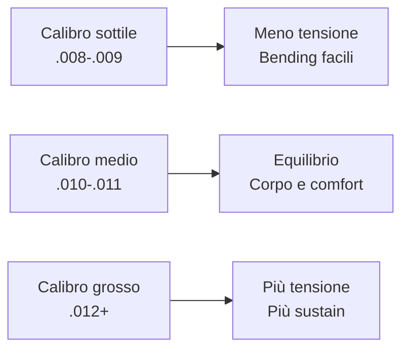
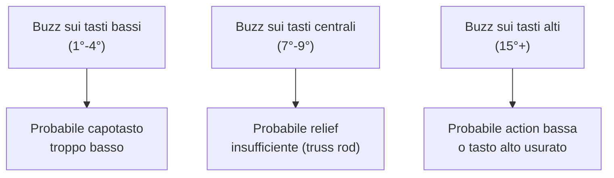

<a id="indice-modulo"></a>
# Modulo 3: Setup e Manutenzione
*Fase 1 · Strumento e Storia (Livello Medio) — Guitar Master, GCProf Academy*

📑 [Introduzione](#intro) · [Obiettivi](#obiettivi) · [Prerequisiti](#prerequisiti) · [Lezioni](#lezioni) · [Esempi](#esempi) · [Laboratorio](#laboratorio) · [Best Practice](#best-practice) · [Errori comuni](#errori) · [Riepilogo](#riepilogo) · [Glossario](#glossario) · [Quiz](#quiz) · [Materiale scaricabile](#materiale) · [Bibliografia](#bibliografia) · [Sitografia](#sitografia)

---

<a id="intro"></a>
## 1. Introduzione

Hai imparato la storia (Modulo 1) e l'anatomia (Modulo 2) della chitarra elettrica. Ora arriva il modulo più **pratico** della Fase 1: mettere le mani sulla tua chitarra e farla suonare come merita.

Una chitarra ben regolata **si suona meglio, intona meglio e ispira di più**: il setup è, letteralmente, il primo "effetto" gratuito a tua disposizione, prima ancora di comprare un pedale. Al contrario, una chitarra mal regolata può farti credere di "non essere ancora bravo abbastanza", quando in realtà è lo strumento a remarti contro.

In questo modulo lavoreremo in ordine, passo dopo passo, esattamente come farebbe un liutaio: prima le fondamenta (corde e truss rod), poi l'altezza delle corde, poi i dettagli fini (intonazione, pickup). Ogni passaggio avrà un diagramma preciso del manico per capire cosa stai realmente misurando e regolando.

⚠️ **Attenzione:** lavora sempre con calma, un quarto di giro alla volta sulle regolazioni, e se non ti senti sicuro con un intervento (es. truss rod su strumenti costosi o vintage), rivolgiti a un liutaio.

---

<a id="obiettivi"></a>
## 2. Obiettivi

Al termine di questo modulo saprai:

- Scegliere **corde e calibri** adatti al tuo stile e alla tua chitarra.
- **Cambiare le corde** correttamente, riducendo i problemi di accordatura.
- Regolare il **truss rod** per ottenere il relief corretto del manico.
- Regolare **action** e **altezza del capotasto** per un'azione comoda e senza buzz.
- Regolare **altezza e polepiece dei pickup**.
- Eseguire l'**intonazione (intonation)** dello strumento.
- Regolare il **tremolo**, se presente.
- Effettuare **pulizia e manutenzione base** di tastiera, elettronica e jack.
- Riconoscere e risolvere i **problemi più comuni** (fret buzz, intonazione, rumori).
- Capire l'impatto delle **accordature alternative** sul setup.

---

<a id="prerequisiti"></a>
## 3. Prerequisiti

- **Serve:** aver completato i Moduli 1 e 2 (in particolare la sezione su ponti e manico del Modulo 2), avere una chitarra elettrica, un set di corde nuove, un cacciavite a stella e a taglio piccoli, una chiave a brugola per il truss rod (spesso inclusa con lo strumento) e, se possibile, un accordatore elettronico.
- **Non serve:** esperienza pregressa di manutenzione: lavoreremo con calma, un passaggio alla volta.

---

<a id="lezioni"></a>
## 4. Lezioni

### 4.1 Scelta di corde e calibri

Il calibro (gauge) è lo spessore delle corde, misurato in millesimi di pollice sulla prima corda (mi cantino). Cambia **tensione, feeling e timbro**.

| Calibro (1ª corda) | Nome comune | Feeling | Uso tipico |
|---|---|---|---|
| .008-.009 | Extra light | Morbidissimo, bending facili | Shred, accordature standard, mani deboli |
| .009-.042 | Light | Equilibrato, molto diffuso | Rock, pop, uso generale |
| .010-.046 | Regular | Più corpo e sustain | Blues, rock classico, standard "universale" |
| .011-.052 | Medium | Tensione robusta | Accordature basse, jazz, tocco pesante |
| .012+ | Heavy | Molta tensione | Slide, jazz tradizionale, accordature molto basse |

*Perché ti serve: un calibro più grosso dà più corpo e sustain ma richiede più forza; un calibro più sottile facilita bending e velocità ma può "sbattere" di più sui tasti. Il calibro incide anche sul setup: cambiare calibro spesso richiede ritoccare truss rod e intonazione.*

**📊 Infografica: calibro, tensione e feeling**



### 4.2 Cambio corde: la procedura corretta

```
Passo 1: Allenta e rimuovi        Passo 2: Inserisci la corda nuova
la corda vecchia                   nel ponte/tailpiece e stendila
                                    verso la meccanica

  ═══●══════════●═══              ───────────────●═══
      ↑ allenta                                    ↑ tira dritta

Passo 3: Avvolgi in meccanica     Passo 4: Accorcia l'eccesso
(2-3 avvolgimenti puliti,         e stira leggermente la corda
corda sotto se stessa la          per stabilizzare l'accordatura
prima volta)

  ◯═══╗                            ═══●═══════●═══
      ║ ↓ avvolgimenti                      ↑ stira con cautela
      ║   ordinati verso il basso            (non troppo forte)
```

- **Cambia una corda alla volta** (non tutte insieme): mantiene una tensione minima costante sul manico, utile soprattutto su ponti con tremolo.
- **2-3 avvolgimenti puliti e ordinati** in meccanica: troppi avvolgimenti disordinati destabilizzano l'accordatura.
- **Stira leggermente ogni corda nuova** con le dita dopo averla accordata: aiuta le corde ad "assestarsi" più in fretta.
- Dopo il cambio, **ricontrolla accordatura e intonazione**: un calibro diverso da quello precedente richiede quasi sempre un ritocco di truss rod e intonazione (sezioni successive).

### 4.3 Il truss rod: cos'è e perché regolarlo

Il **truss rod** è un'asta metallica dentro il manico che contrasta la tensione delle corde. La sua regolazione controlla il **relief**: la leggera curvatura del manico (quasi impercettibile, frazioni di millimetro) necessaria per non far sbattere le corde sui tasti centrali quando vibrano.

```
Manico DRITTO (relief zero)         Manico con RELIEF corretto
troppo poco spazio al centro        (leggera concavità)

 ────────────────────────           ╲                    ╱
 corde quasi a contatto              ╲__________________╱
 con i tasti centrali                  piccolo spazio al centro
 → possibile buzz                      (circa 0,2-0,3 mm)
                                        → vibrazione libera

Manico TROPPO CONCAVO               Manico CONVESSO (contro-arco)
(troppo relief)                      (truss rod troppo stretto)

 ╲                        ╱          ╱‾‾‾‾‾‾‾‾‾‾‾‾‾‾‾‾‾‾╲
  ╲______________________╱          i tasti centrali sono
   grande spazio al centro          "più alti": buzz sui tasti
   → action che sembra alta         bassi e alti, note "morte"
   → può servire meno relief
```

**Come si misura (in modo semplice, senza attrezzi speciali):**

1. Premi la corda mi basso (6ª) **simultaneamente** al 1° tasto e all'ultimo tasto (con un capotasto se disponibile, o con le dita).
2. Osserva lo spazio tra la corda e il tasto **intorno all'8°-9° tasto** (il punto più basso dell'arco).
3. Uno spazio quasi impercettibile ma presente (circa lo spessore di un foglio di carta, 0,2-0,3 mm) indica relief corretto. Nessuno spazio = manico troppo dritto; spazio ampio e visibile = troppo relief.

```
Corda premuta al 1° e all'ultimo tasto: guarda l'8°-9° tasto

 1°tasto                    8°-9° tasto                ultimo tasto
    ●━━━━━━━━━━━━━━━━━━━━━━━━━━━━━━━━━━━━━━━━━━━━━━━━━━━━●
                              ↕ piccolo spazio
                                (relief corretto)
    │←──────────────── corda tesa dritta ────────────────→│
```

**Regolazione:** la vite del truss rod si trova solitamente alla base della paletta o all'estremità del manico vicino al corpo. **Ruota in piccoli incrementi (1/8 di giro alla volta)**, lascia "assestare" il manico per qualche minuto, poi rimisura. Girare in senso orario in genere raddrizza il manico (riduce il relief), antiorario lo rilassa (aumenta il relief) — verifica sempre le indicazioni del tuo modello specifico.

### 4.4 Action: altezza delle corde

L'**action** è la distanza tra le corde e i tasti, misurata di solito al 12° tasto. Va regolata sul ponte (o sui singoli saddle).

```
Action BASSA                        Action ALTA
                                    
 corda ─ ─ ─ ─ ─ ─ ─               corda
        ↕ 1,2-1,5 mm                    ↕ 2,0-2,5 mm
 ═══════════════════               ═══════════════════
 12° tasto                          12° tasto

 + comoda, veloce                   + meno buzz con tocco forte
 + bending facili                   + più sustain percepito
 - rischio di buzz                  - più fatica, meno scorrevole
   con tocco forte
```

- **Action bassa** (indicativamente 1,2-1,6 mm sulla 6ª corda al 12° tasto): comoda e veloce, ma più soggetta a buzz se il tocco è forte o il relief non è ottimale.
- **Action più alta** (2,0-2,5 mm): riduce il buzz e può aumentare il sustain percepito, ma richiede più forza.
- La regolazione si fa alzando o abbassando i **saddle** (sellette) sul ponte, con brugola o cacciavite a seconda del modello, un lato o entrambi i lati della corda per mantenere il raggio della tastiera (vedi Modulo 2).

### 4.5 Altezza del capotasto

Un capotasto troppo alto rende difficili gli accordi in prima posizione; troppo basso causa un fastidioso "sitar buzz" sulle corde a vuoto.

```
Capotasto TROPPO ALTO         Capotasto CORRETTO          Capotasto TROPPO BASSO
                              
 │█│  spazio eccessivo         │█│  spazio minimo           │▁│  corda quasi
 │ │  tra corda e 1° tasto     │ │  ma libero                   a contatto
 ═●══════●══════●══           ═●══●══●══                   ═●══●══●══
  1°tasto                       1°tasto                       1°tasto
 → accordi faticosi            → intonazione precisa         → buzz sulle
   in prima posizione             e comfort ottimale             corde a vuoto
```

La regolazione fine richiede spesso di limare leggermente gli intagli del capotasto: è uno degli interventi più delicati, da affidare a un liutaio se non hai esperienza con le lime specifiche.

### 4.6 Altezza e polepiece dei pickup

L'altezza del pickup rispetto alle corde cambia **output e risposta dinamica**.

```
Vista laterale del pickup sotto le corde

 corde  ══════════════════════
              ↕ distanza
        ▭▭▭▭▭▭▭▭▭▭▭▭▭▭▭▭  ← pickup

Pickup TROPPO VICINO          Pickup a distanza CORRETTA
→ output alto ma può          → equilibrio tra output,
  "tirare" magneticamente        dinamica e intonazione
  le corde (intonazione            (indicativamente 2-3 mm
  instabile, suono strozzato)      lato acuti, 2,5-3,5 mm bassi,
                                    su un humbucker; regola
                                    a orecchio partendo da qui)
```

- **Regola d'oro:** avvicina gradualmente il pickup finché il volume ti soddisfa, poi allontanalo leggermente se senti "strozzature" o note che si intonano male (effetto magnetico eccessivo sulle corde).
- Sui pickup con **polepiece regolabili** (viti sui singoli poli, tipiche dei single coil), puoi bilanciare il volume tra le corde, avvicinando i poli sotto le corde più deboli (spesso le corde di sol e si).

### 4.7 Intonazione (intonation)

L'intonazione garantisce che la chitarra suoni **accordata su tutta la tastiera**, non solo a corde vuote.

```
Come si verifica: confronta l'armonico al 12° tasto
con la nota reale premuta al 12° tasto

 Armonico al 12°           Nota premuta al 12°
 (tocca senza premere)      (premi normalmente)
      ◇                          ●
 ═════╪═══════════          ═════╪═══════════
     12°                        12°

 Se la nota premuta è CRESCENTE rispetto all'armonico:
   → la corda "scala" troppo poco → allontana il saddle dal capotasto

 Se la nota premuta è CALANTE rispetto all'armonico:
   → la corda "scala" troppo → avvicina il saddle al capotasto
```

**Procedura:**

1. Accorda la corda a vuoto con l'accordatore.
2. Suona l'**armonico al 12° tasto** (sfiora la corda esattamente sopra il tasto, senza premere) e leggi la nota.
3. Suona la **stessa corda premuta normalmente al 12° tasto** e confronta.
4. Se la nota premuta è più acuta dell'armonico, allontana il saddle dal capotasto (allunga la corda); se è più grave, avvicinalo.
5. Riaccorda a vuoto e ripeti finché armonico e nota premuta coincidono, per ogni corda.

### 4.8 Regolazione del tremolo

Su un tremolo sincronizzato, l'equilibrio si regola con le **molle sul retro** del corpo e le viti che fissano il ponte:

```
Vista laterale (sezione del corpo)

  tensione CORDE  ──→  ●═══●  ←── tensione MOLLE (retro)
                         ╲___╱
                       perno basculante

 Ponte a filo del corpo:        Ponte "flottante" (sollevato):
 tremolo solo in "picchiata"    tremolo su e giù (Hendrix-style),
 (down only), più stabile        più espressivo ma meno stabile
```

- **Più molle o più tensione delle molle** = ponte più "a filo" del corpo, tremolo solo in discesa, maggiore stabilità di accordatura.
- **Meno molle o meno tensione** = ponte flottante, puoi tirare la leva anche verso l'alto, ma l'accordatura generale è più delicata (basta rompere o stonare una corda per sbilanciare tutte le altre).
- Regola in piccoli passi, riaccordando dopo ogni modifica: è un equilibrio tra tensione corde e tensione molle.

### 4.9 Pulizia e cura della tastiera

- **Tastiere in acero verniciato:** pulisci con un panno leggermente umido; evita oli specifici, che possono rovinare la finitura.
- **Tastiere in palissandro o ebano (legno "a vista", non verniciato):** puoi usare occasionalmente un olio specifico per tastiere (poche gocce, panno morbido) per mantenerle idratate, soprattutto durante i cambi corde o i cambi di stagione.
- **Pulizia generale:** rimuovi residui di sudore e polvere dopo ogni sessione, con un panno morbido asciutto; previene corrosione delle corde e dei tasti.

### 4.10 Controllo di elettronica e jack, piccole riparazioni

- **Rumori "gracchianti" ai potenziometri:** spesso risolvibili con uno spray specifico per contatti elettrici (contact cleaner), applicato con parsimonia nelle fessure del pot mentre lo si ruota.
- **Jack allentato o che "scratcha":** spesso basta stringere il dado di fissaggio del jack (con cautela, senza forzare) o pulire i contatti.
- **Corde arrugginite in fretta o intonazione instabile:** controlla capotasto (attrito) e saddle (bordi taglienti), che a volte vanno limati con cura da un liutaio.
- **Regola generale:** se un intervento richiede di saldare, aprire componenti elettronici o intervenire su un manico incollato, è il momento di rivolgersi a un liutaio.

### 4.11 Accordature alternative e impatto sul setup

Cambiare accordatura (es. Drop D, mezzo tono sotto, accordature aperte) cambia la tensione delle corde e quindi **il setup ottimale**:

- **Accordature più basse:** tensione ridotta → può servire meno relief (truss rod) e talvolta un calibro di corde più grosso per mantenere una tensione comoda e definita.
- **Accordature aperte con molte corde gravi ravvicinate** (es. Open G): possono richiedere un piccolo ritocco di intonazione, soprattutto sulle corde riaccordate.
- **Se cambi spesso accordatura**, valuta una seconda chitarra dedicata: un setup ottimizzato per lo standard raramente è perfetto anche per un drop tuning stabile.

---

<a id="esempi"></a>
## 5. Esempi

**Esempio 1 — Valori di riferimento per un setup "standard rock/blues" (punto di partenza, non regola assoluta):**

| Parametro | Valore indicativo |
|---|---|
| Calibro corde | .010-.046 |
| Relief (truss rod) | 0,2-0,3 mm all'8°-9° tasto |
| Action al 12° tasto (6ª corda) | 1,6-1,8 mm |
| Action al 12° tasto (1ª corda) | 1,3-1,5 mm |
| Altezza pickup (humbucker, lato acuti) | 2-3 mm dalle corde |

**Esempio 2 — Diagnosi rapida del buzz.** Il fret buzz può avere cause diverse: usa questo schema per orientarti.



**Esempio 3 — Prima e dopo il setup.** Un chitarrista alle prime armi con lo strumento appena acquistato spesso nota: prima del setup, corde dure da premere e buzz sui tasti centrali; dopo relief corretto e action regolata, la stessa chitarra "sembra un'altra", con bending più fluidi e minore fatica nella mano sinistra.

---

<a id="laboratorio"></a>
## 6. Laboratorio

**Attività: "Il tuo primo setup completo"**

1. **Cambia le corde** sulla tua chitarra seguendo la procedura della sezione 4.2, una corda alla volta.
2. **Misura il relief** con il metodo della sezione 4.3 (corda premuta al 1° e all'ultimo tasto, osservando l'8°-9°). Annota lo spazio che osservi.
3. **Se necessario, regola il truss rod** in piccoli incrementi (1/8 di giro), aspettando qualche minuto tra una regolazione e la successiva.
4. **Misura l'action** al 12° tasto (con un righello millimetrato, se disponibile) sulla 6ª e sulla 1ª corda. Confrontala con i valori dell'Esempio 1.
5. **Esegui l'intonazione** su ogni corda, seguendo la procedura della sezione 4.7.
6. **Compila la tua scheda di setup:**

| Parametro | Prima | Dopo |
|---|---|---|
| Relief misurato | | |
| Action 6ª corda (12° tasto) | | |
| Action 1ª corda (12° tasto) | | |
| Note su buzz o problemi riscontrati | | |
| Note su comfort e suonabilità percepita | | |

*Obiettivo:* portare a termine il **primo setup completo e documentato** della tua chitarra. Questa scheda, insieme a quella del Modulo 2, sarà parte del **Project Work di fine Fase 1**.

---

<a id="best-practice"></a>
## 7. Best Practice

- **Lavora sempre per piccoli incrementi**, soprattutto sul truss rod: 1/8 di giro alla volta, con pause per lasciar "assestare" il legno.
- **Cambia una variabile alla volta**: se regoli relief, action e intonazione insieme senza metodo, sarà difficile capire cosa ha causato un problema.
- **Riaccorda dopo ogni intervento**: ogni regolazione (relief, action, tremolo) cambia leggermente la tensione delle corde.
- **Segui sempre questo ordine:** corde nuove → relief (truss rod) → action → intonazione → altezza pickup. Ogni passaggio influenza il successivo.
- **Tieni un diario di setup** per la tua chitarra: ti aiuterà a rifare le regolazioni più velocemente in futuro (es. dopo un cambio di stagione).

---

<a id="errori"></a>
## 8. Errori comuni

- ❌ *"Se le corde sbattono, alzo subito l'action."* → Spesso il problema è il relief insufficiente: prima controlla e regola il truss rod, poi eventualmente l'action.
- ❌ *"Il truss rod si regola tutto in un colpo solo."* → Va regolato in piccoli incrementi, con pause: forzare rischia di danneggiare il manico.
- ❌ *"L'intonazione si fa solo a orecchio, senza accordatore."* → Serve un accordatore preciso: l'orecchio da solo non basta per la precisione richiesta al 12° tasto.
- ❌ *"Più il pickup è vicino alle corde, meglio è."* → Un pickup troppo vicino può "tirare" le corde magneticamente, causando intonazione instabile e suono strozzato.
- ❌ *"Cambiare calibro di corde non richiede altre regolazioni."* → Quasi sempre serve ritoccare almeno relief e intonazione dopo un cambio di calibro significativo.

---

<a id="riepilogo"></a>
## 9. Riepilogo

| Concetto | In una riga |
|---|---|
| Calibro corde | Spessore delle corde; cambia tensione, feeling e timbro |
| Cambio corde | Una alla volta, avvolgimenti puliti, stirare leggermente |
| Truss rod / relief | Contrasta la tensione delle corde; regola la leggera curvatura del manico |
| Action | Distanza corde-tasti, misurata al 12° tasto |
| Altezza capotasto | Influenza comfort degli accordi aperti e buzz sulle corde a vuoto |
| Altezza pickup | Bilancia output, dinamica e intonazione |
| Intonazione | Garantisce accordatura corretta su tutta la tastiera |
| Regolazione tremolo | Equilibrio tra tensione corde e tensione molle |
| Pulizia tastiera | Panno per acero verniciato; olio occasionale per palissandro/ebano |
| Accordature alternative | Richiedono spesso un ritocco di relief, calibro e intonazione |

---

<a id="glossario"></a>
## 10. Glossario

- **Action** — distanza tra corde e tasti, misurata solitamente al 12° tasto.
- **Buzz (fret buzz)** — rumore di sfregamento della corda contro i tasti, dovuto a relief, action o capotasto non ottimali.
- **Intonazione (intonation)** — regolazione della lunghezza effettiva della corda affinché suoni accordata su tutta la tastiera.
- **Polepiece** — polo magnetico regolabile di alcuni pickup, usato per bilanciare il volume tra le corde.
- **Relief** — leggera concavità del manico necessaria per la corretta vibrazione delle corde.
- **Saddle (sella)** — elemento del ponte su cui appoggia ogni singola corda, regolabile in altezza e posizione.
- **Setup** — l'insieme delle regolazioni (truss rod, action, intonazione, pickup) che ottimizzano suonabilità e suono di uno strumento.
- **Truss rod** — asta metallica interna al manico che ne contrasta la curvatura dovuta alla tensione delle corde.

---

<a id="quiz"></a>
## 11. Quiz

**1.** Vero o Falso: se le corde sbattono sui tasti centrali, la prima cosa da controllare è l'altezza del capotasto.
`Falso — il buzz sui tasti centrali indica tipicamente un relief insufficiente (truss rod).`

**2.** A cosa serve il truss rod?
- a) A regolare il volume dei pickup
- b) A contrastare la tensione delle corde e controllare la curvatura del manico ✅
- c) A bloccare le corde al ponte
- d) A cambiare la lunghezza di scala

**3.** L'intonazione si verifica confrontando:
- a) Il volume tra due pickup diversi
- b) L'armonico al 12° tasto con la nota premuta allo stesso tasto ✅
- c) L'altezza delle corde al 1° e al 12° tasto
- d) La tensione delle molle del tremolo

**4.** Se la nota premuta al 12° tasto è più acuta (crescente) dell'armonico allo stesso tasto, cosa bisogna fare?
`Allontanare il saddle dal capotasto, per allungare leggermente la corda.`

**5.** Vero o Falso: un pickup troppo vicino alle corde può causare intonazione instabile per effetto magnetico.
`Vero.`

**6.** Qual è l'ordine corretto consigliato per un setup completo?
- a) Intonazione → action → relief → altezza pickup
- b) Relief → action → intonazione → altezza pickup ✅
- c) Altezza pickup → relief → action → intonazione
- d) L'ordine non ha alcuna importanza

**7.** Cosa succede riducendo la tensione delle molle di un tremolo sincronizzato?
`Il ponte diventa più "flottante": si può tirare la leva sia in su sia in giù, ma l'accordatura generale diventa più delicata.`

**8.** Vero o Falso: cambiare accordatura (ad esempio in Drop D) non ha alcun impatto sul setup dello strumento.
`Falso — cambia la tensione delle corde e può richiedere di ritoccare relief, calibro e intonazione.`

**9.** Quale materiale è generalmente sconsigliato per l'uso di oli specifici, a differenza di palissandro ed ebano?
`L'acero verniciato (la finitura protegge il legno; l'olio può danneggiarla).`

**10.** Perché è importante cambiare le corde una alla volta, invece che tutte insieme?
`Perché mantiene una tensione minima costante sul manico durante l'operazione, utile soprattutto con ponti a tremolo, riducendo variazioni brusche di equilibrio.`

---

<a id="materiale"></a>
## 13. Materiale scaricabile

- 📄 Cheat-sheet "Setup in 5 passi" con valori di riferimento (1 pagina, da produrre in PDF)
- 📝 Template "Scheda di setup" compilabile, per documentare ogni intervento
- 📊 Tabella diagnosi rapida del buzz, per zona del manico (da produrre come infografica)
- 🎥 Video guidato di un setup completo passo dopo passo (da produrre)

---

<a id="bibliografia"></a>
## 14. Bibliografia

- Erlewine, D. — *Guitar Player Repair Guide*
- Erlewine, D., Bacon, T. — *How to Make Your Electric Guitar Play Great*
- Hiscock, M. — *Make Your Own Electric Guitar*

---

<a id="sitografia"></a>
## 15. Sitografia

- StewMac — guide passo-passo su truss rod, action e intonazione
- Sito ufficiale Fender e Gibson — guide ufficiali di manutenzione
- Premier Guitar — articoli su setup e manutenzione
- Reverb Learn — guide pratiche su cambio corde e regolazioni

[🔙 Torna all'indice del modulo](#indice-modulo)