<a id="inizio"></a>

# 🎸 Guitar Master: La Chitarra Elettrica a 360°
**Il percorso formativo definitivo di GCProf Academy per trasformare la tua tecnica, il tuo suono e la tua musicalità.**

Benvenuto nella preview esclusiva del nuovo corso **Guitar Master** di **GCProf Academy**. Non un semplice metodo di scale e accordi, ma un vero **percorso professionale, modulare ed espandibile**, che ti accompagna dalla storia e dalla costruzione dello strumento fino alla registrazione, al live e ai moderni **modeler digitali**.

Che tu voglia sbloccare il tuo fraseggio, capire davvero l'armonia, costruire il *tuo* suono o suonare con più espressività, questo corso ti darà competenze **misurabili, pratiche e immediatamente spendibili** sullo strumento, con **diagrammi del manico commentati** in ogni modulo per avere sempre una visione chiara di tastiera, accordi e scale.

**Non stai iniziando da zero, e il corso lo sa**: Guitar Master parte dal livello medio e ti porta, un passo alla volta, fino al livello avanzato.

**[👉 Iscriviti ora e inizia dal Modulo 1!]**

---

## 🎯 L'Approccio: dal "so suonare" al "so cosa sto suonando (e perché suona così)"

Un chitarrista completo padroneggia quattro mondi, e il corso li unisce in un unico percorso:

* 🪵 **Lo strumento**: come è fatto, come si regola, come nasce il suo carattere
* 🎼 **La musica**: manico, scale, accordi e armonia applicata alla chitarra
* ✋ **La tecnica e l'espressività**: mani, ritmo, fraseggio, stile
* 🔊 **Il suono**: dal pickup all'ampli, dai pedali analogici ai modeler

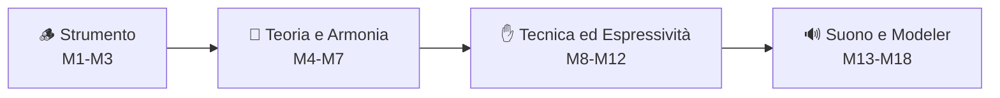

---

## 🏗️ L'Architettura del Corso

Il corso è strutturato in **4 Macro-fasi** strategiche, ciascuna con un traguardo concreto:

| Fase | Livello | Cosa saprai fare al termine |
|---|---|---|
| **1. Strumento e Storia** | Medio (parte 1) | Conoscere l'evoluzione della chitarra elettrica, comprenderne la costruzione e saperla regolare al meglio |
| **2. Manico, Teoria e Armonia** | Medio (parte 2) | Muoverti su tutta la tastiera con scale, modi, accordi e armonia funzionale |
| **3. Tecnica ed Espressività** | Avanzato (parte 1) | Padroneggiare le tecniche di mano destra e sinistra, il groove, il fraseggio e i grandi stili |
| **4. Suono, Effetti e Modeler** | Avanzato (parte 2) | Costruire il tuo suono con ampli, pedali e modeler, e portarlo in studio e sul palco |

---

## 👥 A chi è rivolto

* 🎸 Chitarristi di livello medio che vogliono fare il salto di qualità
* 🔥 Chitarristi avanzati che cercano un percorso sistematico per colmare le lacune e rifinire la tecnica
* 🎓 Studenti di conservatorio, scuole di musica e insegnanti che cercano materiale modulare per le lezioni
* 🎛️ Musicisti e produttori che vogliono capire a fondo suono, effetti e modeler
* 🚀 Band, autodidatti e chiunque voglia costruire un proprio linguaggio sulla chitarra elettrica

**Requisiti:** saper suonare i primi accordi aperti, le scale pentatoniche di base e leggere una tablatura. Serve una chitarra elettrica (qualsiasi) e la voglia di suonare ogni giorno.

---

## 🔍 Un Assaggio del Corso: il Manico sempre sotto controllo

In ogni modulo troverai diagrammi del manico **commentati riga per riga**. Ecco la Pentatonica minore di La (posizione 1, 5ª tastiera):

```
Corde   5     6     7     8      Tasti
 e  |--[A]---------------(C)--|    [X] = tonica
 B  |--(E)---------------(G)--|    (x) = altra nota della scala
 G  |--(C)-------(D)----------|
 D  |--(G)-------[A]----------|
 A  |--(D)-------(E)----------|
 E  |--[A]---------------(C)--|
```

* **Le toniche (La)** si trovano sulla 6ª corda al tasto 5, sulla 4ª corda al tasto 7 e sulla 1ª corda al tasto 5
* **Il "box"** è solo il punto di partenza: nel Modulo 4 lo collegherai a tutte le altre posizioni fino a coprire l'intera tastiera
* **Ogni diagramma** è accompagnato da esercizi, backing track suggerite e note su suono ed espressività

---

<a id="indice"></a>
## 📑 Indice dei Moduli Navigabile

**FASE 1 · STRUMENTO E STORIA**
* [Modulo 1: Storia della Chitarra Elettrica](#modulo-1)
* [Modulo 2: Liuteria: Anatomia e Costruzione](#modulo-2)
* [Modulo 3: Setup e Manutenzione](#modulo-3)

**FASE 2 · MANICO, TEORIA E ARMONIA**
* [Modulo 4: Il Manico: Mappa e Sistemi di Posizioni](#modulo-4)
* [Modulo 5: Scale e Modi](#modulo-5)
* [Modulo 6: Accordi e Voicing](#modulo-6)
* [Modulo 7: Armonia Funzionale e Improvvisazione](#modulo-7)

**FASE 3 · TECNICA ED ESPRESSIVITÀ**
* [Modulo 8: Tecnica della Mano Destra](#modulo-8)
* [Modulo 9: Tecnica della Mano Sinistra](#modulo-9)
* [Modulo 10: Ritmica, Groove e Tempo](#modulo-10)
* [Modulo 11: Tecniche Speciali e Avanzate](#modulo-11)
* [Modulo 12: Espressività, Fraseggio e Stili](#modulo-12)

**FASE 4 · SUONO, EFFETTI E MODELER**
* [Modulo 13: La Catena del Suono e i Pickup](#modulo-13)
* [Modulo 14: Amplificatori, Cabinet e Speaker](#modulo-14)
* [Modulo 15: Effetti e Pedali Analogici](#modulo-15)
* [Modulo 16: Il Mondo Digitale: Modeler, IR e Plugin](#modulo-16)
* [Modulo 17: Registrazione, Mix e Live](#modulo-17)
* [Modulo 18: Il Tuo Sound e Progetto Finale](#modulo-18)

---

## 📚 Dettaglio dei Moduli

### FASE 1 · STRUMENTO E STORIA

<a id="modulo-1"></a>
[🔙 Torna all'indice](#indice)

### Modulo 1: Storia della Chitarra Elettrica
Da dove arriva il suono che ami: capire l'evoluzione dello strumento per capire i suoni di oggi.
* **Argomenti:** Dalle origini della chitarra acustica ai primi pickup, dalla lap steel alla nascita della solid body, i modelli che hanno fatto la storia (Telecaster, Stratocaster, Les Paul, SG, Flying V, semiacustiche come la ES-335, superstrat, 7/8 corde), le rivoluzioni di suono e di stile per decennio, i grandi chitarristi e i loro strumenti simbolo, l'evoluzione fino alle chitarre moderne (baritone, multiscale, fanned fret, headless).
* **Al termine saprai:** riconoscere i modelli storici e le loro caratteristiche, collegare strumenti, suoni e generi musicali e scegliere consapevolmente la chitarra giusta per il tuo stile.

**📊 Infografica: le tappe che hanno cambiato il suono**

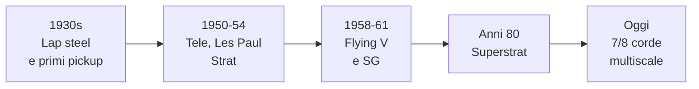

---

<a id="modulo-2"></a>
[🔙 Torna all'indice](#indice)

### Modulo 2: Liuteria: Anatomia e Costruzione
Dentro la chitarra: ogni scelta costruttiva è una scelta di suono.
* **Argomenti:** Anatomia completa dello strumento, tipologie di legni (corpo, manico, tastiera) e loro influenza sul timbro, tipi di attacco del manico (bolt-on, set-neck, neck-through), lunghezza di scala e raggio della tastiera, profili del manico, tasti (dimensioni e materiali), ponti (fissi, tremolo sincronizzati, Floyd Rose, Bigsby), meccaniche, capotasto, elettronica (potenziometri, condensatori, selettori, cablaggi), finiture e materiali.
* **Al termine saprai:** leggere le specifiche di una chitarra, prevedere come le scelte costruttive influenzano suono e suonabilità e valutare l'acquisto o la modifica di uno strumento.

---

<a id="modulo-3"></a>
[🔙 Torna all'indice](#indice)

### Modulo 3: Setup e Manutenzione
Una chitarra ben regolata suona meglio e si suona meglio: il setup è il primo "effetto" da curare.
* **Argomenti:** Scelta di corde e calibri, cambio corde, regolazione del truss rod, action e altezza del capotasto, altezza e polepiece dei pickup, intonazione (intonation), regolazione del tremolo, pulizia e cura della tastiera, controllo di elettronica e jack, piccole riparazioni e strumenti indispensabili, accordature alternative e loro impatto sul setup.
* **Al termine saprai:** eseguire in autonomia un setup completo, risolvere i problemi più comuni (fret buzz, intonazione, rumori) e mantenere la chitarra in condizioni ottimali.

**📊 Infografica: l'ordine consigliato del setup**

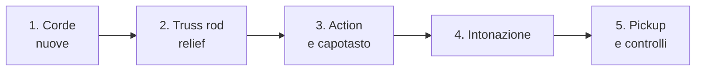

---

### FASE 2 · MANICO, TEORIA E ARMONIA

<a id="modulo-4"></a>
[🔙 Torna all'indice](#indice)

### Modulo 4: Il Manico: Mappa e Sistemi di Posizioni
Smettere di "vedere" solo box e iniziare a vedere l'intera tastiera.
* **Argomenti:** Nomi delle note sul manico, accordatura standard e relazioni tra le corde, sistema CAGED, sistema a 3 note per corda (3NPS), forme di posizione delle scale e degli arpeggi, collegamento tra le posizioni, visualizzazione degli intervalli, diagrammi commentati su tutta la tastiera, sistemi di memorizzazione.
* **Al termine saprai:** localizzare ogni nota e ogni intervallo su tutto il manico e collegare liberamente le posizioni orizzontalmente e verticalmente.

---

<a id="modulo-5"></a>
[🔙 Torna all'indice](#indice)

### Modulo 5: Scale e Modi
Il vocabolario melodico della chitarra elettrica, dal blues ai colori più moderni.
* **Argomenti:** Scala maggiore e minore naturale, pentatoniche (maggiore e minore) e scala blues, i sette modi della scala maggiore (Ionico, Dorico, Frigio, Lidio, Misolidio, Eolio, Locrio), minore armonica e melodica e i loro modi, scale simmetriche (diminuita, a toni interi), scale esotiche e arpeggi, carattere sonoro e utilizzo stilistico di ogni scala, licks e frasi tipiche.
* **Al termine saprai:** scegliere la scala giusta per ogni contesto armonico e stilistico e suonarla in ogni posizione del manico.

**📊 Infografica: i 7 modi divisi per colore**

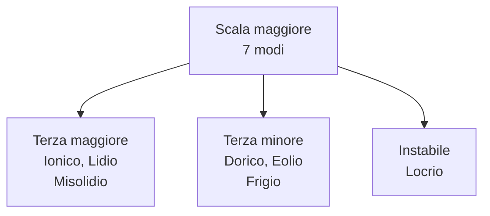

---

<a id="modulo-6"></a>
[🔙 Torna all'indice](#indice)

### Modulo 6: Accordi e Voicing
Dalle triadi ai colori più ricchi: costruire accordi che suonano da chitarrista professionista.
* **Argomenti:** Triadi e loro rivolti su gruppi di corde, accordi di settima (maj7, m7, dom7, m7b5, dim7), estensioni (9, 11, 13) e alterazioni, accordi con barré e accordi mobili, drop 2 e drop 3, voicing jazz e funk, dyad e "double stop", accordi rock e power chord, open voicing e uso di corde vuote, arpeggiatura, diagrammi chiari e commentati.
* **Al termine saprai:** costruire e suonare accordi in qualsiasi posizione, scegliendo il voicing più adatto al contesto musicale e al timbro.

---

<a id="modulo-7"></a>
[🔙 Torna all'indice](#indice)

### Modulo 7: Armonia Funzionale e Improvvisazione
Capire *perché* gli accordi funzionano insieme, per improvvisare con consapevolezza.
* **Argomenti:** Armonizzazione della scala maggiore, funzioni armoniche (tonica, sottodominante, dominante), cadenze e progressioni (I-IV-V, ii-V-I, blues a 12 battute, giri di rock e pop), dominanti secondarie, scambio modale, sostituzioni di tritono, modulazioni, guide tones e chord tones, scelta di scale e arpeggi sull'armonia, costruzione di un assolo, ear training applicato.
* **Al termine saprai:** analizzare una progressione, individuare le scale e gli arpeggi adatti e improvvisare seguendo l'armonia con senso melodico.

**📊 Infografica: il ciclo delle funzioni armoniche (esempio in Do)**

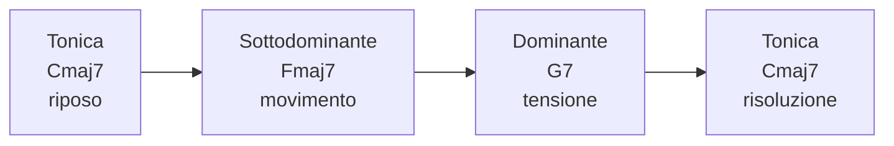

---

### FASE 3 · TECNICA ED ESPRESSIVITÀ

<a id="modulo-8"></a>
[🔙 Torna all'indice](#indice)

### Modulo 8: Tecnica della Mano Destra
Precisione, velocità e controllo partono dal plettro (o dalle dita).
* **Argomenti:** Impugnatura e tipo di plettro, alternate picking, economy picking, sweep picking, hybrid picking, fingerstyle e tecniche miste, palm muting, string skipping, controllo del rumore e mute, esercizi di precisione e sincronizzazione, tremolo picking, gestione della dinamica.
* **Al termine saprai:** scegliere la tecnica di plettrata più efficiente per ogni passaggio e suonare con precisione e velocità controllata.

---

<a id="modulo-9"></a>
[🔙 Torna all'indice](#indice)

### Modulo 9: Tecnica della Mano Sinistra
Il tocco che dà personalità a ogni nota.
* **Argomenti:** Postura ed economia di movimento, hammer-on e pull-off, legato e trilli, slide, bending (mezzo tono, tono, intero, pre-bend, unison bend, bend con rilascio), vibrato (a dito, a polso, con tremolo), estensioni e stretching, indipendenza delle dita, armonici naturali e artificiali, esercizi di forza e resistenza.
* **Al termine saprai:** eseguire legati, slide, bending e vibrato con intonazione e controllo, rendendo il tuo tocco riconoscibile a chi ti ascolta.

---

<a id="modulo-10"></a>
[🔙 Torna all'indice](#indice)

### Modulo 10: Ritmica, Groove e Tempo
Il tempo è tutto: una buona ritmica fa suonare meglio ogni altra tecnica.
* **Argomenti:** Metronomo e pulse, suddivisioni e sincopi, strumming e groove pop/rock, funk e 16esimi, reggae e off-beat, tempi dispari e poliritmia, palm mute e chugging metal, ritmica in coppia con basso e batteria, backing track, lettura di ritmi e tablature ritmiche.
* **Al termine saprai:** suonare con groove e precisione ritmica in diversi stili e mantenere il tempo con solidità in una band.

---

<a id="modulo-11"></a>
[🔙 Torna all'indice](#indice)

### Modulo 11: Tecniche Speciali e Avanzate
Il "linguaggio segreto" dei grandi chitarristi: effetti sonori e tecniche di alto livello.
* **Argomenti:** Tapping a una e due mani, sweep picking avanzato, whammy bar e dive bomb, armonici artificiali e pinch harmonics, tecniche slide e bottleneck, uso dell'E-Bow, trucchi con manopole e pickup selector, tecniche di volume swell, chicken picking, gestione del feedback, uso creativo di accordature alternative.
* **Al termine saprai:** integrare tecniche speciali nel tuo stile con musicalità, evitando di farne semplici "effetti da vetrina".

---

<a id="modulo-12"></a>
[🔙 Torna all'indice](#indice)

### Modulo 12: Espressività, Fraseggio e Stili
Dalle note alla musica: dinamica, respiro, personalità.
* **Argomenti:** Fraseggio e "call and response", dinamica e articolazione, uso del silenzio, costruzione e sviluppo di un tema, imitazione dei modelli (voce, fiati), stili a confronto: blues, rock classico, hard rock, metal, funk, pop, jazz e fusion, analisi di soli iconici, sviluppo dello stile personale.
* **Al termine saprai:** suonare con espressività e riconoscibilità, adattando fraseggio e tocco ai diversi generi e costruendo il tuo linguaggio.

---

### FASE 4 · SUONO, EFFETTI E MODELER

<a id="modulo-13"></a>
[🔙 Torna all'indice](#indice)

### Modulo 13: La Catena del Suono e i Pickup
Dal movimento della corda al segnale che esce dal jack.
* **Argomenti:** Fisica della vibrazione della corda, pickup single coil, humbucker e P90 (struttura, output, timbro), pickup attivi e passivi, piezo e hexaphonic, potenziometri e tone control, impedenza e cavi, ordine ideale della catena (chitarra → pedali → ampli), rumore e schermatura, differenze di suono tra strumenti e configurazioni.
* **Al termine saprai:** leggere e progettare una catena del suono in modo consapevole, capendo l'effetto di ogni componente sul segnale.

**📊 Infografica: il percorso del segnale**

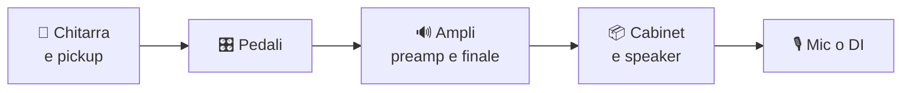

---

<a id="modulo-14"></a>
[🔙 Torna all'indice](#indice)

### Modulo 14: Amplificatori, Cabinet e Speaker
L'ampli non è un semplice "volume": è metà dello strumento.
* **Argomenti:** Amplificatori valvolari e a stato solido, sezione di preamplificazione e finale, classi di funzionamento e sag, tipologie di valvole (12AX7, EL34, 6L6, EL84), gain staging, voicing e EQ, cabinet aperti e chiusi, speaker e loro caratteristiche, potenza e headroom, funzionamento del canale clean e del gain, reactive load e attenuatori, microfonazione di base.
* **Al termine saprai:** scegliere e impostare un ampli e un cabinet in funzione dello stile, del volume e dell'ambiente.

---

<a id="modulo-15"></a>
[🔙 Torna all'indice](#indice)

### Modulo 15: Effetti e Pedali Analogici
Il mondo dei pedali: dal booster al delay, ogni effetto ha un carattere e un ruolo.
* **Argomenti:** Categorie di effetti (dinamica, gain, modulazione, tempo/spazio, filtri, pitch), compressori, overdrive, distorsioni e fuzz, chorus, flanger, phaser, tremolo, delay (analogico e digitale), riverbero, wah e envelope filter, octaver e pitch shifter, loop switcher, alimentazione e rumore, costruzione e ordine di una pedalboard.
* **Al termine saprai:** scegliere, ordinare e combinare i pedali in modo musicale, costruendo una pedalboard efficace per il tuo stile.

**📊 Infografica: ordine tipico di una pedalboard (punto di partenza)**

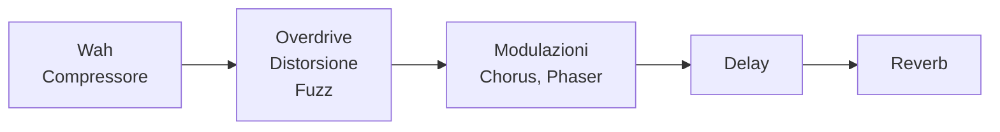

---

<a id="modulo-16"></a>
[🔙 Torna all'indice](#indice)

### Modulo 16: Il Mondo Digitale: Modeler, IR e Plugin
Dal modeling alla realtà: tutto il tuo rig in un unico dispositivo.
* **Argomenti:** Come funzionano i modeler (modellazione e profiling), panoramica delle principali famiglie di sistemi attuali (ad esempio Line 6 Helix, Fractal Audio, Neural DSP Quad Cortex, Kemper Profiler, Boss Katana, IK Multimedia TONEX), Impulse Response (IR) e cabinet virtuali, plugin e amp sim su computer, interfacce audio e latenza, DI e re-amping, integrazione di pedali analogici con i modeler, confronto tra rig analogico, ibrido e digitale, scelta in base a costi, portabilità e uso live/studio.
* **Al termine saprai:** progettare un rig digitale o ibrido, gestire preset e IR e valutare quando conviene un modeler rispetto a un rig tradizionale.

**📊 Infografica: tre strade per il tuo rig**

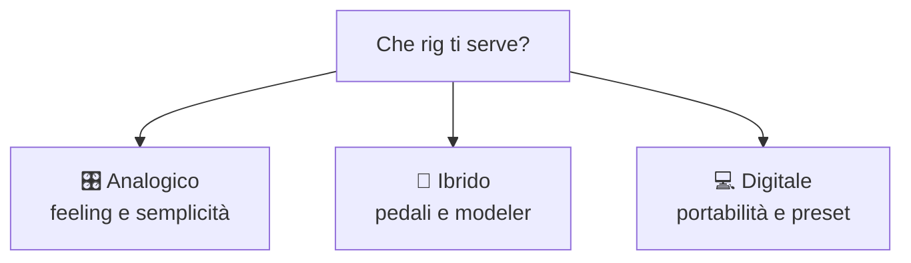

---

<a id="modulo-17"></a>
[🔙 Torna all'indice](#indice)

### Modulo 17: Registrazione, Mix e Live
Portare il tuo suono fuori dalla sala prove: in studio, in casa e sul palco.
* **Argomenti:** Registrare la chitarra (microfonazione, DI, modeler), interfaccia audio e DAW, tracking di ritmiche e soli, doppia traccia e stereo, editing e comping di base, EQ e compressione della chitarra nel mix, gestione del suono dal vivo (ampli, in-ear, DI e FOH), soundcheck, risoluzione dei problemi tipici (feedback, rumori, latenza).
* **Al termine saprai:** registrare e mixare una traccia di chitarra di qualità e gestire il tuo suono in modo affidabile dal vivo.

---

<a id="modulo-18"></a>
[🔙 Torna all'indice](#indice)

### Modulo 18: Il Tuo Sound e Progetto Finale
Mettere insieme tutto: strumento, tecnica, armonia e suono in una identità musicale.
* **Argomenti:** Costruire una "signature sound" (scelta di strumento, ampli, effetti e modeler), strategie di pratica quotidiana, routine efficaci e gestione del tempo di studio, arrangiamento e composizione con la chitarra, preparazione di una performance, registrazione di un brano completo, autovalutazione e piano di crescita.
* **Al termine saprai:** definire il tuo sound e il tuo stile, pianificare la tua crescita e realizzare un brano completo dall'idea al risultato finale.

**📊 Infografica: il ciclo di crescita**

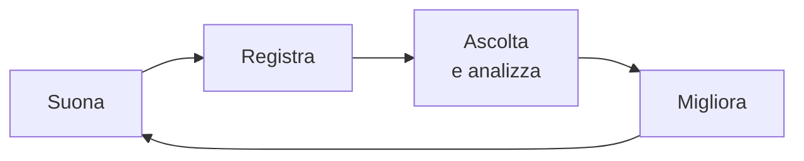

---

## 🛠️ La Nostra Metodologia Formativa

In **GCProf Academy** non crediamo nelle lezioni passive: si impara suonando. Ogni modulo segue una **struttura rigorosa di 15 step**, garantendo la massima qualità e completezza:

*Introduzione ➔ Obiettivi ➔ Prerequisiti ➔ Lezioni ➔ Esempi ➔ Laboratorio ➔ Best Practice ➔ Errori comuni ➔ Riepilogo ➔ Glossario ➔ Quiz ➔ Project Work ➔ Materiale scaricabile ➔ Bibliografia ➔ Sitografia*

**📊 Infografica: il ciclo di ogni modulo**

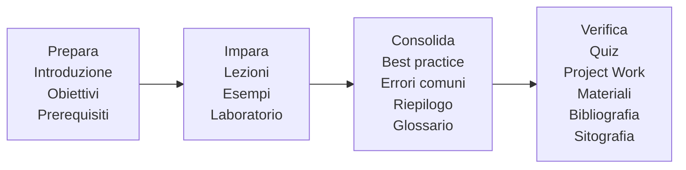

### Tipologie di Lezione Interattive
Le lezioni sono unità indipendenti, utilizzabili dall'insegnante in qualsiasi ordine, composte da:
* 📖 **Guida Teorica Markdown:** con indice navigabile integrato, visualizzabile in Google Colab e Google Docs
* 🎸 **Diagrammi del Manico Commentati:** posizioni di scale e accordi sempre chiare e spiegate passo dopo passo
* 🎥 **Video & Contenuti Multimediali:** dimostrazioni dettagliate di tecniche e suoni
* 🎧 **Practice Lab:** esercizi progressivi con metronomo e backing track
* 🎚️ **Sound Lab:** esercizi guidati per costruire e confrontare timbri, ampli, pedali e modeler
* 🧪 **Quiz Markdown:** compatibili con il parser automatico della piattaforma
* 🧩 **Challenge & Test Finale:** verifica immediata delle competenze

---

## 🏆 Project Work e Valutazione Finale

Alla fine di ogni fase, dovrai affrontare una sfida reale per dimostrare le competenze acquisite:

* **🏁 Fine Fase 1 (Strumento e Storia):** *Scheda tecnica completa* della tua chitarra con setup eseguito e documentato.
* **🏁 Fine Fase 2 (Manico, Teoria e Armonia):** *Analisi armonica e improvvisazione* su una progressione a scelta, con mappa del manico commentata.
* **🏁 Fine Fase 3 (Tecnica ed Espressività):** *Performance registrata* di un brano che integra ritmica, tecniche speciali e fraseggio personale.
* **🏁 Fine Fase 4 (Suono, Effetti e Modeler):** *Progetto finale completo*: brano originale registrato e mixato, con rig (analogico, ibrido o digitale) documentato.

**📊 Infografica: il tuo percorso di Project Work**

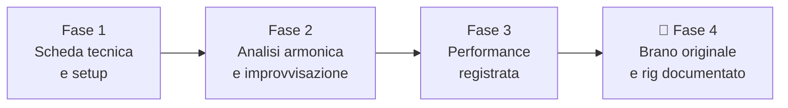

---

### 🚀 Sei pronto a plasmare il tuo suono?
Grazie all'integrazione con l'ecosistema tecnologico di *GCProf Academy* (dashboard docente, tracciamento con Supabase e metadati avanzati per il filtraggio), questo non è solo un corso, ma il tuo hub definitivo per crescere come chitarrista.

**[👉 Iscriviti ora e inizia dal Modulo 1!]**

[🔙 Torna all'indice](#indice)