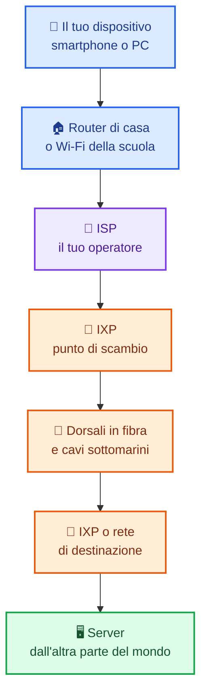
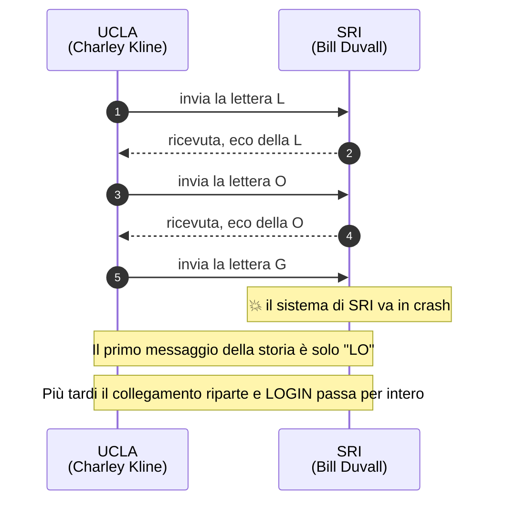
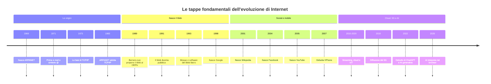
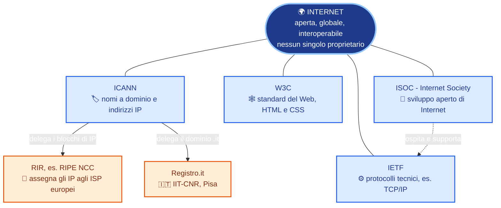
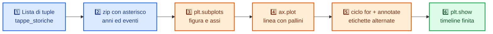
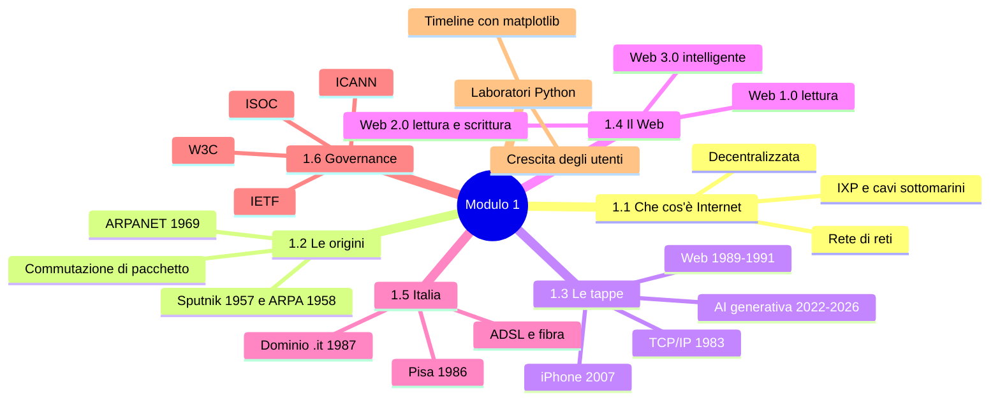

# 🔵 MODULO 1 — Storia di Internet e la sua Evoluzione

### Materiale didattico — Prof. Giuseppe Carnabuci per la piattaforma gcprof-academy.com

### ICDL Online Essentials · Percorso per il primo biennio (indirizzi LSA, RIM) · Ottimizzato per Google Colab · Aggiornato a Settembre 2026

---

## <a id="indice-modulo"></a> Indice del Modulo

1. [1.1 Che cos'è davvero Internet?](#sez-1-1)
2. [1.2 Le origini: ARPANET e la Guerra Fredda](#sez-1-2)
3. [1.3 Le tappe fondamentali dell'evoluzione di Internet](#sez-1-3)
4. [1.4 Dal Web statico al Web moderno: Web 1.0, 2.0 e 3.0](#sez-1-4)
5. [1.5 Internet in Italia](#sez-1-5)
6. [1.6 Chi "governa" davvero Internet?](#sez-1-6)
7. [🐍 Laboratorio Python 1.1 — Costruiamo una timeline di Internet](#lab-1-1)
8. [🐍 Laboratorio Python 1.2 — La crescita esplosiva degli utenti Internet](#lab-1-2)
9. [1.7 Glossario del modulo](#sez-1-7)
10. [Riepilogo del modulo](#riepilogo)

---

# Obiettivi del modulo

Al termine di questo modulo sarai in grado di:

- spiegare che cos'è davvero Internet e perché si chiama "rete di reti";
- distinguere tra Internet (l'infrastruttura) e Web (uno dei servizi che la usano);
- conoscere le origini storiche di Internet, nate in piena Guerra Fredda, e spiegare la differenza tra commutazione di circuito e commutazione di pacchetto;
- ricostruire le tappe fondamentali dell'evoluzione di Internet fino ad oggi;
- distinguere le fasi Web 1.0, Web 2.0 e Web 3.0;
- collocare la diffusione di Internet in Italia nel contesto storico;
- riconoscere quali organizzazioni internazionali contribuiscono a "governare" Internet, pur senza possederla;
- leggere e interpretare mappe, timeline e infografiche che riassumono i concetti chiave;
- utilizzare Python per costruire e visualizzare una timeline storica e un grafico di crescita.

---

<a id="sez-1-1"></a>
# 1.1 Che cos'è davvero Internet?

[⬆ Torna all'indice del modulo](#indice-modulo)

Molte persone usano le parole "Internet" e "Web" come sinonimi, ma in realtà sono due cose diverse (lo vedremo bene nel **Modulo 6**, dedicato interamente al World Wide Web). In breve: **Internet è l'infrastruttura** (le "strade"), mentre il **Web è uno dei servizi** che ci viaggiano sopra, insieme a e-mail, videochiamate, streaming e giochi online.

> **Definizione**
>
> **Internet** è un'enorme **rete di reti**: milioni di computer, server, smartphone e altri dispositivi sparsi in tutto il mondo, collegati tra loro tramite cavi, fibre ottiche e onde radio, capaci di scambiarsi dati seguendo regole comuni (i **protocolli**, che approfondiremo nel Modulo 5).

Immagina Internet come un gigantesco sistema stradale mondiale: ogni casa, scuola o ufficio è collegato a una strada locale, che si collega a strade più grandi, che a loro volta si collegano ad autostrade intercontinentali. Nessuno "possiede" tutta la rete: è un sistema **decentralizzato**, ed è proprio questa caratteristica ad averla resa così resistente e capace di crescere fino a diventare quello che conosciamo oggi.

| Nel sistema stradale | In Internet |
|----------------------|-------------|
| Strada locale sotto casa | **Rete locale (LAN)**: il Wi-Fi di casa o della scuola |
| Strada provinciale o statale | **Rete dell'operatore (ISP)**, cioè il tuo *Internet Service Provider* |
| Autostrada intercontinentale | **Dorsali** (*backbone*) in fibra ottica e cavi sottomarini |
| Svincolo tra due autostrade | **IXP**: punto di scambio tra reti diverse |
| Indirizzo di casa | **Indirizzo IP** (lo studieremo nel Modulo 5) |
| Auto o camion in viaggio | **Pacchetto** di dati |

## Una rete di reti, non un'unica grande rete

Il termine "Internet" nasce proprio dalla contrazione di **INTERconnected NETworks** ("reti interconnesse"). Non esiste, infatti, un'unica infrastruttura centrale: esistono migliaia di reti indipendenti — quella della tua scuola, quella del tuo operatore telefonico, quella di una grande azienda, quella di un governo — che si collegano tra loro attraverso punti di scambio (chiamati **IXP**, *Internet Exchange Point*) e dorsali internazionali in fibra ottica, spesso posate persino sul fondo degli oceani.

<svg xmlns="http://www.w3.org/2000/svg" viewBox="0 0 820 450" width="100%" style="max-width:820px;height:auto" role="img" aria-label="Infografica: Internet come rete di reti. Quattro reti indipendenti (scuola, azienda, operatore, università) si collegano tramite un punto di scambio IXP, e un cavo sottomarino collega gli altri continenti.">
<rect x="1" y="1" width="818" height="448" rx="16" fill="#f8fafc" stroke="#cbd5e1" stroke-width="2"/>
<text x="410" y="36" text-anchor="middle" font-family="Segoe UI, Roboto, Helvetica, Arial, sans-serif" font-size="21" font-weight="700" fill="#1e293b">Internet = rete di reti</text>
<text x="410" y="58" text-anchor="middle" font-family="Segoe UI, Roboto, Helvetica, Arial, sans-serif" font-size="12.5" fill="#475569">Migliaia di reti indipendenti che si scambiano dati seguendo regole comuni (i protocolli)</text>
<g stroke="#64748b" stroke-width="3.5" stroke-linecap="round">
<line x1="240" y1="150" x2="372" y2="180"/>
<line x1="580" y1="150" x2="448" y2="180"/>
<line x1="240" y1="316" x2="372" y2="226"/>
<line x1="580" y1="316" x2="448" y2="226"/>
</g>
<g font-family="Segoe UI, Roboto, Helvetica, Arial, sans-serif" text-anchor="middle">
<rect x="40" y="90" width="200" height="92" rx="14" fill="#dbeafe" stroke="#2563eb" stroke-width="2.5"/>
<text x="140" y="120" font-size="15" font-weight="700" fill="#1e3a8a">Rete della scuola</text>
<text x="140" y="140" font-size="12" fill="#334155">LAN, Wi-Fi, PC, tablet</text>
<circle cx="115" cy="162" r="6" fill="#2563eb"/><circle cx="140" cy="162" r="6" fill="#2563eb"/><circle cx="165" cy="162" r="6" fill="#2563eb"/>
<rect x="580" y="90" width="200" height="92" rx="14" fill="#dcfce7" stroke="#16a34a" stroke-width="2.5"/>
<text x="680" y="120" font-size="15" font-weight="700" fill="#14532d">Rete di un'azienda</text>
<text x="680" y="140" font-size="12" fill="#334155">uffici, server, stampanti</text>
<circle cx="655" cy="162" r="6" fill="#16a34a"/><circle cx="680" cy="162" r="6" fill="#16a34a"/><circle cx="705" cy="162" r="6" fill="#16a34a"/>
<rect x="40" y="270" width="200" height="92" rx="14" fill="#ede9fe" stroke="#7c3aed" stroke-width="2.5"/>
<text x="140" y="300" font-size="15" font-weight="700" fill="#4c1d95">Operatore (ISP)</text>
<text x="140" y="320" font-size="12" fill="#334155">case e smartphone abbonati</text>
<circle cx="115" cy="342" r="6" fill="#7c3aed"/><circle cx="140" cy="342" r="6" fill="#7c3aed"/><circle cx="165" cy="342" r="6" fill="#7c3aed"/>
<rect x="580" y="270" width="200" height="92" rx="14" fill="#ffedd5" stroke="#ea580c" stroke-width="2.5"/>
<text x="680" y="300" font-size="15" font-weight="700" fill="#7c2d12">Università / governo</text>
<text x="680" y="320" font-size="12" fill="#334155">data center, ricerca</text>
<circle cx="655" cy="342" r="6" fill="#ea580c"/><circle cx="680" cy="342" r="6" fill="#ea580c"/><circle cx="705" cy="342" r="6" fill="#ea580c"/>
<circle cx="410" cy="203" r="54" fill="#1e3a8a" stroke="#93c5fd" stroke-width="4"/>
<text x="410" y="200" font-size="22" font-weight="700" fill="#ffffff">IXP</text>
<text x="410" y="218" font-size="10.5" fill="#dbeafe">punto di scambio</text>
</g>
<path d="M410 257 C 372 290, 448 312, 410 352" fill="none" stroke="#0284c7" stroke-width="5" stroke-dasharray="9 6" stroke-linecap="round"/>
<text x="444" y="298" font-family="Segoe UI, Roboto, Helvetica, Arial, sans-serif" font-size="11" font-style="italic" fill="#0369a1">cavo sottomarino</text>
<text x="444" y="312" font-family="Segoe UI, Roboto, Helvetica, Arial, sans-serif" font-size="11" font-style="italic" fill="#0369a1">in fibra ottica</text>
<rect x="310" y="352" width="200" height="56" rx="14" fill="#e0f2fe" stroke="#0284c7" stroke-width="2.5"/>
<text x="410" y="376" text-anchor="middle" font-family="Segoe UI, Roboto, Helvetica, Arial, sans-serif" font-size="14" font-weight="700" fill="#075985">Altri continenti</text>
<text x="410" y="394" text-anchor="middle" font-family="Segoe UI, Roboto, Helvetica, Arial, sans-serif" font-size="11.5" fill="#334155">altre reti, altri IXP</text>
<text x="410" y="435" text-anchor="middle" font-family="Segoe UI, Roboto, Helvetica, Arial, sans-serif" font-size="12.5" font-style="italic" fill="#475569">Nessuno possiede l'intera rete: è un sistema decentralizzato</text>
</svg>

*Infografica 1 — Internet come "rete di reti": reti indipendenti collegate da un punto di scambio (IXP) e, tra i continenti, da cavi sottomarini.*

**Il viaggio di un messaggio, passo dopo passo:**



> 💡 **Approfondimento**
>
> Sapevi che gran parte del traffico Internet intercontinentale viaggia attraverso **cavi sottomarini in fibra ottica**? Secondo le stime di TeleGeography, oggi esistono oltre **500 sistemi di cavi** per più di **un milione di chilometri** complessivi sul fondo degli oceani, che collegano fisicamente i continenti (le stime più citate parlano di oltre il 95% del traffico intercontinentale). Quando invii un messaggio a un amico dall'altra parte del mondo, è molto probabile che quel messaggio passi realmente attraverso uno di questi cavi, a profondità di migliaia di metri!

---

<a id="sez-1-2"></a>
# 1.2 Le origini: ARPANET e la Guerra Fredda

[⬆ Torna all'indice del modulo](#indice-modulo)

La storia di Internet inizia negli **Stati Uniti**, alla fine degli anni '50, in un contesto storico molto particolare: la **Guerra Fredda** tra Stati Uniti e Unione Sovietica.

## Perché nasce Internet?

Nel 1957 l'URSS lancia lo **Sputnik**, il primo satellite artificiale della storia. Gli Stati Uniti, colti di sorpresa, decidono di investire massicciamente nella ricerca tecnologica e militare, fondando nel 1958 l'agenzia **ARPA** (Advanced Research Projects Agency, ribattezzata poi DARPA).

> 💡 **Approfondimento**
>
> Si racconta spesso che Internet sia nata per resistere a un attacco nucleare. La verità è più sfumata: negli anni '60 **Paul Baran** (RAND Corporation) studiò reti di comunicazione capaci di "sopravvivere" a un attacco, con molti percorsi alternativi tra i nodi, e questo influenzò il modo di pensare le reti distribuite. **ARPANET**, però, fu costruita soprattutto per permettere ai centri di ricerca di **condividere risorse** (computer costosissimi e rari). In ogni caso l'idea di **ridondanza** — se un nodo cade, i dati passano da un percorso alternativo — è ancora oggi alla base del funzionamento di Internet.

## L'idea chiave: la commutazione di pacchetto

Alla base di questa visione c'è un'intuizione fondamentale, sviluppata in modo indipendente dal ricercatore statunitense **Paul Baran** e dal britannico **Donald Davies** (che coniò il termine "pacchetto"): invece di stabilire un collegamento "dedicato" e continuo tra due punti (come avveniva con le tradizionali linee telefoniche), i dati potevano essere suddivisi in piccoli **pacchetti**, ciascuno instradato autonomamente verso la destinazione, anche seguendo percorsi diversi.

```text
Comunicazione telefonica tradizionale (commutazione di circuito)
Mittente ═══════════ linea dedicata e continua ═══════════ Destinatario

Comunicazione a pacchetto (Internet)
Mittente → [pacchetto 1] → percorso A → 
         → [pacchetto 2] → percorso B →  Destinatario (ricompone i pacchetti)
         → [pacchetto 3] → percorso A →
```

<svg xmlns="http://www.w3.org/2000/svg" viewBox="0 0 820 490" width="100%" style="max-width:820px;height:auto" role="img" aria-label="Infografica: confronto tra commutazione di circuito, con una linea dedicata tra mittente e destinatario, e commutazione di pacchetto, in cui i pacchetti 1, 2 e 3 seguono percorsi diversi e vengono ricomposti dal destinatario.">
<rect x="1" y="1" width="818" height="488" rx="16" fill="#f8fafc" stroke="#cbd5e1" stroke-width="2"/>
<g font-family="Segoe UI, Roboto, Helvetica, Arial, sans-serif">
<text x="30" y="40" font-size="16" font-weight="700" fill="#1e293b">1  Commutazione di circuito (telefono tradizionale)</text>
<rect x="40" y="68" width="140" height="68" rx="12" fill="#e2e8f0" stroke="#475569" stroke-width="2"/>
<text x="110" y="108" text-anchor="middle" font-size="15" font-weight="700" fill="#1e293b">Mittente</text>
<rect x="640" y="68" width="140" height="68" rx="12" fill="#e2e8f0" stroke="#475569" stroke-width="2"/>
<text x="710" y="108" text-anchor="middle" font-size="15" font-weight="700" fill="#1e293b">Destinatario</text>
<line x1="180" y1="102" x2="640" y2="102" stroke="#475569" stroke-width="9" stroke-linecap="round"/>
<text x="410" y="88" text-anchor="middle" font-size="12.5" fill="#334155">linea dedicata e continua, occupata per tutta la chiamata</text>
<text x="410" y="128" text-anchor="middle" font-size="12" font-style="italic" fill="#b91c1c">se un tratto si guasta, la comunicazione si interrompe</text>
<line x1="30" y1="170" x2="790" y2="170" stroke="#cbd5e1" stroke-width="2" stroke-dasharray="6 6"/>
<text x="30" y="206" font-size="16" font-weight="700" fill="#1e293b">2  Commutazione di pacchetto (Internet)</text>
<g stroke="#64748b" stroke-width="3" fill="none" stroke-linecap="round">
<line x1="180" y1="312" x2="286" y2="266"/><line x1="314" y1="256" x2="506" y2="256"/><line x1="534" y1="266" x2="640" y2="312"/>
<line x1="180" y1="332" x2="286" y2="378"/><line x1="314" y1="384" x2="506" y2="384"/><line x1="534" y1="378" x2="640" y2="332"/>
<line x1="300" y1="272" x2="300" y2="368" stroke-dasharray="5 5" stroke="#94a3b8"/><line x1="520" y1="272" x2="520" y2="368" stroke-dasharray="5 5" stroke="#94a3b8"/>
</g>
<rect x="40" y="290" width="140" height="68" rx="12" fill="#e2e8f0" stroke="#475569" stroke-width="2"/>
<text x="110" y="313" text-anchor="middle" font-size="14" font-weight="700" fill="#1e293b">Mittente</text>
<rect x="640" y="290" width="140" height="68" rx="12" fill="#e2e8f0" stroke="#475569" stroke-width="2"/>
<text x="710" y="313" text-anchor="middle" font-size="14" font-weight="700" fill="#1e293b">Destinatario</text>
<g stroke="#ffffff" stroke-width="1.5">
<rect x="70" y="328" width="18" height="18" rx="3" fill="#2563eb"/><rect x="95" y="328" width="18" height="18" rx="3" fill="#ea580c"/><rect x="120" y="328" width="18" height="18" rx="3" fill="#16a34a"/>
<rect x="670" y="328" width="18" height="18" rx="3" fill="#2563eb"/><rect x="695" y="328" width="18" height="18" rx="3" fill="#ea580c"/><rect x="720" y="328" width="18" height="18" rx="3" fill="#16a34a"/>
</g>
<g font-size="11" font-weight="700" fill="#ffffff" text-anchor="middle">
<text x="79" y="341">1</text><text x="104" y="341">2</text><text x="129" y="341">3</text>
<text x="679" y="341">1</text><text x="704" y="341">2</text><text x="729" y="341">3</text>
</g>
<g fill="#e2e8f0" stroke="#475569" stroke-width="2">
<circle cx="300" cy="260" r="16"/><circle cx="520" cy="260" r="16"/><circle cx="300" cy="384" r="16"/><circle cx="520" cy="384" r="16"/>
</g>
<g font-size="11" font-weight="700" fill="#1e293b" text-anchor="middle">
<text x="300" y="264">R</text><text x="520" y="264">R</text><text x="300" y="388">R</text><text x="520" y="388">R</text>
</g>
<g stroke="#ffffff" stroke-width="1.5">
<rect x="381" y="244" width="30" height="24" rx="5" fill="#2563eb"/><rect x="216" y="272" width="30" height="24" rx="5" fill="#16a34a"/><rect x="381" y="372" width="30" height="24" rx="5" fill="#ea580c"/>
</g>
<g font-size="13" font-weight="700" fill="#ffffff" text-anchor="middle">
<text x="396" y="261">1</text><text x="231" y="289">3</text><text x="396" y="389">2</text>
</g>
<text x="440" y="236" text-anchor="middle" font-size="12" fill="#334155">percorso A</text>
<text x="440" y="416" text-anchor="middle" font-size="12" fill="#334155">percorso B</text>
<text x="110" y="378" text-anchor="middle" font-size="11" fill="#334155">spezza il messaggio</text>
<text x="710" y="378" text-anchor="middle" font-size="11" fill="#334155">ricompone 1-2-3</text>
<text x="410" y="458" text-anchor="middle" font-size="12.5" font-style="italic" fill="#1e293b">Ogni pacchetto sceglie la strada da solo: se un percorso è guasto o congestionato, si passa da un altro</text>
<text x="410" y="476" text-anchor="middle" font-size="10.5" fill="#64748b">R = router, il dispositivo che decide dove inoltrare ogni pacchetto</text>
</g>
</svg>

*Infografica 2 — Circuito contro pacchetto: una linea riservata e fragile, oppure tanti pacchetti indipendenti che aggirano i guasti.*

| Caratteristica | Commutazione di circuito | Commutazione di pacchetto |
|----------------|--------------------------|---------------------------|
| **Collegamento** | dedicato per tutta la durata della comunicazione | nessuna linea riservata |
| **Percorso** | unico e fisso | ogni pacchetto può scegliere strade diverse |
| **Uso della linea** | spesso sprecata (pause, silenzi) | condivisa da molti utenti: molto efficiente |
| **Se un tratto si guasta** | la comunicazione si interrompe | i pacchetti aggirano il guasto |
| **Esempio** | telefonata su rete fissa tradizionale | e-mail, pagine Web, streaming |

Questa idea — la **commutazione di pacchetto** (*packet switching*) — è tuttora il principio su cui si basa il funzionamento di Internet, e la ritroveremo in dettaglio quando parleremo del protocollo IP nel Modulo 5.

## Nasce ARPANET (1969)

Il **29 ottobre 1969** viene trasmesso il primo messaggio tra due computer collegati in rete: uno all'**Università della California, Los Angeles (UCLA)** e uno allo **Stanford Research Institute**. Nasce **ARPANET**, la rete che possiamo considerare la progenitrice di Internet.

```text
1969 — ARPANET
┌─────────────┐        collegamento        ┌──────────────────┐
│    UCLA     │ ◄─────────────────────────► │  Stanford (SRI)   │
└─────────────┘                             └──────────────────┘
```

> ⚠️ **Attenzione**
>
> Un aneddoto molto citato racconta che il primissimo messaggio inviato doveva essere la parola "LOGIN", ma il sistema si bloccò dopo la trasmissione delle prime due lettere: "**LO**". In un certo senso, il primissimo "messaggio" della storia di Internet fu, per un curioso scherzo del destino, la parola "LO" — come in "Lo and behold" ("Ed ecco che..."). Poche ore dopo, il collegamento completo venne comunque stabilito con successo.



Entro la fine del 1969, altri due nodi si aggiunsero alla rete (Università della California a Santa Barbara e Università dello Utah), dando il via a una crescita che, con il senno di poi, si sarebbe rivelata inarrestabile. Ogni computer era collegato alla rete tramite un apparecchio dedicato, l'**IMP** (*Interface Message Processor*), che svolgeva il compito oggi affidato ai router.

<svg xmlns="http://www.w3.org/2000/svg" viewBox="0 0 820 420" width="100%" style="max-width:820px;height:auto" role="img" aria-label="Infografica: la rete ARPANET a quattro nodi del dicembre 1969, con UCLA, Stanford Research Institute, UC Santa Barbara e Università dello Utah. Il primo messaggio, il 29 ottobre 1969, viaggiò da UCLA a SRI.">
<rect x="1" y="1" width="818" height="418" rx="16" fill="#f8fafc" stroke="#cbd5e1" stroke-width="2"/>
<g font-family="Segoe UI, Roboto, Helvetica, Arial, sans-serif">
<text x="410" y="36" text-anchor="middle" font-size="20" font-weight="700" fill="#1e293b">ARPANET a fine 1969: la prima rete a 4 nodi</text>
<text x="410" y="58" text-anchor="middle" font-size="12.5" fill="#475569">Ogni nodo = un computer (host) collegato alla rete tramite un IMP, il "router" dell'epoca</text>
<g stroke="#64748b" stroke-width="4" stroke-linecap="round">
<line x1="320" y1="330" x2="300" y2="120"/>
<line x1="320" y1="330" x2="240" y2="225"/>
<line x1="300" y1="120" x2="240" y2="225"/>
<line x1="300" y1="120" x2="640" y2="150"/>
</g>
<line x1="320" y1="330" x2="300" y2="120" stroke="#ea580c" stroke-width="7" stroke-linecap="round" opacity="0.85"/>
<circle cx="300" cy="120" r="40" fill="#dbeafe" stroke="#2563eb" stroke-width="3.5"/>
<text x="300" y="126" text-anchor="middle" font-size="17" font-weight="700" fill="#1e3a8a">SRI</text>
<text x="248" y="112" text-anchor="end" font-size="13" font-weight="700" fill="#1e293b">Stanford Research Institute</text>
<text x="248" y="129" text-anchor="end" font-size="11.5" fill="#475569">2° nodo · ott 1969</text>
<circle cx="240" cy="225" r="40" fill="#dcfce7" stroke="#16a34a" stroke-width="3.5"/>
<text x="240" y="231" text-anchor="middle" font-size="17" font-weight="700" fill="#14532d">UCSB</text>
<text x="188" y="217" text-anchor="end" font-size="13" font-weight="700" fill="#1e293b">UC Santa Barbara</text>
<text x="188" y="234" text-anchor="end" font-size="11.5" fill="#475569">3° nodo · nov 1969</text>
<circle cx="320" cy="330" r="40" fill="#ffedd5" stroke="#ea580c" stroke-width="3.5"/>
<text x="320" y="336" text-anchor="middle" font-size="17" font-weight="700" fill="#7c2d12">UCLA</text>
<text x="268" y="322" text-anchor="end" font-size="13" font-weight="700" fill="#1e293b">Univ. of California, Los Angeles</text>
<text x="268" y="339" text-anchor="end" font-size="11.5" fill="#475569">1° nodo · set 1969</text>
<circle cx="640" cy="150" r="40" fill="#ede9fe" stroke="#7c3aed" stroke-width="3.5"/>
<text x="640" y="156" text-anchor="middle" font-size="17" font-weight="700" fill="#4c1d95">UTAH</text>
<text x="640" y="208" text-anchor="middle" font-size="13" font-weight="700" fill="#1e293b">Università dello Utah</text>
<text x="640" y="225" text-anchor="middle" font-size="11.5" fill="#475569">4° nodo · dic 1969</text>
<rect x="392" y="236" width="250" height="78" rx="12" fill="#fff7ed" stroke="#ea580c" stroke-width="2.5"/>
<text x="517" y="262" text-anchor="middle" font-size="14" font-weight="700" fill="#7c2d12">29 ottobre 1969</text>
<text x="517" y="282" text-anchor="middle" font-size="12" fill="#334155">primo messaggio della storia:</text>
<text x="517" y="301" text-anchor="middle" font-size="12" fill="#334155">UCLA → SRI (linea arancione)</text>
<line x1="392" y1="275" x2="313" y2="250" stroke="#ea580c" stroke-width="2" stroke-dasharray="4 4"/>
<text x="410" y="398" text-anchor="middle" font-size="12" font-style="italic" fill="#475569">Tra UCLA e SRI esistono due strade (diretta o via UCSB): è l'embrione della ridondanza</text>
</g>
</svg>

*Infografica 3 — La prima rete a quattro nodi (fine 1969). La linea arancione indica il percorso del primo messaggio.*

---

<a id="sez-1-3"></a>
# 1.3 Le tappe fondamentali dell'evoluzione di Internet

[⬆ Torna all'indice del modulo](#indice-modulo)

| Anno | Evento |
|------|--------|
| **1969** | Nasce ARPANET, primo collegamento tra due computer |
| **1971** | Ray Tomlinson invia la prima e-mail e introduce il simbolo **@** |
| **1973** | Vengono gettate le basi del protocollo **TCP/IP** (Vint Cerf e Bob Kahn) |
| **1983** | ARPANET adotta ufficialmente **TCP/IP**: è considerata la nascita di Internet come la intendiamo oggi |
| **1989** | Tim Berners-Lee propone al CERN di Ginevra il **World Wide Web** |
| **1990** | Al CERN vengono realizzati il primo server Web e il primo browser |
| **1991** | Il World Wide Web diventa pubblico e accessibile a tutti |
| **1993** | Nasce Mosaic, uno dei primi browser grafici di successo; il CERN rende libero e gratuito il software del Web |
| **1998** | Nasce Google |
| **2001** | Nasce Wikipedia |
| **2004** | Nascono i grandi social network (Facebook) |
| **2005** | Nasce YouTube: il video online entra nella vita quotidiana |
| **2007** | Debutta l'iPhone: inizia l'era della navigazione mobile di massa |
| **2010-2020** | Esplosione dello streaming, del cloud computing e dell'Internet delle Cose (IoT) |
| **2019-2022** | Diffusione su larga scala del **5G** e generalizzazione dello smart working |
| **2022-2026** | Diffusione dell'AI generativa (dal debutto di ChatGPT nel 2022) integrata nei browser e nei motori di ricerca |



*Infografica 4 — Le quattro grandi ere di Internet, dalla rete dei ricercatori all'era dell'AI.*

> ⚠️ **Attenzione**
>
> Un errore comune è pensare che Internet sia nata "già finita" negli anni '90. In realtà Internet è un sistema **in continua evoluzione**: nuovi protocolli, nuove tecnologie di connessione e nuovi utilizzi vengono introdotti ogni anno.

---

<a id="sez-1-4"></a>
# 1.4 Dal Web statico al Web moderno: Web 1.0, 2.0 e 3.0

[⬆ Torna all'indice del modulo](#indice-modulo)

L'evoluzione del Web viene spesso descritta in tre grandi fasi.

## Web 1.0 (anni '90 - inizio 2000)

- pagine **statiche**, create da pochi soggetti (aziende, istituzioni);
- gli utenti sono soprattutto **lettori passivi**;
- pochissima interattività.

## Web 2.0 (metà anni 2000 - oggi)

- nasce il Web **collaborativo**: blog, social network, wiki;
- gli utenti diventano anche **creatori di contenuti**;
- piattaforme come YouTube, Wikipedia, Facebook, Instagram.

## Web 3.0 (in evoluzione)

- Web **intelligente e decentralizzato**;
- integrazione con l'**Intelligenza Artificiale**;
- maggiore attenzione a privacy e proprietà dei dati.

```text
Web 1.0                Web 2.0                 Web 3.0
(sola lettura)   →   (lettura e scrittura)  →  (intelligente)
Pagine statiche       Social, blog, wiki        AI, decentralizzazione
```

<svg xmlns="http://www.w3.org/2000/svg" viewBox="0 0 840 430" width="100%" style="max-width:840px;height:auto" role="img" aria-label="Infografica: confronto tra Web 1.0 (sola lettura), Web 2.0 (lettura e scrittura) e Web 3.0 (intelligente e decentralizzato) con caratteristiche ed esempi.">
<rect x="1" y="1" width="838" height="428" rx="16" fill="#f8fafc" stroke="#cbd5e1" stroke-width="2"/>
<g font-family="Segoe UI, Roboto, Helvetica, Arial, sans-serif">
<text x="420" y="34" text-anchor="middle" font-size="20" font-weight="700" fill="#1e293b">Le tre fasi del Web</text>
<rect x="30" y="56" width="240" height="316" rx="14" fill="#f1f5f9" stroke="#475569" stroke-width="2.5"/>
<path d="M30 70 a14 14 0 0 1 14 -14 h212 a14 14 0 0 1 14 14 v50 h-240 z" fill="#475569"/>
<text x="150" y="86" text-anchor="middle" font-size="19" font-weight="700" fill="#ffffff">Web 1.0</text>
<text x="150" y="108" text-anchor="middle" font-size="12" fill="#e2e8f0">anni '90 - inizio 2000</text>
<text x="150" y="146" text-anchor="middle" font-size="15" font-weight="700" fill="#334155">SOLA LETTURA</text>
<g font-size="13" fill="#1e293b">
<text x="46" y="180">• Pagine statiche</text>
<text x="46" y="204">• Pochi autori: aziende</text><text x="56" y="221">e istituzioni</text>
<text x="46" y="245">• Utenti = lettori passivi</text>
<text x="46" y="269">• Pochissima interattività</text>
</g>
<line x1="46" y1="292" x2="254" y2="292" stroke="#cbd5e1" stroke-width="1.5"/>
<text x="46" y="314" font-size="11.5" font-weight="700" fill="#475569">ESEMPI</text>
<text x="46" y="332" font-size="12" fill="#334155">siti vetrina, portali,</text>
<text x="46" y="348" font-size="12" fill="#334155">primi motori di ricerca</text>
<rect x="300" y="56" width="240" height="316" rx="14" fill="#dbeafe" stroke="#2563eb" stroke-width="2.5"/>
<path d="M300 70 a14 14 0 0 1 14 -14 h212 a14 14 0 0 1 14 14 v50 h-240 z" fill="#2563eb"/>
<text x="420" y="86" text-anchor="middle" font-size="19" font-weight="700" fill="#ffffff">Web 2.0</text>
<text x="420" y="108" text-anchor="middle" font-size="12" fill="#dbeafe">metà anni 2000 - oggi</text>
<text x="420" y="146" text-anchor="middle" font-size="15" font-weight="700" fill="#1e3a8a">LETTURA E SCRITTURA</text>
<g font-size="13" fill="#1e293b">
<text x="316" y="180">• Web collaborativo:</text><text x="326" y="197">blog, social network, wiki</text>
<text x="316" y="221">• Gli utenti creano</text><text x="326" y="238">contenuti</text>
<text x="316" y="262">• Interazione e condivisione</text>
</g>
<line x1="316" y1="292" x2="524" y2="292" stroke="#93c5fd" stroke-width="1.5"/>
<text x="316" y="314" font-size="11.5" font-weight="700" fill="#1d4ed8">ESEMPI</text>
<text x="316" y="332" font-size="12" fill="#334155">Wikipedia, YouTube,</text>
<text x="316" y="348" font-size="12" fill="#334155">Facebook, Instagram</text>
<rect x="570" y="56" width="240" height="316" rx="14" fill="#ede9fe" stroke="#7c3aed" stroke-width="2.5"/>
<path d="M570 70 a14 14 0 0 1 14 -14 h212 a14 14 0 0 1 14 14 v50 h-240 z" fill="#7c3aed"/>
<text x="690" y="86" text-anchor="middle" font-size="19" font-weight="700" fill="#ffffff">Web 3.0</text>
<text x="690" y="108" text-anchor="middle" font-size="12" fill="#ede9fe">in evoluzione</text>
<text x="690" y="146" text-anchor="middle" font-size="15" font-weight="700" fill="#4c1d95">INTELLIGENTE</text>
<g font-size="13" fill="#1e293b">
<text x="586" y="180">• Web intelligente e</text><text x="596" y="197">decentralizzato</text>
<text x="586" y="221">• Integrazione con</text><text x="596" y="238">l'Intelligenza Artificiale</text>
<text x="586" y="262">• Più attenzione a privacy</text><text x="596" y="279">e proprietà dei dati</text>
</g>
<line x1="586" y1="292" x2="794" y2="292" stroke="#c4b5fd" stroke-width="1.5"/>
<text x="586" y="314" font-size="11.5" font-weight="700" fill="#6d28d9">ESEMPI (in dibattito)</text>
<text x="586" y="332" font-size="12" fill="#334155">assistenti AI, ricerca</text>
<text x="586" y="348" font-size="12" fill="#334155">conversazionale, blockchain</text>
</g>
<g fill="#64748b">
<polygon points="273,208 285,208 285,198 298,214 285,230 285,220 273,220"/>
<polygon points="543,208 555,208 555,198 568,214 555,230 555,220 543,220"/>
</g>
<text x="420" y="402" text-anchor="middle" font-family="Segoe UI, Roboto, Helvetica, Arial, sans-serif" font-size="12.5" font-style="italic" fill="#475569">Non sono confini netti: sono tendenze prevalenti di ciascuna epoca</text>
</svg>

*Infografica 5 — Le tre fasi del Web a confronto: chi crea i contenuti, che cosa può fare l'utente, quali esempi.*

| | **Web 1.0** | **Web 2.0** | **Web 3.0** |
|---|---|---|---|
| **Ruolo dell'utente** | lettore | lettore e autore | lettore, autore e (obiettivo dichiarato) più controllo sui propri dati |
| **Chi crea i contenuti** | pochi editori | milioni di utenti | utenti e sistemi di AI |
| **Interattività** | minima | alta | alta e personalizzata |
| **Parola chiave** | pubblicare | partecipare | comprendere e decentralizzare |

> 💡 **Approfondimento**
>
> Questa suddivisione in "fasi" è un modello divulgativo utile per capire l'evoluzione del Web, ma non ha confini netti e universalmente condivisi tra gli esperti: molti siti Web 1.0 sono tuttora online, e alcune caratteristiche del "Web 3.0" sono ancora oggetto di dibattito. È più corretto pensarle come **tendenze prevalenti** di ciascuna epoca, piuttosto che come categorie rigide.
>
> Attenzione anche alle parole: "Web 3.0" viene usato con due significati diversi. Può indicare il **Web semantico**, l'idea di Tim Berners-Lee di dati dotati di significato, comprensibili anche dalle macchine; oppure il cosiddetto **Web3**, una visione basata su blockchain e servizi decentralizzati. Quando lo leggi, chiediti sempre a quale dei due significati si riferisce l'autore.

---

<a id="sez-1-5"></a>
# 1.5 Internet in Italia

[⬆ Torna all'indice del modulo](#indice-modulo)

- **1986**: primo collegamento italiano a Internet (30 aprile), realizzato dal **CNUCE-CNR di Pisa**;
- **1987**: viene registrato `.it`, il dominio nazionale di primo livello italiano;
- **anni '90**: diffusione dei primi provider italiani (come Video On Line, attivo dal 1994) e delle connessioni via modem;
- **anni 2000**: arrivo dell'**ADSL** nelle case degli italiani (ne parleremo nel Modulo 4);
- **anni 2010-2020**: diffusione della **fibra ottica** e del **4G/5G**;
- **oggi**: il **Registro.it**, gestito dall'Istituto di Informatica e Telematica del CNR di Pisa, è l'ente responsabile dell'assegnazione dei domini `.it`.

<svg xmlns="http://www.w3.org/2000/svg" viewBox="0 0 860 380" width="100%" style="max-width:860px;height:auto" role="img" aria-label="Infografica: Internet in Italia. 1986 primo collegamento dal CNUCE-CNR di Pisa; 1987 registrazione del dominio .it; anni novanta primi provider e modem; anni 2000 ADSL; 2010-2020 fibra ottica, 4G e 5G; oggi Registro.it gestisce i domini .it.">
<rect x="1" y="1" width="858" height="378" rx="16" fill="#f8fafc" stroke="#cbd5e1" stroke-width="2"/>
<rect x="1" y="1" width="286" height="10" rx="5" fill="#009246"/>
<rect x="287" y="1" width="286" height="10" fill="#ffffff" stroke="#e2e8f0" stroke-width="1"/>
<rect x="573" y="1" width="286" height="10" rx="5" fill="#ce2b37"/>
<g font-family="Segoe UI, Roboto, Helvetica, Arial, sans-serif" text-anchor="middle">
<text x="430" y="46" font-size="20" font-weight="700" fill="#1e293b">Internet in Italia: dal CNR di Pisa alla fibra</text>
<line x1="40" y1="200" x2="820" y2="200" stroke="#94a3b8" stroke-width="5" stroke-linecap="round"/>
<g stroke="#94a3b8" stroke-width="2">
<line x1="100" y1="200" x2="100" y2="150"/><line x1="230" y1="200" x2="230" y2="250"/><line x1="360" y1="200" x2="360" y2="150"/>
<line x1="490" y1="200" x2="490" y2="250"/><line x1="620" y1="200" x2="620" y2="150"/><line x1="750" y1="200" x2="750" y2="250"/>
</g>
<circle cx="100" cy="200" r="13" fill="#009246" stroke="#ffffff" stroke-width="3"/>
<circle cx="230" cy="200" r="13" fill="#ffffff" stroke="#475569" stroke-width="3"/>
<circle cx="360" cy="200" r="13" fill="#ce2b37" stroke="#ffffff" stroke-width="3"/>
<circle cx="490" cy="200" r="13" fill="#009246" stroke="#ffffff" stroke-width="3"/>
<circle cx="620" cy="200" r="13" fill="#ffffff" stroke="#475569" stroke-width="3"/>
<circle cx="750" cy="200" r="13" fill="#ce2b37" stroke="#ffffff" stroke-width="3"/>
<rect x="36" y="66" width="128" height="84" rx="10" fill="#dcfce7" stroke="#009246" stroke-width="2"/>
<text x="100" y="88" font-size="16" font-weight="700" fill="#14532d">1986</text>
<text x="100" y="106" font-size="11.5" fill="#1e293b">primo collegamento</text><text x="100" y="121" font-size="11.5" fill="#1e293b">a Internet: CNUCE-CNR,</text><text x="100" y="136" font-size="11.5" fill="#1e293b">Pisa (30 aprile)</text>
<rect x="166" y="250" width="128" height="84" rx="10" fill="#f1f5f9" stroke="#475569" stroke-width="2"/>
<text x="230" y="272" font-size="16" font-weight="700" fill="#334155">1987</text>
<text x="230" y="291" font-size="11.5" fill="#1e293b">registrato il dominio</text><text x="230" y="306" font-size="11.5" fill="#1e293b">nazionale di primo</text><text x="230" y="321" font-size="11.5" fill="#1e293b">livello  .it</text>
<rect x="296" y="66" width="128" height="84" rx="10" fill="#fee2e2" stroke="#ce2b37" stroke-width="2"/>
<text x="360" y="88" font-size="16" font-weight="700" fill="#991b1b">anni '90</text>
<text x="360" y="106" font-size="11.5" fill="#1e293b">primi provider</text><text x="360" y="121" font-size="11.5" fill="#1e293b">italiani e connessioni</text><text x="360" y="136" font-size="11.5" fill="#1e293b">via modem</text>
<rect x="426" y="250" width="128" height="84" rx="10" fill="#dcfce7" stroke="#009246" stroke-width="2"/>
<text x="490" y="272" font-size="16" font-weight="700" fill="#14532d">anni 2000</text>
<text x="490" y="294" font-size="11.5" fill="#1e293b">arriva l'ADSL nelle</text><text x="490" y="309" font-size="11.5" fill="#1e293b">case degli italiani</text><text x="490" y="324" font-size="11.5" fill="#64748b">(Modulo 4)</text>
<rect x="556" y="66" width="128" height="84" rx="10" fill="#f1f5f9" stroke="#475569" stroke-width="2"/>
<text x="620" y="88" font-size="16" font-weight="700" fill="#334155">2010 - 2020</text>
<text x="620" y="112" font-size="11.5" fill="#1e293b">fibra ottica,</text><text x="620" y="127" font-size="11.5" fill="#1e293b">4G e 5G</text>
<rect x="686" y="250" width="128" height="84" rx="10" fill="#fee2e2" stroke="#ce2b37" stroke-width="2"/>
<text x="750" y="272" font-size="16" font-weight="700" fill="#991b1b">oggi</text>
<text x="750" y="291" font-size="11.5" fill="#1e293b">Registro.it (IIT-CNR,</text><text x="750" y="306" font-size="11.5" fill="#1e293b">Pisa) assegna i</text><text x="750" y="321" font-size="11.5" fill="#1e293b">domini  .it</text>
<text x="430" y="362" font-size="12" font-style="italic" fill="#475569">L'Italia entra in rete grazie alla ricerca pubblica, a partire da Pisa</text>
</g>
</svg>

*Infografica 6 — Le tappe di Internet in Italia, dalla ricerca pubblica alla banda ultralarga.*

> 💡 **Approfondimento**
>
> Nel 1986 l'Italia fu tra i primissimi Paesi europei a collegarsi alla rete (la quarta, secondo le ricostruzioni più citate). Il primo "segnale" partì dai ricercatori del CNUCE-CNR di Pisa con un semplice comando *ping*, e ricevette risposta dagli Stati Uniti: è ancora oggi il modo più rapido per verificare se un altro computer in rete è raggiungibile!

---

<a id="sez-1-6"></a>
# 1.6 Chi "governa" davvero Internet?

[⬆ Torna all'indice del modulo](#indice-modulo)

Se Internet non appartiene a nessuno, chi decide le regole tecniche che permettono a miliardi di dispositivi diversi di "parlare la stessa lingua"? La risposta è: nessun singolo governo o azienda, ma una rete di **organizzazioni e comunità internazionali**, per lo più no-profit, che lavorano per mantenere Internet aperta, interoperabile e funzionante.

| Organizzazione | Ruolo |
|------------------|-------|
| **ICANN** (Internet Corporation for Assigned Names and Numbers) | Coordina l'assegnazione dei nomi a dominio e degli indirizzi IP a livello globale |
| **IETF** (Internet Engineering Task Force) | Sviluppa e standardizza i protocolli tecnici di Internet (come il TCP/IP) |
| **W3C** (World Wide Web Consortium) | Definisce gli standard del World Wide Web, come HTML e CSS (fondato dallo stesso Tim Berners-Lee) |
| **Internet Society (ISOC)** | Promuove lo sviluppo aperto di Internet a livello mondiale |
| **RIR** (Regional Internet Registry, come il **RIPE NCC** per l'Europa) | Assegnano i blocchi di indirizzi IP agli operatori della propria area geografica |



*Infografica 7 — Chi si occupa di cosa: ogni organizzazione governa un pezzo diverso di Internet, nessuna le governa tutte.*

> 💡 **Approfondimento**
>
> Questo modello di governance "distribuita" e basata sul consenso tecnico, piuttosto che su un'autorità centrale unica, è uno dei motivi per cui Internet è riuscita a rimanere una rete **globale e aperta** per oltre cinquant'anni, pur attraversando enormi cambiamenti tecnologici, politici e sociali.

---

<a id="lab-1-1"></a>
# 🐍 Laboratorio Python 1.1 — Costruiamo una timeline di Internet

[⬆ Torna all'indice del modulo](#indice-modulo)

Usiamo Python per rappresentare graficamente le tappe storiche che abbiamo appena studiato. L'esercizio è pensato per essere eseguito su **Google Colab**: basta copiare il codice in una cella e premere Shift+Invio.

Prima di scrivere il codice, guarda i passaggi logici che seguiremo:



```python
# ============================================================
# ESERCIZIO 1.1 - Timeline della storia di Internet
# Obiettivo: rappresentare graficamente le tappe fondamentali
#            della storia di Internet usando la libreria matplotlib
# ============================================================

# matplotlib è la libreria standard di Python per creare grafici;
# è già preinstallata su Google Colab, quindi non serve installarla.
import matplotlib.pyplot as plt

# textwrap è una libreria standard di Python (non serve installarla):
# la useremo per mandare a capo automaticamente le etichette troppo lunghe.
import textwrap

# Creiamo una lista di tuple (anno, evento) con le tappe principali.
# Una tupla è una piccola struttura dati che raggruppa più valori,
# in questo caso un numero (l'anno) e una stringa (la descrizione).
tappe_storiche = [
    (1969, "Nasce ARPANET"),
    (1971, "Prima e-mail (simbolo @)"),
    (1983, "ARPANET adotta TCP/IP"),
    (1989, "Tim Berners-Lee propone il Web"),
    (1991, "Il Web diventa pubblico"),
    (1998, "Nasce Google"),
    (2007, "Debutta l'iPhone"),
    (2019, "Diffusione del 5G"),
    (2026, "AI integrata nel Web"),
]

# Separiamo la lista di tuple in due liste distinte: anni ed eventi.
# La funzione zip(*lista) "spacchetta" le tuple in colonne separate.
anni, eventi = zip(*tappe_storiche)

# Creiamo la figura e gli assi su cui disegnare il grafico.
# figsize=(13, 5.5) imposta la larghezza e l'altezza in pollici.
fig, ax = plt.subplots(figsize=(13, 5.5))

# Disegniamo una linea orizzontale (la "linea del tempo") e un
# pallino per ogni evento, usando gli anni come coordinata X
# e un valore costante (0) come coordinata Y.
ax.plot(anni, [0] * len(anni), "o-", color="steelblue", markersize=10)

# Elenco delle altezze a cui scriveremo le etichette: due sopra la linea
# (valori positivi) e due sotto (valori negativi), a rotazione.
# Alternare altezze diverse evita che i testi si sovrappongano.
altezze = [0.12, -0.12, 0.24, -0.24]

# Aggiungiamo il testo di ogni evento sopra o sotto il pallino.
for indice, (anno, evento) in enumerate(tappe_storiche):
    # L'operatore % (resto della divisione) ci fa ripartire da capo
    # nell'elenco quando gli eventi sono più delle altezze disponibili.
    posizione_verticale = altezze[indice % len(altezze)]

    # Mandiamo a capo il testo ogni 16 caratteri circa.
    evento_a_capo = textwrap.fill(evento, width=16)

    ax.annotate(
        f"{anno}\n{evento_a_capo}",           # testo mostrato: anno + evento
        xy=(anno, 0),                         # punto a cui si riferisce l'etichetta
        xytext=(anno, posizione_verticale),   # posizione del testo
        ha="center",                          # allineamento orizzontale centrato
        va="bottom" if posizione_verticale > 0 else "top",  # il testo "si allontana" dalla linea
        fontsize=9,
        arrowprops=dict(arrowstyle="-", color="gray", lw=0.8),
    )

# Nascondiamo l'asse Y (non ha significato in una timeline)
ax.get_yaxis().set_visible(False)
# Rimuoviamo i bordi superflui del grafico per uno stile più pulito
for lato in ["top", "right", "left"]:
    ax.spines[lato].set_visible(False)

ax.set_title("Le tappe fondamentali della storia di Internet", fontsize=14, fontweight="bold")
ax.set_xlabel("Anno")
ax.set_xlim(1960, 2036)     # lasciamo un po' di margine ai lati per non tagliare le etichette
ax.set_ylim(-0.45, 0.45)    # limitiamo lo spazio verticale, serve solo per il layout

plt.tight_layout()  # ottimizza automaticamente gli spazi tra gli elementi
plt.show()           # mostra il grafico

# Proviamo anche a stampare le tappe in ordine cronologico come testo,
# utile per chi preferisce una vista tabellare veloce.
print("\nTappe storiche in ordine cronologico:")
for anno, evento in sorted(tappe_storiche):
    print(f"  {anno} -> {evento}")
```

**Prova tu!** Modifica la lista `tappe_storiche` aggiungendo un evento storico di Internet che ti interessa (ad esempio la nascita di un social network o di un servizio che usi ogni giorno) e rilancia il codice: vedrai la timeline aggiornarsi automaticamente.

> 💡 **Suggerimento**
>
> Se aggiungi molti eventi e le etichette iniziano a sovrapporsi, prova ad aumentare `figsize` (ad esempio `(16, 6)`), a ridurre `fontsize` oppure ad aggiungere altre altezze alla lista `altezze`.

---

<a id="lab-1-2"></a>
# 🐍 Laboratorio Python 1.2 — La crescita esplosiva degli utenti Internet

[⬆ Torna all'indice del modulo](#indice-modulo)

I numeri raccontano meglio di ogni parola quanto Internet sia cresciuta negli ultimi trent'anni. In questo secondo laboratorio visualizziamo la crescita del numero di utenti Internet nel mondo, da poche migliaia di ricercatori a miliardi di persone connesse.

Ecco un'anteprima di ciò che i dati ci diranno: nel codice sotto costruirai tu lo stesso grafico, con Python.

<svg xmlns="http://www.w3.org/2000/svg" viewBox="0 0 820 410" width="100%" style="max-width:820px;height:auto" role="img" aria-label="Infografica: numero di utenti Internet nel mondo in miliardi, da 0,04 nel 1995 a 6,0 nel 2025, circa 150 volte di più, pari a circa tre quarti della popolazione mondiale.">
<rect x="1" y="1" width="818" height="408" rx="16" fill="#f8fafc" stroke="#cbd5e1" stroke-width="2"/>
<g font-family="Segoe UI, Roboto, Helvetica, Arial, sans-serif">
<text x="410" y="34" text-anchor="middle" font-size="20" font-weight="700" fill="#1e293b">Internet in numeri: utenti nel mondo (miliardi)</text>
<g stroke="#e2e8f0" stroke-width="1.5">
<line x1="80" y1="320" x2="790" y2="320"/><line x1="80" y1="243.3" x2="790" y2="243.3"/><line x1="80" y1="166.7" x2="790" y2="166.7"/><line x1="80" y1="90" x2="790" y2="90"/>
</g>
<g font-size="11" fill="#64748b" text-anchor="end">
<text x="72" y="324">0</text><text x="72" y="247">2</text><text x="72" y="170">4</text><text x="72" y="94">6</text>
</g>
<g fill="#fb923c">
<rect x="100" y="318.5" width="60" height="1.5" rx="1"/>
<rect x="186" y="306.2" width="60" height="13.8" rx="3"/>
<rect x="272" y="280.9" width="60" height="39.1" rx="3"/>
<rect x="358" y="242.6" width="60" height="77.4" rx="3"/>
<rect x="444" y="197.3" width="60" height="122.7" rx="3"/>
</g>
<g fill="#ea580c">
<rect x="530" y="141.4" width="60" height="178.6" rx="3"/>
<rect x="616" y="97.7" width="60" height="222.3" rx="3"/>
</g>
<rect x="702" y="90" width="60" height="230" rx="3" fill="#c2410c"/>
<g font-size="12" font-weight="700" fill="#1e293b" text-anchor="middle">
<text x="130" y="310">0,04</text><text x="216" y="298">0,36</text><text x="302" y="273">1,02</text><text x="388" y="235">2,02</text>
<text x="474" y="190">3,20</text><text x="560" y="134">4,66</text><text x="646" y="90">5,80</text><text x="732" y="82">6,00</text>
</g>
<g font-size="12.5" fill="#334155" text-anchor="middle">
<text x="130" y="342">1995</text><text x="216" y="342">2000</text><text x="302" y="342">2005</text><text x="388" y="342">2010</text>
<text x="474" y="342">2015</text><text x="560" y="342">2020</text><text x="646" y="342">2024</text><text x="732" y="342">2025</text>
</g>
<rect x="100" y="108" width="228" height="76" rx="12" fill="#fff7ed" stroke="#ea580c" stroke-width="2.5"/>
<text x="214" y="142" text-anchor="middle" font-size="30" font-weight="800" fill="#c2410c">≈ 150 volte</text>
<text x="214" y="164" text-anchor="middle" font-size="12" fill="#334155">più utenti tra il 1995 e il 2025</text>
<text x="410" y="372" text-anchor="middle" font-size="12.5" fill="#1e293b">Nel 2025 circa 3 persone su 4 nel mondo usano Internet, ma 2,2 miliardi restano offline</text>
<text x="410" y="392" text-anchor="middle" font-size="10.5" fill="#64748b">Fonte: stime ITU (Facts and Figures 2025), valori arrotondati a scopo didattico</text>
</g>
</svg>

*Infografica 8 — Utenti Internet nel mondo, dal 1995 al 2025 (miliardi di persone, stime ITU arrotondate).*

```python
# ============================================================
# ESERCIZIO 1.2 - La crescita degli utenti Internet nel mondo
# Obiettivo: visualizzare, con un grafico a linee, la crescita
#            del numero di utenti Internet nel mondo dal 1995
#            a oggi, per comprendere visivamente la portata
#            del fenomeno di cui abbiamo studiato la storia.
# ============================================================

import matplotlib.pyplot as plt

# Dati approssimativi e a scopo puramente didattico sul numero
# di utenti Internet nel mondo (in miliardi di persone), basati
# sulle stime dell'ITU (Unione Internazionale delle Telecomunicazioni).
# Attenzione: l'ITU rivede periodicamente le sue serie storiche,
# quindi i valori possono differire leggermente da una fonte all'altra.
anni_crescita = [1995, 2000, 2005, 2010, 2015, 2020, 2024, 2025]
utenti_miliardi = [0.04, 0.36, 1.02, 2.02, 3.20, 4.66, 5.80, 6.00]

fig, ax = plt.subplots(figsize=(10, 5))

# Disegniamo un grafico a linee con marcatori sui singoli punti,
# così da evidenziare sia l'andamento generale sia i valori esatti
# negli anni che abbiamo scelto di rappresentare.
ax.plot(anni_crescita, utenti_miliardi, marker="o", color="darkorange", linewidth=2)

# Coloriamo l'area sotto la curva per rendere ancora più evidente,
# a colpo d'occhio, la crescita nel tempo.
ax.fill_between(anni_crescita, utenti_miliardi, color="moccasin", alpha=0.5)

# Scriviamo il valore esatto sopra ogni punto.
# xytext=(0, 8) e textcoords="offset points" spostano il testo di 8 punti verso l'alto.
for anno, valore in zip(anni_crescita, utenti_miliardi):
    ax.annotate(f"{valore:.2f}", xy=(anno, valore), xytext=(0, 8),
                textcoords="offset points", ha="center", fontsize=9)

ax.set_title("Crescita del numero di utenti Internet nel mondo", fontsize=13, fontweight="bold")
ax.set_xlabel("Anno")
ax.set_ylabel("Utenti Internet (miliardi di persone)")
ax.set_xticks(anni_crescita)   # mostriamo sull'asse X esattamente gli anni dei nostri dati
ax.set_ylim(0, 7)              # un po' di spazio in alto per le etichette dei valori
ax.grid(axis="y", linestyle="--", alpha=0.5)

plt.tight_layout()
plt.show()

# Calcoliamo anche di quante volte è cresciuto il numero di utenti
# tra il primo e l'ultimo anno della nostra serie storica.
crescita_totale = utenti_miliardi[-1] / utenti_miliardi[0]
print(f"Tra il {anni_crescita[0]} e il {anni_crescita[-1]}, il numero di utenti Internet")
print(f"nel mondo è cresciuto di circa {crescita_totale:.0f} volte!")
```

> 💡 **Approfondimento**
>
> Un grafico come questo aiuta a capire perché i protocolli e le infrastrutture che studieremo nei prossimi moduli devono essere progettati per **scalare**: un sistema pensato per poche migliaia di ricercatori negli anni '70 doveva essere in grado di sostenere, decenni dopo, miliardi di dispositivi connessi contemporaneamente. Il grafico racconta però anche un'altra storia: secondo l'ITU, nel 2025 circa **2,2 miliardi di persone** risultano ancora offline. Connettersi non è ancora un diritto garantito a tutti.

**Prova tu!** Prova a calcolare, modificando il codice, la crescita percentuale media annua tra due anni della serie a tua scelta.

> 💡 **Suggerimento**
>
> Per la crescita percentuale media annua (tasso composto) puoi usare la formula `((valore_finale / valore_iniziale) ** (1 / numero_anni) - 1) * 100`, dove `numero_anni` è la differenza tra i due anni scelti. Confronta poi i tassi di periodi diversi: la crescita è stata più veloce negli anni '90 o negli anni 2010?

---

<a id="sez-1-7"></a>
# 1.7 Glossario del modulo

[⬆ Torna all'indice del modulo](#indice-modulo)

| Termine | Significato |
|----------|-------------|
| **Internet** | Rete mondiale di reti di computer interconnesse |
| **Rete di reti** | Definizione di Internet: migliaia di reti indipendenti collegate tra loro tramite protocolli comuni |
| **Decentralizzato** | Che non dipende da un unico centro di controllo: se una parte si guasta, il resto continua a funzionare |
| **ARPANET** | Prima rete a commutazione di pacchetto, antenata di Internet |
| **ARPA** | Agenzia statunitense che finanziò la nascita di ARPANET |
| **Nodo** | Ciascun punto (computer o dispositivo di rete) collegato a una rete |
| **Pacchetto** | Piccolo blocco di dati in cui viene suddiviso un messaggio per essere trasmesso in rete |
| **Commutazione di pacchetto** | Tecnica di trasmissione che suddivide i dati in piccoli pacchetti instradati indipendentemente |
| **Protocollo** | Insieme di regole comuni che permettono a dispositivi diversi di comunicare |
| **TCP/IP** | Insieme di protocolli che regolano la trasmissione dei dati su Internet |
| **World Wide Web** | Sistema di documenti ipertestuali collegati tra loro, accessibile tramite Internet |
| **Web 1.0 / 2.0 / 3.0** | Le tre grandi fasi evolutive del Web |
| **Provider (ISP)** | Fornitore del servizio di accesso a Internet |
| **IXP** | Internet Exchange Point, punto di scambio dati tra reti diverse |
| **Dorsale (backbone)** | Collegamento ad altissima capacità, in genere in fibra ottica, che unisce le reti principali |
| **ICANN** | Organizzazione che coordina nomi a dominio e indirizzi IP a livello globale |
| **IETF** | Organizzazione che sviluppa gli standard tecnici di Internet |
| **W3C** | Consorzio che definisce gli standard del Web (HTML, CSS) |
| **ISOC** | Internet Society, organizzazione che promuove lo sviluppo aperto di Internet |
| **RIR / RIPE NCC** | Registro regionale che assegna gli indirizzi IP (RIPE NCC per l'Europa) |
| **Dominio .it** | Dominio nazionale di primo livello italiano, gestito dal Registro.it |

---

<a id="riepilogo"></a>
# Riepilogo del modulo

[⬆ Torna all'indice del modulo](#indice-modulo)

In questo primo modulo hai scoperto:

- che cos'è davvero Internet e perché è definita "rete di reti";
- il contesto storico e militare in cui nasce ARPANET nel 1969, e il principio della commutazione di pacchetto;
- le tappe fondamentali che hanno portato Internet a diventare quella che conosciamo oggi;
- l'evoluzione dal Web statico (1.0) al Web collaborativo (2.0) fino al Web intelligente (3.0);
- i momenti chiave della diffusione di Internet in Italia;
- quali organizzazioni internazionali contribuiscono a "governare" Internet senza possederla;
- come rappresentare graficamente una timeline storica e un grafico di crescita con Python.



*Infografica 9 — La mappa concettuale del modulo: usala per ripassare.*

**Per ripassare, prova a rispondere senza guardare gli appunti:**

1. Perché Internet viene definita una "rete di reti" e perché nessuno la possiede?
2. Qual è la differenza tra commutazione di circuito e commutazione di pacchetto?
3. Che cosa accadde il 29 ottobre 1969 e perché è una data storica?
4. In che cosa si distinguono Web 1.0, Web 2.0 e Web 3.0?
5. Quale ente assegna i domini `.it` e dove ha sede?
6. Quali sono i ruoli di ICANN, IETF e W3C?

Ora che conosci la storia di Internet, sei pronto per scoprire **come viaggiano realmente le informazioni** attraverso i canali di comunicazione e i mezzi trasmissivi: è l'argomento del **Modulo 2 — Canali di Comunicazione e Mezzi Trasmissivi**.

[⬆ Torna all'indice del modulo](#indice-modulo)