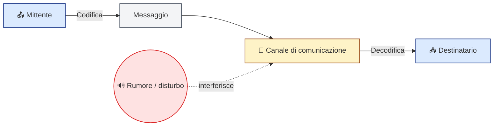
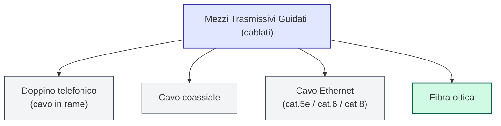
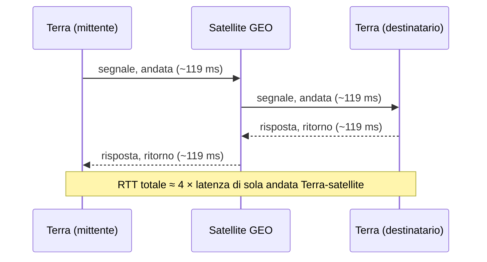

# 🟢 MODULO 2 — Canali di Comunicazione e Mezzi Trasmissivi

### Materiale didattico — Prof. Giuseppe Carnabuci per la piattaforma gcprof-academy.com

### ICDL Online Essentials · Percorso per il primo biennio (indirizzi LSA, RIM) · Ottimizzato per Google Colab · Aggiornato ad Agosto 2026

---

## <a id="indice-modulo"></a> Indice del Modulo

1. [2.1 Che cos'è un canale di comunicazione?](#sez-2-1)
2. [2.2 Comunicazione sincrona e asincrona](#sez-2-2)
3. [2.3 Modalità di trasmissione: simplex, half-duplex, full-duplex](#sez-2-3)
4. [2.4 I mezzi trasmissivi guidati (cablati)](#sez-2-4)
5. [2.5 I mezzi trasmissivi non guidati (wireless)](#sez-2-5)
6. [2.6 Confronto tra i mezzi trasmissivi: banda, velocità, costo](#sez-2-6)
7. [🐍 Laboratorio Python 2.1 — Calcoliamo i tempi di trasferimento dati](#lab-2-1)
8. [🐍 Laboratorio Python 2.2 — La latenza di propagazione del segnale](#lab-2-2)
9. [2.7 Glossario del modulo](#sez-2-7)
10. [Riepilogo del modulo](#riepilogo)

---

# Obiettivi del modulo

Al termine di questo modulo sarai in grado di:

- definire che cos'è un canale di comunicazione e riconoscerne gli elementi fondamentali;
- distinguere la comunicazione sincrona da quella asincrona;
- distinguere le modalità di trasmissione simplex, half-duplex e full-duplex;
- conoscere i principali mezzi trasmissivi guidati (doppino, cavo coassiale, fibra ottica) e non guidati (onde radio, microonde, infrarossi);
- confrontare i mezzi trasmissivi in termini di velocità, costo e affidabilità;
- calcolare con Python i tempi di trasferimento dei dati e la latenza di propagazione del segnale su canali diversi.

---

<a id="sez-2-1"></a>
# 2.1 Che cos'è un canale di comunicazione?

[⬆ Torna all'indice del modulo](#indice-modulo)

Nel Modulo 1 abbiamo visto **che cos'è** Internet e **come si è evoluta**. In questo modulo scendiamo un gradino più in basso, e ci chiediamo: quando due dispositivi comunicano, **attraverso che cosa** viaggiano davvero i dati?

> **Definizione**
>
> Un **canale di comunicazione** è il mezzo fisico o logico attraverso cui viaggiano le informazioni tra un **mittente** (*sender*) e un **destinatario** (*receiver*).

Ogni comunicazione, digitale o meno, può essere descritta con uno schema molto semplice, che risale agli studi del matematico Claude Shannon sulla teoria dell'informazione:



Nel mondo dell'informatica, il "messaggio" è composto da **dati digitali** (sequenze di 0 e 1), e il "canale" può essere un cavo, una fibra ottica o persino l'aria, attraversata da onde radio.

> 💡 **Approfondimento**
>
> Il termine **rumore** (*noise*) indica qualunque fattore che disturbi il segnale lungo il canale: interferenze elettromagnetiche, attenuazione del segnale sulle lunghe distanze, o semplicemente il "sovraffollamento" di una rete Wi-Fi con troppi dispositivi collegati. Una buona parte dell'ingegneria delle telecomunicazioni si occupa proprio di **progettare canali e protocolli capaci di resistere al rumore**, correggendo o richiedendo il reinvio dei dati danneggiati.

Perché mittente e destinatario si capiscano, entrambi devono usare le stesse regole di **codifica** e **decodifica** dell'informazione: è un po' come parlare la stessa lingua. Approfondiremo questo aspetto — i **protocolli di comunicazione** — nel Modulo 5.

---

<a id="sez-2-2"></a>
# 2.2 Comunicazione sincrona e asincrona

[⬆ Torna all'indice del modulo](#indice-modulo)

## Comunicazione sincrona

Mittente e destinatario sono collegati **nello stesso momento** e si scambiano informazioni in tempo reale.

Esempi: una videochiamata, una telefonata, una chat con risposta immediata.

## Comunicazione asincrona

Il messaggio viene inviato e **rimane in attesa** finché il destinatario non lo legge, anche a distanza di ore o giorni.

Esempi: una e-mail, un messaggio lasciato in segreteria, un post pubblicato sui social.

| Caratteristica | Sincrona | Asincrona |
|-----------------|----------|-----------|
| Tempo di risposta | Immediato | Variabile, anche differito |
| Esempio | Videochiamata | E-mail |
| Necessità di essere online insieme | Sì | No |
| Tollera interruzioni della connessione | Poco (la comunicazione si interrompe) | Bene (il messaggio resta in attesa) |

<svg viewBox="0 0 640 220" xmlns="http://www.w3.org/2000/svg" style="width:100%;height:auto;font-family:sans-serif;">
  <defs>
    <marker id="arrowSync" viewBox="0 0 10 10" refX="8" refY="5" markerWidth="6" markerHeight="6" orient="auto-start-reverse">
      <path d="M0,0 L10,5 L0,10 z" fill="#065f46"/>
    </marker>
    <marker id="arrowAsync" viewBox="0 0 10 10" refX="8" refY="5" markerWidth="6" markerHeight="6" orient="auto-start-reverse">
      <path d="M0,0 L10,5 L0,10 z" fill="#92400e"/>
    </marker>
  </defs>
  <rect x="10" y="10" width="300" height="200" rx="12" fill="#ecfdf5" stroke="#10b981" stroke-width="1.5"/>
  <text x="160" y="35" text-anchor="middle" font-size="14" font-weight="bold" fill="#065f46">Comunicazione SINCRONA</text>
  <circle cx="70" cy="110" r="26" fill="#10b981"/>
  <text x="70" y="115" text-anchor="middle" font-size="14" fill="white">A</text>
  <circle cx="250" cy="110" r="26" fill="#10b981"/>
  <text x="250" y="115" text-anchor="middle" font-size="14" fill="white">B</text>
  <line x1="98" y1="103" x2="222" y2="103" stroke="#065f46" stroke-width="2" marker-end="url(#arrowSync)"/>
  <line x1="222" y1="118" x2="98" y2="118" stroke="#065f46" stroke-width="2" marker-end="url(#arrowSync)"/>
  <text x="160" y="152" text-anchor="middle" font-size="12" fill="#065f46">Scambio in tempo reale</text>
  <text x="160" y="172" text-anchor="middle" font-size="12" fill="#065f46">(es. videochiamata)</text>

  <rect x="330" y="10" width="300" height="200" rx="12" fill="#fffbeb" stroke="#f59e0b" stroke-width="1.5"/>
  <text x="480" y="35" text-anchor="middle" font-size="14" font-weight="bold" fill="#92400e">Comunicazione ASINCRONA</text>
  <circle cx="380" cy="110" r="24" fill="#f59e0b"/>
  <text x="380" y="115" text-anchor="middle" font-size="13" fill="white">A</text>
  <rect x="440" y="92" width="40" height="30" rx="4" fill="white" stroke="#92400e" stroke-width="1.5"/>
  <path d="M440,92 L460,108 L480,92" fill="none" stroke="#92400e" stroke-width="1.5"/>
  <circle cx="580" cy="110" r="24" fill="#f59e0b"/>
  <text x="580" y="115" text-anchor="middle" font-size="13" fill="white">B</text>
  <line x1="404" y1="108" x2="438" y2="108" stroke="#92400e" stroke-width="2" marker-end="url(#arrowAsync)"/>
  <line x1="482" y1="108" x2="556" y2="108" stroke="#92400e" stroke-width="2" stroke-dasharray="4 3" marker-end="url(#arrowAsync)"/>
  <text x="480" y="152" text-anchor="middle" font-size="12" fill="#92400e">Il messaggio attende</text>
  <text x="480" y="172" text-anchor="middle" font-size="12" fill="#92400e">di essere letto (es. e-mail)</text>
</svg>

> 💡 **Approfondimento**
>
> Molte app moderne (come WhatsApp o Telegram) sono **ibride**: funzionano in modo asincrono (il messaggio resta lì finché non viene letto) ma permettono anche una comunicazione quasi sincrona, grazie a notifiche istantanee e indicatori "sta scrivendo...". Anche la posta elettronica, storicamente asincrona, può essere resa "quasi sincrona" da app che notificano l'arrivo dei messaggi in tempo reale.

---

<a id="sez-2-3"></a>
# 2.3 Modalità di trasmissione: simplex, half-duplex, full-duplex

[⬆ Torna all'indice del modulo](#indice-modulo)

Oltre a *quando* avviene la comunicazione (sincrona/asincrona), è importante capire *in quali direzioni* può viaggiare il segnale su un canale.

## Simplex

I dati viaggiano in **una sola direzione**, sempre dallo stesso mittente verso lo stesso destinatario. Il destinatario non può "rispondere" utilizzando lo stesso canale.

Esempi: una trasmissione televisiva, la radio, un telecomando (dal telecomando alla TV, mai il contrario).

## Half-duplex

I dati possono viaggiare **in entrambe le direzioni, ma non contemporaneamente**: mentre un dispositivo trasmette, l'altro deve necessariamente ricevere, e viceversa.

Esempio classico: un walkie-talkie, dove bisogna premere il pulsante per parlare e rilasciarlo per ascoltare.

## Full-duplex

I dati possono viaggiare **in entrambe le direzioni contemporaneamente**. È la modalità delle moderne reti dati.

Esempio: una normale telefonata, dove entrambi gli interlocutori possono parlare (e sentirsi) nello stesso istante; oppure una connessione Ethernet moderna, dove il computer può inviare e ricevere dati nello stesso momento.

<svg viewBox="0 0 640 330" xmlns="http://www.w3.org/2000/svg" style="width:100%;height:auto;font-family:sans-serif;">
  <defs>
    <marker id="arr" viewBox="0 0 10 10" refX="8" refY="5" markerWidth="6" markerHeight="6" orient="auto-start-reverse">
      <path d="M0,0 L10,5 L0,10 z" fill="#1f2937"/>
    </marker>
  </defs>

  <text x="20" y="28" font-size="14" font-weight="bold" fill="#1e3a8a">SIMPLEX</text>
  <rect x="20" y="40" width="90" height="40" rx="6" fill="#dbeafe" stroke="#1e3a8a"/>
  <text x="65" y="65" text-anchor="middle" font-size="12">Dispositivo A</text>
  <rect x="530" y="40" width="90" height="40" rx="6" fill="#dbeafe" stroke="#1e3a8a"/>
  <text x="575" y="65" text-anchor="middle" font-size="12">Dispositivo B</text>
  <line x1="115" y1="60" x2="525" y2="60" stroke="#1e3a8a" stroke-width="2.5" marker-end="url(#arr)"/>
  <text x="320" y="98" text-anchor="middle" font-size="11" fill="#1e3a8a">una sola direzione</text>

  <text x="20" y="140" font-size="14" font-weight="bold" fill="#7c2d12">HALF-DUPLEX</text>
  <rect x="20" y="152" width="90" height="40" rx="6" fill="#ffedd5" stroke="#7c2d12"/>
  <text x="65" y="177" text-anchor="middle" font-size="12">Dispositivo A</text>
  <rect x="530" y="152" width="90" height="40" rx="6" fill="#ffedd5" stroke="#7c2d12"/>
  <text x="575" y="177" text-anchor="middle" font-size="12">Dispositivo B</text>
  <line x1="115" y1="165" x2="525" y2="165" stroke="#7c2d12" stroke-width="2.5" marker-end="url(#arr)"/>
  <line x1="525" y1="182" x2="115" y2="182" stroke="#7c2d12" stroke-width="2.5" stroke-dasharray="5 4" marker-end="url(#arr)"/>
  <text x="320" y="210" text-anchor="middle" font-size="11" fill="#7c2d12">entrambe le direzioni, ma non insieme</text>

  <text x="20" y="252" font-size="14" font-weight="bold" fill="#065f46">FULL-DUPLEX</text>
  <rect x="20" y="264" width="90" height="40" rx="6" fill="#d1fae5" stroke="#065f46"/>
  <text x="65" y="289" text-anchor="middle" font-size="12">Dispositivo A</text>
  <rect x="530" y="264" width="90" height="40" rx="6" fill="#d1fae5" stroke="#065f46"/>
  <text x="575" y="289" text-anchor="middle" font-size="12">Dispositivo B</text>
  <line x1="115" y1="277" x2="525" y2="277" stroke="#065f46" stroke-width="2.5" marker-end="url(#arr)"/>
  <line x1="525" y1="292" x2="115" y2="292" stroke="#065f46" stroke-width="2.5" marker-end="url(#arr)"/>
  <text x="320" y="322" text-anchor="middle" font-size="11" fill="#065f46">entrambe le direzioni, insieme</text>
</svg>

> ⚠️ **Attenzione**
>
> Un errore comune è pensare che le prime reti locali basate su cavo Ethernet e **hub** fossero già full-duplex: in realtà, con un hub tutti i dispositivi collegati condividevano lo stesso canale in modalità half-duplex, e potevano verificarsi delle **collisioni** se due dispositivi trasmettevano nello stesso istante. Solo con l'introduzione degli **switch** (che vedremo meglio nel Modulo 3) le reti locali sono diventate realmente full-duplex.

---

<a id="sez-2-4"></a>
# 2.4 I mezzi trasmissivi guidati (cablati)

[⬆ Torna all'indice del modulo](#indice-modulo)

Il **mezzo trasmissivo** è il supporto fisico su cui viaggiano concretamente i segnali. Si divide in due grandi famiglie: **mezzi guidati** (o cablati), in cui il segnale è "incanalato" fisicamente lungo un supporto, e **mezzi non guidati** (wireless), che vedremo nella prossima sezione.

## Doppino telefonico (cavo in rame)

- economico e diffusissimo;
- utilizzato storicamente per la telefonia e le prime connessioni Internet (i vecchi modem analogici e l'ADSL, che approfondiremo nel Modulo 4);
- soggetto a **interferenze elettromagnetiche** e ad **attenuazione** del segnale sulle lunghe distanze.

## Cavo coassiale

- un conduttore centrale in rame, avvolto da uno strato isolante e da una schermatura metallica;
- più resistente alle interferenze rispetto al semplice doppino;
- storicamente usato per la TV via cavo e per le prime reti locali.

## Cavo Ethernet (doppino intrecciato, es. cat.5e / cat.6)

- coppie di fili in rame **intrecciate tra loro** (*twisted pair*), proprio per ridurre le interferenze reciproche tra le coppie (fenomeno noto come **diafonia**, o *crosstalk*);
- è il cavo usato oggi nelle reti locali (LAN) di case, scuole e uffici;
- le categorie più recenti (cat.6, cat.6a, cat.8) supportano velocità sempre più elevate su distanze via via più corte.

## Fibra ottica

- trasmette dati sotto forma di **impulsi luminosi** attraverso sottilissimi filamenti di vetro o plastica, invece che come segnali elettrici;
- velocità **altissime**, bassissima attenuazione sulle lunghe distanze, e **immunità totale alle interferenze elettromagnetiche** (la luce non è influenzata dai campi elettrici o magnetici circostanti);
- è la tecnologia alla base delle moderne dorsali intercontinentali di Internet (i cavi sottomarini citati nel Modulo 1) e delle connessioni domestiche **FTTH** (*Fiber To The Home*), che vedremo nel Modulo 4.



> 💡 **Approfondimento**
>
> Perché la fibra ottica è così veloce e affidabile? A differenza del rame, dove il segnale è una corrente elettrica soggetta a resistenza e a interferenze, nella fibra il segnale è **luce**, che si propaga con perdite minime anche per centinaia di chilometri prima di dover essere "rigenerata" da un ripetitore. È per questo che i cavi sottomarini che collegano i continenti sono, oggi, quasi esclusivamente in fibra ottica.

> ⚠️ **Attenzione**
>
> Non confondere il **mezzo trasmissivo** (il "tubo" fisico o l'aria attraverso cui viaggiano i dati) con il **protocollo di comunicazione** (le "regole" che permettono a due dispositivi di capirsi). Il primo è hardware, il secondo è un insieme di regole software. Approfondiremo i protocolli nel Modulo 5.

---

<a id="sez-2-5"></a>
# 2.5 I mezzi trasmissivi non guidati (wireless)

[⬆ Torna all'indice del modulo](#indice-modulo)

Nei mezzi **non guidati**, il segnale non è incanalato in un supporto fisico, ma si propaga liberamente nello spazio sotto forma di onde elettromagnetiche.

## Onde radio

- utilizzate da **Wi-Fi**, **Bluetooth** e dalle reti mobili (**3G/4G/5G**);
- attraversano ostacoli come muri e pareti, anche se con attenuazione crescente;
- soggette a **interferenze** da parte di altri dispositivi che trasmettono sulla stessa frequenza (per esempio, molte reti Wi-Fi vicine tra loro, o un forno a microonde acceso in cucina).

## Microonde

- utilizzate per i **ponti radio** (collegamenti punto-punto tra antenne che si "vedono" a vista) e per le comunicazioni **satellitari**;
- richiedono che le antenne siano orientate reciprocamente, senza ostacoli lungo il percorso;
- i satelliti geostazionari orbitano a circa **35.786 km** di quota, mentre le costellazioni di satelliti in **orbita bassa** (LEO, *Low Earth Orbit* — come quella del servizio Starlink) orbitano a poche centinaia di chilometri, riducendo drasticamente i tempi di latenza rispetto ai satelliti geostazionari tradizionali.

## Infrarossi

- utilizzati per comunicazioni a **brevissima distanza** e in linea d'aria diretta (es. telecomandi, alcuni mouse e tastiere di vecchia generazione);
- non attraversano ostacoli solidi: basta un oggetto tra il trasmettitore e il ricevitore per interrompere la comunicazione.

<svg viewBox="0 0 640 300" xmlns="http://www.w3.org/2000/svg" style="width:100%;height:auto;font-family:sans-serif;">
  <line x1="320" y1="230" x2="320" y2="80" stroke="#374151" stroke-width="4"/>
  <polygon points="320,60 310,80 330,80" fill="#374151"/>
  <path d="M 260 90 A 80 80 0 0 1 380 90" fill="none" stroke="#3b82f6" stroke-width="3"/>
  <path d="M 220 110 A 130 130 0 0 1 420 110" fill="none" stroke="#8b5cf6" stroke-width="3"/>
  <path d="M 175 138 A 178 178 0 0 1 465 138" fill="none" stroke="#f59e0b" stroke-width="3"/>
  <circle cx="90" cy="225" r="7" fill="#3b82f6"/>
  <text x="105" y="230" font-size="12" fill="#1f2937">Onde radio (Wi-Fi, Bluetooth, 3G/4G/5G)</text>
  <circle cx="90" cy="252" r="7" fill="#8b5cf6"/>
  <text x="105" y="257" font-size="12" fill="#1f2937">Microonde (ponti radio, satelliti GEO/LEO)</text>
  <circle cx="90" cy="279" r="7" fill="#f59e0b"/>
  <text x="105" y="284" font-size="12" fill="#1f2937">Infrarossi (corto raggio, linea diretta)</text>
</svg>

> ⚠️ **Attenzione**
>
> La comodità dei mezzi wireless ha anche un rovescio della medaglia: poiché il segnale si propaga liberamente nell'aria, chiunque si trovi entro il raggio d'azione può, in linea teorica, intercettarlo. Per questo le reti wireless devono sempre essere protette con protocolli di **cifratura** adeguati (come il WPA3 per il Wi-Fi), un tema che ritroveremo parlando di sicurezza online.

---

<a id="sez-2-6"></a>
# 2.6 Confronto tra i mezzi trasmissivi: banda, velocità, costo

[⬆ Torna all'indice del modulo](#indice-modulo)

| Mezzo trasmissivo | Velocità tipica | Costo | Sensibilità alle interferenze |
|--------------------|------------------|-------|-------------------------------|
| Doppino telefonico | Bassa | Molto basso | Alta |
| Cavo coassiale | Media | Basso | Media |
| Cavo Ethernet (rame) | Alta | Medio | Bassa |
| Fibra ottica | Altissima | Medio-alto | Praticamente nulla |
| Wi-Fi | Medio-alta | Basso | Media (interferenze da altri dispositivi) |
| Rete mobile 5G | Alta | Variabile | Media |

La **banda** (o larghezza di banda, *bandwidth*) misura la quantità massima di dati che un canale può trasportare in un certo intervallo di tempo, ed è tipicamente espressa in **bit al secondo** (bit/s), o nei suoi multipli: kbit/s, Mbit/s, Gbit/s.

<svg viewBox="0 0 640 300" xmlns="http://www.w3.org/2000/svg" style="width:100%;height:auto;font-family:sans-serif;">
  <text x="10" y="18" font-size="13" font-weight="bold" fill="#1f2937">Velocità relativa dei mezzi trasmissivi (scala qualitativa)</text>

  <text x="170" y="42" text-anchor="end" font-size="12" fill="#1f2937">Doppino telefonico</text>
  <rect x="180" y="28" width="80" height="20" rx="3" fill="#60a5fa"/>

  <text x="170" y="72" text-anchor="end" font-size="12" fill="#1f2937">Cavo coassiale</text>
  <rect x="180" y="58" width="160" height="20" rx="3" fill="#60a5fa"/>

  <text x="170" y="102" text-anchor="end" font-size="12" fill="#1f2937">Ethernet (rame)</text>
  <rect x="180" y="88" width="240" height="20" rx="3" fill="#3b82f6"/>

  <text x="170" y="132" text-anchor="end" font-size="12" fill="#1f2937">Fibra ottica</text>
  <rect x="180" y="118" width="400" height="20" rx="3" fill="#1d4ed8"/>

  <text x="170" y="162" text-anchor="end" font-size="12" fill="#1f2937">Wi-Fi</text>
  <rect x="180" y="148" width="240" height="20" rx="3" fill="#34d399"/>

  <text x="170" y="192" text-anchor="end" font-size="12" fill="#1f2937">Rete mobile 5G</text>
  <rect x="180" y="178" width="320" height="20" rx="3" fill="#10b981"/>

  <line x1="180" y1="215" x2="580" y2="215" stroke="#9ca3af" stroke-width="1"/>
  <text x="180" y="232" font-size="11" fill="#6b7280">bassa</text>
  <text x="565" y="232" font-size="11" fill="#6b7280">altissima</text>

  <rect x="180" y="250" width="14" height="14" fill="#3b82f6"/>
  <text x="200" y="261" font-size="11" fill="#1f2937">mezzi guidati (cablati)</text>
  <rect x="360" y="250" width="14" height="14" fill="#10b981"/>
  <text x="380" y="261" font-size="11" fill="#1f2937">mezzi non guidati (wireless)</text>
</svg>

> 💡 **Approfondimento**
>
> Attenzione a non confondere **bit** e **byte**! Un byte equivale a 8 bit. Le velocità di connessione si misurano quasi sempre in **Megabit** al secondo (Mbps), mentre la dimensione dei file si misura quasi sempre in **Megabyte** (MB). Per questo un file da 100 MB, su una linea da 100 Mbps, non impiega esattamente 1 secondo a scaricare, ma circa 8!

---

<a id="lab-2-1"></a>
# 🐍 Laboratorio Python 2.1 — Calcoliamo i tempi di trasferimento dati

[⬆ Torna all'indice del modulo](#indice-modulo)

Mettiamo in pratica il concetto di banda calcolando quanto tempo impiega un file a essere trasferito su mezzi trasmissivi diversi, ricordando bene la differenza tra bit e byte vista poco fa.

```python
# ============================================================
# ESERCIZIO 2.1 - Calcolatore del tempo di trasferimento dati
# Obiettivo: calcolare quanto tempo serve per trasferire un file
#            su canali di comunicazione con banda diversa,
#            ricordando la differenza tra bit e byte.
# ============================================================

# Dizionario che associa a ogni mezzo trasmissivo la sua velocità
# tipica, espressa in Megabit al secondo (Mbps).
velocita_canali_mbps = {
    "Doppino telefonico (56k)": 0.056,
    "ADSL": 20,
    "Wi-Fi domestico": 100,
    "Fibra ottica FTTH": 1000,
    "Rete mobile 5G": 500,
}

def calcola_tempo_trasferimento(dimensione_file_mb, velocita_mbps):
    """
    Calcola il tempo necessario (in secondi) per trasferire
    un file, dati la sua dimensione in Megabyte e la velocità
    del canale in Megabit al secondo.
    """
    # 1 Byte = 8 bit, quindi convertiamo la dimensione del file
    # da Megabyte (MB) a Megabit (Mb) moltiplicando per 8.
    dimensione_file_mbit = dimensione_file_mb * 8

    # Il tempo (in secondi) è semplicemente: quantità di dati / velocità.
    tempo_secondi = dimensione_file_mbit / velocita_mbps
    return tempo_secondi


# Proviamo a calcolare quanto tempo serve per scaricare
# un video da 500 MB su ciascun canale trasmissivo.
dimensione_video_mb = 500

print(f"Tempo di download di un file da {dimensione_video_mb} MB:\n")
for nome_canale, velocita in velocita_canali_mbps.items():
    tempo = calcola_tempo_trasferimento(dimensione_video_mb, velocita)

    # Se il tempo è molto lungo, lo convertiamo in minuti per leggibilità.
    if tempo > 60:
        print(f"  {nome_canale:<28} -> {tempo/60:.1f} minuti")
    else:
        print(f"  {nome_canale:<28} -> {tempo:.2f} secondi")

# Visualizziamo il confronto anche con un grafico a barre.
import matplotlib.pyplot as plt

canali = list(velocita_canali_mbps.keys())
tempi = [calcola_tempo_trasferimento(dimensione_video_mb, v) for v in velocita_canali_mbps.values()]

plt.figure(figsize=(10, 5))
# Usiamo una scala logaritmica sull'asse Y perché i tempi sono
# molto diversi tra loro (da pochi secondi a diversi minuti).
plt.bar(canali, tempi, color="mediumseagreen")
plt.yscale("log")
plt.ylabel("Tempo di trasferimento (secondi, scala logaritmica)")
plt.title(f"Tempo per scaricare un file da {dimensione_video_mb} MB")
plt.xticks(rotation=20, ha="right")
plt.tight_layout()
plt.show()
```

**Prova tu!** Cambia il valore di `dimensione_video_mb` (ad esempio prova con la dimensione di un film in 4K, circa 10.000 MB) e osserva come cambiano i tempi sui vari canali.

---

<a id="lab-2-2"></a>
# 🐍 Laboratorio Python 2.2 — La latenza di propagazione del segnale

[⬆ Torna all'indice del modulo](#indice-modulo)

La banda non è tutto: anche se un canale è "largo" (molti bit al secondo), il segnale impiega comunque un po' di tempo a percorrere fisicamente la distanza tra mittente e destinatario. Questo tempo si chiama **latenza di propagazione**, e dipende dalla distanza percorsa e dalla velocità con cui il segnale si muove in quel particolare mezzo trasmissivo.

```python
# ============================================================
# ESERCIZIO 2.2 - La latenza di propagazione del segnale
# Obiettivo: confrontare, per mezzi trasmissivi diversi, il tempo
#            che il segnale impiega a "viaggiare" fisicamente da
#            un capo all'altro del canale (latenza di propagazione),
#            per capire perché una connessione satellitare, pur
#            offrendo banda elevata, può risultare più "lenta" di
#            una in fibra ottica per usi come le videochiamate.
# ============================================================

# Velocità approssimative di propagazione del segnale nei diversi mezzi.
# Nel vuoto/aria le onde elettromagnetiche viaggiano alla velocità
# della luce (~300.000 km/s); nella fibra ottica il segnale luminoso
# rallenta a causa dell'indice di rifrazione del vetro, viaggiando a
# circa i 2/3 della velocità della luce nel vuoto.
velocita_luce_vuoto_km_s = 300_000       # onde radio, microonde, satellite
velocita_segnale_fibra_km_s = 200_000    # fibra ottica (circa 0.67 x c)

def latenza_propagazione_ms(distanza_km, velocita_km_s):
    """Calcola la latenza di propagazione in millisecondi,
    dato un percorso di una certa lunghezza e la velocità del segnale."""
    tempo_secondi = distanza_km / velocita_km_s
    return tempo_secondi * 1000  # conversione in millisecondi


# Definiamo alcuni scenari di collegamento realistici, con la
# distanza approssimativa percorsa dal segnale (solo andata).
scenari = {
    "Fibra ottica, stessa città (~20 km)": (20, velocita_segnale_fibra_km_s),
    "Fibra ottica, Roma-Milano (~600 km)": (600, velocita_segnale_fibra_km_s),
    "Fibra ottica transatlantica (~8.000 km)": (8000, velocita_segnale_fibra_km_s),
    "Satellite geostazionario (~35.786 km di quota)": (35786, velocita_luce_vuoto_km_s),
}

print("Latenza di propagazione (sola andata) per scenario:\n")
for nome_scenario, (distanza, velocita) in scenari.items():
    latenza = latenza_propagazione_ms(distanza, velocita)
    print(f"  {nome_scenario:<45} -> {latenza:.1f} ms")

# Per una connessione satellitare il segnale deve percorrere il tragitto
# Terra -> satellite -> Terra due volte per ogni singolo invio, sia
# all'andata che al ritorno della risposta: calcoliamo quindi il
# "tempo di andata e ritorno" (RTT, Round-Trip Time) per il caso
# satellitare, spesso citato come causa dei ritardi percepiti nelle
# videochiamate via satellite geostazionario.
distanza_satellite, velocita_satellite = scenari["Satellite geostazionario (~35.786 km di quota)"]
rtt_satellite_ms = latenza_propagazione_ms(distanza_satellite, velocita_satellite) * 4
print(f"\nRTT stimato di un collegamento satellitare geostazionario: {rtt_satellite_ms:.0f} ms")

# Visualizziamo il confronto con un grafico a barre orizzontali.
import matplotlib.pyplot as plt

nomi = list(scenari.keys())
latenze = [latenza_propagazione_ms(d, v) for d, v in scenari.values()]

plt.figure(figsize=(10, 5))
plt.barh(nomi, latenze, color="cornflowerblue")
plt.xlabel("Latenza di propagazione, sola andata (millisecondi)")
plt.title("Confronto della latenza di propagazione tra mezzi trasmissivi")
plt.tight_layout()
plt.show()
```

Il motivo per cui il collegamento satellitare "paga" quattro volte la latenza di sola andata è visibile qui:



> 💡 **Approfondimento**
>
> Nota un aspetto sorprendente: il segnale satellitare viaggia alla **velocità della luce nel vuoto**, più veloce di quello in fibra ottica (che è rallentato dal vetro). Eppure il collegamento satellitare risulta comunque **più lento**, perché la distanza da percorrere (decine di migliaia di km fino al satellite e ritorno) è enormemente maggiore di quella di un cavo terrestre. È un ottimo esempio di come, in informatica, **la distanza fisica conti quanto la velocità del segnale**: proprio per questo motivo le moderne costellazioni di satelliti in orbita bassa (LEO), molto più vicine alla Terra, riducono drasticamente la latenza rispetto ai satelliti geostazionari tradizionali.

**Prova tu!** Aggiungi allo scenario un collegamento satellitare LEO a circa 550 km di quota (l'altitudine tipica delle costellazioni di satelliti in orbita bassa) e confronta la latenza ottenuta con quella del satellite geostazionario.

---

<a id="sez-2-7"></a>
# 2.7 Glossario del modulo

[⬆ Torna all'indice del modulo](#indice-modulo)

| Termine | Significato |
|----------|-------------|
| **Canale di comunicazione** | Mezzo attraverso cui viaggiano le informazioni tra mittente e destinatario |
| **Comunicazione sincrona** | Scambio di informazioni in tempo reale |
| **Comunicazione asincrona** | Scambio di informazioni non in tempo reale |
| **Simplex** | Trasmissione dati in una sola direzione |
| **Half-duplex** | Trasmissione dati in entrambe le direzioni, ma non contemporaneamente |
| **Full-duplex** | Trasmissione dati in entrambe le direzioni contemporaneamente |
| **Mezzo guidato** | Mezzo trasmissivo fisico (cavo, fibra) |
| **Mezzo non guidato** | Mezzo trasmissivo senza supporto fisico (wireless) |
| **Diafonia (crosstalk)** | Interferenza reciproca tra coppie di fili adiacenti in un cavo |
| **Banda (bandwidth)** | Quantità massima di dati trasportabili da un canale nell'unità di tempo |
| **Bit / Byte** | Unità di misura dell'informazione digitale (1 Byte = 8 bit) |
| **Latenza di propagazione** | Tempo impiegato dal segnale per percorrere fisicamente il canale |
| **RTT (Round-Trip Time)** | Tempo di andata e ritorno di un segnale tra mittente e destinatario |

---

<a id="riepilogo"></a>
# Riepilogo del modulo

[⬆ Torna all'indice del modulo](#indice-modulo)

In questo secondo modulo hai imparato:

- che cos'è un canale di comunicazione e i suoi elementi fondamentali, secondo il modello mittente-canale-destinatario;
- la differenza tra comunicazione sincrona e asincrona;
- la differenza tra le modalità di trasmissione simplex, half-duplex e full-duplex;
- quali sono i principali mezzi trasmissivi guidati (doppino, cavo coassiale, Ethernet, fibra ottica) e non guidati (onde radio, microonde, infrarossi);
- come confrontare i mezzi trasmissivi in base a velocità, costo e sensibilità alle interferenze;
- come calcolare in Python il tempo di trasferimento di un file e la latenza di propagazione del segnale su canali diversi.

Nel prossimo modulo scopriremo **come i dati vengono effettivamente rappresentati** all'interno di questi canali, distinguendo tra segnali analogici e digitali, e vedremo come i singoli dispositivi vengono collegati tra loro per formare una rete: è l'argomento del **Modulo 3 — Reti Analogiche e Digitali, Topologie di Rete**.

[⬆ Torna all'indice del modulo](#indice-modulo)