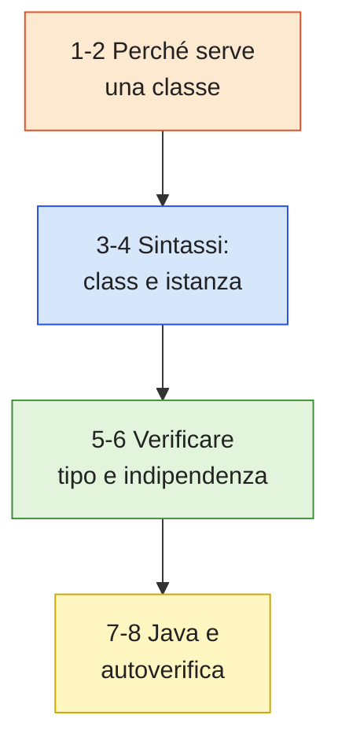
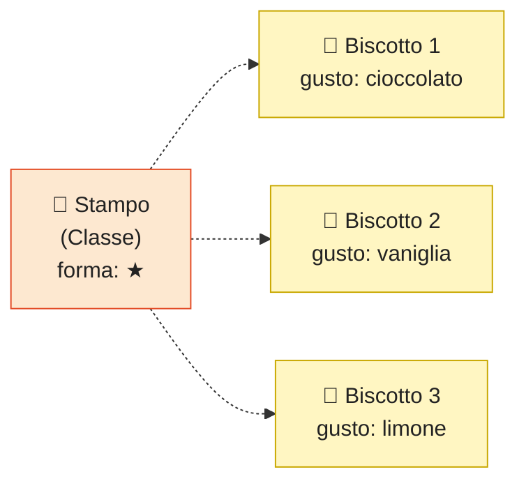
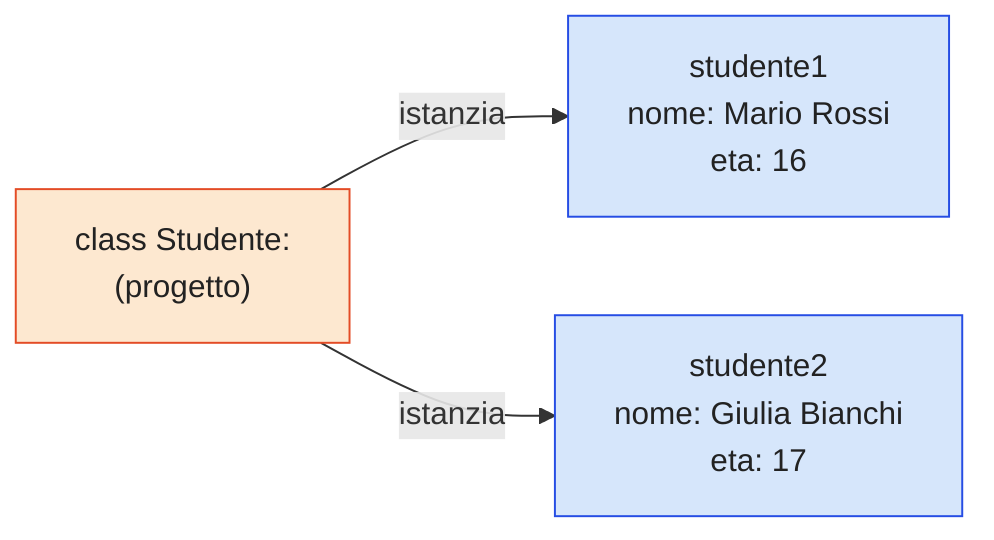
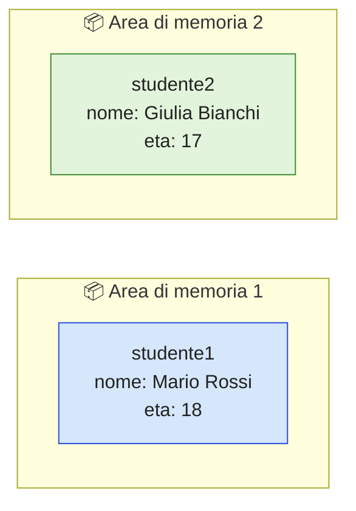
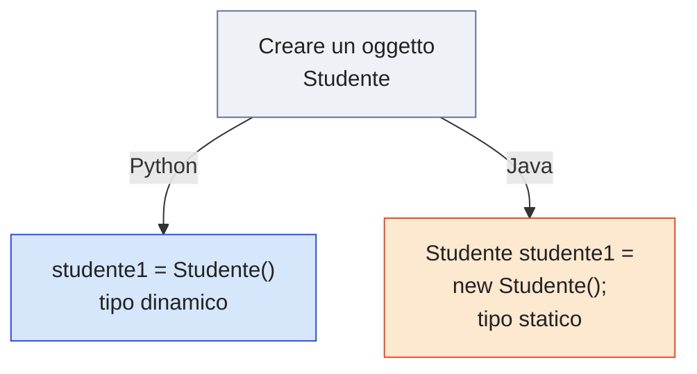

# 🧩 Modulo 2 — Classi e Oggetti: Il Progetto e l'Istanza

- **Corso:** OOP Explorer — Programmazione ad Oggetti con Python e Java
- **Piattaforma:** GCProf Academy
- **Livello:** 🟢 Base (Fase 1 — Le Fondamenta dell'OOP)
- **Target:** Studenti del triennio delle superiori (indirizzo tecnico, finanza e marketing, relazioni internazionali), docenti, appassionati
- **Prerequisiti:** Modulo 1 (Pensare a Oggetti), conoscenza base di Python (variabili, funzioni)
- **Obiettivo Didattico:** Comprendere la differenza tra classe e oggetto, scrivere le prime classi in Python con la parola chiave `class`, istanziare oggetti, verificarne tipo e indipendenza, e riconoscere lo stesso concetto nella sintassi Java.



*📊 Il percorso del Modulo 2: dal problema dei dizionari sparsi alla classe in Java.*

---

<a id="indice"></a>
# 📑 Indice del Modulo 2

1. [Capitolo 1 — Dal Bisogno alla Soluzione: perché serve una "classe"](#capitolo-1)
2. [Capitolo 2 — La Classe: il progetto di un oggetto](#capitolo-2)
3. [Capitolo 3 — La Sintassi in Python: la parola chiave `class`](#capitolo-3)
4. [Capitolo 4 — L'Oggetto: istanziare una classe](#capitolo-4)
5. [Capitolo 5 — Verificare Tipo e Identità: `type()` e `isinstance()`](#capitolo-5)
6. [Capitolo 6 — Indipendenza degli Oggetti: ogni istanza vive di vita propria](#capitolo-6)
7. [Capitolo 7 — Classi e Oggetti in Java: un primo sguardo](#capitolo-7)
8. [Capitolo 8 — Sintesi, Laboratorio e Autoverifica](#capitolo-8)

---

<a id="capitolo-1"></a>
## 1. Capitolo 1 — Dal Bisogno alla Soluzione: perché serve una "classe"

Nel Modulo 1 hai visto che l'esigenza dell'OOP nasce quando i dati e le funzioni che li elaborano, tenuti separati, diventano difficili da gestire. Ma c'è un secondo problema, altrettanto concreto, che l'OOP risolve fin dal primo istante: **come rappresentare, in codice, entità multiple dello stesso tipo?**

Immagina di dover gestire non uno, ma trenta studenti di una classe. Con lo stile che già conosci, dovresti creare trenta dizionari separati, sperando di scrivere sempre le stesse chiavi nello stesso modo:

```python
# ==================== ESEMPIO 2.1: IL PROBLEMA SENZA UNA "CLASSE" ====================
"""
Senza un progetto comune, ogni "studente" è un dizionario scritto a mano.
Nulla garantisce che tutti abbiano la stessa struttura: un errore di battitura
nella chiave (es. "eta" scritto come "età" in un dizionario e non nell'altro)
si scopre solo quando il programma va in crash.
"""
studente_a = {"nome": "Mario Rossi", "eta": 16}
studente_b = {"nome": "Giulia Bianchi", "età": 17}   # <-- chiave diversa per errore!

# print(studente_b["eta"])  # KeyError: 'eta' non esiste in studente_b
```

> ⚠️ **Attenzione** — Questo è lo stesso problema visto nel Modulo 1 con l'Esempio 1.1, qui ancora più evidente: senza un progetto comune, ogni dizionario può avere chiavi leggermente diverse, e l'errore si scopre solo quando il programma va in crash.

Serve un modo per dire, una sola volta, "**ogni Studente avrà sempre queste caratteristiche, garantite**", e poi creare quanti studenti servono a partire da quel progetto unico. Questo "progetto" è esattamente ciò che in OOP si chiama **classe**.

[🔙 Torna all'indice](#indice)

---

<a id="capitolo-2"></a>
## 2. Capitolo 2 — La Classe: il progetto di un oggetto

Una **classe** è un modello — un progetto, uno stampo — che definisce:

* **quali dati (attributi)** avrà ogni oggetto creato a partire da essa;
* **quali azioni (metodi)** ogni oggetto potrà compiere.

### 🍪 L'Analogia dello Stampo per Biscotti



*📊 Un solo stampo (la classe) genera infiniti biscotti (gli oggetti): stessa forma, gusto diverso.*

* Lo **stampo** (la classe) definisce la forma del biscotto — non è un biscotto vero, è solo il progetto.
* Ogni **biscotto** realizzato con quello stampo (l'oggetto) ha quella forma, ma può avere un gusto diverso dagli altri.
* Dallo stesso stampo puoi creare **infiniti biscotti**, tutti diversi nei dettagli ma identici nella struttura.

### Terminologia essenziale

| Termine | Significato | Esempio |
| :--- | :--- | :--- |
| **Classe** | Il progetto/modello | `Automobile` |
| **Oggetto** (o **Istanza**) | La realizzazione concreta del progetto | "la mia Fiat 500 rossa" |
| **Istanziare** | L'atto di creare un oggetto a partire da una classe | `Automobile()` |

> 💡 **Approfondimento** — "Oggetto" e "istanza" sono, nella pratica, sinonimi: si dice indifferentemente "lo studente1 è un oggetto" oppure "studente1 è un'istanza della classe Studente".

[🔙 Torna all'indice](#indice)

---

<a id="capitolo-3"></a>
## 3. Capitolo 3 — La Sintassi in Python: la parola chiave `class`

In Python, una classe si definisce con la parola chiave `class`, seguita dal nome della classe (per convenzione, sempre con l'iniziale maiuscola) e dai due punti:

```python
# ==================== ESEMPIO 2.2: LA PRIMA CLASSE IN PYTHON ====================
"""
Definiamo la classe Studente: per ora è solo un "guscio vuoto",
il progetto senza ancora attributi né metodi (li aggiungeremo nel Modulo 3
con il costruttore __init__). 'pass' dice a Python "questo blocco è vuoto,
ma è valido: non fare nulla".
"""

class Studente:
    """
    Classe che rappresenta uno studente.
    Al momento è vuota: la completeremo nel Modulo 3.
    """
    pass    # segnaposto: la classe non ha ancora contenuto
```

Nota bene: `Studente` da sola **non è un oggetto**. È il progetto. Non contiene ancora nessuno studente reale: definisce soltanto che, da questo momento, "Studente" è un nuovo tipo di dato che Python conosce, esattamente come conosce `int`, `str` o `list`.

> ⚠️ **Attenzione** — Per convenzione, il nome di una classe si scrive sempre con l'iniziale maiuscola e senza underscore (`Studente`, non `studente` né `studente_classe`): è una regola non obbligatoria per Python, ma seguita da qualsiasi programmatore, e ti aiuterà a distinguere a colpo d'occhio una classe da una variabile.

[🔙 Torna all'indice](#indice)

---

<a id="capitolo-4"></a>
## 4. Capitolo 4 — L'Oggetto: istanziare una classe

Per ottenere un oggetto concreto a partire da una classe, si **istanzia** la classe chiamandola come se fosse una funzione, con le parentesi tonde:

```python
# ==================== ESEMPIO 2.3: ISTANZIARE OGGETTI ====================
"""
Creiamo due oggetti (istanze) a partire dalla stessa classe Studente.
In Python, dopo aver istanziato un oggetto "vuoto", possiamo assegnargli
attributi dall'esterno con la notazione punto: oggetto.attributo = valore.
(Nel Modulo 3 vedrai il modo corretto e professionale di farlo,
con il costruttore __init__ — qui lo facciamo "a mano" per capire il meccanismo.)
"""

print("=== Creazione di Oggetti ===\n")

# Creiamo il primo studente: Studente() chiama il "progetto" e restituisce un oggetto nuovo
studente1 = Studente()
studente1.nome = "Mario Rossi"
studente1.matricola = "12345"
studente1.eta = 16

print(f"Studente 1: {studente1.nome}, matricola {studente1.matricola}, {studente1.eta} anni")

# Creiamo un secondo studente: è un oggetto COMPLETAMENTE DIVERSO dal primo
studente2 = Studente()
studente2.nome = "Giulia Bianchi"
studente2.matricola = "54321"
studente2.eta = 17

print(f"Studente 2: {studente2.nome}, matricola {studente2.matricola}, {studente2.eta} anni")
```

> 💡 **Approfondimento** — Assegnare gli attributi "a mano" dopo aver creato l'oggetto (come qui) funziona, ma è scomodo e rischioso: niente impedisce di dimenticarsi un attributo su uno dei due studenti. Nel Modulo 3 vedrai il costruttore `__init__`, il modo corretto per garantire che ogni oggetto nasca già completo.



*📊 Un solo progetto, due oggetti indipendenti in memoria.*

[🔙 Torna all'indice](#indice)

---

<a id="capitolo-5"></a>
## 5. Capitolo 5 — Verificare Tipo e Identità: `type()` e `isinstance()`

Python mette a disposizione due strumenti per interrogare un oggetto sulla propria natura:

* **`type(oggetto)`** restituisce la classe a cui l'oggetto appartiene.
* **`isinstance(oggetto, Classe)`** restituisce `True` o `False`, verificando se un oggetto è un'istanza di una determinata classe.

```python
# ==================== ESEMPIO 2.4: TYPE() E ISINSTANCE() ====================
"""
Interroghiamo studente1 (creato nel Capitolo 4) sulla sua natura.
Questi strumenti sono preziosi soprattutto quando il codice cresce
e non è più immediato "a occhio" sapere di che classe è un oggetto.
"""

print(f"Tipo di studente1: {type(studente1)}")
# Output: <class '__main__.Studente'>

print(f"studente1 è un'istanza di Studente? {isinstance(studente1, Studente)}")
# Output: True

print(f"studente1 è un'istanza di int? {isinstance(studente1, int)}")
# Output: False — uno Studente non è un numero intero!
```

> ⚠️ **Attenzione** — `type(oggetto) == Classe` e `isinstance(oggetto, Classe)` sembrano equivalenti, ma non lo sono sempre: `isinstance()` riconosce come vera anche l'appartenenza a una sottoclasse (concetto che approfondirai con l'Ereditarietà, Modulo 5), mentre `type()` no. Per questo motivo `isinstance()` è, in genere, la scelta preferita.

*Perché ti serve: nei moduli successivi, quando lavorerai con gerarchie di classi (Ereditarietà, Modulo 5), `isinstance()` diventerà uno strumento chiave per scrivere codice che si comporta correttamente a seconda del tipo di oggetto che riceve.*

[🔙 Torna all'indice](#indice)

---

<a id="capitolo-6"></a>
## 6. Capitolo 6 — Indipendenza degli Oggetti: ogni istanza vive di vita propria

Il punto concettualmente più importante di questo modulo: **due oggetti creati dalla stessa classe sono entità completamente separate in memoria**. Modificare l'uno non ha alcun effetto sull'altro.

```python
# ==================== ESEMPIO 2.5: L'INDIPENDENZA DEGLI OGGETTI ====================
"""
Dimostriamo che studente1 e studente2 (creati nel Capitolo 4)
NON sono lo stesso oggetto, e che modificarne uno non tocca l'altro.
L'operatore 'is' verifica l'identità (sono la STESSA cella di memoria?),
diverso da '==' che verifica l'uguaglianza dei valori.
"""

# IMPORTANTE: studente1 e studente2 sono OGGETTI DIVERSI
print(f"studente1 e studente2 sono lo stesso oggetto? {studente1 is studente2}")
# Output: False

# Modifichiamo SOLO studente1
studente1.eta = 18

print(f"\nDopo aver modificato studente1.eta:")
print(f"Età studente1: {studente1.eta}")   # 18 — è cambiata
print(f"Età studente2: {studente2.eta}")   # 17 — NON è cambiata!
```



*📊 Aree di memoria separate: modificare studente1 non tocca in alcun modo studente2.*

Questo comportamento è ciò che rende l'OOP affidabile su larga scala: puoi creare centinaia di oggetti dalla stessa classe con la certezza matematica che restino indipendenti, a meno che tu stesso non li colleghi esplicitamente.

[🔙 Torna all'indice](#indice)

---

<a id="capitolo-7"></a>
## 7. Capitolo 7 — Classi e Oggetti in Java: un primo sguardo

Lo stesso identico concetto — classe come progetto, oggetto come istanza — esiste in **ogni** linguaggio a oggetti, Java compreso. Cambia la sintassi, non l'idea. Approfondirai Java nel dettaglio nel Modulo 11; qui vediamo solo un primo confronto diretto.

```java
// ==================== ESEMPIO 2.6: LA CLASSE STUDENTE IN JAVA ====================
/*
 * Stessa classe dell'Esempio 2.2/2.3, scritta in Java.
 * Nota le differenze principali rispetto a Python, evidenziate nei commenti.
 */

// Definizione della classe Studente
class Studente {
    // In Java gli attributi vanno dichiarati con un TIPO esplicito
    public String nome;
    public String matricola;
    public int eta;
}

// Classe principale per eseguire il programma
public class Main {
    public static void main(String[] args) {

        // 'new' è la parola chiave che crea l'oggetto (equivale a Studente() in Python)
        Studente studente1 = new Studente();
        studente1.nome = "Mario Rossi";
        studente1.matricola = "12345";
        studente1.eta = 16;

        System.out.println("Studente 1: " + studente1.nome +
                            ", matricola " + studente1.matricola +
                            ", " + studente1.eta + " anni");
    }
}
```

### Confronto diretto Python ↔ Java

| Aspetto | Python | Java |
| :--- | :--- | :--- |
| Dichiarazione classe | `class Studente:` | `class Studente { ... }` |
| Creazione oggetto | `studente1 = Studente()` | `Studente studente1 = new Studente();` |
| Tipo degli attributi | Non dichiarato, dinamico | Dichiarato esplicitamente (es. `String`, `int`) |
| Parola chiave di creazione | Nessuna (si chiama la classe) | `new` |
| Verifica del tipo | `type(studente1)` / `isinstance()` | `studente1.getClass().getName()` |

In Python il tipo di ogni attributo è **dinamico** (deciso al volo, in base al valore assegnato); in Java è **statico** (dichiarato una volta per tutte e mai cambiato). È una differenza filosofica che ritroverai in tutto il resto del corso.



*📊 Stessa idea, due sintassi: Python non richiede `new` e non dichiara i tipi, Java sì.*

[🔙 Torna all'indice](#indice)

---

<a id="capitolo-8"></a>
## 8. Capitolo 8 — Sintesi, Laboratorio e Autoverifica

### 💡 Punti Chiave del Modulo 2

1. Una **classe** è un progetto/stampo che definisce attributi e metodi comuni a tutti gli oggetti creati da essa.
2. Un **oggetto** (o istanza) è la realizzazione concreta di una classe, con valori propri per ogni attributo.
3. In Python una classe si definisce con `class NomeClasse:` e si istanzia chiamandola come una funzione: `NomeClasse()`.
4. `type()` restituisce la classe di un oggetto; `isinstance()` verifica se un oggetto appartiene a una determinata classe.
5. Due oggetti della stessa classe sono **sempre indipendenti**: modificare l'uno non modifica l'altro.
6. In Java lo stesso concetto si esprime con una sintassi tipizzata e con la parola chiave `new` per creare un oggetto.

---

### 🧪 Laboratorio Pratico: "La Classe Rettangolo"

**Obiettivo:** Applicare da soli classe, istanziazione e verifica del tipo su Google Colab.

1. Definisci una classe vuota `Rettangolo` (usa `pass`, come nell'Esempio 2.2).
2. Crea due oggetti, `rett1` e `rett2`, e assegna a ciascuno gli attributi `base` e `altezza` con valori a tua scelta.
3. Stampa `type(rett1)` e verifica con `isinstance()` che `rett1` sia un'istanza di `Rettangolo`.
4. Modifica `base` di `rett1` e dimostra, stampando entrambi gli oggetti, che `rett2` non ne risente.
5. **Sfida finale:** prova a scrivere, in un commento, come faresti a calcolare l'area del rettangolo — non serve implementarla ora: la vera soluzione (i **metodi**) arriva nel Modulo 3.

*Suggerimento:* riusa esattamente la struttura degli Esempi 2.3 e 2.5 di questo modulo, cambiando solo il nome della classe e degli attributi.

---

### ❓ Quiz di Autoverifica

**Domanda 1:** Cosa rappresenta, correttamente, una classe in Python?
- A) Un oggetto già pronto all'uso
- B) Un progetto/modello che definisce attributi e metodi comuni a più oggetti
- C) Una funzione che restituisce sempre un numero
- D) Un tipo di ciclo `for` speciale

**Domanda 2:** Quale istruzione crea correttamente un oggetto a partire dalla classe `Automobile`?
- A) `Automobile.new()`
- B) `new Automobile()`
- C) `Automobile()`
- D) `class Automobile()`

**Domanda 3:** Se `a = Automobile()` e `b = Automobile()`, cosa restituisce `a is b`?
- A) `True`, perché sono create dalla stessa classe
- B) `False`, perché sono due oggetti indipendenti in memoria
- C) Un errore, perché il confronto non è permesso tra oggetti
- D) Dipende dagli attributi assegnati

**Domanda 4:** Qual è la differenza principale, evidenziata nel Capitolo 7, tra la dichiarazione di un attributo in Python e in Java?
- A) In Python bisogna sempre usare `new`, in Java no
- B) In Java il tipo dell'attributo va dichiarato esplicitamente, in Python è dinamico
- C) In Java non esistono le classi
- D) Non c'è nessuna differenza reale tra i due linguaggi

---

[🔙 Torna all'indice](#indice)