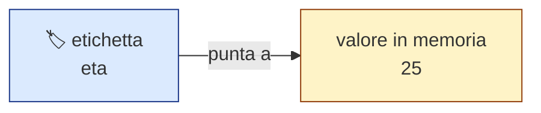
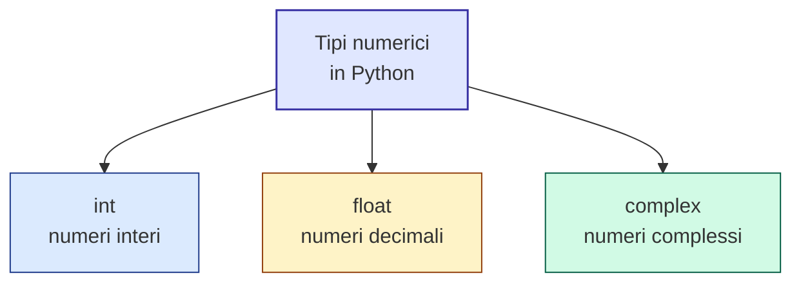
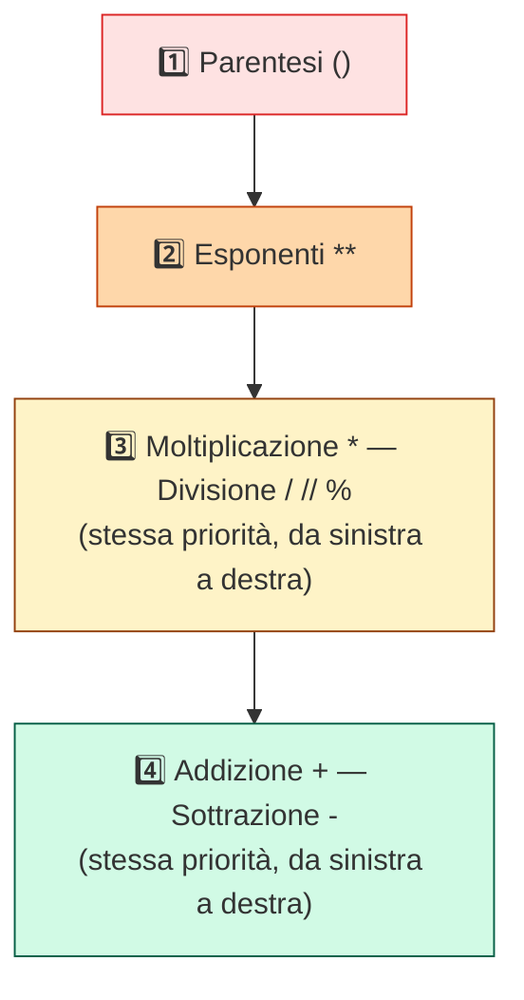
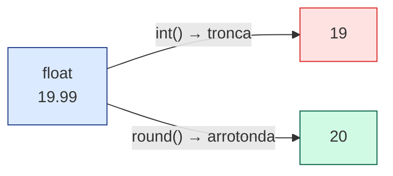

# 🐍 Modulo 2 — Variabili, Tipi di Dato e Operatori Aritmetici

- **Corso:** Python Master — Dalle Basi al Mondo Reale
- **Piattaforma:** GCProf Academy
- **Livello:** 🟢 Base (Fase 1 — Le Fondamenta del Linguaggio)
- **Target:** Studenti del triennio delle superiori (indirizzo tecnico, finanza e marketing, relazioni internazionali), docenti, appassionati
- **Prerequisiti:** Modulo 1 (uso base di Google Colab, `print()`, commenti)
- **Obiettivo Didattico:** Dichiarare variabili con nomi significativi, distinguere e usare correttamente i tipi numerici, eseguire calcoli applicando la corretta precedenza degli operatori e convertire in sicurezza tra tipi diversi.

---

<a id="indice"></a>
# 📑 Indice del Modulo 2

1. [Capitolo 1 — Le Variabili: Etichette per i Dati](#capitolo-1)
2. [Capitolo 2 — I Tipi Numerici: int, float e complex](#capitolo-2)
3. [Capitolo 3 — Operatori Aritmetici e Precedenza (PEMDAS)](#capitolo-3)
4. [Capitolo 4 — Operatori di Confronto](#capitolo-4)
5. [Capitolo 5 — Operatori di Assegnazione Combinata](#capitolo-5)
6. [Capitolo 6 — Conversioni tra Tipi Numerici](#capitolo-6)
7. [Capitolo 7 — Il Modulo `math`](#capitolo-7)
8. [Capitolo 8 — Sintesi, Laboratorio e Autoverifica](#capitolo-8)

---

<a id="capitolo-1"></a>
## 1. Capitolo 1 — Le Variabili: Etichette per i Dati

Una **variabile** è un nome che assegniamo a un valore memorizzato dal programma, in modo da poterlo richiamare e riutilizzare in seguito senza doverlo riscrivere ogni volta.

### 🏷️ L'Analogia dell'Etichetta



*La variabile NON è la "scatola" che contiene il dato: è l'ETICHETTA che ci permette di ritrovarlo e usarlo.*

In Python, una variabile si crea semplicemente **assegnandole un valore** con l'operatore `=`: non serve dichiararne il tipo (lo abbiamo visto nel Modulo 1 parlando di tipizzazione dinamica).

```python
# ==================== ESEMPIO 2.1: CREARE VARIABILI ====================
"""
L'operatore = non significa "è uguale a" (come in matematica), ma
"assegna il valore a destra alla variabile a sinistra".
"""

eta = 25            # creiamo la variabile 'eta' e le assegniamo il valore 25
nome_studente = "Giulia"  # creiamo la variabile 'nome_studente'

print(eta)             # 25
print(nome_studente)   # Giulia

eta = 26                # riassegnamo un nuovo valore alla STESSA variabile
print(eta)              # 26 -> il valore precedente (25) è stato sovrascritto
```

### Le Regole per i Nomi delle Variabili

| Regola | Esempio corretto | Esempio SCORRETTO |
| :--- | :--- | :--- |
| Può contenere lettere, numeri e underscore `_` | `voto_finale`, `alunno2` | — |
| Non può iniziare con un numero | `anno_2024` | `2024_anno` ❌ |
| Non può contenere spazi | `prezzo_totale` | `prezzo totale` ❌ |
| Case-sensitive: maiuscole/minuscole contano | `Eta` e `eta` sono **due variabili diverse** | — |
| Non può usare parole riservate di Python | `totale`, `somma` | `class`, `if`, `for` ❌ |

💡 **Best Practice:** in Python si usa la convenzione **snake_case** per i nomi di variabile: parole minuscole separate da underscore (es. `saldo_conto`, `numero_tentativi`). Preferisci sempre nomi **descrittivi** (`prezzo_totale` è molto meglio di `x` o `p`): il codice si scrive una volta ma si rilegge molte volte, e un buon nome vale più di dieci commenti.

[🔙 Torna all'indice](#indice)

---

<a id="capitolo-2"></a>
## 2. Capitolo 2 — I Tipi Numerici: int, float e complex

Python mette a disposizione tre tipi numerici predefiniti:

| Tipo | Rappresenta | Esempio |
| :--- | :--- | :--- |
| `int` | Numeri interi, positivi o negativi, senza limite di grandezza (in Python) | `7`, `-42`, `1000000` |
| `float` | Numeri decimali (a virgola mobile) | `3.14`, `-0.5`, `2.0` |
| `complex` | Numeri complessi (parte reale + parte immaginaria) — uso raro nella programmazione didattica, ma utile in ambito scientifico | `2 + 3j` |



```python
# ==================== ESEMPIO 2.2: RICONOSCERE I TIPI NUMERICI ====================
"""
La funzione type() ci dice sempre, con certezza, il tipo di una variabile
nell'istante in cui viene interrogata.
"""

anno_nascita = 2008          # int
media_voti = 7.85            # float
numero_complesso = 2 + 3j    # complex

print(type(anno_nascita))    # <class 'int'>
print(type(media_voti))      # <class 'float'>
print(type(numero_complesso))# <class 'complex'>
```

⚠️ **Attenzione:** anche se il valore è "intero" nel senso matematico, scrivere `7.0` invece di `7` crea comunque un `float`, non un `int`. È la presenza del punto decimale nel codice sorgente (o il risultato di un'operazione che lo produce) a determinare il tipo.

[🔙 Torna all'indice](#indice)

---

<a id="capitolo-3"></a>
## 3. Capitolo 3 — Operatori Aritmetici e Precedenza (PEMDAS)

Python supporta tutti i classici operatori aritmetici, più due operatori "speciali" molto usati nella programmazione.

| Operatore | Significato | Esempio | Risultato |
| :--- | :--- | :--- | :--- |
| `+` | Addizione | `5 + 2` | `7` |
| `-` | Sottrazione | `5 - 2` | `3` |
| `*` | Moltiplicazione | `5 * 2` | `10` |
| `/` | Divisione (restituisce **sempre** un `float`) | `5 / 2` | `2.5` |
| `//` | Divisione intera (parte intera del quoziente) | `5 // 2` | `2` |
| `%` | Modulo (resto della divisione intera) | `5 % 2` | `1` |
| `**` | Elevamento a potenza | `5 ** 2` | `25` |

```python
# ==================== ESEMPIO 2.3: OPERATORI ARITMETICI ====================
"""
Nota la differenza fondamentale tra / e //: la prima dà sempre un risultato
decimale, la seconda scarta la parte decimale e restituisce un intero
(o comunque la 'parte intera' del risultato).
"""

a = 17
b = 5

print(a / b)    # 3.4   -> divisione "normale"
print(a // b)   # 3     -> divisione intera: quante volte 5 entra in 17
print(a % b)    # 2     -> il resto: 17 = (5 * 3) + 2
print(a ** 2)   # 289   -> 17 elevato al quadrato
```

### La Precedenza degli Operatori (PEMDAS)

Come in matematica, anche in Python gli operatori hanno una **precedenza**: alcune operazioni vengono eseguite prima di altre, secondo la regola mnemonica **PEMDAS**:



```python
# ==================== ESEMPIO 2.4: PRECEDENZA DEGLI OPERATORI ====================
"""
Senza parentesi, Python calcola PRIMA la moltiplicazione e POI la somma,
esattamente come faresti a mano seguendo le regole matematiche standard.
"""

risultato = 2 + 3 * 4
print(risultato)         # 14, non 20: prima 3*4=12, poi 2+12=14

risultato_con_parentesi = (2 + 3) * 4
print(risultato_con_parentesi)   # 20: le parentesi forzano l'ordine di calcolo
```

💡 **Best Practice:** anche quando la precedenza "di default" darebbe il risultato corretto, usare le parentesi per rendere esplicito l'ordine di calcolo migliora sempre la leggibilità del codice, specialmente in espressioni lunghe.

[🔙 Torna all'indice](#indice)

---

<a id="capitolo-4"></a>
## 4. Capitolo 4 — Operatori di Confronto

Gli **operatori di confronto** confrontano due valori e restituiscono sempre un valore booleano: `True` o `False`. Li useremo moltissimo a partire dal Modulo 5, quando parleremo di strutture di controllo (`if`).

| Operatore | Significato | Esempio | Risultato |
| :--- | :--- | :--- | :--- |
| `==` | Uguale a | `5 == 5` | `True` |
| `!=` | Diverso da | `5 != 3` | `True` |
| `>` | Maggiore di | `7 > 10` | `False` |
| `<` | Minore di | `7 < 10` | `True` |
| `>=` | Maggiore o uguale a | `10 >= 10` | `True` |
| `<=` | Minore o uguale a | `9 <= 8` | `False` |

```python
# ==================== ESEMPIO 2.5: OPERATORI DI CONFRONTO ====================
"""
ATTENZIONE: '==' (confronto) e '=' (assegnazione) sono due operatori
completamente diversi. Confonderli è l'errore più comune per chi inizia.
"""

eta = 17

print(eta == 18)   # False -> stiamo CHIEDENDO se eta è uguale a 18
print(eta != 18)   # True  -> stiamo chiedendo se eta è DIVERSA da 18
print(eta >= 16)   # True  -> eta è maggiore o uguale a 16
```

[🔙 Torna all'indice](#indice)

---

<a id="capitolo-5"></a>
## 5. Capitolo 5 — Operatori di Assegnazione Combinata

Quando dobbiamo **modificare** il valore di una variabile in base al suo valore attuale (es. "aumenta il punteggio di 10"), Python offre una scorciatoia molto usata: gli **operatori di assegnazione combinata**.

| Operatore | Equivale a | Esempio |
| :--- | :--- | :--- |
| `+=` | `x = x + valore` | `punteggio += 10` |
| `-=` | `x = x - valore` | `vite -= 1` |
| `*=` | `x = x * valore` | `totale *= 2` |
| `/=` | `x = x / valore` | `media /= 3` |

```python
# ==================== ESEMPIO 2.6: ASSEGNAZIONE COMBINATA ====================
"""
punteggio += 10 è identico, nel risultato, a scrivere punteggio = punteggio + 10,
ma è più corto e più immediato da leggere: 'aggiungi 10 a punteggio'.
"""

punteggio = 0
print(punteggio)      # 0

punteggio += 10       # equivale a: punteggio = punteggio + 10
print(punteggio)      # 10

punteggio += 5
print(punteggio)      # 15

vite = 3
vite -= 1              # equivale a: vite = vite - 1
print(vite)             # 2
```

[🔙 Torna all'indice](#indice)

---

<a id="capitolo-6"></a>
## 6. Capitolo 6 — Conversioni tra Tipi Numerici

A volte serve trasformare un valore da un tipo numerico a un altro: Python mette a disposizione le funzioni `int()` e `float()` per farlo in modo esplicito e controllato.

```python
# ==================== ESEMPIO 2.7: CONVERSIONI ESPLICITE ====================
"""
int() 'tronca' la parte decimale (NON arrotonda: 7.9 diventa 7, non 8).
float() aggiunge semplicemente '.0' a un numero intero.
"""

prezzo = 19.99

prezzo_intero = int(prezzo)     # 19  -> attenzione: TRONCA, non arrotonda
print(prezzo_intero)

quantita = 5
quantita_decimale = float(quantita)   # 5.0
print(quantita_decimale)

# round() invece ARROTONDA correttamente al più vicino
print(round(prezzo))            # 20  -> arrotondamento matematico corretto
print(round(prezzo, 1))         # 20.0 (con 1 cifra decimale) -> 20.0
```



⚠️ **Errore comune:** confondere `int()` con `round()`. `int(7.9)` restituisce `7` (tronca semplicemente la parte decimale), mentre `round(7.9)` restituisce `8` (arrotonda al valore più vicino). Se ti serve un arrotondamento "corretto", usa sempre `round()`.

Esiste anche un caso di **conversione implicita** (automatica), che avviene quando Python combina tra loro tipi diversi in una stessa operazione:

```python
# ==================== ESEMPIO 2.8: CONVERSIONE IMPLICITA ====================
"""
Quando un int e un float compaiono nella stessa operazione, Python
converte automaticamente l'int in float, per non perdere precisione.
"""

interi_piu_decimali = 5 + 2.5
print(interi_piu_decimali)          # 7.5
print(type(interi_piu_decimali))    # <class 'float'> -> il risultato è "salito" a float
```

[🔙 Torna all'indice](#indice)

---

<a id="capitolo-7"></a>
## 7. Capitolo 7 — Il Modulo `math`

Per operazioni matematiche più avanzate (radice quadrata, arrotondamenti particolari, costanti come π), Python mette a disposizione il **modulo `math`**, parte della sua libreria standard. Per usarlo, va prima importato con `import math` (approfondiremo il meccanismo degli import nel Modulo 13).

```python
# ==================== ESEMPIO 2.9: IL MODULO math ====================
"""
import math rende disponibili tutte le funzioni e le costanti del modulo,
richiamabili con la sintassi math.nome_funzione(...).
"""

import math

print(math.sqrt(16))     # 4.0   -> radice quadrata
print(math.pi)           # 3.141592653589793 -> la costante pi greco
print(math.floor(7.9))   # 7     -> arrotonda sempre per difetto
print(math.ceil(7.1))    # 8     -> arrotonda sempre per eccesso
print(math.pow(2, 3))    # 8.0   -> equivalente a 2 ** 3, ma restituisce sempre un float
```

| Funzione/Costante | Descrizione |
| :--- | :--- |
| `math.sqrt(x)` | Radice quadrata di `x` |
| `math.pi` | La costante π |
| `math.floor(x)` | Arrotonda per difetto (verso il basso) |
| `math.ceil(x)` | Arrotonda per eccesso (verso l'alto) |
| `math.pow(x, y)` | `x` elevato a `y`, restituito come `float` |

[🔙 Torna all'indice](#indice)

---

<a id="capitolo-8"></a>
## 8. Capitolo 8 — Sintesi, Laboratorio e Autoverifica

### 💡 Punti Chiave del Modulo 2

1. Una **variabile** è un'etichetta assegnata a un valore con l'operatore `=`; i nomi seguono la convenzione **snake_case** e devono essere descrittivi.
2. Python offre tre tipi numerici: `int` (interi), `float` (decimali) e `complex` (numeri complessi).
3. Gli **operatori aritmetici** (`+ - * / // % **`) seguono la precedenza **PEMDAS**; `/` restituisce sempre un `float`, `//` restituisce la divisione intera, `%` il resto.
4. Gli **operatori di confronto** (`== != > < >= <=`) restituiscono sempre un booleano; `==` non va confuso con `=`.
5. Gli **operatori di assegnazione combinata** (`+= -= *= /=`) sono scorciatoie per modificare una variabile in base al suo valore attuale.
6. `int()` e `float()` convertono esplicitamente tra tipi (attenzione: `int()` **tronca**, non arrotonda; per arrotondare si usa `round()`).
7. Il **modulo `math`** (da importare con `import math`) offre funzioni matematiche avanzate come `sqrt()`, `floor()`, `ceil()` e la costante `pi`.

---

### 🧪 Laboratorio Pratico: "Il Calcolatore da Scontrino"

**Obiettivo:** Applicare variabili, tipi numerici, operatori aritmetici e conversioni per risolvere un piccolo problema realistico.

1. Crea tre variabili che rappresentino il prezzo di tre prodotti diversi (usa valori `float`, es. `12.50`, `7.90`, `3.20`).
2. Calcola il **totale** sommando i tre prezzi e stampalo.
3. Applica uno **sconto del 10%** al totale (suggerimento: moltiplica il totale per `0.9`) e stampa il nuovo totale scontato.
4. Usando `round()`, stampa il totale scontato arrotondato a **2 cifre decimali**.
5. Calcola quante "monete da 5 euro" servono per coprire almeno il totale scontato, usando l'operatore `//` sul totale arrotondato (es. `math.ceil(totale / 5)`), e stampa il risultato.
6. **Sfida finale:** aggiungi una quarta variabile che rappresenti la quantità acquistata di uno dei prodotti (un `int`), e usa l'operatore `*=` per aggiornare il totale moltiplicandolo per quella quantità.

*Suggerimento:* riusa la struttura degli Esempi 2.3, 2.7 e 2.9 di questo modulo.

---

### ❓ Quiz di Autoverifica

**Domanda 1:** Qual è il risultato di `17 // 5` in Python?
- A) `3.4`
- B) `2`
- C) `3`
- D) `2.5`

**Domanda 2:** Qual è il risultato di `2 + 3 * 4` in Python, seguendo la precedenza degli operatori?
- A) `20`
- B) `14`
- C) `24`
- D) Un errore, perché mancano le parentesi

**Domanda 3:** Cosa fa esattamente l'istruzione `punteggio += 5`?
- A) Confronta `punteggio` con `5`
- B) Crea una nuova variabile chiamata `+=`
- C) Assegna il valore `5` a `punteggio`, cancellando il valore precedente
- D) Aggiorna `punteggio` sommandogli `5`, equivalente a `punteggio = punteggio + 5`

**Domanda 4:** Qual è la differenza tra `int(7.9)` e `round(7.9)`?
- A) Sono identici: restituiscono entrambi `8`
- B) `int(7.9)` restituisce `7` (tronca), `round(7.9)` restituisce `8` (arrotonda)
- C) `int(7.9)` restituisce `8`, `round(7.9)` restituisce `7`
- D) `int(7.9)` genera sempre un errore

---

[🔙 Torna all'indice](#indice)