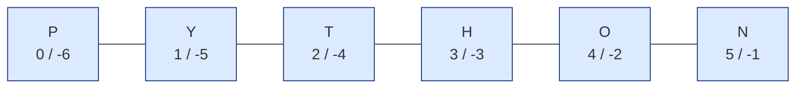
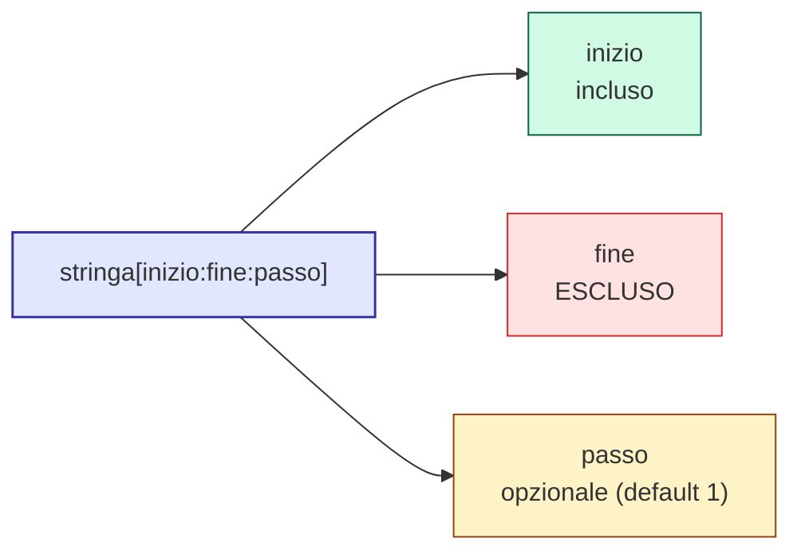
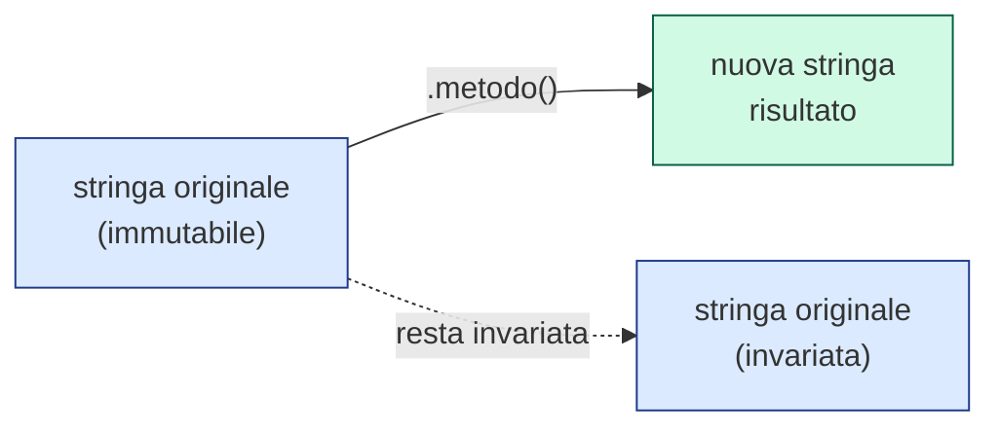

# 🐍 Modulo 3 — Stringhe: Manipolazione e Formattazione del Testo

- **Corso:** Python Master — Dalle Basi al Mondo Reale
- **Piattaforma:** GCProf Academy
- **Livello:** 🟢 Base (Fase 1 — Le Fondamenta del Linguaggio)
- **Target:** Studenti del triennio delle superiori (indirizzo tecnico, finanza e marketing, relazioni internazionali), docenti, appassionati
- **Prerequisiti:** Modulo 1 (Colab, `print()`), Modulo 2 (variabili, tipi di dato)
- **Obiettivo Didattico:** Manipolare testo con sicurezza, estrarre porzioni di stringa con lo slicing e formattare output leggibili con le f-string.

---

<a id="indice"></a>
# 📑 Indice del Modulo 3

1. [Capitolo 1 — Cos'è una Stringa e Come si Crea](#capitolo-1)
2. [Capitolo 2 — Indicizzazione: Accedere ai Singoli Caratteri](#capitolo-2)
3. [Capitolo 3 — Slicing: Estrarre Porzioni di Stringa](#capitolo-3)
4. [Capitolo 4 — I Metodi Principali delle Stringhe](#capitolo-4)
5. [Capitolo 5 — Le f-string: la Formattazione Moderna](#capitolo-5)
6. [Capitolo 6 — Stringhe Multilinea e Caratteri di Escape](#capitolo-6)
7. [Capitolo 7 — Errori Comuni con le Stringhe](#capitolo-7)
8. [Capitolo 8 — Sintesi, Laboratorio e Autoverifica](#capitolo-8)

---

<a id="capitolo-1"></a>
## 1. Capitolo 1 — Cos'è una Stringa e Come si Crea

Una **stringa** (`str`) è una sequenza di caratteri — lettere, numeri, simboli, spazi — racchiusa tra virgolette. È il tipo di dato che userai più spesso in assoluto: nomi, messaggi, indirizzi, risposte dell'utente sono quasi sempre stringhe.

```python
# ==================== ESEMPIO 3.1: CREARE STRINGHE ====================
"""
Python accetta indifferentemente virgolette singole ' o doppie ":
la scelta è una questione di stile, purché sia coerente all'interno
dello stesso progetto. Le doppie sono utili quando il testo contiene
un apostrofo.
"""

citta = "Milano"           # virgolette doppie
nazione = 'Italia'          # virgolette singole: equivalenti
frase = "L'informatica è affascinante"   # doppie: comodo se il testo contiene un apostrofo

print(citta, nazione, frase)
print(type(citta))          # <class 'str'>
```

### La Concatenazione: Unire Stringhe

```python
# ==================== ESEMPIO 3.2: CONCATENAZIONE CON + ====================
"""
L'operatore + tra stringhe non somma: UNISCE (concatena) il testo.
Attenzione: Python NON aggiunge automaticamente spazi tra le stringhe unite.
"""

nome = "Marco"
cognome = "Bianchi"

nome_completo = nome + " " + cognome   # lo spazio va aggiunto esplicitamente
print(nome_completo)                    # Marco Bianchi

# L'operatore * ripete una stringa un certo numero di volte
separatore = "-" * 20
print(separatore)          # --------------------
```

⚠️ **Attenzione:** `+` tra una stringa e un numero genera sempre un `TypeError`. Se vuoi unire testo e numeri, devi prima convertire il numero in stringa con `str()` (oppure, meglio ancora, usare le f-string che vedremo nel Capitolo 5).

[🔙 Torna all'indice](#indice)

---

<a id="capitolo-2"></a>
## 2. Capitolo 2 — Indicizzazione: Accedere ai Singoli Caratteri

Una stringa è una **sequenza ordinata**: ogni carattere ha una posizione precisa, chiamata **indice**, che parte da **0** (non da 1!).

### 🔢 L'Analogia della Fila Numerata



*Python conta i posti a partire da ZERO, come i posti in fila di un teatro numerati dalla porta d'ingresso. Gli indici negativi (in basso) contano invece a partire dalla fine.*

```python
# ==================== ESEMPIO 3.3: INDICIZZAZIONE ====================
"""
Gli indici negativi contano a partire dalla FINE della stringa:
-1 è sempre l'ultimo carattere, molto comodo per non dover
calcolare la lunghezza della stringa ogni volta.
"""

parola = "PYTHON"

print(parola[0])     # 'P' -> primo carattere (indice 0, non 1!)
print(parola[2])     # 'T' -> terzo carattere
print(parola[-1])    # 'N' -> ultimo carattere
print(parola[-2])    # 'O' -> penultimo carattere
print(len(parola))   # 6   -> len() restituisce la lunghezza della stringa
```

⚠️ **Errore comune:** provare ad accedere a un indice che non esiste (es. `parola[10]` su una stringa di 6 caratteri) genera un `IndexError: string index out of range`.

[🔙 Torna all'indice](#indice)

---

<a id="capitolo-3"></a>
## 3. Capitolo 3 — Slicing: Estrarre Porzioni di Stringa

Lo **slicing** permette di estrarre una "fetta" (sotto-sequenza) di una stringa, specificando un indice di inizio e uno di fine, con la sintassi `stringa[inizio:fine:passo]`.

⚠️ Regola fondamentale: l'indice di **fine è escluso** dal risultato.



```python
# ==================== ESEMPIO 3.4: SLICING BASE ====================
"""
stringa[inizio:fine] restituisce i caratteri dall'indice 'inizio'
FINO ALL'INDICE 'fine' ESCLUSO. Omettere inizio o fine significa
'dall'inizio della stringa' o 'fino alla fine della stringa'.
"""

parola = "PROGRAMMAZIONE"

print(parola[0:4])     # 'PROG'  -> dall'indice 0 al 3 (il 4 è escluso)
print(parola[4:])      # 'RAMMAZIONE' -> dall'indice 4 fino alla fine
print(parola[:4])      # 'PROG'  -> dall'inizio fino all'indice 3
print(parola[-5:])     # 'ZIONE' -> gli ultimi 5 caratteri
```

```python
# ==================== ESEMPIO 3.5: SLICING CON PASSO ====================
"""
Il terzo parametro (passo) indica ogni quanti caratteri prendere un
elemento. Un passo negativo (-1) permette di leggere la stringa
al CONTRARIO: un trucco molto usato per invertire il testo.
"""

parola = "PYTHON"

print(parola[::2])     # 'PTO'    -> un carattere sì e uno no
print(parola[::-1])    # 'NOHTYP' -> l'intera stringa, invertita
```

[🔙 Torna all'indice](#indice)

---

<a id="capitolo-4"></a>
## 4. Capitolo 4 — I Metodi Principali delle Stringhe

Un **metodo** è una funzione "legata" a un oggetto, richiamata con la sintassi `oggetto.metodo()`. Le stringhe ne offrono decine: ecco i più utilizzati nella pratica quotidiana.

| Metodo | Cosa fa | Esempio | Risultato |
| :--- | :--- | :--- | :--- |
| `.upper()` | Converte tutto in maiuscolo | `"ciao".upper()` | `"CIAO"` |
| `.lower()` | Converte tutto in minuscolo | `"CIAO".lower()` | `"ciao"` |
| `.strip()` | Rimuove spazi (o altri caratteri) a inizio/fine | `"  ciao  ".strip()` | `"ciao"` |
| `.split(sep)` | Divide la stringa in una lista, usando `sep` come separatore | `"a,b,c".split(",")` | `['a', 'b', 'c']` |
| `.replace(a, b)` | Sostituisce tutte le occorrenze di `a` con `b` | `"ciao".replace("i", "u")` | `"cuao"` |
| `.join(lista)` | Unisce gli elementi di una lista in un'unica stringa | `"-".join(['a','b','c'])` | `"a-b-c"` |
| `.startswith(x)` | Verifica se la stringa inizia con `x` | `"Python".startswith("Py")` | `True` |
| `.find(x)` | Restituisce l'indice della prima occorrenza di `x` (o `-1` se assente) | `"Python".find("th")` | `2` |

### 🔒 Le stringhe sono immutabili



```python
# ==================== ESEMPIO 3.6: METODI DELLE STRINGHE IN AZIONE ====================
"""
IMPORTANTE: i metodi delle stringhe NON modificano la stringa originale
(le stringhe in Python sono immutabili!). Restituiscono sempre una
NUOVA stringa, che va salvata in una variabile se serve conservarla.
"""

input_utente = "   Mario Rossi   "

pulito = input_utente.strip()          # rimuove gli spazi superflui
print(f"'{pulito}'")                    # 'Mario Rossi'

email = "Mario.Rossi@Scuola.IT"
email_corretta = email.lower()          # normalizza in minuscolo
print(email_corretta)                   # mario.rossi@scuola.it

frase = "Python è fantastico"
parole = frase.split(" ")               # divide la frase in una lista di parole
print(parole)                            # ['Python', 'è', 'fantastico']

ricomposta = "_".join(parole)           # ricompone la lista in una stringa con "_"
print(ricomposta)                        # Python_è_fantastico

# La stringa originale, infatti, non è mai cambiata:
print(input_utente)                      # '   Mario Rossi   ' (invariata!)
```

[🔙 Torna all'indice](#indice)

---

<a id="capitolo-5"></a>
## 5. Capitolo 5 — Le f-string: la Formattazione Moderna

Le **f-string** (*formatted string literals*, introdotte in Python 3.6) sono il modo più moderno, leggibile ed efficiente per inserire il valore di variabili dentro una stringa. Si scrivono anteponendo una `f` alle virgolette, e permettono di inserire espressioni tra parentesi graffe `{}`.

```python
# ==================== ESEMPIO 3.7: LE F-STRING ====================
"""
Dentro le graffe {} di una f-string si può inserire QUALSIASI
espressione Python valida: variabili, calcoli, persino chiamate
a metodi. Python la valuta e ne inserisce il risultato nella stringa.
"""

nome = "Elena"
eta = 17
media = 8.456

# Confronto: il vecchio modo (concatenazione) vs le f-string
vecchio_modo = "Ciao " + nome + ", hai " + str(eta) + " anni"
nuovo_modo = f"Ciao {nome}, hai {eta} anni"

print(vecchio_modo)   # Ciao Elena, hai 17 anni
print(nuovo_modo)     # Ciao Elena, hai 17 anni -> stesso risultato, molto più leggibile

# Le f-string possono contenere ESPRESSIONI, non solo variabili
print(f"L'anno prossimo avrai {eta + 1} anni")   # L'anno prossimo avrai 18 anni

# E permettono di controllare la formattazione numerica con ':'
print(f"Media: {media:.2f}")     # Media: 8.46  -> arrotonda a 2 cifre decimali
```

| Sintassi | Effetto |
| :--- | :--- |
| `f"{variabile}"` | Inserisce il valore della variabile |
| `f"{espressione}"` | Valuta l'espressione e ne inserisce il risultato |
| `f"{numero:.2f}"` | Formatta un numero con 2 cifre decimali |
| `f"{numero:,}"` | Formatta un numero con separatore delle migliaia |

💡 **Best Practice:** da qui in poi, useremo **sempre** le f-string per costruire output che contengono variabili: sono lo standard moderno di Python, più leggibili e meno soggette a errori rispetto alla concatenazione con `+`.

[🔙 Torna all'indice](#indice)

---

<a id="capitolo-6"></a>
## 6. Capitolo 6 — Stringhe Multilinea e Caratteri di Escape

### Stringhe su più righe

Racchiudendo il testo tra **tripli apici** (`"""..."""` o `'''...'''`) si possono creare stringhe che si estendono su più righe, mantenendo gli "a capo" così come sono stati scritti.

```python
# ==================== ESEMPIO 3.8: STRINGHE MULTILINEA ====================
"""
Le stringhe con tripli apici sono utili per testi lunghi, messaggi
formattati su più righe, o (come già visto) per i commenti di
documentazione estesi all'inizio di celle ed esempi.
"""

messaggio = """Gentile studente,
il tuo esame si terrà il 15 giugno.
Buono studio!"""

print(messaggio)
```

### I Caratteri di Escape

Un **carattere di escape** permette di inserire in una stringa caratteri speciali, che altrimenti avrebbero un significato diverso.

| Sequenza | Significato |
| :--- | :--- |
| `\n` | Va a capo (nuova riga) |
| `\t` | Tabulazione (spazio orizzontale) |
| `\"` | Virgoletta doppia letterale (dentro una stringa con `"`) |
| `\\` | Backslash letterale |

```python
# ==================== ESEMPIO 3.9: CARATTERI DI ESCAPE ====================
"""
Senza \" per "proteggere" la virgoletta interna, Python interpreterebbe
quella virgoletta come la CHIUSURA della stringa, generando un errore.
"""

print("Riga 1\nRiga 2")              # va a capo tra "Riga 1" e "Riga 2"
print("Nome\tCognome\tEtà")          # tre colonne separate da tabulazione
print("Lei disse: \"Ciao a tutti\"")  # le virgolette interne sono "protette"
```

[🔙 Torna all'indice](#indice)

---

<a id="capitolo-7"></a>
## 7. Capitolo 7 — Errori Comuni con le Stringhe

```python
# ==================== ESEMPIO 3.10: ERRORI TIPICI ====================
"""
Questi tre errori sono tra i più frequenti per chi inizia a lavorare
con le stringhe: vale la pena riconoscerli subito.
"""

eta = 17

# ERRORE 1: concatenare stringa e numero senza conversione
# print("Ho " + eta + " anni")   # TypeError: can only concatenate str

# CORRETTO:
print("Ho " + str(eta) + " anni")     # conversione esplicita con str()
print(f"Ho {eta} anni")                # oppure, meglio, con una f-string

# ERRORE 2: dimenticare che le stringhe sono immutabili
parola = "ciao"
# parola[0] = "C"   # TypeError: 'str' object does not support item assignment

# CORRETTO: si crea una NUOVA stringa, non si modifica quella esistente
parola = "C" + parola[1:]
print(parola)                           # Ciao
```

| Errore | Causa | Soluzione |
| :--- | :--- | :--- |
| `TypeError: can only concatenate str` | Si tenta di unire una stringa a un numero con `+` | Usare `str()` oppure una f-string |
| `TypeError: 'str' object does not support item assignment` | Si tenta di modificare un carattere direttamente (`parola[0] = ...`) | Creare una nuova stringa (le stringhe sono immutabili) |
| `IndexError: string index out of range` | Si accede a un indice che non esiste | Verificare la lunghezza con `len()` prima di accedere |

[🔙 Torna all'indice](#indice)

---

<a id="capitolo-8"></a>
## 8. Capitolo 8 — Sintesi, Laboratorio e Autoverifica

### 💡 Punti Chiave del Modulo 3

1. Una **stringa** è una sequenza di caratteri, **immutabile**: i suoi metodi restituiscono sempre una nuova stringa, senza modificare l'originale.
2. Ogni carattere ha un **indice** a partire da `0` (o da `-1` partendo dalla fine); lo **slicing** (`stringa[inizio:fine:passo]`) estrae porzioni di stringa, con l'indice di fine sempre escluso.
3. I **metodi** più usati sono `.upper()`, `.lower()`, `.strip()`, `.split()`, `.replace()`, `.join()`.
4. Le **f-string** (`f"testo {variabile}"`) sono il modo moderno e leggibile per costruire stringhe che includono variabili ed espressioni, con controllo della formattazione (`{numero:.2f}`).
5. I **tripli apici** creano stringhe multilinea; i **caratteri di escape** (`\n`, `\t`, `\"`) inseriscono caratteri speciali.
6. Unire stringa e numero con `+` richiede sempre una conversione esplicita con `str()` — oppure, meglio, una f-string.

---

### 🧪 Laboratorio Pratico: "Il Generatore di Badge Evento"

**Obiettivo:** Applicare indicizzazione, slicing, metodi delle stringhe e f-string per generare automaticamente un badge da un nome e cognome inseriti.

1. Crea due variabili `nome` e `cognome` con un nome e cognome a tua scelta (anche con spazi superflui iniziali/finali, per poterli poi ripulire).
2. Usa `.strip()` e `.title()` (cerca cosa fa, o prova a intuirlo) per ripulire e formattare correttamente nome e cognome.
3. Genera un **codice badge** formato dalle prime 3 lettere del cognome (in maiuscolo) seguite dalla lunghezza del nome, usando lo slicing e `.upper()` (es. `"Rossi"` → `"ROS5"`).
4. Usa una f-string per stampare un badge completo, es.: `Badge: MARIO ROSSI (codice: ROS5)`.
5. **Sfida finale:** genera anche la versione "al contrario" del nome completo usando lo slicing con passo `-1`, e stampala come "codice di sicurezza" del badge.

*Suggerimento:* riusa la struttura degli Esempi 3.4, 3.6 e 3.7 di questo modulo.

---

### ❓ Quiz di Autoverifica

**Domanda 1:** Dato `parola = "SCUOLA"`, cosa restituisce `parola[1:4]`?
- A) `'SCU'`
- B) `'CUO'`
- C) `'CUOL'`
- D) `'SCUO'`

**Domanda 2:** Quale metodo rimuove gli spazi superflui a inizio e fine di una stringa?
- A) `.split()`
- B) `.replace()`
- C) `.strip()`
- D) `.join()`

**Domanda 3:** Qual è, tra le seguenti, la sintassi corretta di una f-string che stampa il valore della variabile `eta`?
- A) `print("Hai {eta} anni")`
- B) `print(f"Hai {eta} anni")`
- C) `print("Hai " + eta + " anni")`
- D) `print(f"Hai eta anni")`

**Domanda 4:** Cosa succede se si prova a eseguire `"ciao"[0] = "C"`?
- A) Il primo carattere diventa `"C"`, senza problemi.
- B) Python genera un `TypeError`, perché le stringhe sono immutabili.
- C) Viene creata automaticamente una nuova variabile.
- D) Non succede nulla: l'istruzione viene semplicemente ignorata.

---

[🔙 Torna all'indice](#indice)