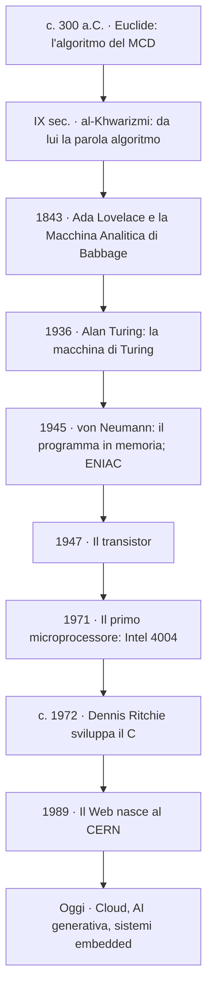
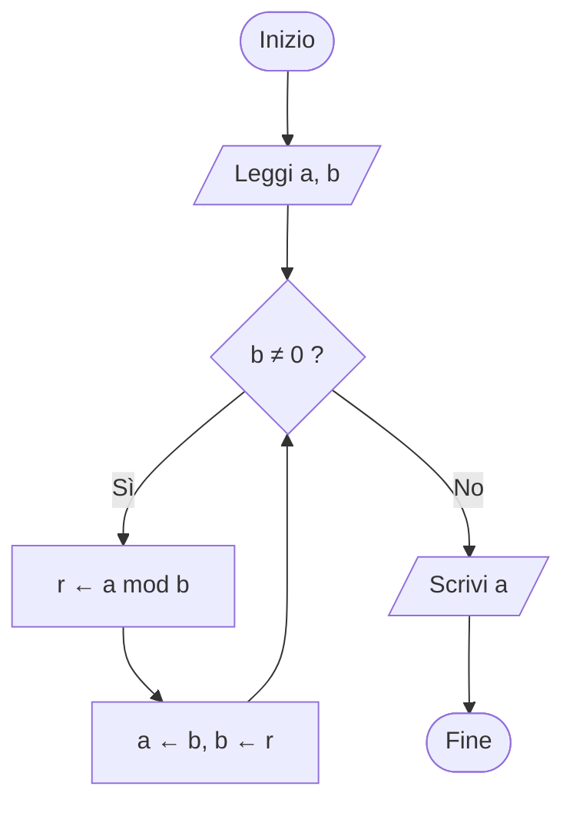
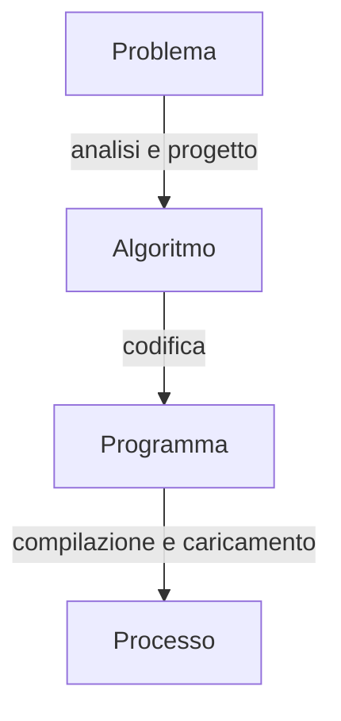
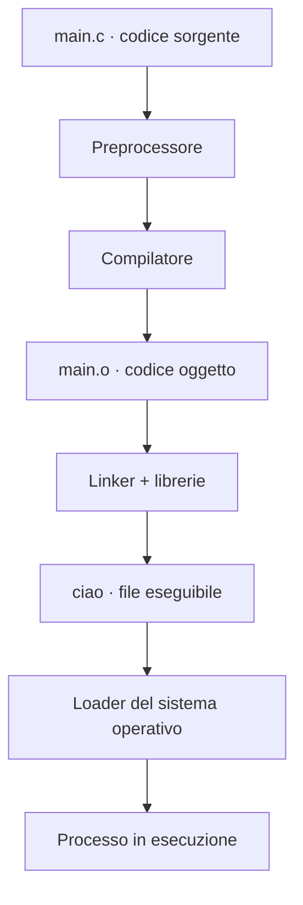

# 🚀 Modulo 1 — Che cos'è l'Informatica: Algoritmi, Programmi e Catena di Programmazione

- **Corso:** C Master — Dai Bit al Software
- **Piattaforma:** GCProf Academy
- **Livello:** 🟢 Base (Fase 1 — Fondamenti dell'Informatica)
- **Target:** Matricole di Ingegneria, studenti di discipline scientifiche e del triennio tecnico-scientifico, docenti, appassionati
- **Prerequisiti:** Nessuno — è il primo modulo del corso
- **Obiettivo Didattico:** Comprendere cos'è l'informatica e come si risolve un problema in modo automatico, distinguere algoritmo, programma e processo, descrivere un algoritmo con pseudocodice e diagrammi di flusso, e compilare ed eseguire il primo programma in C.

---

<a id="indice"></a>
# 📑 Indice del Modulo 1

1. [Capitolo 1 — Che cos'è l'Informatica: Definizione e Ambiti](#capitolo-1)
2. [Capitolo 2 — Breve Storia del Calcolo: da Euclide ai Microprocessori](#capitolo-2)
3. [Capitolo 3 — Il Concetto di Algoritmo](#capitolo-3)
4. [Capitolo 4 — Rappresentare gli Algoritmi: Pseudocodice e Diagrammi di Flusso](#capitolo-4)
5. [Capitolo 5 — Dall'Algoritmo al Processo: Programma, Linguaggi e Catena di Programmazione](#capitolo-5)
6. [Capitolo 6 — Il Tuo Ambiente di Lavoro: OnlineGDB (e `gcc` in Locale)](#capitolo-6)
7. [Capitolo 7 — Il Primo Programma in C: `Hello, World!`](#capitolo-7)
8. [Capitolo 8 — Errori Comuni per Chi Inizia (e Come Leggerli)](#capitolo-8)
9. [Capitolo 9 — Sintesi, Laboratorio e Autoverifica](#capitolo-9)

---

<a id="capitolo-1"></a>
## 1. Capitolo 1 — Che cos'è l'Informatica: Definizione e Ambiti

Se pensi che l'informatica sia "saper usare il computer", preparati a una bella sorpresa. Una frase celebre, spesso attribuita a **Edsger Dijkstra**, dice che l'informatica riguarda i computer tanto quanto l'astronomia riguarda i telescopi: il telescopio è lo *strumento*, l'universo è l'*oggetto di studio*. Il computer è lo strumento; **l'oggetto di studio è l'informazione e il modo di elaborarla automaticamente**.

### 📖 Definizione

* **Informatica** = la scienza che studia la **rappresentazione** e l'**elaborazione automatica dell'informazione**.
* Il nome nasce in Francia nei primi anni Sessanta (*informatique* = *information* + *automatique*); in inglese si dice *computer science*.
* La domanda centrale è: **quali problemi si possono risolvere in modo automatico, e con quali risorse** (tempo di calcolo, memoria)?

### 🔎 Dato e informazione: non sono la stessa cosa

* Un **dato** è una rappresentazione grezza: per esempio `37.2`.
* Un'**informazione** è il dato *interpretato* in un contesto: "la temperatura corporea del paziente è 37,2 °C".
* Il computer manipola dati; il **significato** lo danno il programma che li tratta e le persone che li leggono.

### 🗺️ Le grandi aree dell'informatica (e dove le incontrerai nel corso)

| Ambito | Di cosa si occupa | Dove lo incontrerai |
| :--- | :--- | :--- |
| 🧮 Algoritmi e strutture dati | Come risolvere problemi in modo corretto ed efficiente | Moduli 9–13, 18–19 |
| 🗣️ Linguaggi e compilatori | Come esprimere i programmi e tradurli per la macchina | Moduli 1, 5–9, 20 |
| 🖥️ Architetture dei calcolatori | Com'è fatta e come lavora la macchina | Modulo 4 |
| ⚙️ Sistemi operativi | Come si gestiscono memoria, file e processi | Moduli 4, 16, 17 |
| 🌐 Reti e sistemi distribuiti | Come comunicano i calcolatori | Oltre questo corso |
| 🗄️ Basi di dati | Come archiviare e interrogare grandi quantità di dati | Modulo 17 (le basi: i file) |
| 🧰 Ingegneria del software | Come progettare, collaudare e mantenere il software | Moduli 20 e 22 |
| 🤖 Intelligenza Artificiale | Come far apprendere le macchine dai dati | Modulo 21 |
| 🛡️ Sicurezza informatica | Come proteggere dati e sistemi | Moduli 11, 16, 20 |

### 🎯 Perché serve a un ingegnere

* **Simulare** sistemi prima di costruirli (ponti, circuiti, motori, processi produttivi).
* **Controllare** macchine e impianti tramite software (sistemi embedded, automazione, robotica).
* **Analizzare** grandi quantità di dati sperimentali, di misura o di produzione.
* **Comunicare** con colleghi informatici parlando la stessa lingua, anche se non sarai tu a scrivere tutto il software.

[🔙 Torna all'indice](#indice)

---

<a id="capitolo-2"></a>
## 2. Capitolo 2 — Breve Storia del Calcolo: da Euclide ai Microprocessori

Il calcolo automatico ha una storia lunghissima. Non serve ricordare le date a memoria: serve capire **quali idee hanno cambiato tutto**.



### 💡 Le quattro idee-chiave

* **L'algoritmo esiste prima del computer.** Euclide descrisse un procedimento per il massimo comun divisore circa 2300 anni fa: lo useremo in questo modulo. La parola "algoritmo" deriva dal nome del matematico persiano al-Khwarizmi (IX secolo).
* **La macchina universale (Turing, 1936).** Alan Turing definì un modello astratto di calcolo e dimostrò che una sola macchina, opportunamente istruita, può eseguire qualsiasi procedimento algoritmico. Nasce l'idea di **macchina programmabile**.
* **Il programma memorizzato (von Neumann, 1945).** Le istruzioni sono *dati* come tutti gli altri e vivono nella stessa memoria. È l'architettura su cui si basano ancora oggi i computer (la studieremo nel Modulo 4).
* **La miniaturizzazione.** Dal transistor al microprocessore, la potenza di calcolo è passata da stanze intere a un chip: oggi un microcontrollore da pochi euro esegue milioni di istruzioni al secondo.

### 🌟 Una curiosità su Ada Lovelace

Nel 1843, Ada Lovelace descrisse un procedimento per calcolare i numeri di Bernoulli sulla Macchina Analitica ideata da Charles Babbage, e intuì che una macchina di calcolo poteva manipolare anche simboli, non solo numeri. Per questo è spesso ricordata come l'autrice del **primo programma** della storia.

[🔙 Torna all'indice](#indice)

---

<a id="capitolo-3"></a>
## 3. Capitolo 3 — Il Concetto di Algoritmo

### 🍳 L'analogia della ricetta

Una ricetta di cucina è un ottimo modello di algoritmo: elenca gli **ingredienti** (dati in ingresso), una sequenza di **passi** da eseguire in ordine, e produce un **piatto** (risultato in uscita). Ma un computer è un cuoco molto particolare: **esegue alla lettera**, senza intuito, senza buon senso. Una ricetta che dice "aggiungi sale quanto basta" non gli va bene: *quanto* è "quanto basta"?

### 📖 Definizione

Un **algoritmo** è una **sequenza finita di istruzioni non ambigue**, eseguibili da un **esecutore**, che trasforma dei **dati in ingresso** in un **risultato in uscita** e risolve una **classe di problemi** (non un solo caso particolare).

L'**esecutore** è chi (o cosa) esegue l'algoritmo: può essere una persona, un robot, un computer. Il computer è un **esecutore automatico**: capisce solo un insieme finito di istruzioni elementari, ma le esegue con velocità e precisione impareggiabili.

### ✅ Le proprietà di un buon algoritmo

| Proprietà | Significato | Esempio di violazione |
| :--- | :--- | :--- |
| **Finitezza** | Termina dopo un numero finito di passi | "Scrivi tutte le cifre decimali di π" |
| **Non ambiguità** | Ogni istruzione ha un solo significato possibile | "Rendi il risultato più bello" |
| **Eseguibilità** | Ogni istruzione è elementare per l'esecutore | "Trova la soluzione del problema" |
| **Input e Output** | Zero o più dati in ingresso, almeno un risultato in uscita | Un procedimento che non produce alcun risultato |
| **Generalità** | Risolve una *classe* di problemi | "Calcola il MCD di 48 e 18" (e basta) invece di "il MCD di due numeri qualunque" |

A queste si aggiunge la più importante: la **correttezza**. Un algoritmo è corretto se produce il risultato giusto **per tutti** gli ingressi ammessi, non solo per quelli che hai provato.

### ⚖️ Stesso problema, algoritmi diversi

Lo stesso problema può avere **più algoritmi**, molto diversi per efficienza. Prendiamo il MCD di 1.000.000 e 999.999:

* **Algoritmo "ingenuo":** provare tutti i divisori a partire dal più piccolo dei due numeri, scendendo fino al primo divisore comune. Qui servono circa **un milione di tentativi**.
* **Algoritmo di Euclide:** `1000000 mod 999999 = 1`, poi `999999 mod 1 = 0`. Il risultato (1) arriva in **due sole divisioni**.

Il risultato è identico; il lavoro richiesto differisce di centinaia di migliaia di volte. Scegliere e progettare buoni algoritmi è il cuore dell'informatica: ci torneremo nel Modulo 19.

### 🧠 Una curiosità da matricola

Non tutti i problemi ammettono un algoritmo. Turing dimostrò che esistono problemi **non decidibili**: per esempio, non esiste un algoritmo generale capace di stabilire, dato un qualsiasi programma, se prima o poi terminerà (il celebre *problema della fermata*). L'informatica studia anche i **limiti** di ciò che si può calcolare.

> 👨‍🏫 **Per il docente:** un'attività "unplugged" da 10 minuti funziona benissimo. Uno studente è il "robot" e deve eseguire alla lettera le istruzioni scritte dai compagni per un compito quotidiano (fare un panino, disegnare una figura). Le ambiguità emergono subito, e con esse il concetto di *non ambiguità*.

[🔙 Torna all'indice](#indice)

---

<a id="capitolo-4"></a>
## 4. Capitolo 4 — Rappresentare gli Algoritmi: Pseudocodice e Diagrammi di Flusso

Prima di scrivere codice in un linguaggio vero, un buon programmatore **descrive l'algoritmo in modo indipendente dal linguaggio**. Gli strumenti sono due: lo **pseudocodice** e il **diagramma di flusso**.

### ✍️ Lo pseudocodice

È una descrizione in italiano strutturato, con poche parole chiave ricorrenti: non è eseguibile da nessuna macchina, ma è precisa abbastanza da essere tradotta in qualsiasi linguaggio.

| Costrutto | Notazione usata nel corso |
| :--- | :--- |
| Lettura di dati | `LEGGI a, b` |
| Scrittura di risultati | `SCRIVI x` |
| Assegnazione | `x ← valore` (si legge "x riceve valore") |
| Scelta | `SE condizione ALLORA … ` |
| Ripetizione | `FINCHÉ condizione ESEGUI …` |

**Primo esempio: il massimo fra tre numeri**

```text
ALGORITMO massimo_di_tre
    LEGGI a, b, c
    max ← a                     // parto ipotizzando che a sia il maggiore
    SE b > max ALLORA
        max ← b                 // b è più grande: aggiorno il massimo
    SE c > max ALLORA
        max ← c                 // c è più grande: aggiorno il massimo
    SCRIVI max
FINE
```

**Secondo esempio: l'algoritmo di Euclide per il MCD**

```text
ALGORITMO MCD_Euclide
    LEGGI a, b
    FINCHÉ b ≠ 0 ESEGUI
        r ← resto della divisione di a per b
        a ← b
        b ← r
    SCRIVI a                    // quando b vale 0, a contiene il MCD
FINE
```

### 🔷 Il diagramma di flusso

Lo stesso algoritmo di Euclide, disegnato come **diagramma di flusso** (flowchart). Ogni forma ha un significato preciso:

* **Ovale** = inizio o fine
* **Parallelogramma** = lettura o scrittura di dati
* **Rettangolo** = elaborazione (un'assegnazione, un calcolo)
* **Rombo** = decisione, con due uscite (Sì / No)



### 🧪 Collaudare l'algoritmo "a tavolino": la tabella di traccia

Prima di scrivere una sola riga di codice, **simula a mano** l'algoritmo con dei valori di prova. Con `a = 48` e `b = 18`:

| Passo | `a` | `b` | `r` (resto) | Condizione `b ≠ 0` |
| :---: | :---: | :---: | :---: | :---: |
| Inizio | 48 | 18 | — | Sì |
| 1 | 18 | 12 | 12 | Sì |
| 2 | 12 | 6 | 6 | Sì |
| 3 | 6 | 0 | 0 | **No** → esci |

Risultato: `a = 6`. Infatti il MCD di 48 e 18 è 6. ✅

💡 **Consiglio pratico:** *prima carta e penna, poi la tastiera*. Chi scrive subito codice senza aver capito l'algoritmo passa il tempo a "provare a caso" finché qualcosa funziona. Chi progetta prima scrive meno codice e con meno errori. Questo principio ti accompagnerà per tutto il corso.

[🔙 Torna all'indice](#indice)

---

<a id="capitolo-5"></a>
## 5. Capitolo 5 — Dall'Algoritmo al Processo: Programma, Linguaggi e Catena di Programmazione

### 🔁 Quattro parole che vanno tenute distinte



| Concetto | Cosa è | Natura | Analogia della ricetta |
| :--- | :--- | :--- | :--- |
| **Problema** | Ciò che vogliamo ottenere | — | "Voglio una torta al cioccolato" |
| **Algoritmo** | Il *come*, indipendente dal linguaggio | Idea astratta | La ricetta pensata |
| **Programma** | L'algoritmo scritto in un linguaggio di programmazione (file di testo, detto **codice sorgente**) | **Statico**: un file sul disco | La ricetta scritta su un libro |
| **Processo** | Il programma **in esecuzione**, con la sua memoria e il suo stato | **Dinamico**: vive finché gira | Il cuoco che sta cucinando |

Un dettaglio importante: dallo **stesso programma** possono nascere **più processi** contemporanei, ciascuno con i propri dati (esattamente come due cuochi possono preparare la stessa ricetta nello stesso momento).

### 🗣️ I linguaggi di programmazione

Un computer capisce soltanto il **linguaggio macchina**, fatto di sequenze di bit. Scriverlo a mano è impraticabile: per questo esistono linguaggi più vicini a noi.

| Livello | Esempio | Caratteristiche |
| :--- | :--- | :--- |
| **Linguaggio macchina** | `10110000 01100001` | Sequenze di bit, specifiche del processore |
| **Assembly** | `mov al, 97` | Mnemonici leggibili, uno-a-uno con il linguaggio macchina |
| **Alto livello** | C, Python, Java | Vicini al ragionamento umano, portabili tra macchine diverse |

Il **C**, sviluppato da Dennis Ritchie nei Bell Labs attorno al 1972 (e usato per riscrivere il sistema operativo UNIX), è un linguaggio di alto livello che però permette un controllo **molto vicino alla macchina**. È questa combinazione, portabilità più controllo, ad averlo reso il linguaggio dei sistemi operativi e dei sistemi embedded.

Il C è un linguaggio **compilato**: il codice sorgente viene tradotto *tutto insieme*, prima dell'esecuzione, in un programma eseguibile. (Se hai già incontrato Python: lì il codice viene invece letto ed eseguito da un interprete.)

### ⛓️ La catena di programmazione

Dal file di testo che scrivi al programma che gira sullo schermo, il codice attraversa una **catena di strumenti**:



| Fase | Strumento | Cosa fa |
| :--- | :--- | :--- |
| ✍️ **Scrittura** | Editor (o IDE) | Produce il file sorgente `main.c` |
| 🧹 **Preprocessing** | Preprocessore | Espande le direttive che iniziano con `#` (es. `#include`, `#define`) ed elimina i commenti |
| 🛠️ **Compilazione** | Compilatore | Controlla sintassi e coerenza, poi traduce il sorgente in **codice oggetto** (`main.o`), passando dall'assembly |
| 🔗 **Collegamento (linking)** | Linker | Unisce il codice oggetto con le **librerie** (per esempio quella che contiene `printf`) e produce l'**eseguibile** |
| 📥 **Caricamento** | Loader (parte del sistema operativo) | Copia l'eseguibile in memoria, prepara la pila e avvia l'esecuzione dalla funzione `main` |
| ▶️ **Esecuzione** | CPU | Esegue le istruzioni: il programma diventa un **processo** |

Un **IDE** (*Integrated Development Environment*, ambiente integrato di sviluppo) racchiude in un'unica interfaccia editor, compilatore, linker e debugger: è quello che troverai in OnlineGDB, e nella maggior parte dei programmi di sviluppo.

### 🔬 Vedere la catena con i propri occhi (in locale, con `gcc`)

Se hai `gcc` installato sul tuo computer, puoi eseguire le fasi **una alla volta** e osservare cosa produce ciascuna:

```bash
gcc -E main.c -o main.i     # 1) SOLO preprocessore: main.i è il sorgente "espanso"
gcc -S main.i -o main.s     # 2) compila in assembly: main.s è testo leggibile
gcc -c main.s -o main.o     # 3) assembla in codice oggetto: main.o è binario
gcc main.o -o ciao          # 4) linker: produce l'eseguibile "ciao"
./ciao                      # 5) il loader lo carica e parte il processo
                            #    (su Windows: ciao.exe)
```

In un uso normale si fa tutto con un solo comando (consigliato anche con i **warning** attivi, che segnalano codice sospetto):

```bash
gcc -Wall -Wextra -std=c17 main.c -o ciao
```

*Nota:* su macOS il comando `gcc` invoca in realtà il compilatore `clang`: per noi è del tutto equivalente.

[🔙 Torna all'indice](#indice)

---

<a id="capitolo-6"></a>
## 6. Capitolo 6 — Il Tuo Ambiente di Lavoro: OnlineGDB (e `gcc` in Locale)

Per questo corso il punto di riferimento è **OnlineGDB** ([www.onlinegdb.com](https://www.onlinegdb.com)): un IDE gratuito, nel browser, che permette di scrivere, compilare, eseguire ed eseguire il debug di programmi C **senza installare nulla**.

### 🧭 Come usare OnlineGDB (passo passo)

1. Apri [www.onlinegdb.com](https://www.onlinegdb.com) e seleziona il linguaggio **C** (nel selettore dei linguaggi).
2. Nell'area centrale trovi il file `main.c` con un programma d'esempio: cancellane il contenuto e incolla il tuo codice.
3. Premi il pulsante **Run** (▶️): OnlineGDB esegue **tutta la catena** (preprocessore → compilatore → linker → esecuzione) con un solo clic.
4. L'**output** appare nella console in basso. Se ci sono errori di compilazione, compaiono nella stessa area, con riga e descrizione.
5. Per conservare i tuoi progetti conviene registrarti (è gratuito); in alternativa, copia sempre il tuo codice in un file locale.

💡 **Consiglio pratico:** nei moduli successivi useremo anche i programmi che leggono dati da tastiera (`scanf`): in OnlineGDB i dati si digitano direttamente nella console, sotto l'output del programma.

### 🖥️ Ambienti a confronto

| Ambiente | Pro | Contro |
| :--- | :--- | :--- |
| ☁️ **OnlineGDB** | Zero installazione, funziona ovunque, ideale in classe | Serve la connessione; strumenti avanzati (es. sanitizer) non sempre disponibili |
| 🐧 **`gcc` da terminale** (Linux, macOS, WSL su Windows) | Controllo totale su tutte le fasi e sulle opzioni | Richiede installazione e un minimo di dimestichezza col terminale |
| 🧰 **IDE locale** (es. VS Code con estensione C/C++, Code::Blocks) | Editor evoluto, debugger visuale, gestione di progetti multi-file | Configurazione iniziale più lunga |

Tutti gli esempi del corso funzionano in **ogni** ambiente: parti da OnlineGDB e passa a quello locale quando ti senti pronto.

[🔙 Torna all'indice](#indice)

---

<a id="capitolo-7"></a>
## 7. Capitolo 7 — Il Primo Programma in C: `Hello, World!`

È tradizione, in ogni linguaggio, che il primo programma stampi un saluto. In C sono poche righe, ma **ciascuna ha un ruolo preciso**.

```c
// ==================== ESEMPIO 1.1: IL TUO PRIMO PROGRAMMA IN C ====================
/*
   Questo è il programma C più famoso del mondo.
   Copialo in OnlineGDB (file main.c) e premi Run.
*/

#include <stdio.h>          // Direttiva per il PREPROCESSORE: include l'header "stdio.h"
                            // (Standard Input/Output), che dichiara la funzione printf

int main(void)              // Punto di ingresso del programma: l'esecuzione parte da qui.
{                           // "int" = la funzione restituisce un numero intero al sistema operativo
                            // "void" = non riceve alcun parametro
    printf("Ciao, mondo!\n");   // Stampa il testo tra virgolette sullo schermo.
                                // \n = "a capo" (new line)
    return 0;               // Restituisce 0 al sistema operativo: per convenzione significa "tutto ok"
}                           // Fine del corpo della funzione main
```

**Output:**

```text
Ciao, mondo!
```

### 🔍 Anatomia del programma

| Elemento | Significato |
| :--- | :--- |
| `#include <stdio.h>` | Chiede al **preprocessore** di inserire l'header che descrive le funzioni di input/output, tra cui `printf`. Senza questa riga il compilatore non conoscerebbe `printf` |
| `int main(void)` | Definisce la funzione **`main`**: ogni programma C ne ha una, ed è da qui che parte l'esecuzione |
| `{` e `}` | Delimitano un **blocco** di istruzioni (qui, il corpo di `main`) |
| `printf("…");` | Chiama la funzione della libreria standard che **stampa** sullo schermo |
| `\n` | Carattere speciale di "a capo". Se lo dimentichi, il testo successivo resta sulla stessa riga |
| `;` | Il **punto e virgola** termina ogni istruzione: in C è obbligatorio |
| `return 0;` | Termina `main` restituendo al sistema operativo il **codice di uscita** (0 = successo) |

⚠️ **In C le maiuscole contano:** `printf` e `Printf` sono due nomi diversi, e solo il primo esiste.

Ora vediamo `printf` mentre stampa anche dei **valori**. Non preoccuparti di capire ogni dettaglio delle variabili: le studieremo nel Modulo 5.

```c
// ==================== ESEMPIO 1.2: printf CON PIÙ VALORI ====================
/*
   printf accetta una "stringa di formato" con dei segnaposto (%d, %c, ...)
   che vengono sostituiti dai valori indicati dopo la virgola, nello stesso ordine.
   %d = numero intero (decimale)      %c = singolo carattere
*/

#include <stdio.h>

int main(void)
{
    int anno = 1972;            // variabile intera che contiene un anno
    char iniziale = 'C';        // variabile di tipo carattere (apici singoli!)

    // Il primo %c viene sostituito da 'iniziale', il primo %d da 'anno'
    printf("Il linguaggio %c nasce attorno al %d\n", iniziale, anno);

    // Più printf di seguito stampano una riga dopo l'altra (grazie a \n)
    printf("Riga 1\n");
    printf("Riga 2\n");

    return 0;
}
```

**Output:**

```text
Il linguaggio C nasce attorno al 1972
Riga 1
Riga 2
```

```c
// ==================== ESEMPIO 1.3: I COMMENTI ====================
/*
   I commenti servono a spiegare il codice a chi lo legge (compreso te stesso,
   tra qualche settimana). Il compilatore li IGNORA completamente.
   Questo è un commento su più righe: si apre con la coppia slash-asterisco
   e si chiude con la coppia asterisco-slash.
*/

#include <stdio.h>

int main(void)
{
    // Questo è un commento su singola riga (disponibile dallo standard C99)
    printf("Questa riga viene eseguita\n");   // un commento può stare anche dopo il codice

    // printf("Questa riga NON viene eseguita: è commentata\n");

    return 0;
}
```

**Output:**

```text
Questa riga viene eseguita
```

💡 **Consiglio pratico:** commenta il **perché**, non il **cosa**. `// stampa il testo` è inutile (lo dice già `printf`); `// a capo per non attaccare l'output successivo` è utile.

### 🎁 Assaggio: dall'algoritmo di Euclide al programma C

Riprendiamo l'algoritmo del Capitolo 4 e traduciamolo in C. **Non serve capire ogni riga adesso**: tornerai su queste istruzioni nei Moduli 5–9. Guarda però quanto il programma **somiglia allo pseudocodice**: è la prova che un buon algoritmo si traduce facilmente in qualsiasi linguaggio.

```c
// ==================== ESEMPIO 1.4: L'ALGORITMO DI EUCLIDE IN C ====================
/*
   Calcola il Massimo Comun Divisore (MCD) di due numeri con l'algoritmo di Euclide.
   Confronta questo codice con lo pseudocodice e con la tabella di traccia del Capitolo 4.
*/

#include <stdio.h>

int main(void)
{
    int a = 48;                 // primo numero (dato in ingresso, fissato nel codice)
    int b = 18;                 // secondo numero
    int r;                      // variabile di appoggio per il resto

    printf("Calcolo del MCD di %d e %d\n", a, b);

    while (b != 0)              // FINCHÉ b è diverso da 0 ESEGUI...
    {
        r = a % b;              // % è l'operatore "resto della divisione intera"
        a = b;                  // a riceve il valore di b
        b = r;                  // b riceve il resto
        printf("  a = %d, b = %d\n", a, b);   // stampiamo lo stato a ogni passo (la "traccia")
    }

    printf("MCD = %d\n", a);    // quando b vale 0, a contiene il risultato
    return 0;
}
```

**Output:**

```text
Calcolo del MCD di 48 e 18
  a = 18, b = 12
  a = 12, b = 6
  a = 6, b = 0
MCD = 6
```

Confronta le righe stampate con la **tabella di traccia** del Capitolo 4: sono identiche. Hai appena visto un algoritmo passare da idea, a pseudocodice, a diagramma di flusso, a programma, a **processo in esecuzione**. 🎉

*Perché ti serve: `printf` sarà il tuo primo strumento per "vedere cosa succede" dentro un programma. Anche i programmatori più esperti lo usano ogni giorno per controllare che il codice faccia davvero ciò che ci si aspetta.*

*Nota sugli accenti:* se stampi lettere accentate (à, è, ì…) e su alcuni terminali locali (specie su Windows) vedi caratteri strani, non è un errore del tuo programma ma una questione di codifica dei caratteri: ne parleremo nel Modulo 2. Per ora, nei testi stampati, puoi anche evitarli.

[🔙 Torna all'indice](#indice)

---

<a id="capitolo-8"></a>
## 8. Capitolo 8 — Errori Comuni per Chi Inizia (e Come Leggerli)

Sbagliare, all'inizio, è normale e fa parte dell'apprendimento. Anche i professionisti passano gran parte del loro tempo a cercare e correggere errori (i **bug**). Imparare a leggere i messaggi del compilatore è importante quanto imparare a scrivere codice.

### 🧩 Tre famiglie di errori

| Famiglia | Chi la segnala | Quando | Esempio |
| :--- | :--- | :--- | :--- |
| 🟥 **Errore di compilazione** (sintassi) | Compilatore | Prima dell'esecuzione: **non si genera l'eseguibile** | `;` mancante |
| 🟧 **Errore di collegamento** (linking) | Linker | Dopo la compilazione: manca qualcosa da collegare | Funzione usata ma mai definita |
| 🟦 **Errore logico o di esecuzione** | **Nessuno**: sei tu a doverlo scoprire (o il programma, andando in crash) | Il programma parte, ma **fa la cosa sbagliata** | Scrivere `-` al posto di `+` |

⚠️ **I peggiori sono i terzi**: il computer non protesta, semplicemente fa ciò che gli hai scritto, non ciò che intendevi. Per questo l'algoritmo va collaudato con la tabella di traccia *prima*, e il programma va provato su più casi *dopo*.

### 🟥 Esempio: un errore di sintassi

```c
// ==================== ESEMPIO 1.5: UN ERRORE DI SINTASSI ====================
/*
   Manca il punto e virgola dopo printf: il compilatore non capisce dove finisce
   l'istruzione e si ferma, senza generare l'eseguibile.
*/

#include <stdio.h>

int main(void)
{
    printf("Ciao, mondo!\n")      // <-- ERRORE: manca il ; finale
    return 0;
}
```

Il messaggio del compilatore ha una forma tipica (numeri di riga e colonna indicativi, e possono variare tra versioni):

```text
main.c: In function 'main':
main.c:7:29: error: expected ';' before 'return'
```

**Come leggerlo:** `file : riga : colonna : tipo : descrizione`. Ti dice **dove** guardare (riga 7, colonna 29), **che tipo** di problema c'è (`error`) e **cosa si aspettava** (un `;`). Una regola d'oro: quando il compilatore segnala un errore alla riga *N*, controlla anche la riga **precedente**, dove spesso manca una chiusura.

### 🟧 Esempio: una funzione che non esiste

```c
// ==================== ESEMPIO 1.6: UN NOME SBAGLIATO ====================
/*
   "printf" è scritto male ("prinft"): il compilatore non conosce questa funzione.
   Nelle versioni recenti di gcc è un ERRORE ("implicit declaration of function");
   in quelle più vecchie è solo un warning, seguito da un errore del LINKER:
   "undefined reference to `prinft'".
*/

#include <stdio.h>

int main(void)
{
    prinft("Ciao, mondo!\n");      // <-- ERRORE: nome sbagliato
    return 0;
}
```

Stessa storia se dimentichi `#include <stdio.h>`, o se scrivi `Printf` con la maiuscola.

### 🟦 Esempio: un errore logico

```c
// ==================== ESEMPIO 1.7: UN ERRORE LOGICO ====================
/*
   Vogliamo stampare la SOMMA di 5 e 3, ma per distrazione scriviamo una sottrazione.
   Il programma compila senza errori e gira senza problemi... ma il risultato è SBAGLIATO.
*/

#include <stdio.h>

int main(void)
{
    printf("La somma di 5 e 3 e' %d\n", 5 - 3);   // <-- BUG: doveva essere 5 + 3

    return 0;
}
```

**Output (sbagliato, ma senza alcun messaggio d'errore):**

```text
La somma di 5 e 3 e' 2
```

Nessun segnale d'allarme: solo tu, confrontando il risultato con quello atteso (8), puoi accorgerti che qualcosa non va.

### ⚡ Warning: i segnali che non vanno ignorati

Oltre agli errori, il compilatore emette anche **warning** (avvertimenti): il programma viene generato, ma il compilatore ti sta dicendo "*qui c'è qualcosa di sospetto*". **Trattali come errori**: spesso indicano un bug reale. In locale, attivali sempre con `-Wall -Wextra`.

### ✅ Abitudini di un buon programmatore

* Leggi il messaggio **dall'inizio** e parti dalla **prima** segnalazione: spesso le successive sono solo conseguenze della prima.
* Compila **spesso**, dopo ogni piccola modifica: un errore in 3 righe nuove è facile da trovare, in 300 no.
* Non provare a "indovinare": leggi, ragiona, correggi **una cosa alla volta**.

[🔙 Torna all'indice](#indice)

---

<a id="capitolo-9"></a>
## 9. Capitolo 9 — Sintesi, Laboratorio e Autoverifica

### 💡 Punti Chiave del Modulo 1

1. L'**informatica** è la scienza della **rappresentazione e dell'elaborazione automatica dell'informazione**: il computer è lo strumento, non l'oggetto di studio.
2. Un **algoritmo** è una sequenza **finita** di istruzioni **non ambigue** ed **eseguibili**, che risolve una **classe** di problemi; deve essere **corretto** per tutti gli ingressi ammessi.
3. Lo stesso problema può avere algoritmi di **efficienza molto diversa** (esempio: MCD ingenuo contro Euclide).
4. Gli algoritmi si descrivono con **pseudocodice** e **diagrammi di flusso**, e si collaudano "a tavolino" con una **tabella di traccia**.
5. **Programma** (statico, file sul disco) e **processo** (dinamico, programma in esecuzione) sono concetti diversi; dallo stesso programma possono nascere più processi.
6. La **catena di programmazione** del C è: editor → preprocessore → compilatore → linker → loader → esecuzione.
7. Ogni programma C parte dalla funzione **`main`**; `#include <stdio.h>` rende disponibile `printf`; ogni istruzione termina con `;`.
8. Gli errori sono di tre famiglie: **compilazione**, **collegamento**, **logici**: i più insidiosi sono gli ultimi. I **warning** vanno presi sul serio.

---

### 📖 Mini-Glossario

| Termine | Significato |
| :--- | :--- |
| **Algoritmo** | Sequenza finita di istruzioni non ambigue che risolve una classe di problemi |
| **Esecutore** | Chi (o cosa) esegue un algoritmo: una persona, un robot, un computer |
| **Programma** | Algoritmo scritto in un linguaggio di programmazione |
| **Processo** | Programma in esecuzione, con la sua memoria e il suo stato |
| **Codice sorgente** | Il testo del programma, scritto dal programmatore (`.c`) |
| **Pseudocodice** | Descrizione strutturata di un algoritmo, indipendente dal linguaggio |
| **Diagramma di flusso** | Rappresentazione grafica di un algoritmo con forme e frecce |
| **Preprocessore** | Strumento che espande le direttive `#` prima della compilazione |
| **Compilatore** | Traduce il sorgente in codice oggetto e segnala gli errori di sintassi |
| **Linker** | Unisce codice oggetto e librerie in un file eseguibile |
| **Loader** | Parte del sistema operativo che carica l'eseguibile in memoria e lo avvia |
| **IDE** | Ambiente integrato di sviluppo: editor, compilatore, linker e debugger insieme |
| **Bug** | Errore in un programma |
| **Warning** | Avvertimento del compilatore su codice sospetto, che non blocca la compilazione |

---

### 🧪 Laboratorio Pratico: "Dall'Idea al Processo"

**Obiettivo:** ripercorrere l'intera catena, dal problema al programma in esecuzione, e riconoscere i diversi tipi di errore.

**Parte A — Progettare (carta e penna)**
1. Scrivi in **pseudocodice** l'algoritmo che, letti tre voti, calcola e stampa la loro **somma** (suggerimento: parti dalla struttura dell'esempio `massimo_di_tre`).
2. Disegna il relativo **diagramma di flusso** (su carta, oppure scrivendo il codice Mermaid come nell'esempio del Capitolo 4).
3. Collauda l'algoritmo con una **tabella di traccia** su valori a tua scelta, poi con valori "estremi" (per esempio tutti zero).

**Parte B — Eseguire (OnlineGDB)**
4. Apri [www.onlinegdb.com](https://www.onlinegdb.com), scegli il linguaggio C e riproduci l'**Esempio 1.1**. Poi modificalo perché stampi, con più istruzioni `printf`: il tuo nome, il corso di laurea o l'indirizzo di studi che frequenti e una frase su perché vuoi imparare il C.
5. Aggiungi almeno **due commenti** (uno `//`, uno `/* … */`) che spieghino il *perché* di una scelta.
6. Riproduci l'**Esempio 1.4** e cambia i valori di `a` e `b` (per esempio `1000000` e `999999`). Confronta il risultato con quello che ti aspetti **prima** di eseguire.

**Parte C — Sbagliare di proposito**
7. Provoca **tre errori**, uno alla volta: togli un `;`, scrivi `Printf` con la maiuscola, sostituisci un `+` con un `-` in un calcolo. Per ciascuno annota: il **messaggio** ottenuto (se c'è) e la **famiglia** di errore (compilazione, collegamento, logico).

**🚀 Sfida finale (per chi ha `gcc` in locale)**
8. Esegui le **cinque fasi separate** del Capitolo 5 sul tuo `main.c`. Poi confronta con `wc -l`: quante righe ha `main.c`? Quante ne ha `main.i` dopo il preprocessore? Quanto è grande `main.o`? Cosa ne deduci sul lavoro svolto dal preprocessore con `#include <stdio.h>`?

*Suggerimento:* riusa la struttura degli Esempi 1.1, 1.2 e 1.4, personalizzando i testi e i valori.

---

### ❓ Quiz di Autoverifica

**Domanda 1:** Qual è la differenza corretta tra *programma* e *processo*?
- A) Sono sinonimi: indicano la stessa cosa
- B) Il programma è l'algoritmo scritto in un linguaggio (statico); il processo è il programma in esecuzione (dinamico)
- C) Il programma è il compilatore; il processo è il codice sorgente
- D) Il processo è il file `.c`; il programma è il file `.o`

**Domanda 2:** Quale delle seguenti NON è una proprietà richiesta a un algoritmo?
- A) Finitezza: termina dopo un numero finito di passi
- B) Non ambiguità: ogni istruzione ha un solo significato
- C) Eseguibilità: le istruzioni sono elementari per l'esecutore
- D) Dipendenza da un linguaggio di programmazione specifico

**Domanda 3:** Qual è l'ordine corretto degli strumenti nella catena di programmazione del C?
- A) Compilatore → editor → linker → preprocessore → loader
- B) Editor → preprocessore → compilatore → linker → loader
- C) Editor → linker → compilatore → preprocessore → loader
- D) Preprocessore → editor → loader → compilatore → linker

**Domanda 4:** Quale strumento unisce il codice oggetto con le librerie (per esempio quella che contiene `printf`) per produrre il file eseguibile?
- A) Il preprocessore
- B) L'editor di testo
- C) Il linker
- D) Il loader

**Domanda 5:** Un programma compila senza errori e parte, ma stampa un risultato sbagliato perché è stato scritto `-` al posto di `+`. Di che tipo di errore si tratta?
- A) Errore di compilazione: il compilatore lo segnala sempre
- B) Errore di collegamento: manca una libreria
- C) Errore logico: il programma è sintatticamente corretto ma fa la cosa sbagliata
- D) Non è un errore: è solo un warning

---

[🔙 Torna all'indice](#indice)