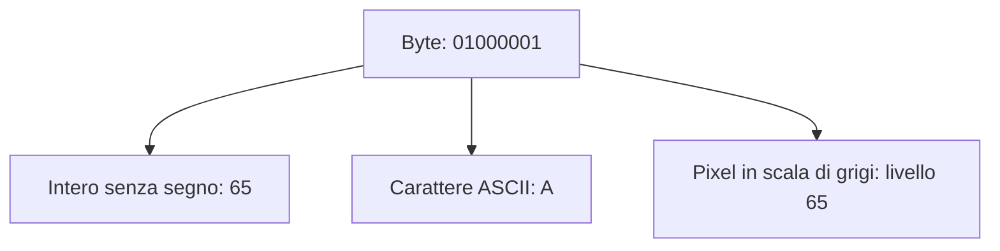
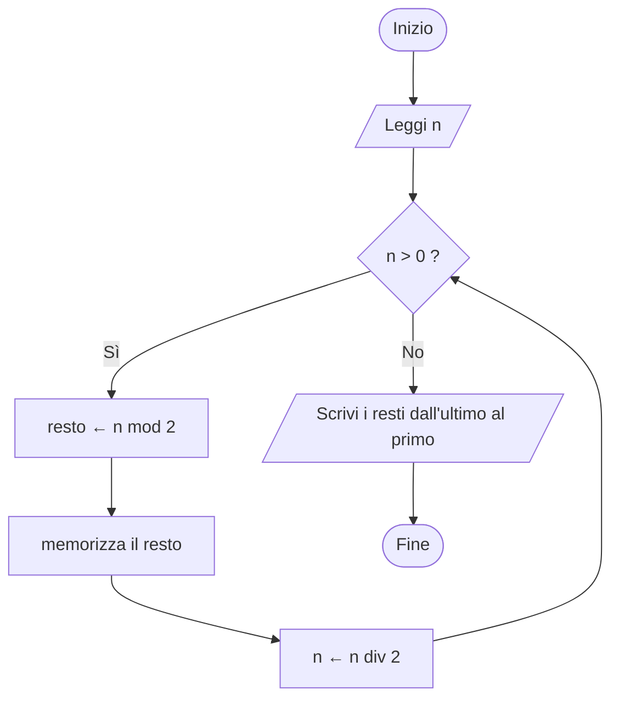
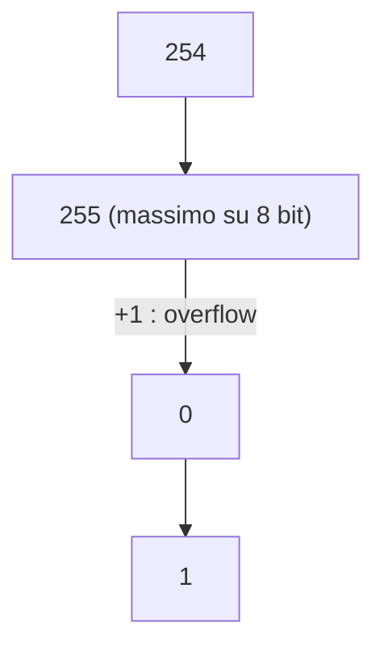
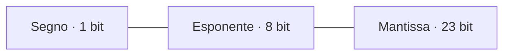
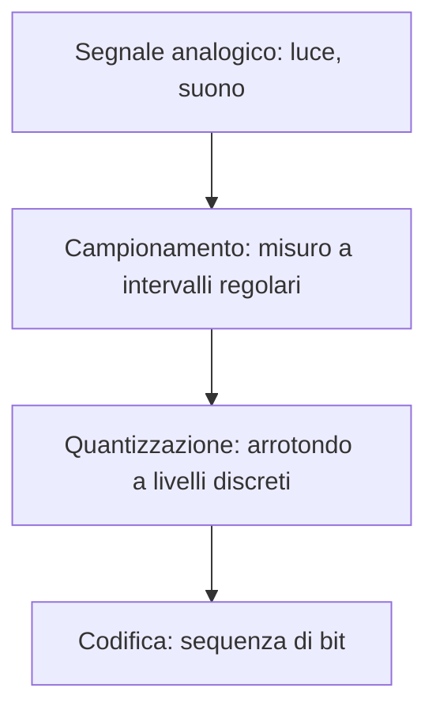

# 🔢 Modulo 2 — La Natura dell'Informazione: Sistemi di Numerazione e Rappresentazione dei Dati

- **Corso:** C Master — Dai Bit al Software
- **Piattaforma:** GCProf Academy
- **Livello:** 🟢 Base (Fase 1 — Fondamenti dell'Informatica)
- **Target:** Matricole di Ingegneria, studenti di discipline scientifiche e del triennio tecnico-scientifico, docenti, appassionati
- **Prerequisiti:** Modulo 1 (algoritmi, pseudocodice, catena di programmazione, primo programma in C)
- **Obiettivo Didattico:** Comprendere come il computer rappresenta numeri, testi, immagini e suoni con sequenze di bit; convertire numeri tra le basi 2, 8, 10 e 16; rappresentare interi in complemento a 2; spiegare perché `0.1 + 0.2` non è esattamente `0.3`; stimare l'occupazione di memoria di testi, immagini e audio.

> 🛠️ **Nota sul codice di questo modulo:** alcuni esempi usano cicli e funzioni che studierai nei Moduli 9 e 12. Trattali come **"scatole nere"**: leggi i commenti, esegui, osserva l'output. Sono strumenti che ti permettono di *vedere i bit* fin da subito.

---

<a id="indice"></a>
# 📑 Indice del Modulo 2

1. [Capitolo 1 — Bit e Byte: l'Alfabeto del Computer](#capitolo-1)
2. [Capitolo 2 — Sistemi di Numerazione Posizionali: Binario, Ottale, Decimale, Esadecimale](#capitolo-2)
3. [Capitolo 3 — Conversioni tra Basi](#capitolo-3)
4. [Capitolo 4 — Interi Senza Segno e Overflow](#capitolo-4)
5. [Capitolo 5 — Interi con Segno: il Complemento a 2](#capitolo-5)
6. [Capitolo 6 — Numeri Reali: Virgola Mobile e Standard IEEE 754](#capitolo-6)
7. [Capitolo 7 — Rappresentare il Testo: ASCII, Unicode e UTF-8](#capitolo-7)
8. [Capitolo 8 — Immagini, Suono e Multimedia](#capitolo-8)
9. [Capitolo 9 — Rilevare gli Errori: il Bit di Parità](#capitolo-9)
10. [Capitolo 10 — Errori Comuni per Chi Inizia](#capitolo-10)
11. [Capitolo 11 — Sintesi, Laboratorio e Autoverifica](#capitolo-11)

---

<a id="capitolo-1"></a>
## 1. Capitolo 1 — Bit e Byte: l'Alfabeto del Computer

Dentro un computer non esistono numeri, lettere, foto o canzoni. Esistono solo **interruttori** che possono essere in due stati: acceso o spento. Tutto il resto, dalla tua playlist al tuo programma in C, è una **convenzione** su come interpretare lunghe sequenze di questi due stati.

### 📖 I concetti di base

* **Bit** (*binary digit*): la più piccola unità di informazione, con due valori possibili: `0` o `1`.
* **Perché due soli stati?** Distinguere "tensione alta" da "tensione bassa" è semplice e affidabile anche in presenza di disturbi elettrici; distinguere dieci livelli diversi sarebbe molto più fragile.
* **Byte**: un gruppo di **8 bit**. È l'unità minima che la memoria indirizza e che il C chiama `char`.
* **Nibble**: 4 bit (mezzo byte). Vedremo perché è utile con l'esadecimale.
* **Parola** (*word*): la dimensione "naturale" dei dati per una CPU (32 o 64 bit nei sistemi attuali).

### 🧮 Quante combinazioni con *n* bit?

Ogni bit raddoppia le possibilità: con **n bit** si ottengono **2ⁿ** combinazioni distinte.

| Bit | Combinazioni | Valore |
| :---: | :---: | :--- |
| 1 | 2¹ | 2 |
| 4 | 2⁴ | 16 |
| 8 (un byte) | 2⁸ | 256 |
| 10 | 2¹⁰ | 1.024 |
| 16 | 2¹⁶ | 65.536 |
| 32 | 2³² | 4.294.967.296 |
| 64 | 2⁶⁴ | 18.446.744.073.709.551.616 |

### 📏 Multipli del byte: attenzione a "kilo"

| Prefisso decimale (SI) | Valore | Prefisso binario (IEC) | Valore |
| :--- | :--- | :--- | :--- |
| kB (kilobyte) | 1.000 B | KiB (kibibyte) | 1.024 B |
| MB (megabyte) | 1.000.000 B | MiB (mebibyte) | 1.048.576 B |
| GB (gigabyte) | 10⁹ B | GiB (gibibyte) | 1.073.741.824 B |
| TB (terabyte) | 10¹² B | TiB (tebibyte) | 1.099.511.627.776 B |

*Curiosità:* è per questo che un disco "da 500 GB" venduto dal produttore (decimale) sembra più piccolo nel sistema operativo, che spesso conta in GiB.

### 🎭 La stessa sequenza di bit, tante interpretazioni

Un byte **non ha un significato intrinseco**: lo acquista dal modo in cui il programma lo interpreta.



Questa è forse l'idea più importante di tutto il modulo: **i dati sono bit + una regola di interpretazione**. Cambiando la regola, gli stessi bit cambiano significato.

```c
// ==================== ESEMPIO 2.1: QUANTO OCCUPANO I TIPI DEL C ====================
/*
   L'operatore sizeof restituisce quanti BYTE occupa un tipo di dato.
   CHAR_BIT (da limits.h) dice quanti bit ci sono in un byte (di solito 8).
   %zu è lo specificatore di formato per il tipo restituito da sizeof.
   ATTENZIONE: i valori dipendono dalla piattaforma (es. long: 8 byte su Linux a 64 bit,
   4 byte su Windows). Questo è l'output tipico su OnlineGDB.
*/

#include <stdio.h>
#include <limits.h>     // per CHAR_BIT

int main(void)
{
    printf("Bit in un byte (CHAR_BIT): %d\n", CHAR_BIT);
    printf("char      : %zu byte\n", sizeof(char));
    printf("short     : %zu byte\n", sizeof(short));
    printf("int       : %zu byte\n", sizeof(int));
    printf("long      : %zu byte\n", sizeof(long));
    printf("long long : %zu byte\n", sizeof(long long));
    printf("float     : %zu byte\n", sizeof(float));
    printf("double    : %zu byte\n", sizeof(double));

    // Quanti bit ha un int, e quante combinazioni distinte può rappresentare?
    int bit_int = (int)(sizeof(int) * CHAR_BIT);
    printf("Un int usa %d bit -> %llu combinazioni\n", bit_int, 1ULL << bit_int);
    // 1ULL << n significa "1 spostato a sinistra di n posizioni" = 2^n (Modulo 6)

    return 0;
}
```

**Output tipico:**

```text
Bit in un byte (CHAR_BIT): 8
char      : 1 byte
short     : 2 byte
int       : 4 byte
long      : 8 byte
long long : 8 byte
float     : 4 byte
double    : 8 byte
Un int usa 32 bit -> 4294967296 combinazioni
```

```c
// ==================== ESEMPIO 2.2: STESSI BIT, INTERPRETAZIONI DIVERSE ====================
/*
   La variabile 'byte' contiene sempre la stessa sequenza di bit: 01000001.
   Cambia soltanto lo specificatore di formato di printf, cioè la REGOLA
   con cui quei bit vengono interpretati e mostrati.
*/

#include <stdio.h>

int main(void)
{
    unsigned char byte = 0x41;   // 0x41 è la scrittura esadecimale di 65 (la vedremo nel Capitolo 2)

    printf("Come numero intero : %d\n", byte);      // %d -> interpreta come intero
    printf("Come carattere     : %c\n", byte);      // %c -> interpreta come carattere ASCII
    printf("Come esadecimale   : 0x%X\n", byte);    // %X -> mostra in base 16

    return 0;
}
```

**Output:**

```text
Come numero intero : 65
Come carattere     : A
Come esadecimale   : 0x41
```

[🔙 Torna all'indice](#indice)

---

<a id="capitolo-2"></a>
## 2. Capitolo 2 — Sistemi di Numerazione Posizionali: Binario, Ottale, Decimale, Esadecimale

### 📖 Come funziona un sistema posizionale

Il sistema decimale che usi ogni giorno è **posizionale**: il valore di una cifra dipende dalla sua **posizione**. Nel numero `347`:

`347 = 3·10² + 4·10¹ + 7·10⁰ = 300 + 40 + 7`

La **base** è 10, perché abbiamo 10 cifre (0–9) e ogni posizione vale 10 volte la precedente. La regola vale per qualsiasi base *b*:

> **valore = Σ cifraᵢ · bⁱ**  (dove *i* è la posizione, contata da destra a partire da 0)

### 🎛️ Le quattro basi che incontrerai

| Base | Nome | Cifre | Dove si usa |
| :---: | :--- | :--- | :--- |
| 2 | **Binario** | 0, 1 | Il linguaggio nativo dell'hardware |
| 8 | **Ottale** | 0–7 | Permessi dei file in Unix (es. `chmod 755`), legacy |
| 10 | **Decimale** | 0–9 | La comunicazione umana |
| 16 | **Esadecimale** | 0–9, A–F | Indirizzi di memoria, colori, byte in forma compatta |

### 🔡 Tabella di riferimento: da 0 a 15

| Decimale | Binario | Ottale | Esadecimale |
| :---: | :---: | :---: | :---: |
| 0 | 0000 | 0 | 0 |
| 1 | 0001 | 1 | 1 |
| 2 | 0010 | 2 | 2 |
| 3 | 0011 | 3 | 3 |
| 4 | 0100 | 4 | 4 |
| 5 | 0101 | 5 | 5 |
| 6 | 0110 | 6 | 6 |
| 7 | 0111 | 7 | 7 |
| 8 | 1000 | 10 | 8 |
| 9 | 1001 | 11 | 9 |
| 10 | 1010 | 12 | A |
| 11 | 1011 | 13 | B |
| 12 | 1100 | 14 | C |
| 13 | 1101 | 15 | D |
| 14 | 1110 | 16 | E |
| 15 | 1111 | 17 | F |

💡 **Da imparare a memoria:** le prime 16 righe di questa tabella. Serviranno per tutto il corso (e per tutta la carriera).

### ✏️ Esempi di lettura

* `1011₂ = 1·8 + 0·4 + 1·2 + 1·1 = 11₁₀`
* `3F₁₆ = 3·16 + 15·1 = 63₁₀`
* `17₈ = 1·8 + 7·1 = 15₁₀`

*(Il pedice indica la base in cui il numero è scritto.)*

### 🤔 Perché l'esadecimale è così amato dai programmatori?

* **Una cifra esadecimale = esattamente 4 bit** (un nibble). Un byte si scrive quindi con **due sole cifre** (`0x00`–`0xFF`).
* È molto più compatto e leggibile del binario, ma mantiene la corrispondenza diretta con i bit.
* Esempio: `11010110` è difficile da leggere; `D6` no.

### 🧷 Come si scrivono i numeri in base diversa nel codice C

| Notazione | Esempio | Valore decimale |
| :--- | :--- | :---: |
| Decimale | `31` | 31 |
| Esadecimale (prefisso `0x`) | `0x1F` | 31 |
| Ottale (prefisso `0` iniziale) | `017` | 15 |
| Binario (prefisso `0b`) | `0b1011` | 11 |

⚠️ **Trappola classica:** in C uno **zero iniziale** significa "ottale". `010` **non** vale dieci: vale **otto**! Non far precedere mai da zeri un numero decimale.

*Nota:* i letterali binari `0b…` sono ufficialmente standard dal C23; `gcc` li accetta da molto tempo prima come estensione.

```c
// ==================== ESEMPIO 2.3: LO STRUMENTO stampa_binario ====================
/*
   Una piccola "lente d'ingrandimento" per vedere i bit di un numero.
   La useremo in tutto il modulo.
   - valore : il numero di cui vogliamo vedere i bit
   - n_bit  : quanti bit mostrare (8, 16, 32...)
   Il ciclo scorre i bit dal più significativo (a sinistra) al meno significativo:
   (valore >> i) sposta il bit i-esimo in ultima posizione, & 1 lo isola.
   (Cicli: Modulo 9. Funzioni: Modulo 12. Operatori sui bit: Modulo 6.)
*/

#include <stdio.h>

void stampa_binario(unsigned int valore, int n_bit)
{
    for (int i = n_bit - 1; i >= 0; i--)
    {
        putchar(((valore >> i) & 1u) ? '1' : '0');   // stampa '1' o '0' per il bit i
    }
}

int main(void)
{
    printf("  5 su  8 bit: "); stampa_binario(5, 8);      printf("\n");
    printf("255 su  8 bit: "); stampa_binario(255, 8);    printf("\n");
    printf(" 65 su  8 bit: "); stampa_binario(65, 8);     printf("\n");
    printf("1000 su 16 bit: "); stampa_binario(1000, 16); printf("\n");
    return 0;
}
```

**Output:**

```text
  5 su  8 bit: 00000101
255 su  8 bit: 11111111
 65 su  8 bit: 01000001
1000 su 16 bit: 0000001111101000
```

```c
// ==================== ESEMPIO 2.4: STESSO NUMERO IN BASI DIVERSE ====================
/*
   printf può mostrare lo stesso valore in basi diverse:
     %d = decimale     %o = ottale     %x / %X = esadecimale (minuscolo / maiuscolo)
   Il simbolo # davanti aggiunge il prefisso (0 per l'ottale, 0x per l'esadecimale).
*/

#include <stdio.h>

int main(void)
{
    int n = 255;

    printf("Decimale     : %d\n", n);
    printf("Ottale       : %o\n", n);
    printf("Esadecimale  : %x  (maiuscolo: %X)\n", n, n);
    printf("Con prefisso : %#o  %#x\n", n, n);

    // Scrivere numeri in basi diverse direttamente nel codice
    int da_hex = 0x1F;      // esadecimale: 1*16 + 15 = 31
    int da_ott = 017;       // OTTALE (zero iniziale!): 1*8 + 7 = 15
    int da_bin = 0b1011;    // binario: 8 + 2 + 1 = 11

    printf("0x1F = %d   017 = %d   0b1011 = %d\n", da_hex, da_ott, da_bin);

    return 0;
}
```

**Output:**

```text
Decimale     : 255
Ottale       : 377
Esadecimale  : ff  (maiuscolo: FF)
Con prefisso : 0377  0xff
0x1F = 31   017 = 15   0b1011 = 11
```

[🔙 Torna all'indice](#indice)

---

<a id="capitolo-3"></a>
## 3. Capitolo 3 — Conversioni tra Basi

### ➡️ Da una base qualsiasi al decimale

Applica la formula posizionale: moltiplica ogni cifra per la potenza della base e somma.

`101101₂ = 1·32 + 0·16 + 1·8 + 1·4 + 0·2 + 1·1 = 45₁₀`

### ⬅️ Dal decimale al binario: le divisioni successive

Dividi il numero per 2 **ripetutamente**, annotando i **resti**; fermati quando il quoziente è 0. Il binario si legge **dal basso verso l'alto** (dall'ultimo resto al primo). Esempio con **45**:

| Divisione | Quoziente | Resto |
| :--- | :---: | :---: |
| 45 : 2 | 22 | **1** |
| 22 : 2 | 11 | **0** |
| 11 : 2 | 5 | **1** |
| 5 : 2 | 2 | **1** |
| 2 : 2 | 1 | **0** |
| 1 : 2 | 0 | **1** |

Leggendo i resti dal basso: **`101101₂`**. Verifica: 32 + 8 + 4 + 1 = 45 ✅

Lo stesso procedimento, come **diagramma di flusso** (riconosci lo stile del Modulo 1?):



*(Per convertire in un'altra base, cambia semplicemente il divisore: 8 per l'ottale, 16 per l'esadecimale.)*

### ⚡ Il trucco dei gruppi: binario ↔ esadecimale (e ottale)

Poiché 16 = 2⁴ e 8 = 2³, la conversione **non richiede calcoli**: si raggruppano i bit.

* **Binario → esadecimale:** raggruppa i bit **a 4 a 4, partendo da destra**, e sostituisci ogni gruppo con la sua cifra.

  `1011 0110₂` → `B` `6` → **`B6₁₆`** (= 11·16 + 6 = **182**)

* **Esadecimale → binario:** sostituisci ogni cifra con i suoi 4 bit.

  `3F₁₆` → `0011 1111₂`

* **Binario → ottale:** raggruppa **a 3 a 3**, da destra.

  `101 101₂` → `5` `5` → **`55₈`** (= 45)

### 🔬 E i numeri con la virgola?

Per la parte frazionaria si **moltiplica per 2** e si annota la parte intera a ogni passo. Esempio con **0,625**:

* `0,625 · 2 = 1,25` → cifra **1**, resta 0,25
* `0,25 · 2 = 0,5` → cifra **0**, resta 0,5
* `0,5 · 2 = 1,0` → cifra **1**, resta 0

Risultato: `0,625₁₀ = 0,101₂` (infatti ½ + ⅛ = 0,625 ✅).

**Ma attenzione:** `0,1₁₀` in binario diventa `0,0001100110011…₂`, una sequenza **periodica infinita**, esattamente come `1/3 = 0,333…` in decimale. Il computer dovrà **tagliarla**: è l'origine di un celebre problema, che vedremo nel Capitolo 6.

```c
// ==================== ESEMPIO 2.5: LE DIVISIONI SUCCESSIVE IN C ====================
/*
   Implementa l'algoritmo del Capitolo 3: converte un numero decimale in binario.
   Ogni passo stampa la divisione, i resti vengono salvati in un array
   (Modulo 10) e infine letti in ordine inverso.
   Non serve capire ogni riga adesso: osserva quanto il codice somiglia al diagramma di flusso.
*/

#include <stdio.h>

int main(void)
{
    int n = 45;                 // numero da convertire (fissato nel codice)
    int resti[32];              // array dove salviamo i resti (fino a 32 bit)
    int quanti = 0;             // quanti resti abbiamo salvato

    printf("Converto %d in binario\n", n);

    int copia = n;              // lavoriamo su una copia, per non perdere n
    while (copia > 0)           // FINCHÉ il quoziente è maggiore di 0...
    {
        resti[quanti] = copia % 2;      // il resto della divisione per 2 è il prossimo bit
        printf("  %d : 2 = %d resto %d\n", copia, copia / 2, copia % 2);
        copia = copia / 2;              // nuovo quoziente
        quanti++;
    }

    printf("Risultato: ");
    for (int i = quanti - 1; i >= 0; i--)   // leggiamo i resti DALL'ULTIMO AL PRIMO
    {
        printf("%d", resti[i]);
    }
    printf("\n");

    return 0;
}
```

**Output:**

```text
Converto 45 in binario
  45 : 2 = 22 resto 1
  22 : 2 = 11 resto 0
  11 : 2 = 5 resto 1
  5 : 2 = 2 resto 1
  2 : 2 = 1 resto 0
  1 : 2 = 0 resto 1
Risultato: 101101
```

🔎 **Sfida da tenere a mente:** cosa stampa questo programma se `n` vale `0`? (Lo scoprirai nel laboratorio.)

[🔙 Torna all'indice](#indice)

---

<a id="capitolo-4"></a>
## 4. Capitolo 4 — Interi Senza Segno e Overflow

Il modo più semplice di rappresentare un intero non negativo è il **binario puro**: con **n bit** si rappresentano i numeri da **0 a 2ⁿ − 1**. Sono i cosiddetti interi **senza segno** (*unsigned*).

* 8 bit → da 0 a **255**
* 16 bit → da 0 a **65.535**
* 32 bit → da 0 a **4.294.967.295**

### 🚗 L'analogia del contachilometri

Immagina un contachilometri a 3 cifre: dopo `999` non può mostrare `1000`, e **ricomincia da `000`**. Nei computer succede lo stesso: quando un risultato **supera il massimo rappresentabile**, i bit in eccesso vanno persi e il valore "gira" da capo. Si chiama **overflow**.



In termini matematici, l'aritmetica senza segno a *n* bit è un'aritmetica **modulo 2ⁿ**: `255 + 1 = 256 mod 256 = 0`.

### 🌍 Perché ti riguarda da vicino

L'overflow non è una curiosità: ha causato guasti reali.

* **Ariane 5 (1996):** il razzo si autodistrusse pochi secondi dopo il lancio; tra le cause, la conversione di un valore da 64 bit in virgola mobile a un intero a 16 bit con segno che ne superava il massimo.
* **Anno 2038:** molti sistemi memorizzano la data come numero di secondi da un'origine in un intero a 32 bit con segno, che **si esaurisce il 19 gennaio 2038**: i sistemi ancora a 32 bit dovranno essere aggiornati.
* **Contatori virali:** il contatore di visualizzazioni di un noto video ha superato il limite dei 32 bit con segno, costringendo ad aggiornare il sistema.

```c
// ==================== ESEMPIO 2.6: L'OVERFLOW SENZA SEGNO ====================
/*
   In C l'overflow degli interi SENZA segno è ben definito: il valore "gira" (modulo 2^n).
   Partiamo da 250 in un unsigned char (8 bit, massimo 255) e incrementiamo 10 volte.
   UINT_MAX (da limits.h) è il massimo valore di un unsigned int.
*/

#include <stdio.h>
#include <limits.h>

int main(void)
{
    unsigned char c = 250;

    printf("unsigned char: ");
    for (int i = 0; i < 10; i++)
    {
        printf("%d ", c);       // stampiamo il valore attuale
        c++;                    // incrementiamo: dopo 255 si torna a 0
    }
    printf("\n");

    unsigned int u = UINT_MAX;          // il massimo unsigned int
    printf("UINT_MAX     = %u\n", u);   // %u = intero senza segno
    u = u + 1;                          // overflow: ricomincia da zero
    printf("UINT_MAX + 1 = %u\n", u);

    return 0;
}
```

**Output:**

```text
unsigned char: 250 251 252 253 254 255 0 1 2 3 
UINT_MAX     = 4294967295
UINT_MAX + 1 = 0
```

[🔙 Torna all'indice](#indice)

---

<a id="capitolo-5"></a>
## 5. Capitolo 5 — Interi con Segno: il Complemento a 2

Servono anche i numeri **negativi**. Come si rappresentano con soli 0 e 1? Esistono tre approcci storici; noi ci concentriamo sull'unico che ha vinto.

| Metodo | Idea | Problema |
| :--- | :--- | :--- |
| **Modulo e segno** | 1 bit per il segno, il resto per il valore | Esistono due zeri (`+0` e `−0`); l'addizione richiede casi speciali |
| **Complemento a 1** | Si invertono tutti i bit | Anche qui due zeri |
| ✅ **Complemento a 2** | Si inverte e si somma 1 | Un solo zero; **lo stesso circuito somma numeri con e senza segno** |

### ✏️ Come si ottiene il negativo di un numero

Per ottenere **−x** in complemento a 2: **inverti tutti i bit di x e somma 1.** Esempio con **−5** su 8 bit:

1. `+5` = `00000101`
2. Inverto i bit → `11111010`
3. Sommo 1 → **`11111011`** = **−5**

**Verifica in due modi:**

* Come *unsigned* vale 251 = 256 − 5 ✅
* Il bit più significativo pesa **−128** anziché +128: `−128 + 64 + 32 + 16 + 8 + 2 + 1 = −5` ✅

**E la somma funziona senza casi speciali:**

```text
   00000101   (+5)
 + 11111011   (−5)
 = 1 00000000
```

Il "riporto" oltre l'ottavo bit si perde → **`00000000` = 0** ✅

### 📋 La tabella a 4 bit

| Bit | Senza segno | Con segno (compl. a 2) |
| :---: | :---: | :---: |
| 0000 | 0 | 0 |
| 0001 | 1 | 1 |
| 0010 | 2 | 2 |
| 0011 | 3 | 3 |
| 0100 | 4 | 4 |
| 0101 | 5 | 5 |
| 0110 | 6 | 6 |
| 0111 | 7 | 7 |
| 1000 | 8 | **−8** |
| 1001 | 9 | −7 |
| 1010 | 10 | −6 |
| 1011 | 11 | −5 |
| 1100 | 12 | −4 |
| 1101 | 13 | −3 |
| 1110 | 14 | −2 |
| 1111 | 15 | −1 |

Osserva due cose: il **bit più significativo** è `1` per tutti i negativi (funge da "segno"), e l'intervallo è **asimmetrico**: c'è un negativo in più (−8) rispetto ai positivi.

### 📐 Intervalli rappresentabili

Con *n* bit in complemento a 2: da **−2ⁿ⁻¹** a **2ⁿ⁻¹ − 1**.

| Bit | Senza segno | Con segno |
| :---: | :--- | :--- |
| 8 | 0 … 255 | −128 … 127 |
| 16 | 0 … 65.535 | −32.768 … 32.767 |
| 32 | 0 … 4.294.967.295 | −2.147.483.648 … 2.147.483.647 |
| 64 | 0 … 18.446.744.073.709.551.615 | −9.223.372.036.854.775.808 … 9.223.372.036.854.775.807 |

### ⚠️ Cosa dice il C

* Prima del C23, lo standard ammetteva anche altre rappresentazioni dei negativi; **C23 impone il complemento a 2**.
* L'overflow di un intero **con segno** (`int`) in C è **comportamento indefinito** (*undefined behavior*): il compilatore può assumere che non accada e produrre risultati imprevedibili. Ne parleremo nel Modulo 6: per ora ricorda che *unsigned* "gira", *signed* **non deve** andare in overflow.

```c
// ==================== ESEMPIO 2.7: IL COMPLEMENTO A 2 IN AZIONE ====================
/*
   Osserviamo i bit di 5, di ~5 (bit invertiti) e di -5 (complemento a 2).
   ~x   = inverte tutti i bit di x     (complemento a 1)
   ~x+1 = complemento a 2, cioè -x
   (unsigned char)(...) forza la visualizzazione su 8 bit: il valore viene ridotto modulo 256.
*/

#include <stdio.h>
#include <limits.h>

void stampa_binario(unsigned int valore, int n_bit)     // lo strumento dell'Esempio 2.3
{
    for (int i = n_bit - 1; i >= 0; i--)
    {
        putchar(((valore >> i) & 1u) ? '1' : '0');
    }
}

int main(void)
{
    int x = 5;
    int neg = ~x + 1;           // inverto i bit e sommo 1

    printf("x     =  %d -> ", x);        stampa_binario((unsigned char)x, 8);    printf("\n");
    printf("~x    = %d -> ", ~x);        stampa_binario((unsigned char)~x, 8);   printf("\n");
    printf("~x + 1 = %d -> ", neg);      stampa_binario((unsigned char)neg, 8);  printf("\n");
    printf("~x + 1 coincide con -x ? %s\n", (neg == -x) ? "si" : "no");

    // -5 su 32 bit: interpretato come numero senza segno diventa enorme
    printf("-5 visto come unsigned int: %u\n", (unsigned int)(-5));
    printf("in binario (32 bit)       : ");
    stampa_binario((unsigned int)(-5), 32);
    printf("\n");

    // I limiti dei tipi con segno (da limits.h)
    printf("signed char: da %d a %d\n", SCHAR_MIN, SCHAR_MAX);
    printf("int        : da %d a %d\n", INT_MIN, INT_MAX);

    return 0;
}
```

**Output:**

```text
x     =  5 -> 00000101
~x    = -6 -> 11111010
~x + 1 = -5 -> 11111011
~x + 1 coincide con -x ? si
-5 visto come unsigned int: 4294967291
in binario (32 bit)       : 11111111111111111111111111111011
signed char: da -128 a 127
int        : da -2147483648 a 2147483647
```

[🔙 Torna all'indice](#indice)

---

<a id="capitolo-6"></a>
## 6. Capitolo 6 — Numeri Reali: Virgola Mobile e Standard IEEE 754

Come si memorizzano `3,14159`, `0,000001` o `6,022·10²³` in un numero finito di bit? Si usa la stessa idea della **notazione scientifica**: si separano le *cifre significative* dall'*ordine di grandezza*. È la **virgola mobile** (*floating point*), codificata dallo standard **IEEE 754**, adottato dalla quasi totalità dei processori.

### 🧬 Struttura di un numero in virgola mobile



*(Il diagramma mostra il formato a 32 bit, `float`.)*

Il valore rappresentato è:

> **(−1)ˢ × 1,mantissa × 2^(esponente − bias)**

* **Segno (S):** 0 = positivo, 1 = negativo.
* **Esponente (E):** l'ordine di grandezza (in potenze di 2), memorizzato con un **bias** (127 per `float`) per poter rappresentare anche esponenti negativi.
* **Mantissa (M):** le cifre significative. Il "1," iniziale è **implicito** (non viene memorizzato): si guadagna un bit di precisione.

| Formato | Tipo C | Bit totali | Segno | Esponente | Mantissa | Precisione | Massimo circa |
| :--- | :--- | :---: | :---: | :---: | :---: | :---: | :---: |
| Singola precisione | `float` | 32 | 1 | 8 (bias 127) | 23 | ~7 cifre decimali | 3,4 · 10³⁸ |
| Doppia precisione | `double` | 64 | 1 | 11 (bias 1023) | 52 | ~15–16 cifre decimali | 1,8 · 10³⁰⁸ |

**Valori speciali:** lo standard prevede anche `+0` e `−0`, `+∞` e `−∞` (`inf`), e `NaN` (*Not a Number*, il risultato di operazioni come `0/0`).

### ✏️ Esempio svolto: codifichiamo `0,15625` come `float`

1. In binario: `0,15625 = 0,00101₂` (perché 0,15625 = 5/32).
2. Normalizziamo come `1,mantissa × 2ᵉ`: `0,00101₂ = 1,01₂ × 2⁻³`.
3. **Segno** = 0 (positivo).
4. **Esponente** = −3 + 127 = **124** = `01111100`.
5. **Mantissa** = cifre dopo la virgola: `01` seguite da zeri = `01000000000000000000000` (23 bit).

Sequenza completa: `0 01111100 01000000000000000000000` = **`0x3E200000`**.

### 💥 Il problema: la maggior parte dei decimali non è esatta

Come visto nel Capitolo 3, `0,1` in binario è **periodico infinito** e deve essere **troncato**. Il computer memorizza il numero binario *più vicino* a 0,1, non 0,1 esatto. Ne segue che:

* `0.1 + 0.2` **non** è esattamente `0.3`;
* confrontare due numeri in virgola mobile con `==` è **quasi sempre un errore**;
* sommando numeri di ordini di grandezza molto diversi, quelli piccoli possono essere **assorbiti**.

Il caso più celebre: nel 1991, in un sistema antimissile Patriot, l'errore di rappresentazione del tempo (multipli di 0,1 s troncati) si accumulò dopo ore di funzionamento continuo, contribuendo a un mancato intercettamento.

### ✅ Regole d'oro

* **Mai confrontare `float`/`double` con `==`**: usa una **tolleranza** (`|a − b| < ε`).
* **Preferisci `double` a `float`** (più precisione), salvo vincoli di memoria.
* **Mai usare la virgola mobile per il denaro**: usa **interi in centesimi**.
* Per gli interi molto grandi, `float` perde precisione: sopra `2²⁴ = 16.777.216` non riesce più a rappresentare tutti gli interi consecutivi.

```c
// ==================== ESEMPIO 2.8: ISPEZIONARE I BIT DI UN float ====================
/*
   Copiamo i 32 bit di un float dentro un intero senza segno con memcpy,
   così possiamo leggerli come campi: segno, esponente, mantissa.
   (memcpy e il simbolo & sono trattati più avanti: puntatori nel Modulo 15;
    per ora usali come "scatole nere".)
*/

#include <stdio.h>
#include <stdint.h>     // uint32_t: intero senza segno di ESATTAMENTE 32 bit
#include <string.h>     // memcpy

void stampa_binario(unsigned int valore, int n_bit)     // lo strumento dell'Esempio 2.3
{
    for (int i = n_bit - 1; i >= 0; i--)
    {
        putchar(((valore >> i) & 1u) ? '1' : '0');
    }
}

void analizza_float(float f)
{
    uint32_t bit;
    memcpy(&bit, &f, sizeof bit);           // i 32 bit del float finiscono in 'bit'

    unsigned int segno     = bit >> 31;             // bit 31
    unsigned int esponente = (bit >> 23) & 0xFF;    // bit 30..23 (8 bit)
    unsigned int mantissa  = bit & 0x7FFFFF;        // bit 22..0  (23 bit)

    printf("Valore  : %.5f\n", f);
    printf("Segno   : %u\n", segno);
    printf("Esponente: "); stampa_binario(esponente, 8);
    printf("  (= %u, cioe' 2^%d)\n", esponente, (int)esponente - 127);
    printf("Mantissa: ");  stampa_binario(mantissa, 23);   printf("\n");
    printf("In esadecimale: 0x%08X\n\n", (unsigned int)bit);
}

int main(void)
{
    analizza_float(0.15625f);   // il nostro esempio svolto: valore ESATTO
    analizza_float(0.1f);       // 0.1 NON è esatto: la mantissa è il "taglio" di una sequenza periodica
    return 0;
}
```

**Output:**

```text
Valore  : 0.15625
Segno   : 0
Esponente: 01111100  (= 124, cioe' 2^-3)
Mantissa: 01000000000000000000000
In esadecimale: 0x3E200000

Valore  : 0.10000
Segno   : 0
Esponente: 01111011  (= 123, cioe' 2^-4)
Mantissa: 10011001100110011001101
In esadecimale: 0x3DCCCCCD

```

Guarda la mantissa di `0.1f`: `1001 1001 1001 …` è la sequenza periodica del Capitolo 3, **arrotondata** nell'ultimo bit (`…1001101`). Ecco l'origine dell'errore.

```c
// ==================== ESEMPIO 2.9: GLI ERRORI DI ARROTONDAMENTO ====================
/*
   %.17f stampa 17 cifre decimali: abbastanza da vedere l'errore nascosto.
   FLT_EPSILON / DBL_EPSILON (float.h) = la più piccola differenza rilevabile vicino a 1.0.
*/

#include <stdio.h>
#include <float.h>

int main(void)
{
    // 1) 0.1 + 0.2 non è 0.3
    double a = 0.1 + 0.2;
    double b = 0.3;
    printf("0.1 + 0.2 = %.17f\n", a);
    printf("0.3       = %.17f\n", b);
    printf("a == b ?  %s\n", (a == b) ? "uguali" : "DIVERSI!");

    // 2) Il confronto corretto: con una TOLLERANZA
    double differenza = a - b;
    if (differenza < 0) differenza = -differenza;       // valore assoluto "a mano"
    printf("Con tolleranza 1e-9: %s\n", (differenza < 1e-9) ? "uguali" : "diversi");

    // 3) L'errore si ACCUMULA: sommiamo 0.1 dieci volte
    double somma = 0.0;
    for (int i = 0; i < 10; i++) somma += 0.1;
    printf("0.1 sommato 10 volte = %.17f\n", somma);

    // 4) I numeri piccoli possono essere assorbiti dai grandi
    float grande = 16777216.0f;             // 2^24
    printf("%.1f + 1 = %.1f  (l'unita' e' andata perduta!)\n", grande, grande + 1.0f);

    // 5) La precisione dei due formati
    printf("FLT_EPSILON = %e\n", FLT_EPSILON);
    printf("DBL_EPSILON = %e\n", DBL_EPSILON);

    return 0;
}
```

**Output:**

```text
0.1 + 0.2 = 0.30000000000000004
0.3       = 0.29999999999999999
a == b ?  DIVERSI!
Con tolleranza 1e-9: uguali
0.1 sommato 10 volte = 0.99999999999999989
16777216.0 + 1 = 16777216.0  (l'unita' e' andata perduta!)
FLT_EPSILON = 1.192093e-07
DBL_EPSILON = 2.220446e-16
```

*Nota:* nei prossimi moduli useremo `fabs()` di `math.h` per il valore assoluto; qui l'abbiamo scritto a mano per non dipendere da altre librerie.

[🔙 Torna all'indice](#indice)

---

<a id="capitolo-7"></a>
## 7. Capitolo 7 — Rappresentare il Testo: ASCII, Unicode e UTF-8

Un carattere è, per il computer, **un numero**: basta una **tabella di corrispondenza** condivisa tra chi scrive e chi legge.

### 🔤 ASCII: il codice a 7 bit

Lo standard **ASCII** (1963) assegna un codice a **128 caratteri** (7 bit, cioè numeri da 0 a 127).

| Intervallo | Contenuto | Esempi |
| :--- | :--- | :--- |
| 0 – 31 (e 127) | **Caratteri di controllo** (non stampabili) | `0` = NUL (terminatore delle stringhe C, `'\0'`); `9` = tabulazione (`'\t'`); `10` = a capo (`'\n'`) |
| 32 | Spazio | |
| 48 – 57 | Cifre `'0'` … `'9'` | `'0'` = 48, `'7'` = 55 |
| 65 – 90 | Maiuscole `'A'` … `'Z'` | `'A'` = 65 |
| 97 – 122 | Minuscole `'a'` … `'z'` | `'a'` = 97 |

Due proprietà molto utili:

* **Maiuscole e minuscole distano 32**: `'a' − 'A' = 32`. Cambia un solo bit (il bit di valore 32).
* **Le cifre sono consecutive**: il numero corrispondente al carattere `'7'` si ottiene con `'7' − '0'` = 7.

⚠️ **`'7'` e `7` sono due cose diverse!** Il primo è il *carattere* (codice 55), il secondo è il *numero*.

### 🌍 Oltre l'ASCII: Unicode

L'ASCII non contiene `à`, `è`, `€`, `ñ`, `ß`, gli alfabeti non latini, gli ideogrammi, gli emoji. Per anni si sono usate estensioni a 8 bit (come ISO-8859-1 o Windows-1252), tra loro **incompatibili**: da qui i famosi testi con lettere sbagliate. La soluzione è **Unicode**: un unico standard che assegna a ogni carattere del mondo un **punto di codice** univoco.

| Carattere | Punto di codice |
| :---: | :--- |
| `A` | U+0041 |
| `è` | U+00E8 |
| `€` | U+20AC |
| `😀` | U+1F600 |

### 📦 UTF-8: come si scrive Unicode in byte

**UTF-8** è la codifica più diffusa (praticamente tutto il Web): usa da **1 a 4 byte** per carattere, in base al punto di codice.

| Punti di codice | Byte | Schema dei bit |
| :--- | :---: | :--- |
| U+0000 – U+007F | 1 | `0xxxxxxx` |
| U+0080 – U+07FF | 2 | `110xxxxx 10xxxxxx` |
| U+0800 – U+FFFF | 3 | `1110xxxx 10xxxxxx 10xxxxxx` |
| U+10000 – U+10FFFF | 4 | `11110xxx 10xxxxxx 10xxxxxx 10xxxxxx` |

| Carattere | Byte in UTF-8 (esadecimale) | N. byte |
| :---: | :--- | :---: |
| `A` | `41` | 1 |
| `è` | `C3 A8` | 2 |
| `€` | `E2 82 AC` | 3 |
| `😀` | `F0 9F 98 80` | 4 |

**Il punto di forza:** i primi 128 caratteri coincidono con l'ASCII, quindi un testo ASCII è già UTF-8 valido.

💡 **Ti ricordi la "nota sugli accenti" del Modulo 1?** Ecco la spiegazione: `è` non è *un* byte ma **due** (`C3 A8`). Un terminale che interpreta quei byte con un'altra tabella (per esempio Windows-1252) mostra caratteri sbagliati. Non è un errore del tuo programma: è una *discordanza di tabella*.

```c
// ==================== ESEMPIO 2.10: I CARATTERI SONO NUMERI ====================
/*
   In C il tipo char è un intero piccolo: 'A' vale 65, e possiamo farci i calcoli.
   %c stampa il carattere corrispondente al codice, %d stampa il codice stesso.
*/

#include <stdio.h>

int main(void)
{
    char c = 'A';
    printf("'%c' ha codice %d\n", c, c);
    printf("Il successivo e' '%c' (codice %d)\n", c + 1, c + 1);

    // Da maiuscola a minuscola: si aggiunge 32
    printf("Minuscola di '%c': '%c'\n", c, c + 32);
    printf("'a' - 'A' = %d\n", 'a' - 'A');

    // Da carattere-cifra a numero: si sottrae il codice di '0'
    char cifra = '7';
    printf("Il carattere '7' ha codice %d, ma rappresenta la cifra %d\n", cifra, cifra - '0');

    // Una porzione della tabella ASCII
    printf("\nCodice -> Carattere\n");
    for (int codice = 65; codice < 71; codice++)
    {
        printf("  %d -> %c\n", codice, codice);
    }

    return 0;
}
```

**Output:**

```text
'A' ha codice 65
Il successivo e' 'B' (codice 66)
Minuscola di 'A': 'a'
'a' - 'A' = 32
Il carattere '7' ha codice 55, ma rappresenta la cifra 7

Codice -> Carattere
  65 -> A
  66 -> B
  67 -> C
  68 -> D
  69 -> E
  70 -> F
```

```c
// ==================== ESEMPIO 2.11: I BYTE DI UNA STRINGA UTF-8 ====================
/*
   Mostriamo quanti byte occupa "è€" e quali sono, in esadecimale.
   Il risultato assume che il file sorgente sia salvato in UTF-8 (è il caso di OnlineGDB
   e dei compilatori moderni); con altre codifiche i byte cambiano.
   strlen (da string.h) conta i BYTE, non i caratteri.
   (Il tipo "const char *" e le stringhe: Modulo 11.)
*/

#include <stdio.h>
#include <string.h>

int main(void)
{
    const char *testo = "è€";           // due caratteri: una 'e' accentata e il simbolo dell'euro

    printf("Numero di byte: %zu\n", strlen(testo));

    printf("Byte in esadecimale:");
    for (size_t i = 0; i < strlen(testo); i++)
    {
        printf(" %02X", (unsigned char)testo[i]);   // %02X = 2 cifre hex, con zero iniziale
    }
    printf("\n");

    return 0;
}
```

**Output:**

```text
Numero di byte: 5
Byte in esadecimale: C3 A8 E2 82 AC
```

Due caratteri, **cinque byte**: 2 per `è` + 3 per `€`. Ricordalo quando conterai la lunghezza di un testo in C: `strlen` conta i **byte**, non le lettere.

[🔙 Torna all'indice](#indice)

---

<a id="capitolo-8"></a>
## 8. Capitolo 8 — Immagini, Suono e Multimedia

Anche i contenuti multimediali sono numeri: basta **misurare** il mondo fisico a intervalli regolari e **arrotondare** le misure a un insieme finito di valori. Questo processo si chiama **digitalizzazione**.



### 🖼️ Immagini

Un'immagine **raster** (bitmap) è una **griglia di pixel**; ogni pixel memorizza un colore come numero.

* **Risoluzione:** larghezza × altezza in pixel (es. 1920 × 1080 = 2.073.600 pixel).
* **Profondità di colore:** i bit usati per ogni pixel.

| Profondità | Significato | Colori |
| :--- | :--- | :---: |
| 1 bit | Bianco e nero | 2 |
| 8 bit | Scala di grigi | 256 livelli |
| 24 bit (**RGB**) | 3 canali × 8 bit (Rosso, Verde, Blu) | 16.777.216 |
| 32 bit (**RGBA**) | RGB + canale **alfa** (trasparenza) | come RGB + trasparenza |

Un colore è quindi **una terna di byte**: in esadecimale, `#FF8800` significa Rosso = `FF` (255), Verde = `88` (136), Blu = `00` (0): un arancione. Ecco perché l'esadecimale è ovunque nel web design.

**Dimensione non compressa** = larghezza × altezza × byte per pixel.

Le immagini **vettoriali** (es. SVG) memorizzano invece *istruzioni di disegno* (linee, curve, colori): si ingrandiscono all'infinito senza perdere nitidezza, ma non sono adatte alle fotografie.

### 🔊 Suono

Un suono è un'onda di pressione. Per digitalizzarlo:

* **Campionamento:** si misura l'ampiezza dell'onda tante volte al secondo (**frequenza di campionamento**, in Hz). Per il **teorema del campionamento di Nyquist–Shannon** occorre campionare ad almeno il **doppio della frequenza massima** da riprodurre. L'orecchio umano arriva a circa 20 kHz: da qui i **44.100 Hz** del CD.
* **Quantizzazione:** ogni misura è arrotondata a uno tra 2ᵇ livelli (*b* = bit per campione; 16 bit → 65.536 livelli).
* **Canali:** mono (1), stereo (2).

**Qualità CD:** 44.100 campioni/s × 16 bit × 2 canali = **1.411.200 bit/s** (circa 1,4 Mbit/s).

### 🎬 Video

Un video è una **sequenza di immagini** (*frame*) mostrate rapidamente (es. 30 al secondo), più l'audio.

### 🗜️ Compressione

I dati non compressi sono enormi (vedi l'esempio sotto). Si usa la **compressione**:

| Tipo | Idea | Esempi |
| :--- | :--- | :--- |
| **Senza perdita** (*lossless*) | Elimina la ridondanza; i dati originali si ricostruiscono **esattamente** | ZIP, PNG, FLAC |
| **Con perdita** (*lossy*) | Scarta i dettagli meno percepibili; i dati originali **non** si recuperano | JPEG, MP3, AAC, video H.264 |

Un MP3 a 128 kbit/s occupa circa **11 volte meno** dell'audio CD, con una perdita di qualità spesso impercettibile.

```c
// ==================== ESEMPIO 2.12: QUANTO OCCUPANO IMMAGINI, AUDIO E VIDEO ====================
/*
   Stimiamo l'occupazione di memoria NON COMPRESSA.
   Usiamo unsigned long long (almeno 64 bit) per evitare l'overflow nei calcoli grandi.
   1 MiB = 1024 * 1024 byte.
*/

#include <stdio.h>

int main(void)
{
    const double MIB = 1024.0 * 1024.0;     // un mebibyte, in byte

    // --- Immagine Full HD a 24 bit (3 byte per pixel) ---
    unsigned long long larghezza = 1920, altezza = 1080, byte_per_pixel = 3;
    unsigned long long immagine = larghezza * altezza * byte_per_pixel;
    printf("Immagine %llux%llu, 24 bit : %llu byte = %.2f MiB\n",
           larghezza, altezza, immagine, immagine / MIB);

    // --- Un minuto di audio qualita' CD ---
    unsigned long long freq = 44100;        // campioni al secondo
    unsigned long long byte_campione = 2;   // 16 bit = 2 byte
    unsigned long long canali = 2;          // stereo
    unsigned long long secondi = 60;
    unsigned long long audio = freq * byte_campione * canali * secondi;
    printf("1 minuto di audio CD       : %llu byte = %.2f MiB\n", audio, audio / MIB);

    // --- Un secondo di video Full HD a 30 fotogrammi al secondo ---
    unsigned long long video = immagine * 30;
    printf("1 secondo di video 1080p30 : %llu byte = %.2f MiB\n", video, video / MIB);

    return 0;
}
```

**Output:**

```text
Immagine 1920x1080, 24 bit : 6220800 byte = 5.93 MiB
1 minuto di audio CD       : 10584000 byte = 10.09 MiB
1 secondo di video 1080p30 : 186624000 byte = 177.98 MiB
```

Quasi **178 MiB per un solo secondo** di video non compresso: capisci subito perché **senza compressione lo streaming non esisterebbe**.

[🔙 Torna all'indice](#indice)

---

<a id="capitolo-9"></a>
## 9. Capitolo 9 — Rilevare gli Errori: il Bit di Parità

I bit viaggiano su cavi, onde radio, dischi: qualcuno può **cambiare valore** per disturbi. Come accorgersene? Aggiungendo un po' di **ridondanza controllata**.

### ➕ Il bit di parità

Idea: si aggiunge ai dati **un bit in più**, scelto in modo che il numero totale di `1` sia **pari** (*parità pari*).

| Dato (7 bit) | Numero di `1` | Bit di parità | Dato trasmesso |
| :---: | :---: | :---: | :---: |
| `1000001` (`'A'`) | 2 | 0 | `1000001` **0** |
| `1000011` (`'C'`) | 3 | 1 | `1000011` **1** |

Il ricevente riconta gli `1`: se il totale è **dispari**, **c'è stato un errore**.

### ⚖️ Limiti

* **Rileva** un errore su un singolo bit, ma **non lo corregge** (non sa *quale* bit è sbagliato).
* Se cambiano **due** bit, la parità torna corretta e l'errore **passa inosservato**.
* Per fare meglio esistono codici più potenti: il **checksum**, il **CRC** (usato in reti e file), i **codici di Hamming** e i codici correttori (**ECC**) delle memorie dei server, che rilevano **e correggono** gli errori.

```c
// ==================== ESEMPIO 2.13: CALCOLO E CONTROLLO DELLA PARITA' ====================
/*
   bit_parita conta gli 1 di un byte e restituisce il bit di parità PARI:
   0 se gli 1 sono già in numero pari, 1 se sono dispari.
   Simuliamo poi un errore di trasmissione: invertiamo un bit con l'operatore XOR (^).
*/

#include <stdio.h>

int bit_parita(unsigned char dato)
{
    int uni = 0;
    for (int i = 0; i < 8; i++)
    {
        uni += (dato >> i) & 1;     // sommo il bit i-esimo: alla fine 'uni' = numero di 1
    }
    return uni % 2;                 // 1 se dispari, 0 se pari
}

int main(void)
{
    unsigned char a = 'A';          // 01000001 -> 2 uni -> parità 0
    unsigned char c = 'C';          // 01000011 -> 3 uni -> parità 1

    printf("'A' -> bit di parita' = %d\n", bit_parita(a));
    printf("'C' -> bit di parita' = %d\n", bit_parita(c));

    // Trasmettiamo 'A' con la sua parità, poi un disturbo inverte UN bit
    int parita_trasmessa = bit_parita(a);
    unsigned char ricevuto = a ^ 0x04;      // XOR con 00000100: inverte il bit di valore 4

    printf("\nInviato : '%c' con parita' %d\n", a, parita_trasmessa);
    printf("Ricevuto: '%c' (un bit e' cambiato)\n", ricevuto);

    if (bit_parita(ricevuto) != parita_trasmessa)
    {
        printf("ERRORE RILEVATO: la parita' non torna!\n");
    }
    else
    {
        printf("Nessun errore rilevato.\n");
    }

    return 0;
}
```

**Output:**

```text
'A' -> bit di parita' = 0
'C' -> bit di parita' = 1

Inviato : 'A' con parita' 0
Ricevuto: 'E' (un bit e' cambiato)
ERRORE RILEVATO: la parita' non torna!
```

[🔙 Torna all'indice](#indice)

---

<a id="capitolo-10"></a>
## 10. Capitolo 10 — Errori Comuni per Chi Inizia

| Errore | Perché è sbagliato | Come evitarlo |
| :--- | :--- | :--- |
| Scrivere `int x = 010;` pensando a dieci | Lo zero iniziale indica **ottale**: vale 8 | Non far precedere da zeri i decimali |
| Confrontare due `double` con `==` | Gli errori di arrotondamento rendono quasi sempre `false` un confronto "esatto" | Usa una tolleranza: `|a − b| < ε` |
| Usare `float` o `double` per il denaro | 0,1 non è rappresentabile esattamente | Usa interi (es. centesimi) |
| Confondere `'7'` con `7` | Il carattere ha codice 55, il numero vale 7 | Per convertire: `'7' - '0'` |
| Dare per scontato che `int` abbia 32 bit | Dipende dalla piattaforma | Usa `sizeof` e, quando serve, i tipi di `stdint.h` (`int32_t`) |
| Contare 1.000 = 1.024 | kB ≠ KiB | Ricorda la differenza SI / IEC |
| Confondere valore massimo e numero di valori | Con 8 bit i valori sono **256**, ma il massimo è **255** | Il massimo è 2ⁿ − 1 |
| Trascurare l'overflow | Unsigned "gira" senza avvisare; signed è **indefinito** | Scegli tipi abbastanza grandi; ragiona sugli intervalli |
| Contare i caratteri con `strlen` su testo UTF-8 | `strlen` conta i **byte**, non le lettere | Ricorda che `è` occupa 2 byte |
| Leggere una lunga sequenza di bit senza raggrupparla | Errori di lettura quasi certi | Raggruppa a 4 bit (nibble) o passa all'esadecimale |

💡 **Consiglio pratico:** quando un risultato numerico ti sembra "strano", chiediti sempre tre cose: *di che tipo è? quanti bit ha? in quale base lo sto leggendo?* Nove volte su dieci la risposta è lì.

[🔙 Torna all'indice](#indice)

---

<a id="capitolo-11"></a>
## 11. Capitolo 11 — Sintesi, Laboratorio e Autoverifica

### 💡 Punti Chiave del Modulo 2

1. Il computer usa **bit** (0/1); un **byte** sono 8 bit; con *n* bit si rappresentano **2ⁿ** combinazioni.
2. Un dato è sempre **bit + regola di interpretazione**: gli stessi bit possono essere un intero, un carattere, un pixel.
3. Nei **sistemi posizionali** il valore è Σ cifraᵢ · bⁱ; le basi fondamentali sono **2, 8, 10, 16**. Una cifra esadecimale = **4 bit**.
4. **Decimale → binario:** divisioni successive per 2 (resti letti dal basso). **Binario ↔ esadecimale:** raggruppa a 4 bit.
5. Gli interi **senza segno** a *n* bit vanno da 0 a 2ⁿ − 1; l'overflow "gira" (aritmetica modulo 2ⁿ).
6. Gli interi **con segno** usano il **complemento a 2** (inverti e somma 1); l'intervallo è da −2ⁿ⁻¹ a 2ⁿ⁻¹ − 1. In C l'overflow con segno è **comportamento indefinito**.
7. I reali usano la **virgola mobile IEEE 754** (segno, esponente, mantissa): `float` ≈ 7 cifre, `double` ≈ 15–16. Molti decimali (come 0,1) **non sono esatti**: mai confrontare con `==`, mai usarli per il denaro.
8. Il testo usa **ASCII** (7 bit) e **Unicode**, tipicamente codificato in **UTF-8** (1–4 byte per carattere).
9. Immagini e suoni si digitalizzano con **campionamento e quantizzazione**; la dimensione non compressa è **larghezza × altezza × byte per pixel** (immagini) e **frequenza × byte × canali × secondi** (audio). La **compressione** può essere lossless o lossy.
10. Il **bit di parità** rileva (senza correggere) gli errori su un singolo bit.

---

### 📖 Mini-Glossario

| Termine | Significato |
| :--- | :--- |
| **Bit** | Unità minima di informazione: 0 o 1 |
| **Byte** | Gruppo di 8 bit |
| **Nibble** | Gruppo di 4 bit (una cifra esadecimale) |
| **Sistema posizionale** | Sistema in cui il valore di una cifra dipende dalla sua posizione |
| **Base** | Numero di cifre distinte del sistema (2, 8, 10, 16) |
| **Complemento a 2** | Rappresentazione degli interi con segno: −x = ~x + 1 |
| **Overflow** | Risultato che supera il massimo rappresentabile |
| **Virgola mobile** | Rappresentazione dei reali con segno, esponente e mantissa |
| **IEEE 754** | Standard per i numeri in virgola mobile |
| **Mantissa** | Le cifre significative di un numero in virgola mobile |
| **ASCII** | Codice a 7 bit per 128 caratteri |
| **Unicode** | Standard che assegna un punto di codice a ogni carattere |
| **UTF-8** | Codifica di Unicode a lunghezza variabile (1–4 byte) |
| **Campionamento** | Misura di un segnale a intervalli regolari |
| **Quantizzazione** | Arrotondamento delle misure a un insieme finito di livelli |
| **Compressione** | Riduzione della dimensione dei dati (lossless o lossy) |
| **Bit di parità** | Bit aggiunto per rendere pari (o dispari) il numero di 1 |

---

### 🧪 Laboratorio Pratico: "Il Traduttore di Numeri"

**Obiettivo:** allenare le conversioni a mano e verificarle con il computer.

**Parte A — Carta e penna**
1. Converti in binario: `37`, `100`, `255`. Verifica con la sommatoria delle potenze di 2.
2. Converti in decimale: `1101 0110₂`, `0x7F`, `0xC8`, `52₈` (ottale).
3. Passa da binario a esadecimale, usando il trucco dei gruppi: `1010 0111₂`, `1111 0000 1100₂`.
4. Rappresenta **−18** in complemento a 2 su 8 bit; poi verifica sommando `+18` e ottenendo 0.
5. Codifica a mano `0,375` in binario (moltiplicazioni per 2).

**Parte B — Verifica con OnlineGDB**
6. Riproduci l'**Esempio 2.3** e usa `stampa_binario` per controllare le tue risposte ai punti 1 e 4.
7. Riproduci l'**Esempio 2.4** e verifica le conversioni al punto 2 con `%d`, `%x` e `%o`.
8. Nell'**Esempio 2.5** cambia `n` in `100`, poi in `0`: cosa succede a `0`? Prova a **correggere** il programma perché stampi `0`.

**Parte C — Stime di memoria**
9. Calcola a mano quanti byte occupano: un testo ASCII di 2.000 caratteri; una foto da 4000 × 3000 pixel a 24 bit; 3 minuti di audio stereo a 44.100 Hz e 16 bit. Poi verifica con l'**Esempio 2.12** modificando i valori.

**🚀 Sfida finale**
10. Modifica l'**Esempio 2.5** per convertire un numero in **base 16** (suggerimento: il divisore diventa 16 e serve una tabella di caratteri `"0123456789ABCDEF"` per le cifre). Verifica il risultato con `printf("%X", n)`.

*Suggerimento:* riusa la struttura degli Esempi 2.3, 2.4 e 2.5, cambiando i valori.

---

### ❓ Quiz di Autoverifica

**Domanda 1:** Quante combinazioni distinte si possono rappresentare con 10 bit?
- A) 10
- B) 100
- C) 1.024
- D) 512

**Domanda 2:** Come si scrive in esadecimale la sequenza binaria `1011 0110`?
- A) A6
- B) B6
- C) 6B
- D) 66

**Domanda 3:** Qual è la rappresentazione di −5 in complemento a 2 su 8 bit?
- A) `10000101`
- B) `11111010`
- C) `11111011`
- D) `00000101`

**Domanda 4:** Cosa succede se a un `unsigned char` che vale 255 si aggiunge 1?
- A) Vale 256
- B) Il programma va sempre in crash
- C) Il valore "gira" e diventa 0
- D) Vale −1

**Domanda 5:** Perché in genere `0.1 + 0.2 == 0.3` è falso in C con i `double`?
- A) Perché il C non sa sommare i decimali
- B) Perché 0,1 e 0,2 non sono rappresentabili esattamente in binario e l'errore di arrotondamento si somma
- C) Perché la somma dà sempre un numero intero
- D) Perché `==` funziona solo con gli interi

**Domanda 6:** Quanti byte occupa in UTF-8 il carattere `è`?
- A) 1
- B) 2
- C) 3
- D) 4

**Domanda 7:** Quanto occupa, circa, un'immagine non compressa di 1000 × 1000 pixel a 24 bit per pixel?
- A) 1 MB
- B) 3 MB
- C) 8 MB
- D) 24 MB

---

[🔙 Torna all'indice](#indice)