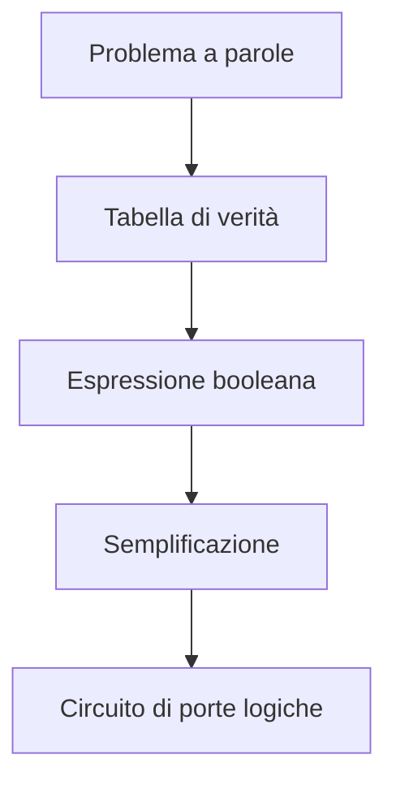
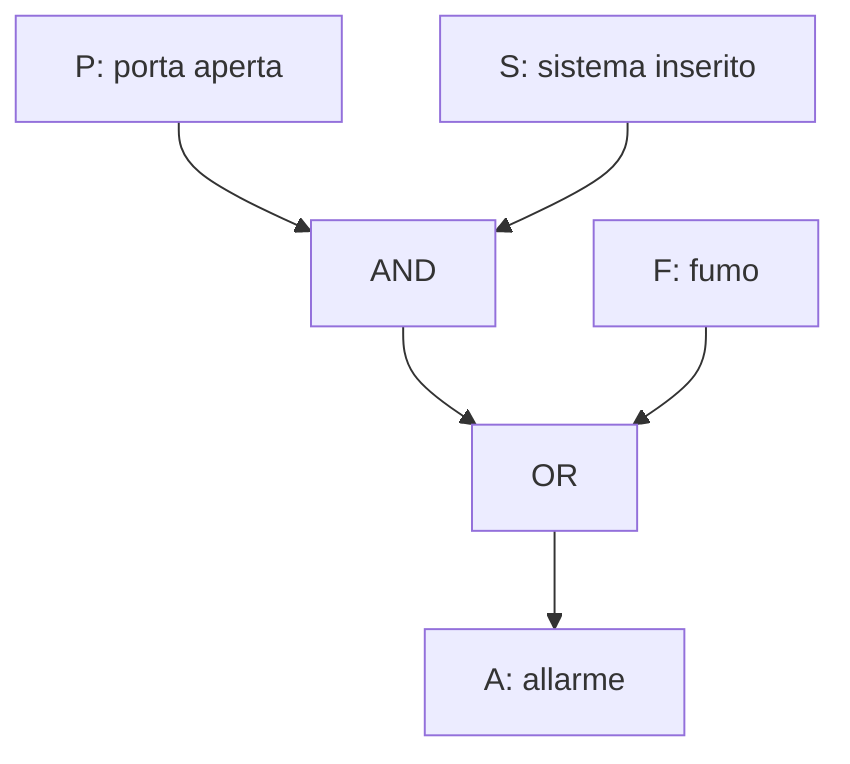
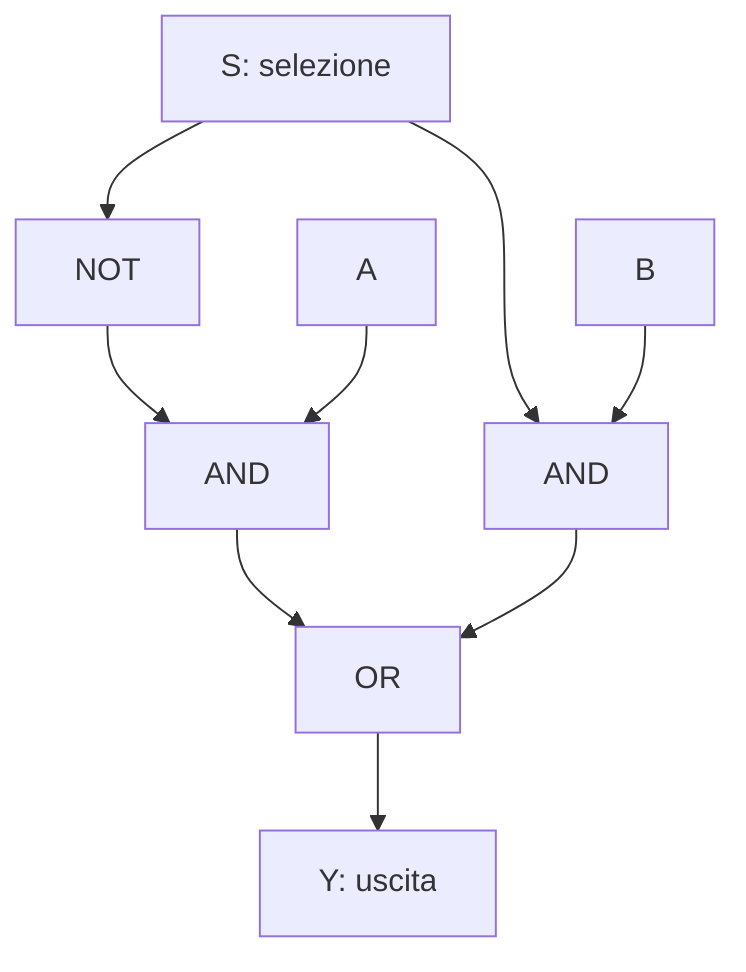
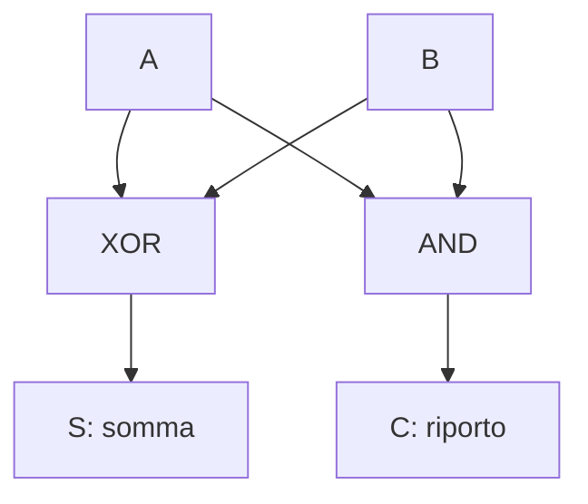
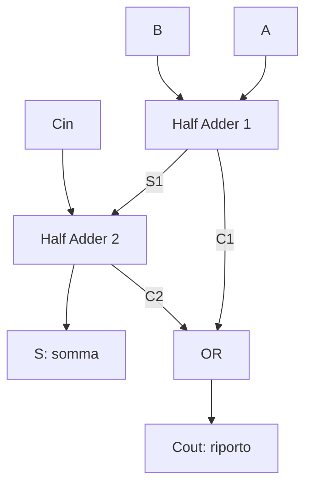
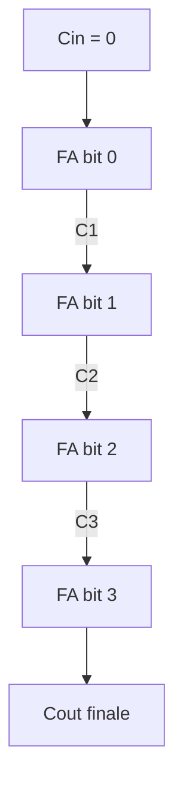

# ⚡ Modulo 3 — Algebra di Boole e Logica Digitale

- **Corso:** C Master — Dai Bit al Software
- **Piattaforma:** GCProf Academy
- **Livello:** 🟢 Base (Fase 1 — Fondamenti dell'Informatica)
- **Target:** Matricole di Ingegneria, studenti di discipline scientifiche e del triennio tecnico-scientifico, docenti, appassionati
- **Prerequisiti:** Moduli 1 e 2 (algoritmi, bit e sistema binario)
- **Obiettivo Didattico:** Padroneggiare gli operatori AND, OR, NOT (e XOR, NAND, NOR), costruire e leggere tabelle di verità, applicare le leggi di De Morgan e le principali proprietà per semplificare espressioni, progettare un semplice circuito combinatorio fino al sommatore (half adder e full adder) e collegare tutto agli operatori logici e bit a bit del linguaggio C.

> 🛠️ **Nota sul codice di questo modulo:** come nel Modulo 2, alcuni esempi usano cicli e funzioni che studierai nei Moduli 9 e 12. Trattali come **"scatole nere"**: leggi i commenti, esegui, osserva l'output.

---

<a id="indice"></a>
# 📑 Indice del Modulo 3

1. [Capitolo 1 — Dalla Logica ai Circuiti: Boole e Shannon](#capitolo-1)
2. [Capitolo 2 — Gli Operatori Fondamentali: AND, OR, NOT](#capitolo-2)
3. [Capitolo 3 — Altri Operatori: XOR, NAND, NOR, XNOR](#capitolo-3)
4. [Capitolo 4 — Proprietà e Leggi di De Morgan](#capitolo-4)
5. [Capitolo 5 — Dalla Tabella di Verità all'Espressione, e Semplificazione](#capitolo-5)
6. [Capitolo 6 — Porte Logiche e Circuiti Combinatori](#capitolo-6)
7. [Capitolo 7 — Il Sommatore: Half Adder e Full Adder](#capitolo-7)
8. [Capitolo 8 — Boole nel Linguaggio C: Operatori Logici e Bit a Bit](#capitolo-8)
9. [Capitolo 9 — Errori Comuni per Chi Inizia](#capitolo-9)
10. [Capitolo 10 — Sintesi, Laboratorio e Autoverifica](#capitolo-10)

---

<a id="capitolo-1"></a>
## 1. Capitolo 1 — Dalla Logica ai Circuiti: Boole e Shannon

Nel Modulo 2 hai visto che tutto, nel computer, si riduce a `0` e `1`. Ma come fa una macchina a **elaborare** quei bit, cioè a sommarli, confrontarli, prendere decisioni? La risposta è una delle idee più eleganti dell'intera scienza: **la logica**.

### 📜 Una storia in due atti

* **1854 — George Boole.** Il matematico inglese pubblica *An Investigation of the Laws of Thought*: mostra che il ragionamento logico ("vero" / "falso") si può trattare con regole algebriche, come i numeri. Nasce l'**algebra di Boole**.
* **1937 — Claude Shannon.** Ancora studente al MIT, nella sua tesi di master dimostra che l'algebra di Boole descrive perfettamente i **circuiti a interruttori** (i relè dell'epoca). Tradotto: *con la logica si possono progettare macchine che ragionano*.

Oggi al posto dei relè ci sono i **transistor**, e un processore ne contiene **miliardi**, ciascuno usato come minuscolo interruttore. Ma le regole sono sempre quelle di Boole.

### 🔗 Tre mondi, un solo linguaggio

| Mondo | `0` | `1` |
| :--- | :--- | :--- |
| **Logica** | Falso | Vero |
| **Elettronica** | Tensione bassa | Tensione alta |
| **Interruttore** | Aperto | Chiuso |

Un'**algebra booleana** lavora con **variabili che assumono solo due valori** (0 o 1) e con pochi **operatori** che le combinano. Sarà il mattone con cui, in questo modulo, costruirai perfino un **circuito che somma numeri**.

### 🗺️ Il flusso di progetto di un circuito

Come per gli algoritmi nel Modulo 1, anche progettare un circuito segue un percorso ordinato:



Lo percorreremo interamente nei Capitoli 5–7.

### 🎯 Perché serve a un ingegnere

* **Progettare hardware:** dalle porte logiche ai processori (elettronica, informatica).
* **Automazione industriale:** le logiche dei PLC (allarmi, sicurezze, sequenze) sono espressioni booleane.
* **Programmare:** ogni `if`, ogni `while` contiene una condizione booleana.
* **Basi di dati e ricerca:** filtri del tipo "(A **e** B) **oppure** non C".

[🔙 Torna all'indice](#indice)

---

<a id="capitolo-2"></a>
## 2. Capitolo 2 — Gli Operatori Fondamentali: AND, OR, NOT

### 🔌 L'intuizione degli interruttori

* **AND** = interruttori **in serie**: la corrente passa solo se sono chiusi **tutti**.
* **OR** = interruttori **in parallelo**: la corrente passa se ne basta **almeno uno** chiuso.
* **NOT** = un **inverter**: se entra 1 esce 0, e viceversa.

### 🧾 Le tre operazioni

**AND (congiunzione)** — il risultato è `1` solo se **entrambi** gli ingressi sono `1`.
*Esempio: "il forno si accende se la porta è chiusa **E** il timer è attivo".*

| A | B | A · B |
| :---: | :---: | :---: |
| 0 | 0 | 0 |
| 0 | 1 | 0 |
| 1 | 0 | 0 |
| 1 | 1 | **1** |

**OR (disgiunzione)** — il risultato è `1` se **almeno uno** degli ingressi è `1`.
*Esempio: "il ventilatore parte se la temperatura è alta **O** se c'è fumo".*

| A | B | A + B |
| :---: | :---: | :---: |
| 0 | 0 | 0 |
| 0 | 1 | **1** |
| 1 | 0 | **1** |
| 1 | 1 | **1** |

**NOT (negazione)** — inverte il valore.

| A | ¬A |
| :---: | :---: |
| 0 | 1 |
| 1 | 0 |

### 🔣 Notazioni e operatori del C

Lo stesso concetto ha più "vestiti". Ecco la tabella di corrispondenza che useremo per tutto il corso:

| Operazione | Simbolo logico | **Notazione del corso** | Operatore C *logico* | Operatore C *bit a bit* |
| :--- | :---: | :---: | :---: | :---: |
| AND | ∧ | `A · B` (o `AB`) | `&&` | `&` |
| OR | ∨ | `A + B` | `\|\|` | `\|` |
| NOT | ¬ | `¬A` | `!` | `~` |
| XOR | ⊕ | `A ⊕ B` | (si usa `!=`) | `^` |

⚠️ **Attenzione:** nell'algebra di Boole il simbolo `+` significa **OR**, non "somma". Nell'espressione `1 + 1 = 1`, l'OR di due `1` fa `1`! Non confonderlo con l'addizione aritmetica, che vedrai nel Capitolo 7.

### 🥇 Precedenza degli operatori

Come in aritmetica la moltiplicazione precede l'addizione, in Boole vale l'ordine:

1. **NOT** (`¬`) per primo
2. **AND** (`·`) poi
3. **OR** (`+`) per ultimo

Perciò `A + B · ¬C` significa `A + (B · (¬C))`. Nel dubbio, **usa le parentesi**: rendono l'espressione leggibile e mai ambigua.

[🔙 Torna all'indice](#indice)

---

<a id="capitolo-3"></a>
## 3. Capitolo 3 — Altri Operatori: XOR, NAND, NOR, XNOR

Con AND, OR, NOT si può costruire qualsiasi funzione, ma in pratica si usano anche altri operatori "derivati".

* **XOR (OR esclusivo)** — `1` se gli ingressi sono **diversi**. *"O l'uno o l'altro, ma non entrambi".* Ha una formula: `A ⊕ B = A · ¬B + ¬A · B`.
* **NAND** = `¬(A · B)` — AND seguito da NOT.
* **NOR** = `¬(A + B)` — OR seguito da NOT.
* **XNOR** = `¬(A ⊕ B)` — vale `1` se gli ingressi sono **uguali**.

### 📊 Tutte le tabelle insieme

| A | B | AND | OR | XOR | NAND | NOR | XNOR |
| :---: | :---: | :---: | :---: | :---: | :---: | :---: | :---: |
| 0 | 0 | 0 | 0 | 0 | 1 | 1 | 1 |
| 0 | 1 | 0 | 1 | 1 | 1 | 0 | 0 |
| 1 | 0 | 0 | 1 | 1 | 1 | 0 | 0 |
| 1 | 1 | 1 | 1 | 0 | 0 | 0 | 1 |

### 💡 XOR: l'operatore più sorprendente

* `A ⊕ 0 = A` (con 0 non cambia nulla)
* `A ⊕ 1 = ¬A` (con 1 **inverte**)
* `A ⊕ A = 0`
* Proprietà chiave: **`A ⊕ K ⊕ K = A`** — applicare due volte lo stesso XOR "annulla" l'effetto. È la base di controlli di errore, cifrature elementari e, come vedrai, del **sommatore**.

### 🧱 NAND e NOR sono "universali"

Un risultato notevole: **con sole porte NAND si costruisce qualunque circuito** (lo stesso vale per NOR). Ecco come:

| Funzione | Realizzazione con sole NAND |
| :--- | :--- |
| `¬A` | `A NAND A` |
| `A · B` | `(A NAND B) NAND (A NAND B)` |
| `A + B` | `(A NAND A) NAND (B NAND B)` |

*Perché conta:* i chip reali possono essere costruiti con un solo tipo di porta, ripetuto milioni di volte: più semplice e più economico da produrre.

```c
// ==================== ESEMPIO 3.1: TUTTE LE TABELLE DI VERITÀ ====================
/*
   Generiamo con due cicli annidati tutte le combinazioni di A e B (0 e 1)
   e calcoliamo i sei operatori. In C:
     &&  AND logico        ||  OR logico        !  NOT logico
     ^   XOR bit a bit     (su valori 0/1 si comporta come XOR logico)
   Il risultato di un'espressione logica in C è sempre 1 (vero) oppure 0 (falso).
*/

#include <stdio.h>

int main(void)
{
    printf(" A B | AND OR XOR NAND NOR XNOR\n");
    printf("-----+--------------------------\n");

    for (int a = 0; a <= 1; a++)            // A assume i valori 0 e 1
    {
        for (int b = 0; b <= 1; b++)        // per ogni A, B assume 0 e 1
        {
            printf(" %d %d |  %d   %d   %d    %d    %d    %d\n",
                   a, b,
                   a && b,                  // AND
                   a || b,                  // OR
                   a ^ b,                   // XOR
                   !(a && b),               // NAND = NOT(AND)
                   !(a || b),               // NOR  = NOT(OR)
                   !(a ^ b));               // XNOR = NOT(XOR)
        }
    }
    return 0;
}
```

**Output:**

```text
 A B | AND OR XOR NAND NOR XNOR
-----+--------------------------
 0 0 |  0   0   0    1    1    1
 0 1 |  0   1   1    1    0    0
 1 0 |  0   1   1    1    0    0
 1 1 |  1   1   0    0    0    1
```

Confronta l'output con la tabella teorica di questo capitolo: sono identiche. Hai appena **verificato con il computer** sei tabelle di verità. 🎉

[🔙 Torna all'indice](#indice)

---

<a id="capitolo-4"></a>
## 4. Capitolo 4 — Proprietà e Leggi di De Morgan

Come nell'algebra tradizionale, anche l'algebra di Boole ha **leggi** che permettono di trasformare (e semplificare) le espressioni **senza cambiarne il significato**.

### 📚 Le proprietà fondamentali

| Nome | Forma AND | Forma OR |
| :--- | :--- | :--- |
| **Elemento neutro** | `A · 1 = A` | `A + 0 = A` |
| **Elemento dominante** | `A · 0 = 0` | `A + 1 = 1` |
| **Idempotenza** | `A · A = A` | `A + A = A` |
| **Complemento** | `A · ¬A = 0` | `A + ¬A = 1` |
| **Doppia negazione** | `¬(¬A) = A` | |
| **Commutativa** | `A · B = B · A` | `A + B = B + A` |
| **Associativa** | `(A · B) · C = A · (B · C)` | `(A + B) + C = A + (B + C)` |
| **Distributiva** | `A · (B + C) = A·B + A·C` | `A + B·C = (A + B) · (A + C)` |
| **Assorbimento** | `A · (A + B) = A` | `A + A·B = A` |

🪞 **Principio di dualità:** ogni identità resta valida se si **scambiano AND con OR e 0 con 1**. È per questo che le colonne della tabella si "rispecchiano".

⚠️ Attenzione alla **seconda distributiva** (`A + B·C = (A+B)·(A+C)`): non ha equivalente nell'algebra dei numeri, e la sorpresa è frequente.

### ⚖️ Le leggi di De Morgan

Sono le più usate in pratica. Legano AND, OR e NOT:

> **`¬(A · B) = ¬A + ¬B`** — la negazione di un AND è l'OR delle negazioni
> **`¬(A + B) = ¬A · ¬B`** — la negazione di un OR è l'AND delle negazioni

**Traduzione a parole:** "non è vero che (piove **e** ho l'ombrello)" equivale a "non piove **oppure** non ho l'ombrello".

**Dimostrazione con la tabella di verità** della prima legge:

| A | B | A · B | ¬(A · B) | ¬A | ¬B | ¬A + ¬B |
| :---: | :---: | :---: | :---: | :---: | :---: | :---: |
| 0 | 0 | 0 | **1** | 1 | 1 | **1** |
| 0 | 1 | 0 | **1** | 1 | 0 | **1** |
| 1 | 0 | 0 | **1** | 0 | 1 | **1** |
| 1 | 1 | 1 | **0** | 0 | 0 | **0** |

Le colonne evidenziate sono **identiche**: le due espressioni sono equivalenti.

💡 **Metodo universale:** per dimostrare che due espressioni sono equivalenti, basta costruire la **tabella di verità di entrambe** e confrontarle riga per riga. Con *n* variabili le righe sono 2ⁿ (ti ricorda qualcosa del Modulo 2?).

```c
// ==================== ESEMPIO 3.2: DIMOSTRARE LE LEGGI CON IL COMPUTER ====================
/*
   Per dimostrare un'equivalenza basta provare TUTTE le combinazioni degli ingressi.
   Qui verifichiamo, con tre cicli annidati (2*2*2 = 8 combinazioni di A, B, C):
     1) De Morgan sull'AND:   !(a && b)  ==  (!a || !b)
     2) De Morgan sull'OR:    !(a || b)  ==  (!a && !b)
     3) Assorbimento:         a || (a && b)  ==  a
   Ogni verifica parte da "tutto ok" (1) e diventa 0 al primo controesempio.
*/

#include <stdio.h>

int main(void)
{
    int ok1 = 1, ok2 = 1, ok3 = 1;

    for (int a = 0; a <= 1; a++)
    {
        for (int b = 0; b <= 1; b++)
        {
            for (int c = 0; c <= 1; c++)        // c non serve alle leggi 1-3, ma prova tutte le righe
            {
                if (!(a && b) != (!a || !b))  ok1 = 0;   // controesempio a De Morgan (AND)
                if (!(a || b) != (!a && !b))  ok2 = 0;   // controesempio a De Morgan (OR)
                if ((a || (a && b)) != a)     ok3 = 0;   // controesempio all'assorbimento
                (void)c;                                  // evita l'avviso "variabile inutilizzata"
            }
        }
    }

    printf("De Morgan (AND) : %s\n", ok1 ? "VERIFICATA" : "FALSA");
    printf("De Morgan (OR)  : %s\n", ok2 ? "VERIFICATA" : "FALSA");
    printf("Assorbimento    : %s\n", ok3 ? "VERIFICATA" : "FALSA");

    return 0;
}
```

**Output:**

```text
De Morgan (AND) : VERIFICATA
De Morgan (OR)  : VERIFICATA
Assorbimento    : VERIFICATA
```

[🔙 Torna all'indice](#indice)

---

<a id="capitolo-5"></a>
## 5. Capitolo 5 — Dalla Tabella di Verità all'Espressione, e Semplificazione

Ora sappiamo leggere le tabelle. Il passo davvero *ingegneristico* è l'opposto: **partire da un problema a parole e arrivare a un'espressione**.

### 🛠️ Il metodo dei mintermini (somma di prodotti)

1. Traduci il problema in una **tabella di verità** (una riga per ogni combinazione degli ingressi).
2. Per **ogni riga in cui l'uscita vale 1**, scrivi un **prodotto** (AND) di tutti gli ingressi: la variabile appare **negata** se in quella riga vale 0, **affermata** se vale 1.
3. Fai l'**OR** di tutti i prodotti ottenuti. Questa è la **forma canonica**, sempre corretta ma spesso ridondante.
4. **Semplifica** con le leggi del Capitolo 4.

### 🗳️ Esempio: la funzione "maggioranza"

*Problema:* un'uscita **M** deve valere `1` quando **almeno due** dei tre ingressi A, B, C sono a `1` (una votazione a maggioranza semplice: lo trovi nei sistemi di sicurezza ridondanti, dove tre sensori "votano").

**Passo 1 — Tabella di verità:**

| A | B | C | M |
| :---: | :---: | :---: | :---: |
| 0 | 0 | 0 | 0 |
| 0 | 0 | 1 | 0 |
| 0 | 1 | 0 | 0 |
| 0 | 1 | 1 | **1** |
| 1 | 0 | 0 | 0 |
| 1 | 0 | 1 | **1** |
| 1 | 1 | 0 | **1** |
| 1 | 1 | 1 | **1** |

**Passo 2–3 — Somma di prodotti** (una riga per ogni `1`):

`M = ¬A·B·C + A·¬B·C + A·B·¬C + A·B·C`

**Passo 4 — Semplificazione.** L'idea: raggruppare i termini che differiscono per **una sola variabile**, sfruttando `X·Y + X·¬Y = X`. Sfruttiamo l'idempotenza per riusare `A·B·C` tre volte:

* `¬A·B·C + A·B·C = B·C·(¬A + A) = B·C`
* `A·¬B·C + A·B·C = A·C·(¬B + B) = A·C`
* `A·B·¬C + A·B·C = A·B·(¬C + C) = A·B`

Risultato finale, molto più compatto:

> **`M = A·B + A·C + B·C`**

*(Da 4 prodotti di 3 variabili a 3 prodotti di 2 variabili: meno porte, meno costo, meno consumo.)*

### 🚨 Un secondo esempio: l'allarme

*Problema:* un allarme **A** suona se **(la porta è aperta P e il sistema è inserito S)** oppure se c'è **fumo F**.

* Espressione (diretta dal testo): `A = P·S + F`
* Tabella di verità: 8 righe; `A = 1` in 5 di esse (tutte quelle con F = 1, più P = S = 1 con F = 0).

Qui l'espressione è già minima: la semplificazione non sempre serve, e il **testo del problema** spesso fornisce direttamente la forma giusta.

### 🗺️ Un cenno alle mappe di Karnaugh

Semplificare con l'algebra richiede "occhio". Un metodo **grafico**, le **mappe di Karnaugh**, dispone la tabella di verità in una griglia in cui i termini "adiacenti" (che differiscono di un solo bit) si raggruppano a colpo d'occhio. È uno strumento standard nei corsi di elettronica digitale: qui ti basta sapere che esiste e che formalizza il ragionamento fatto sopra.

[🔙 Torna all'indice](#indice)

---

<a id="capitolo-6"></a>
## 6. Capitolo 6 — Porte Logiche e Circuiti Combinatori

### 🚪 Le porte logiche

Una **porta logica** (*logic gate*) è un piccolo circuito elettronico che realizza fisicamente un operatore booleano. Ogni porta ha uno **simbolo standard** e un suo nome:

| Porta | Espressione | Uscita = 1 quando… |
| :--- | :--- | :--- |
| **NOT** (inverter) | `¬A` | l'ingresso è 0 |
| **AND** | `A · B` | **tutti** gli ingressi sono 1 |
| **OR** | `A + B` | **almeno uno** è 1 |
| **NAND** | `¬(A · B)` | **non** tutti gli ingressi sono 1 |
| **NOR** | `¬(A + B)` | **tutti** gli ingressi sono 0 |
| **XOR** | `A ⊕ B` | gli ingressi sono **diversi** |
| **XNOR** | `¬(A ⊕ B)` | gli ingressi sono **uguali** |

### 🔧 Circuiti combinatori

Collegando le porte si ottiene un **circuito combinatorio**: un circuito la cui **uscita dipende soltanto dagli ingressi attuali**, senza "memoria" di ciò che è successo prima. Le funzioni viste finora (maggioranza, allarme, sommatore) sono tutte combinatorie.

*(Se invece l'uscita dipende anche dalla **storia** degli ingressi, il circuito è **sequenziale**: è il caso delle celle di memoria e dei registri della CPU, che incontrerai nel Modulo 4.)*

### 🚨 Il circuito dell'allarme: `A = P·S + F`



Per leggere il diagramma: parti dagli **ingressi in alto** e segui le frecce verso l'**uscita in basso**. Ogni riquadro "AND"/"OR" è una porta.

### 🔀 Un circuito importante: il multiplexer 2:1

Un **multiplexer** è un "selettore": un ingresso di controllo **S** decide quale tra due ingressi dati (**A** o **B**) arriva in uscita.

> **`Y = ¬S·A + S·B`** — se `S = 0` esce A; se `S = 1` esce B.

I multiplexer sono ovunque nella CPU: scelgono, per esempio, da quale registro leggere un operando.



[🔙 Torna all'indice](#indice)

---

<a id="capitolo-7"></a>
## 7. Capitolo 7 — Il Sommatore: Half Adder e Full Adder

Eccoci al momento più bello del modulo: mostrare che **la logica sa fare aritmetica**. Somma di due bit, in binario:

* `0 + 0 = 0`
* `0 + 1 = 1`
* `1 + 0 = 1`
* `1 + 1 = 10₂` → **somma 0, con riporto 1** (come `9 + 1 = 10` in decimale: scrivo 0 e "riporto 1")

### ➕ Il semisommatore (Half Adder)

Somma **due bit** A e B e produce due uscite: la **somma S** e il **riporto C** (carry).

| A | B | S (somma) | C (riporto) |
| :---: | :---: | :---: | :---: |
| 0 | 0 | 0 | 0 |
| 0 | 1 | 1 | 0 |
| 1 | 0 | 1 | 0 |
| 1 | 1 | 0 | 1 |

Guardando le colonne si riconoscono subito due operatori già noti:

> **`S = A ⊕ B`** (XOR) e **`C = A · B`** (AND)

*Un intero circuito sommatore a partire da due sole porte.*



### ➕➕ Il sommatore completo (Full Adder)

Per sommare numeri di più bit, ogni colonna deve gestire **tre** ingressi: i due bit **A** e **B** e il **riporto in ingresso Cin** proveniente dalla colonna a destra.

| A | B | Cin | S | Cout |
| :---: | :---: | :---: | :---: | :---: |
| 0 | 0 | 0 | 0 | 0 |
| 0 | 0 | 1 | 1 | 0 |
| 0 | 1 | 0 | 1 | 0 |
| 0 | 1 | 1 | 0 | 1 |
| 1 | 0 | 0 | 1 | 0 |
| 1 | 0 | 1 | 0 | 1 |
| 1 | 1 | 0 | 0 | 1 |
| 1 | 1 | 1 | 1 | 1 |

Le formule:

> **`S = A ⊕ B ⊕ Cin`**
> **`Cout = A·B + Cin·(A ⊕ B)`**

E il circuito si ottiene con **due half adder** e una porta OR:



```c
// ==================== ESEMPIO 3.3: LA TABELLA DEL FULL ADDER ====================
/*
   Calcoliamo la tabella di verità del sommatore completo con gli operatori bit a bit:
     S    = a ^ b ^ cin                  (XOR di tutti e tre)
     cout = (a & b) | (cin & (a ^ b))    (formula del riporto)
   Confronta l'output con la tabella teorica del Capitolo 7.
*/

#include <stdio.h>

int main(void)
{
    printf(" A B Cin | S Cout\n");
    printf("---------+-------\n");

    for (int a = 0; a <= 1; a++)
    {
        for (int b = 0; b <= 1; b++)
        {
            for (int cin = 0; cin <= 1; cin++)
            {
                int s    = a ^ b ^ cin;                     // bit di somma
                int cout = (a & b) | (cin & (a ^ b));       // bit di riporto in uscita
                printf(" %d %d  %d  | %d  %d\n", a, b, cin, s, cout);
            }
        }
    }
    return 0;
}
```

**Output:**

```text
 A B Cin | S Cout
---------+-------
 0 0  0  | 0  0
 0 0  1  | 1  0
 0 1  0  | 1  0
 0 1  1  | 0  1
 1 0  0  | 1  0
 1 0  1  | 0  1
 1 1  0  | 0  1
 1 1  1  | 1  1
```

### 🔗 Sommare numeri a più bit: il "ripple-carry"

Mettiamo in fila **quattro full adder**, uno per bit, collegando il riporto d'uscita di ciascuno al riporto d'ingresso del successivo. Il riporto "si propaga a onda" (*ripple*) da destra a sinistra, esattamente come quando sommi a mano in colonna.



**Esempio: 6 + 7 su 4 bit** (`0110 + 0111`)

| Bit | A | B | Cin | S | Cout |
| :---: | :---: | :---: | :---: | :---: | :---: |
| 0 | 0 | 1 | 0 | **1** | 0 |
| 1 | 1 | 1 | 0 | **0** | 1 |
| 2 | 1 | 1 | 1 | **1** | 1 |
| 3 | 0 | 0 | 1 | **1** | 0 |

Risultato (bit 3…0): **`1101`** = 13 ✅

### ⚠️ Il riporto finale = overflow (Modulo 2)

Se dopo l'ultimo bit il riporto **Cout vale 1**, il risultato non entra nei bit disponibili. Per esempio `1001 + 1001` (9 + 9) dà `0010` con riporto finale 1: 18 non è rappresentabile su 4 bit senza segno. Ecco l'**overflow** del Modulo 2, visto "dall'interno" del circuito.

### ➖ Bonus: la sottrazione con lo stesso circuito

Ricordi il **complemento a 2**? Sottrarre equivale a sommare l'opposto: **`A − B = A + ¬B + 1`**. Basta **invertire i bit di B** e porre **Cin = 1**: lo **stesso sommatore** svolge sia addizioni sia sottrazioni. Questa è la ragione profonda per cui il complemento a 2 ha vinto.

```c
// ==================== ESEMPIO 3.4: UN SOMMATORE RIPPLE-CARRY A 4 BIT IN C ====================
/*
   Simuliamo il circuito dei quattro full adder: un ciclo elabora un bit alla volta,
   dal meno significativo (bit 0) al più significativo (bit 3), propagando il riporto.
   Alla fine mostriamo il risultato e se si è verificato un riporto finale (overflow senza segno).
   (Funzioni: Modulo 12. Le usiamo come "scatole nere".)
*/

#include <stdio.h>

void somma_4bit(unsigned int a, unsigned int b)
{
    unsigned int risultato = 0;     // qui costruiamo i bit del risultato
    unsigned int riporto = 0;       // riporto in ingresso al bit corrente (Cin), parte da 0

    printf("%u + %u (4 bit)\n", a, b);

    for (int i = 0; i < 4; i++)
    {
        unsigned int ai = (a >> i) & 1u;                    // bit i-esimo di a
        unsigned int bi = (b >> i) & 1u;                    // bit i-esimo di b

        unsigned int s = ai ^ bi ^ riporto;                 // somma del full adder
        unsigned int nuovo = (ai & bi) | (riporto & (ai ^ bi));   // riporto in uscita

        printf("  bit %d: a=%u b=%u cin=%u -> S=%u cout=%u\n", i, ai, bi, riporto, s, nuovo);

        risultato |= (s << i);      // inseriamo il bit di somma nella posizione i
        riporto = nuovo;            // il riporto in uscita diventa il Cin del bit successivo
    }

    // Stampa del risultato in binario a 4 bit (bit 3 ... bit 0)
    printf("  Risultato: ");
    for (int i = 3; i >= 0; i--)
    {
        putchar(((risultato >> i) & 1u) ? '1' : '0');
    }
    printf(" (%u), riporto finale = %u", risultato, riporto);
    if (riporto == 1)
    {
        printf("  <-- OVERFLOW senza segno!");
    }
    printf("\n\n");
}

int main(void)
{
    somma_4bit(6, 7);       // 0110 + 0111 = 1101 (13): nessun overflow
    somma_4bit(9, 9);       // 1001 + 1001 = 10010: non entra in 4 bit
    return 0;
}
```

**Output:**

```text
6 + 7 (4 bit)
  bit 0: a=0 b=1 cin=0 -> S=1 cout=0
  bit 1: a=1 b=1 cin=0 -> S=0 cout=1
  bit 2: a=1 b=1 cin=1 -> S=1 cout=1
  bit 3: a=0 b=0 cin=1 -> S=1 cout=0
  Risultato: 1101 (13), riporto finale = 0

9 + 9 (4 bit)
  bit 0: a=1 b=1 cin=0 -> S=0 cout=1
  bit 1: a=0 b=0 cin=1 -> S=1 cout=0
  bit 2: a=0 b=0 cin=0 -> S=0 cout=0
  bit 3: a=1 b=1 cin=0 -> S=0 cout=1
  Risultato: 0010 (2), riporto finale = 1  <-- OVERFLOW senza segno!

```

Hai appena scritto un **simulatore software di un circuito hardware**: la prova che hardware e software sono due facce della stessa medaglia. 🚀

[🔙 Torna all'indice](#indice)

---

<a id="capitolo-8"></a>
## 8. Capitolo 8 — Boole nel Linguaggio C: Operatori Logici e Bit a Bit

Il C ha **due famiglie** di operatori booleani, che sembrano simili ma fanno cose diverse. Tienile ben separate fin da subito. (Nel Modulo 6 le approfondiremo.)

### 🅰️ Operatori **logici**: `&&`, `||`, `!`

* Lavorano sul **valore di verità** dell'intero operando: in C, **`0` è falso, qualsiasi valore diverso da 0 è vero**.
* Restituiscono sempre **`1`** (vero) o **`0`** (falso).
* Si usano nelle **condizioni** (`if`, `while`).
* Sono a **corto circuito** (*short-circuit*): `&&` non valuta il secondo operando se il primo è già falso; `||` non lo valuta se il primo è già vero.

### 🅱️ Operatori **bit a bit**: `&`, `|`, `^`, `~`

* Lavorano **su ogni bit** separatamente, confrontando le posizioni corrispondenti dei due operandi.
* Il risultato è un **numero**, non un semplice vero/falso.
* Si usano per **manipolare i bit** (maschere, flag, protocolli, hardware).

| Operazione sui valori 2 (`010`) e 4 (`100`) | Con operatori **logici** | Con operatori **bit a bit** |
| :--- | :--- | :--- |
| AND | `2 && 4` → **1** (entrambi "veri") | `2 & 4` → **0** (nessun bit in comune) |
| OR | `2 \|\| 4` → **1** | `2 \| 4` → **6** (`010 \| 100 = 110`) |

⚠️ **Errore classico:** scrivere `&` al posto di `&&` (o viceversa) **compila senza errori** ma cambia il risultato. Nelle condizioni usa quasi sempre `&&` e `||`.

### 🎛️ Le maschere di bit: 4 operazioni fondamentali

Un byte può contenere **8 "interruttori"** (flag): ad esempio i permessi di un file o gli stati di un dispositivo. Per manipolare un singolo bit *n*, si usa una **maschera** `(1u << n)`, cioè un numero con un solo `1` nella posizione *n*.

| Operazione | Codice C | Effetto sul bit *n* |
| :--- | :--- | :--- |
| **Impostare** (set) | `x \|= (1u << n);` | Lo porta a **1** |
| **Azzerare** (clear) | `x &= ~(1u << n);` | Lo porta a **0** |
| **Invertire** (toggle) | `x ^= (1u << n);` | Lo **inverte** |
| **Verificare** (test) | `(x & (1u << n)) != 0` | Vale 1 se il bit è **1** |

*Ecco XOR e AND al lavoro: `|` accende, `& ~` spegne, `^` inverte, `&` legge.*

```c
// ==================== ESEMPIO 3.5: LOGICI CONTRO BIT A BIT, E LE MASCHERE ====================
/*
   Parte 1: la differenza tra && e & (e tra || e |).
   Parte 2: le quattro operazioni sulle maschere, su un byte "flags" di 8 interruttori.
   Parte 3: il corto circuito di &&.
*/

#include <stdio.h>

void stampa_binario(unsigned int valore, int n_bit)     // lo strumento del Modulo 2
{
    for (int i = n_bit - 1; i >= 0; i--)
    {
        putchar(((valore >> i) & 1u) ? '1' : '0');
    }
}

int main(void)
{
    // ---------- PARTE 1: logici contro bit a bit ----------
    int x = 2, y = 4;                       // 2 = 010, 4 = 100
    printf("x && y = %d   (logico: due valori non nulli -> vero)\n", x && y);
    printf("x &  y = %d   (bit a bit: 010 & 100 = 000)\n", x & y);
    printf("x || y = %d\n", x || y);
    printf("x |  y = %d   (bit a bit: 010 | 100 = 110)\n", x | y);

    // ---------- PARTE 2: le maschere ----------
    unsigned char flags = 0;                // 00000000: tutti gli interruttori spenti
    printf("\nPartenza       : "); stampa_binario(flags, 8); printf("\n");

    flags |= (1u << 0);                     // SET del bit 0
    flags |= (1u << 3);                     // SET del bit 3
    printf("Set bit 0 e 3  : "); stampa_binario(flags, 8); printf("  (= %d)\n", flags);

    printf("Il bit 3 e' acceso? %s\n", (flags & (1u << 3)) != 0 ? "si" : "no");
    printf("Il bit 5 e' acceso? %s\n", (flags & (1u << 5)) != 0 ? "si" : "no");

    flags &= ~(1u << 0);                    // CLEAR del bit 0
    printf("Clear bit 0    : "); stampa_binario(flags, 8); printf("\n");

    flags ^= (1u << 7);                     // TOGGLE del bit 7
    printf("Toggle bit 7   : "); stampa_binario(flags, 8); printf("\n");

    // ---------- PARTE 3: il corto circuito ----------
    int d = 0;
    if (d != 0 && 10 / d > 1)               // se d è 0 il primo termine è FALSO: la divisione NON viene eseguita
    {
        printf("\nramo non raggiungibile\n");
    }
    else
    {
        printf("\nDivisione per zero evitata grazie al corto circuito.\n");
    }

    return 0;
}
```

**Output:**

```text
x && y = 1   (logico: due valori non nulli -> vero)
x &  y = 0   (bit a bit: 010 & 100 = 000)
x || y = 1
x |  y = 6   (bit a bit: 010 | 100 = 110)

Partenza       : 00000000
Set bit 0 e 3  : 00001001  (= 9)
Il bit 3 e' acceso? si
Il bit 5 e' acceso? no
Clear bit 0    : 00001000
Toggle bit 7   : 10001000

Divisione per zero evitata grazie al corto circuito.
```

### 🔐 XOR al lavoro: una cifratura giocattolo

Ricordi la proprietà `A ⊕ K ⊕ K = A`? Cifrare con XOR e decifrare con lo stesso XOR restituisce l'originale. È il principio di base di molti sistemi di cifratura a flusso. Ma attenzione: **questa versione minima non è sicura**, è solo per capire il meccanismo.

```c
// ==================== ESEMPIO 3.6: XOR, LA CIFRATURA GIOCATTOLO ====================
/*
   Cifriamo un carattere con una "chiave" usando XOR, poi lo decifriamo con la stessa chiave.
   ATTENZIONE: è solo una dimostrazione didattica, NON è sicura per l'uso reale.
*/

#include <stdio.h>

int main(void)
{
    unsigned char messaggio = 'C';          // 0x43 = 01000011
    unsigned char chiave    = 0x5A;         //        01011010

    unsigned char cifrato   = messaggio ^ chiave;   // A XOR K
    unsigned char decifrato = cifrato ^ chiave;     // (A XOR K) XOR K = A

    printf("Messaggio : '%c' = 0x%02X\n", messaggio, messaggio);
    printf("Cifrato   : 0x%02X\n", cifrato);
    printf("Decifrato : '%c' = 0x%02X\n", decifrato, decifrato);

    return 0;
}
```

**Output:**

```text
Messaggio : 'C' = 0x43
Cifrato   : 0x19
Decifrato : 'C' = 0x43
```

[🔙 Torna all'indice](#indice)

---

<a id="capitolo-9"></a>
## 9. Capitolo 9 — Errori Comuni per Chi Inizia

| Errore | Perché è sbagliato | Come evitarlo |
| :--- | :--- | :--- |
| Confondere `+` (OR) con la somma | In Boole `1 + 1 = 1` | Ricorda: nell'algebra di Boole `+` è OR |
| Scrivere `&` al posto di `&&` nelle condizioni | Compila ma calcola altro (`2 & 4` è 0, `2 && 4` è 1) | Nelle condizioni usa `&&`, `\|\|`, `!` |
| Usare `~` per negare un valore vero/falso | `~0` vale −1 e `~1` vale −2: entrambi sono "veri"! | Per la negazione logica usa `!` |
| Scrivere `x & 1 == 0` | `==` ha **precedenza maggiore** di `&`: viene letto `x & (1 == 0)` | Usa le parentesi: `(x & 1) == 0` |
| Dimenticare le parentesi tra AND e OR | `A + B·C` non è `(A + B)·C` | Aggiungi parentesi in caso di dubbio |
| Applicare De Morgan solo a metà | `¬(A·B)` **non** è `¬A·¬B`: si scambia anche l'operatore | `¬(A·B) = ¬A + ¬B` (e viceversa) |
| Scrivere `=` invece di `==` in una condizione | `=` assegna, `==` confronta (vedi Modulo 8) | Leggi: "uguale" = due segni |
| Tabelle di verità con righe mancanti | Con *n* ingressi servono **2ⁿ** righe | Genera le righe contando in binario |
| Confondere "OR" logico con "o" del linguaggio naturale | Nel parlato "o" spesso è *esclusivo* ("tè **o** caffè?"); in Boole OR include il caso "entrambi" | Per l'esclusivo usa XOR |

💡 **Consiglio pratico:** in caso di dubbio su un'espressione, **costruisci la tabella di verità** o verificala con un piccolo programma C come l'Esempio 3.2. Il computer non ha opinioni: fa il conto.

[🔙 Torna all'indice](#indice)

---

<a id="capitolo-10"></a>
## 10. Capitolo 10 — Sintesi, Laboratorio e Autoverifica

### 💡 Punti Chiave del Modulo 3

1. L'**algebra di Boole** (Boole 1854, Shannon 1937) tratta variabili a due valori (0/1 = falso/vero = tensione bassa/alta) e i loro operatori: è il fondamento di ogni circuito digitale.
2. Gli operatori base sono **AND** (`·`), **OR** (`+`), **NOT** (`¬`); precedenza: NOT, poi AND, poi OR. Gli operatori derivati sono **XOR**, **NAND**, **NOR**, **XNOR**.
3. Le **tabelle di verità** elencano tutte le 2ⁿ combinazioni degli ingressi e permettono di **dimostrare** equivalenze.
4. Le **leggi di De Morgan**: `¬(A·B) = ¬A + ¬B` e `¬(A+B) = ¬A · ¬B`. Insieme a distributiva, assorbimento e complemento servono a **semplificare** espressioni.
5. **NAND** (e **NOR**) sono **universali**: qualsiasi circuito si può costruire con un solo tipo di porta.
6. Il flusso di progetto: **problema → tabella di verità → espressione (somma di prodotti) → semplificazione → circuito**.
7. Un **circuito combinatorio** ha uscite che dipendono solo dagli ingressi attuali; uno **sequenziale** ha memoria.
8. **Half adder:** `S = A ⊕ B`, `C = A·B`. **Full adder:** `S = A ⊕ B ⊕ Cin`, `Cout = A·B + Cin·(A ⊕ B)`. Concatenandoli (**ripple-carry**) si somma su *n* bit; un riporto finale a 1 segnala **overflow** senza segno; con `A + ¬B + 1` lo stesso circuito **sottrae**.
9. In C: **`&&`, `||`, `!`** sono operatori *logici* (0 = falso, non-0 = vero, corto circuito); **`&`, `|`, `^`, `~`** lavorano *bit per bit*. Le **maschere** `(1u << n)` permettono di impostare, azzerare, invertire e leggere un singolo bit.

---

### 📖 Mini-Glossario

| Termine | Significato |
| :--- | :--- |
| **Algebra di Boole** | Algebra di variabili a due valori (0/1) con operatori AND, OR, NOT |
| **Tabella di verità** | Elenco dei valori d'uscita per tutte le combinazioni degli ingressi |
| **AND / OR / NOT** | Congiunzione, disgiunzione, negazione |
| **XOR** | OR esclusivo: vale 1 se gli ingressi sono diversi |
| **NAND / NOR** | AND / OR seguiti da NOT; porte universali |
| **Legge di De Morgan** | `¬(A·B) = ¬A + ¬B`, `¬(A+B) = ¬A · ¬B` |
| **Somma di prodotti** | Forma canonica: OR di termini AND (mintermini) |
| **Porta logica** | Circuito che realizza un operatore booleano |
| **Circuito combinatorio** | Uscite che dipendono solo dagli ingressi attuali |
| **Circuito sequenziale** | Uscite che dipendono anche dalla storia (ha memoria) |
| **Half adder / Full adder** | Sommatore di 2 bit / di 3 bit (con riporto in ingresso) |
| **Riporto (carry)** | Bit che si trasmette alla colonna successiva |
| **Maschera di bit** | Numero usato per isolare o modificare singoli bit |
| **Corto circuito** | Valutazione di `&&` / `\|\|` che salta il secondo operando quando non serve |

---

### 🧪 Laboratorio Pratico: "Il Progettista Digitale"

**Obiettivo:** progettare circuiti a partire da un problema e verificarli al computer.

**Parte A — Carta e penna**
1. Costruisci la tabella di verità di `F = A·¬B + ¬A·B` e riconosci di che operatore si tratta.
2. Dimostra con la tabella di verità la **seconda legge di De Morgan**: `¬(A + B) = ¬A · ¬B`.
3. Semplifica con le leggi del Capitolo 4: `A·B + A·¬B`; `A + A·B`; `(A + B)·(A + ¬B)`.
4. **Progetta** (tabella → espressione → semplificazione) un circuito con tre ingressi che valga 1 **solo quando esattamente un ingresso** è a 1.
5. Realizza `A + B` usando **soltanto porte NAND** e disegnalo (anche in Mermaid, come nei Capitoli 6–7).

**Parte B — Verifica con OnlineGDB**
6. Esegui gli **Esempi 3.1, 3.2 e 3.3** e confronta gli output con le tabelle del modulo.
7. Nell'**Esempio 3.2**, aggiungi la verifica della **seconda legge distributiva** `A + B·C = (A + B)·(A + C)` (in C: `a || (b && c)` contro `(a || b) && (a || c)`).
8. Con l'**Esempio 3.5**, imposta i bit 1, 4 e 6 di `flags`, azzera il bit 4 e invertine due a scelta, stampando ogni passo.

**Parte C — Programmare la logica**
9. Scrivi un programma che stampi la **tabella di verità** di `F = (A ∧ ¬B) ∨ C` con tre cicli annidati, poi verificala a mano.
10. Nell'**Esempio 3.6**, cifra con XOR tre caratteri a scelta (una riga per carattere) e verifica che la decifratura li restituisca.

**🚀 Sfida finale**
11. **Estendi l'Esempio 3.4 a 8 bit** (cambia i limiti del ciclo) e prova `200 + 100`: cosa succede al riporto finale? Poi realizza la **sottrazione** `A − B` come `A + ¬B + 1` su 4 bit, e verifica `9 − 5 = 4`.

*Suggerimento:* riusa la struttura dei cicli annidati dell'Esempio 3.1 e le formule del Capitolo 7.

---

### ❓ Quiz di Autoverifica

**Domanda 1:** Quando l'uscita di una porta XOR a due ingressi vale 1?
- A) Quando entrambi gli ingressi sono 1
- B) Quando entrambi gli ingressi sono 0
- C) Quando gli ingressi sono diversi tra loro
- D) Sempre

**Domanda 2:** Secondo De Morgan, `¬(A · B)` è equivalente a:
- A) `¬A · ¬B`
- B) `¬A + ¬B`
- C) `A + B`
- D) `¬A · B`

**Domanda 3:** Quale porta logica è "universale", cioè permette da sola di costruire qualsiasi circuito?
- A) AND
- B) OR
- C) XOR
- D) NAND

**Domanda 4:** Un full adder riceve in ingresso A = 1, B = 1, Cin = 1. Quali sono S e Cout?
- A) S = 0, Cout = 1
- B) S = 1, Cout = 0
- C) S = 1, Cout = 1
- D) S = 0, Cout = 0

**Domanda 5:** In C, quanto valgono rispettivamente `2 && 4` e `2 & 4`?
- A) 1 e 0
- B) 1 e 1
- C) 6 e 6
- D) 0 e 1

**Domanda 6:** Quali porte servono per realizzare un half adder?
- A) Due OR
- B) Una XOR (per la somma) e una AND (per il riporto)
- C) Una NOT e una OR
- D) Due NAND e una NOR

**Domanda 7:** Quale istruzione C **azzera** il bit 3 della variabile `x` (senza modificare gli altri)?
- A) `x |= (1u << 3);`
- B) `x ^= (1u << 3);`
- C) `x &= ~(1u << 3);`
- D) `x = 1u << 3;`

---

[🔙 Torna all'indice](#indice)