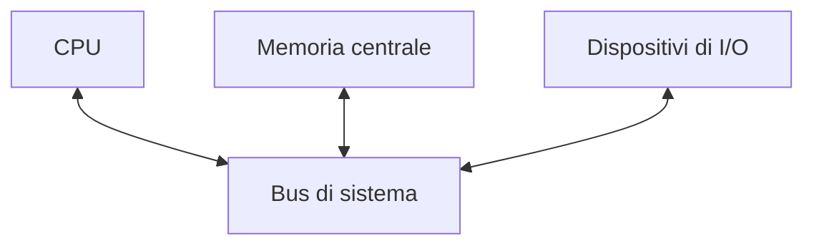
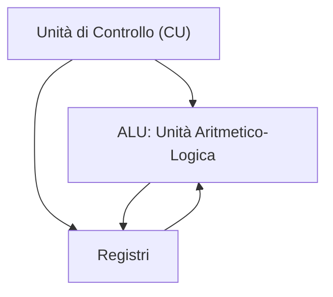
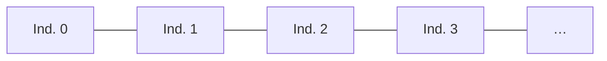
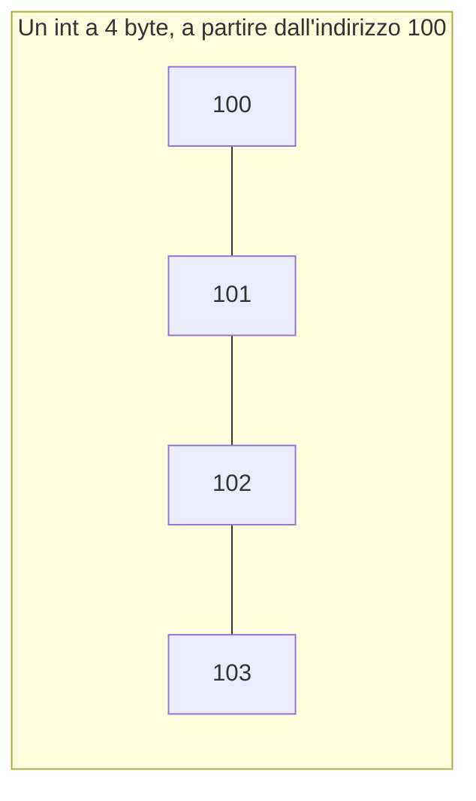
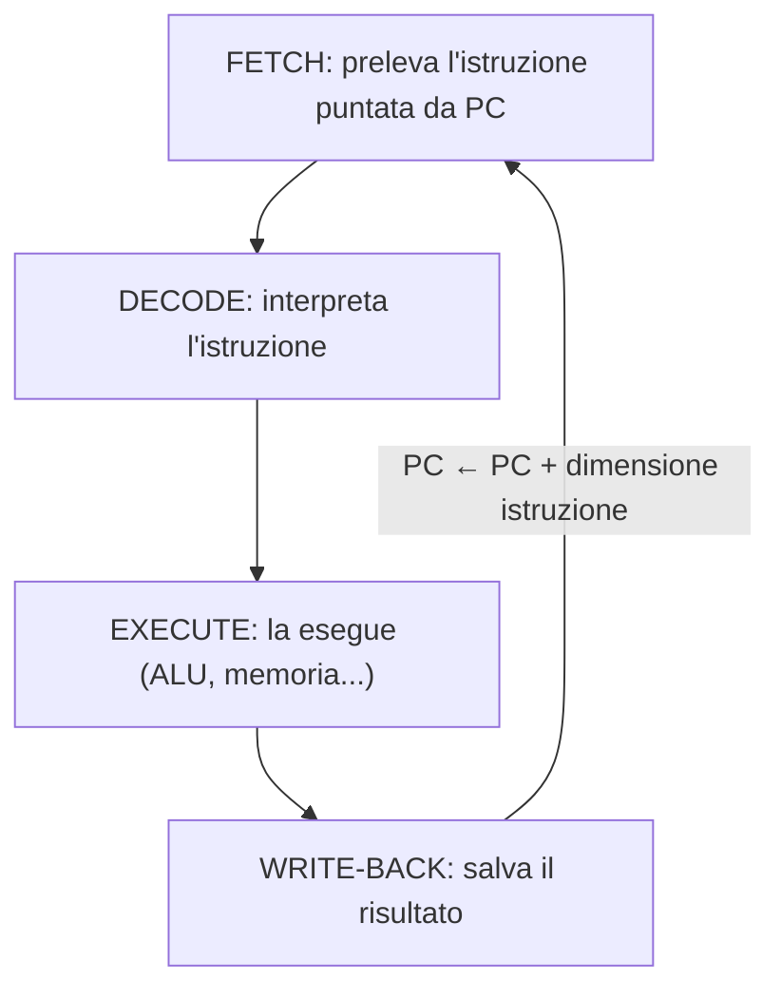
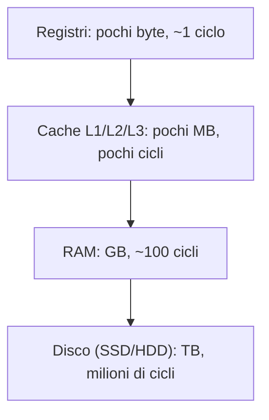
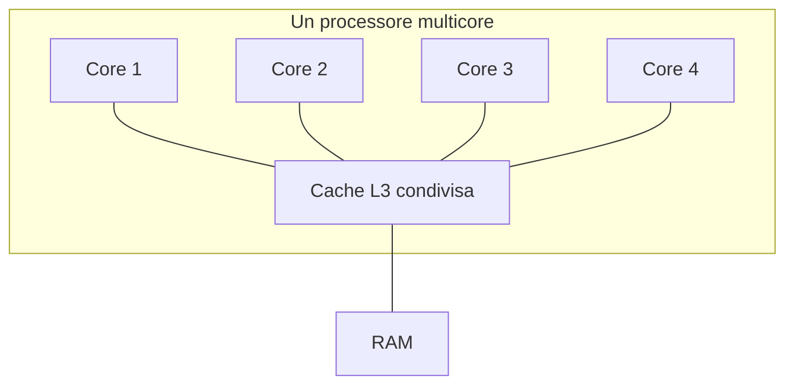
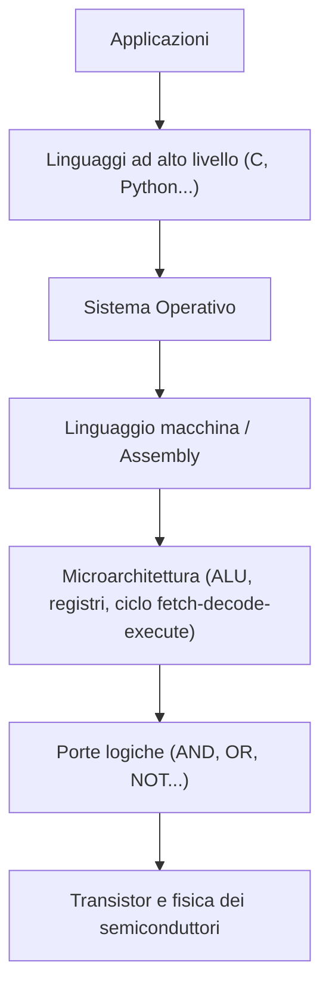

# 🖥️ Modulo 4 — Il Calcolatore Elettronico: Architettura ed Esecuzione delle Istruzioni

- **Corso:** C Master — Dai Bit al Software
- **Piattaforma:** GCProf Academy
- **Livello:** 🟢 Base (Fase 1 — Fondamenti dell'Informatica)
- **Target:** Matricole di Ingegneria, studenti di discipline scientifiche e del triennio tecnico-scientifico, docenti, appassionati
- **Prerequisiti:** Moduli 1–3 (algoritmi, sistema binario, algebra di Boole e porte logiche)
- **Obiettivo Didattico:** Descrivere l'architettura di von Neumann, il ruolo di CPU, memoria, bus e dispositivi di I/O; ripercorrere passo dopo passo il ciclo fetch-decode-execute; distinguere i livelli della gerarchia di memoria e spiegarne il perché; collocare linguaggio macchina, assembly, C e sistema operativo nella scala dei livelli di astrazione. Chiude la Fase 1 del corso: dal prossimo modulo si scrive solo C.

---

<a id="indice"></a>
# 📑 Indice del Modulo 4

1. [Capitolo 1 — Dalla Logica alla Macchina: l'Architettura di von Neumann](#capitolo-1)
2. [Capitolo 2 — La CPU: ALU, Registri, Unità di Controllo](#capitolo-2)
3. [Capitolo 3 — La Memoria Centrale e gli Indirizzi](#capitolo-3)
4. [Capitolo 4 — I Bus: le Strade dell'Informazione](#capitolo-4)
5. [Capitolo 5 — Il Ciclo Fetch-Decode-Execute](#capitolo-5)
6. [Capitolo 6 — Linguaggio Macchina e Assembly](#capitolo-6)
7. [Capitolo 7 — I Dispositivi di Input/Output](#capitolo-7)
8. [Capitolo 8 — La Gerarchia di Memoria](#capitolo-8)
9. [Capitolo 9 — Il Sistema Operativo: il Direttore d'Orchestra](#capitolo-9)
10. [Capitolo 10 — Architetture Moderne: Multicore e Acceleratori](#capitolo-10)
11. [Capitolo 11 — I Livelli di Astrazione: dal Silicio al Tuo Codice C](#capitolo-11)
12. [Capitolo 12 — Errori Concettuali Comuni per Chi Inizia](#capitolo-12)
13. [Capitolo 13 — Sintesi, Laboratorio e Autoverifica](#capitolo-13)

---

<a id="capitolo-1"></a>
## 1. Capitolo 1 — Dalla Logica alla Macchina: l'Architettura di von Neumann

Nel Modulo 3 hai costruito un sommatore con sole porte logiche. Ora la domanda sale di livello: **come si organizzano miliardi di porte logiche per ottenere una macchina che esegue programmi diversi, uno dopo l'altro, senza essere ricablata ogni volta?**

### 💡 L'idea rivoluzionaria: il programma è un dato

Le prime macchine di calcolo (come l'ENIAC, 1945) venivano **riprogrammate fisicamente**: settimane di lavoro con cavi e interruttori per passare da un calcolo all'altro. La svolta arriva nel 1945, quando **John von Neumann** (riprendendo idee già presenti nei lavori di Turing e nel progetto EDVAC) descrive un principio semplice quanto potente:

> **Le istruzioni di un programma sono dati come tutti gli altri, e vivono nella stessa memoria dei dati che elaborano.**

Cambiare programma non significa più ricablare la macchina: basta **caricare in memoria una sequenza diversa di bit**. È il principio del **programma memorizzato** (*stored program*), ed è ancora oggi il cuore di ogni computer, smartphone e microcontrollore.

### 🏛️ I quattro componenti dell'architettura di von Neumann



| Componente | Ruolo |
| :--- | :--- |
| **CPU** (*Central Processing Unit*) | Esegue le istruzioni: calcola e decide |
| **Memoria centrale** | Contiene, insieme, **sia le istruzioni del programma sia i dati** su cui lavora |
| **Bus** | I "collegamenti" attraverso cui viaggiano dati, indirizzi e segnali di controllo |
| **Dispositivi di I/O** | Fanno comunicare il calcolatore con il mondo esterno (tastiera, schermo, disco, rete) |

### 🥃 Il "collo di bottiglia di von Neumann"

Poiché istruzioni e dati condividono lo **stesso bus** verso la memoria, CPU e memoria non possono comunicare istruzioni e dati nello stesso istante: è un limite strutturale, chiamato per l'appunto **collo di bottiglia di von Neumann**. Tornerà utile nel Capitolo 8, quando vedremo perché serve la cache.

*(Esiste un'architettura alternativa, detta **Harvard**, con memorie separate per istruzioni e dati: la trovi in molti microcontrollori. I processori dei PC e degli smartphone usano invece una via di mezzo: von Neumann all'esterno, con cache separate "in stile Harvard" vicino alla CPU.)*

[🔙 Torna all'indice](#indice)

---

<a id="capitolo-2"></a>
## 2. Capitolo 2 — La CPU: ALU, Registri, Unità di Controllo

La **CPU** è il "cervello" del calcolatore: legge le istruzioni, le interpreta ed esegue le operazioni richieste. Al suo interno si distinguono tre blocchi principali.



### 🧮 La ALU (Arithmetic Logic Unit)

Esegue le **operazioni aritmetiche** (somma, sottrazione, e nei processori moderni anche moltiplicazione e divisione) e le **operazioni logiche** (AND, OR, NOT, confronti). Ricordi il sommatore del Modulo 3? **È, in scala ben più grande, un pezzo della ALU.**

### 🗂️ I registri

I **registri** sono piccolissime memorie **dentro** la CPU: pochissimi byte, ma **velocissime** (un solo ciclo di clock per accedervi, contro le decine richieste dalla RAM). Servono a contenere i valori su cui la CPU sta lavorando *in questo istante*.

| Registro | Ruolo |
| :--- | :--- |
| **Registri general-purpose** | Contengono operandi e risultati intermedi dei calcoli |
| **Program Counter (PC)** | Contiene l'**indirizzo** della prossima istruzione da eseguire |
| **Instruction Register (IR)** | Contiene l'istruzione **appena prelevata**, in attesa di essere decodificata |
| **Registro di stato (Flags)** | Bit che segnalano condizioni: risultato zero, overflow, riporto… |

### 🕹️ L'unità di controllo (CU)

La **Control Unit** è il "direttore d'orchestra" interno alla CPU: **legge** l'istruzione corrente, la **decodifica** (capisce di che operazione si tratta) e **genera i segnali** che coordinano ALU, registri, memoria e bus perché l'istruzione venga eseguita correttamente. È il ciclo che vedremo nel dettaglio nel Capitolo 5.

### ⏱️ Il clock

Tutte le operazioni della CPU sono scandite da un segnale periodico, il **clock**: a ogni "tic" avanza un passo dell'esecuzione. La **frequenza di clock** (in Hz, tipicamente GHz oggi) indica quanti cicli avvengono al secondo — ma, come vedremo nel Capitolo 10, **non è l'unico fattore** che determina la velocità reale di un processore.

[🔙 Torna all'indice](#indice)

---

<a id="capitolo-3"></a>
## 3. Capitolo 3 — La Memoria Centrale e gli Indirizzi

### 📬 La memoria come una via di caselle postali

Immagina la **RAM** (*Random Access Memory*) come una lunghissima via con case numerate in sequenza da `0` in su. Ogni "casa" è un **byte** (Modulo 2), e il suo numero civico è l'**indirizzo**.



* **Random Access** significa che la CPU può raggiungere **qualsiasi indirizzo in tempo costante**, non deve "scorrere" dall'inizio (a differenza, per esempio, di un nastro magnetico).
* La memoria è **volatile**: il suo contenuto si perde quando manca l'alimentazione. Per questo servono i **file** su disco (Modulo 17), che sono invece persistenti.
* La **dimensione della memoria indirizzabile** dipende dal numero di bit usati per gli indirizzi: con *n* bit di indirizzo si raggiungono **2ⁿ** posizioni distinte (lo stesso principio del Modulo 2!). Un'architettura **a 32 bit** indirizza al massimo **4 GiB**; una **a 64 bit** arriva, in teoria, a 16 esibyte — enormemente oltre le necessità pratiche attuali.

### 🧩 Dati "grandi" occupano più byte consecutivi

Un `int` a 4 byte (Modulo 2) non sta in una sola casella: occupa **4 caselle consecutive**. L'indirizzo del dato è quello del **primo** dei 4 byte.



Ordinare i byte di un dato multi-byte è una **convenzione**: le architetture *little-endian* (la maggior parte dei PC odierni) mettono il byte meno significativo all'indirizzo più basso; le *big-endian* fanno il contrario. Non serve approfondire ora: ne riparleremo, se necessario, quando incontreremo i puntatori (Modulo 15).

### 🗺️ Cosa vive in memoria: il layout di un processo

Quando un programma diventa un **processo** (Modulo 1), il sistema operativo gli assegna una porzione di memoria organizzata in **zone** con scopi diversi:

| Zona | Contiene |
| :--- | :--- |
| **Segmento di codice** | Le istruzioni del programma (tradotte in linguaggio macchina) |
| **Segmento dati / BSS** | Le variabili globali e statiche |
| **Heap** | Memoria allocata dinamicamente a runtime (Modulo 16) |
| **Pila (stack)** | Le variabili locali e le informazioni delle funzioni in corso (Modulo 13) |

Ritroverai questa mappa, con tutti i dettagli, nel Modulo 16: per ora basta sapere che **anche il tuo programma vive fisicamente in questa "via di caselle postali"**.

[🔙 Torna all'indice](#indice)

---

<a id="capitolo-4"></a>
## 4. Capitolo 4 — I Bus: le Strade dell'Informazione

Se CPU, memoria e dispositivi di I/O sono le "città", i **bus** sono le **strade** che le collegano: insiemi di fili paralleli su cui viaggiano segnali elettrici.

### 🛣️ Tre bus, tre compiti

| Bus | Cosa trasporta | Direzione |
| :--- | :--- | :--- |
| **Bus indirizzi** (*address bus*) | L'indirizzo della cella di memoria (o del dispositivo) da raggiungere | Solo dalla CPU verso l'esterno |
| **Bus dati** (*data bus*) | Il valore effettivo da leggere o scrivere | Nei due sensi |
| **Bus di controllo** (*control bus*) | Segnali di comando: "leggi", "scrivi", "pronto", interruzioni | Nei due sensi |

### 📏 Perché la larghezza del bus conta

Un bus dati **a 64 bit** trasporta 64 bit **in un solo passaggio**; uno a 32 bit ne trasporta la metà, e per lo stesso dato servono due passaggi. La **larghezza del bus indirizzi**, come visto nel Capitolo 3, determina invece **quanta memoria si può raggiungere**.

### ✋ Un'analogia: il casello autostradale

Il bus indirizzi è come dire al casellante **"voglio uscire al chilometro 120"**; il bus dati è la **merce** che passa; il bus di controllo è il **semaforo** che dice quando è il momento di passare. Se il casello ha poche corsie (bus stretto), il traffico rallenta, anche con un'auto velocissima (CPU potente): un'altra ragione per cui la sola frequenza di clock non basta a giudicare le prestazioni.

[🔙 Torna all'indice](#indice)

---

<a id="capitolo-5"></a>
## 5. Capitolo 5 — Il Ciclo Fetch-Decode-Execute

Eccoci al cuore pulsante del modulo: **cosa fa davvero la CPU, istante per istante**, mentre un programma "gira"? La risposta è un ciclo che si ripete, senza sosta, miliardi di volte al secondo.

### 🔄 Le tre (quattro) fasi



1. **FETCH (prelievo):** l'Unità di Controllo legge dalla memoria, all'indirizzo contenuto nel **Program Counter (PC)**, l'istruzione successiva e la deposita nell'**Instruction Register (IR)**.
2. **DECODE (decodifica):** la CU interpreta i bit dell'istruzione: quale operazione richiede? Quali registri o indirizzi coinvolge?
3. **EXECUTE (esecuzione):** la ALU (o un'altra unità) esegue l'operazione: una somma, un confronto, una lettura dalla memoria…
4. **WRITE-BACK (scrittura del risultato):** il risultato viene salvato in un registro o in memoria.
5. **Aggiornamento del PC:** il Program Counter avanza, di norma alla **prossima** istruzione in memoria — a meno che l'istruzione appena eseguita non sia un **salto** (come quelli che realizzano `if` e i cicli: vedremo la connessione nei Moduli 8 e 9), che scrive nel PC un indirizzo diverso.

Poi il ciclo **ricomincia** da capo. Sempre. Milioni, miliardi di volte al secondo. Ogni singola azione del tuo computer — aprire un'app, muovere il mouse, riprodurre un video — è, in fondo, **questo ciclo ripetuto un numero incalcolabile di volte**.

### 🧾 Una traccia passo-passo

Supponiamo che in memoria, agli indirizzi 100–103, ci sia l'istruzione (semplificata) "somma il contenuto del registro R1 al registro R0" e che R0 valga 5, R1 valga 3:

| Fase | Cosa succede |
| :--- | :--- |
| Fetch | PC = 100 → si legge l'istruzione all'indirizzo 100, si carica in IR |
| Decode | La CU riconosce: "operazione = ADD, sorgente = R1, destinazione = R0" |
| Execute | La ALU calcola `R0 + R1 = 5 + 3 = 8` |
| Write-back | Il risultato `8` viene scritto in R0 |
| Aggiornamento PC | PC diventa 104 (l'istruzione successiva) |

Confronta questa tabella con la **tabella di traccia** del Modulo 1: è esattamente lo stesso metodo — collaudare un procedimento passo per passo — applicato questa volta **dentro la CPU**.

```c
// ==================== ESEMPIO 4.1: SIMULARE IL CICLO FETCH-DECODE-EXECUTE ====================
/*
   Non è un vero microprocessore, ma un piccolissimo INTERPRETE che mostra il ciclo
   fetch-decode-execute con dati veri: una "memoria" di istruzioni, un PC e due registri.
   Le istruzioni sono numeri: 1 = somma, 2 = sottrai, 9 = ferma.
   (Array: Modulo 10. Qui li usiamo per rappresentare la "memoria" del nostro programma.)
*/

#include <stdio.h>

int main(void)
{
    // La "memoria istruzioni": ogni riga è (codice_operazione, valore)
    int memoria_op[]  = {1, 1, 2, 4, 1, 10, 9, 0};   // FETCH leggerà due celle per istruzione
    int pc = 0;                                       // Program Counter: punta alla prossima istruzione
    int registro = 0;                                 // il nostro unico "registro" R0

    printf("Registro iniziale: %d\n\n", registro);

    while (1)                                          // il ciclo si ferma con "break" (istruzione 9)
    {
        // ---- FETCH ----
        int codice_operazione = memoria_op[pc];         // preleva il codice operazione
        int valore            = memoria_op[pc + 1];     // preleva l'operando
        printf("FETCH   : PC=%d -> istruzione (%d, %d)\n", pc, codice_operazione, valore);

        // ---- DECODE + EXECUTE ----
        if (codice_operazione == 1)                      // 1 = ADD
        {
            printf("DECODE  : ADD %d\n", valore);
            registro = registro + valore;                 // EXECUTE
            printf("EXECUTE : registro = %d\n", registro);
        }
        else if (codice_operazione == 2)                  // 2 = SUB
        {
            printf("DECODE  : SUB %d\n", valore);
            registro = registro - valore;                 // EXECUTE
            printf("EXECUTE : registro = %d\n", registro);
        }
        else if (codice_operazione == 9)                  // 9 = STOP
        {
            printf("DECODE  : STOP\n");
            break;                                          // usciamo dal ciclo: fine del programma
        }

        // ---- AGGIORNAMENTO PC ----
        pc = pc + 2;                                        // ogni istruzione occupa 2 celle
        printf("           (nuovo PC = %d)\n\n", pc);
    }

    printf("\nEsecuzione terminata. Registro finale = %d\n", registro);
    return 0;
}
```

**Output:**

```text
Registro iniziale: 0

FETCH   : PC=0 -> istruzione (1, 1)
DECODE  : ADD 1
EXECUTE : registro = 1
           (nuovo PC = 2)

FETCH   : PC=2 -> istruzione (2, 4)
DECODE  : SUB 4
EXECUTE : registro = -3
           (nuovo PC = 4)

FETCH   : PC=4 -> istruzione (1, 10)
DECODE  : ADD 10
EXECUTE : registro = 7
           (nuovo PC = 6)

FETCH   : PC=6 -> istruzione (9, 0)
DECODE  : STOP

Esecuzione terminata. Registro finale = 7
```

*Perché ti serve:* questo "giocattolo" è, in miniatura, **esattamente ciò che fa un vero processore** con le tue istruzioni C compilate. Osservalo bene: lo ritroverai, con più dettaglio, quando studierai la pila delle chiamate (Modulo 13) e i puntatori a funzione (Modulo 15).

[🔙 Torna all'indice](#indice)

---

<a id="capitolo-6"></a>
## 6. Capitolo 6 — Linguaggio Macchina e Assembly

Nel Modulo 1 hai già intravisto i livelli dei linguaggi. Ora che conosci il ciclo fetch-decode-execute, li rivediamo **con più consapevolezza**.

### 0️⃣ Il linguaggio macchina

È l'unico linguaggio che la CPU **comprende direttamente**: sequenze di bit, in cui alcuni bit codificano **l'operazione** (il codice operativo, o *opcode*) e altri i **registri o indirizzi** coinvolti. Esattamente come nella nostra "memoria istruzioni" dell'Esempio 4.1, solo con codifiche reali e molto più complesse.

### 🔤 L'assembly: bit resi leggibili

L'**assembly** (o linguaggio assemblativo) sostituisce le sequenze di bit con **mnemonici** leggibili dall'uomo, in corrispondenza **uno a uno** con le istruzioni macchina. Un **assemblatore** traduce l'assembly in linguaggio macchina.

Confrontiamo la nostra istruzione simulata "ADD 1" con un assembly reale (sintassi x86-64, semplificata):

```text
; Assembly (leggibile)      Linguaggio macchina (esadecimale)
mov eax, 0                  B8 00 00 00 00
add eax, 1                  83 C0 01
sub eax, 4                  83 E8 04
add eax, 10                 83 C0 0A
```

Ogni riga di assembly corrisponde a **una** istruzione macchina: nessuna scorciatoia, nessuna struttura come `if` o `while` — solo operazioni elementari, esattamente come nel nostro Esempio 4.1.

### 🌉 Dove si colloca il C

Il C è un linguaggio di **alto livello**, ma **compilato direttamente in linguaggio macchina** (passando dall'assembly, ricordi la catena di programmazione del Modulo 1?), senza un livello intermedio come una macchina virtuale. Per questo il C è spesso descritto come un "assembly portabile": ti dà costrutti leggibili (`for`, funzioni, `struct`), ma **resta molto vicino** a ciò che la macchina fa davvero — è il motivo per cui, studiando puntatori e memoria (Moduli 15–16), toccherai con mano concetti che in altri linguaggi restano nascosti.

```c
// ==================== ESEMPIO 4.2: DAL C ALL'ASSEMBLY (CON gcc -S) ====================
/*
   Non è un programma da eseguire con printf: è un ESPERIMENTO da fare in locale con gcc
   (su OnlineGDB non è disponibile l'opzione -S).
   Il file "somma.c" contiene una funzione minima:
*/

int somma(int a, int b)
{
    return a + b;
}
```

**Comando da eseguire in locale:**

```bash
gcc -S -O0 somma.c -o somma.s
cat somma.s
```

**Estratto tipico dell'output (assembly x86-64, può variare tra sistemi):**

```text
somma:
    push    rbp
    mov     rbp, rsp
    mov     DWORD PTR [rbp-4], edi   ; salva il parametro 'a'
    mov     DWORD PTR [rbp-8], esi   ; salva il parametro 'b'
    mov     edx, DWORD PTR [rbp-4]   ; preleva 'a' (FETCH concettuale)
    mov     eax, DWORD PTR [rbp-8]   ; preleva 'b'
    add     eax, edx                 ; EXECUTE: la ALU somma
    pop     rbp
    ret                              ; il risultato è in eax
```

Quella riga `return a + b;`, che sembra un'unica operazione, diventa **diverse istruzioni macchina**: caricare i valori nei registri, sommarli con la ALU, restituire il risultato. È la prova concreta di quanto lavoro svolge il **compilatore** al posto tuo.

[🔙 Torna all'indice](#indice)

---

<a id="capitolo-7"></a>
## 7. Capitolo 7 — I Dispositivi di Input/Output

Un calcolatore isolato, senza modo di ricevere dati o mostrare risultati, sarebbe inutile. I **dispositivi di I/O** collegano la macchina al mondo esterno.

### ⌨️🖥️ Categorie di dispositivi

| Categoria | Esempi |
| :--- | :--- |
| **Input puro** | Tastiera, mouse, microfono, sensori |
| **Output puro** | Monitor, stampante, altoparlanti |
| **Input/Output** | Disco (SSD/HDD), touch screen, scheda di rete |

### 🐢 Un'enorme differenza di velocità

I dispositivi di I/O sono, in genere, **ordini di grandezza più lenti** della CPU: la CPU esegue miliardi di operazioni al secondo, un disco compie migliaia di operazioni al secondo, una connessione di rete può richiedere millisecondi per una risposta. Il calcolatore deve gestire questo divario senza "restare bloccato" ad aspettare.

### 🔔 Interruzioni: non restare in attesa

Anziché controllare "in loop" se un dispositivo ha finito (*polling*, spreco di cicli di CPU), i sistemi moderni usano le **interruzioni** (*interrupt*): il dispositivo, quando è pronto, invia un segnale speciale sul bus di controllo che **interrompe** il normale ciclo fetch-decode-execute; la CPU sospende ciò che stava facendo, gestisce l'evento (per esempio: "è arrivato un carattere da tastiera") e poi **riprende da dove aveva lasciato**. È un meccanismo che ritroverai, concettualmente, ogni volta che un programma "risponde" immediatamente a un input.

### 💾 Memory-mapped I/O: un'idea elegante

Su molte architetture, i dispositivi vengono resi visibili alla CPU **come se fossero indirizzi di memoria**: scrivere un valore a un certo indirizzo può significare, per esempio, "accendi un LED" invece che "salva un dato". È un'idea che tornerà utile se in futuro lavorerai con sistemi embedded (Modulo 21): la stessa istruzione che scrive in memoria può, con l'indirizzo giusto, comandare l'hardware.

[🔙 Torna all'indice](#indice)

---

<a id="capitolo-8"></a>
## 8. Capitolo 8 — La Gerarchia di Memoria

Abbiamo detto: la CPU è velocissima, la memoria centrale (RAM) più lenta, i dischi lentissimi. Costruire **tutta** la memoria del computer con la tecnologia più veloce sarebbe **troppo costoso**. La soluzione, geniale nella sua semplicità, è la **gerarchia di memoria**.



| Livello | Dimensione tipica | Velocità (ordine di grandezza) | Volatile? |
| :--- | :--- | :--- | :---: |
| **Registri** | Poche decine di byte | ~1 ciclo di clock | Sì |
| **Cache L1** | 32–64 KB (per core) | Pochi cicli | Sì |
| **Cache L2** | 256 KB – 1 MB (per core) | Decine di cicli | Sì |
| **Cache L3** | Alcuni–decine di MB (condivisa) | Alcune decine di cicli | Sì |
| **RAM** | Alcuni–decine di GB | Centinaia di cicli | Sì |
| **SSD/HDD** | Centinaia di GB – TB | Migliaia–milioni di cicli | **No** (persistente) |

*(I numeri di cicli sono indicativi e variano molto tra architetture: contano soprattutto le **proporzioni** tra un livello e l'altro.)*

### 📦 Il principio di località

Perché la cache funziona così bene? Per un fenomeno osservato empiricamente su quasi tutti i programmi, il **principio di località**:

* **Località temporale:** un dato appena usato ha un'alta probabilità di essere riusato **a breve** (pensa a una variabile dentro un ciclo).
* **Località spaziale:** se accedi a un indirizzo di memoria, è probabile che tra poco accederai a un indirizzo **vicino** (pensa a scorrere un array, Modulo 10).

La cache sfrutta entrambe: quando la CPU legge un dato dalla RAM, il sistema ne copia in cache **anche un blocco di dati vicini** (una *cache line*), scommettendo che serviranno presto. Quando la scommessa è vinta, si parla di **cache hit** (successo: dato trovato in cache, velocissimo); quando è persa, di **cache miss** (bisogna andare fino alla RAM, molto più lento).

### 🎯 Perché conta anche per chi scrive codice C

Scorrere un array **riga per riga** (accessi consecutivi in memoria) sfrutta la località spaziale ed è quindi più **veloce** di uno scorrimento che "salta" in memoria in modo irregolare, anche se il numero di operazioni è identico. Approfondiremo questo aspetto concretamente nel Modulo 10 (matrici) e nel Modulo 19 (misurare le prestazioni): per ora basta l'intuizione — **la memoria non è "gratis e istantanea"**: è una gerarchia, e usarla bene è parte del mestiere dell'ingegnere.

[🔙 Torna all'indice](#indice)

---

<a id="capitolo-9"></a>
## 9. Capitolo 9 — Il Sistema Operativo: il Direttore d'Orchestra

Un computer moderno esegue **molti processi contemporaneamente** (il browser, l'editor di testo, la riproduzione musicale…) pur avendo un numero **limitato** di CPU. Chi decide chi usa cosa, e quando? Il **sistema operativo** (SO).

### 🎭 I compiti principali del SO

| Compito | Cosa fa |
| :--- | :--- |
| **Gestione dei processi** | Decide quale processo usa la CPU e per quanto tempo (*scheduling*), crea e termina processi |
| **Gestione della memoria** | Assegna a ogni processo la propria area di memoria, evitando che un processo interferisca con un altro |
| **Gestione dei file** | Organizza i dati persistenti su disco in file e cartelle (Modulo 17) |
| **Gestione dei dispositivi** | Fornisce ai programmi un'interfaccia uniforme per parlare con hardware diversissimo tra loro |

### 🔁 Multitasking: l'illusione della simultaneità

Con una sola CPU, come possono "girare" più programmi *insieme*? Il SO applica il **time-sharing**: assegna a ogni processo una **piccola fetta di tempo** (pochi millisecondi), poi passa al successivo, e così via, così rapidamente da dare **l'illusione della simultaneità**. Ricordi il ciclo fetch-decode-execute del Capitolo 5? Il SO lo interrompe, salva lo stato del processo in corso (registri, PC…), carica lo stato di un altro processo, e lo fa ripartire: è un'applicazione, a livello di sistema, dello stesso meccanismo di interruzione visto nel Capitolo 7.

### 🧠 Ricollegando i concetti del Modulo 1

Ricordi la distinzione **programma / processo** del Modulo 1? Ora puoi definirla con più precisione: il **sistema operativo** è ciò che **crea un processo a partire da un programma** (tramite il *loader*, Modulo 1), gli assegna memoria e tempo di CPU, e lo **termina** quando ha finito. Quando scriverai i tuoi primi programmi C multi-processo o parlerai di argomenti da riga di comando (Modulo 17), ritroverai proprio queste idee.

[🔙 Torna all'indice](#indice)

---

<a id="capitolo-10"></a>
## 10. Capitolo 10 — Architetture Moderne: Multicore e Acceleratori

Per decenni, i processori sono diventati più veloci soprattutto **aumentando la frequenza di clock**. Ma intorno al 2005 si è arrivati a un limite fisico: frequenze più alte significano **troppo calore** da smaltire. L'industria ha cambiato strategia.

### 🧩 CPU multicore

Anziché un solo "cervello" sempre più veloce, i processori moderni contengono **più core**: unità di elaborazione indipendenti, ciascuna capace di eseguire il proprio ciclo fetch-decode-execute, sullo stesso chip. Un processore **quad-core** ha, in pratica, 4 CPU complete che lavorano in parallelo.



Sfruttare davvero più core richiede però che il **programma stesso** sia scritto per lavorare in parallelo (*programmazione concorrente*): un tema affascinante ma che va oltre questo corso introduttivo. Per ora, ogni programma che scriverai userà **un solo core alla volta**.

### 🎮 Gli acceleratori: le GPU

Le **GPU** (*Graphics Processing Unit*), nate per calcolare milioni di pixel in parallelo, contengono **migliaia** di piccoli core, ciascuno più semplice di un core da CPU, ma capaci insieme di eseguire la **stessa** operazione su moltissimi dati **contemporaneamente**. Questa caratteristica le ha rese, inaspettatamente, lo strumento chiave per l'addestramento dei moderni modelli di **Intelligenza Artificiale** (Modulo 21), fatto in larga parte di enormi moltiplicazioni tra matrici (Modulo 10) — esattamente il tipo di calcolo "ripetuto su tanti dati" in cui una GPU eccelle.

| | CPU | GPU |
| :--- | :--- | :--- |
| **Numero di core** | Pochi (4–64 tipicamente) | Migliaia |
| **Complessità per core** | Alta: gestisce logica complessa e diversificata | Bassa: stessa semplice operazione, su tanti dati |
| **Punto di forza** | Compiti sequenziali e diversificati | Compiti massicciamente parallelizzabili e ripetitivi |

*Curiosità:* la sigla che indica un processore per **calcolo generico** (non solo grafico) è oggi spesso **GPGPU** (*General-Purpose computing on GPU*).

[🔙 Torna all'indice](#indice)

---

<a id="capitolo-11"></a>
## 11. Capitolo 11 — I Livelli di Astrazione: dal Silicio al Tuo Codice C

Chiudiamo il cerchio aperto nel Modulo 1. Ora hai tutti gli elementi per collocare con precisione **dove vivi**, come programmatore, in questa scala.



### 🎁 L'idea centrale: ogni livello nasconde la complessità di quello sottostante

* Quando scrivi `int somma = a + b;` (livello 6), **non pensi** ai transistor (livello 1), né alle porte logiche del sommatore (livello 2, Modulo 3), né al ciclo fetch-decode-execute che lo eseguirà (livello 3, Capitolo 5).
* Questo è **esattamente il potere dell'astrazione**: ogni livello offre un'interfaccia più semplice, costruita **sopra** quello inferiore, e ti permette di ragionare senza dover tenere a mente tutto insieme.
* Un buon ingegnere sa lavorare al proprio livello **e** capire, quando serve, cosa succede uno o due livelli più sotto: è precisamente l'obiettivo di questo corso.

### 🗺️ Una mappa riassuntiva del percorso fatto finora

| Livello | Argomento | Dove lo hai incontrato |
| :--- | :--- | :--- |
| Transistor, porte logiche | Bit, algebra di Boole, sommatore | Moduli 2–3 |
| Microarchitettura | Registri, ALU, ciclo fetch-decode-execute | Modulo 4 (questo) |
| Linguaggio macchina / assembly | Istruzioni elementari della CPU | Modulo 4 (questo) |
| Sistema operativo | Processi, memoria, file, dispositivi | Modulo 4 (questo), poi Moduli 16–17 |
| Linguaggio C | La tua "lingua" per parlare con la macchina | Da qui in avanti: Moduli 5–22 |

Da questo momento, **smetterai di guardare "sotto" al codice** e ti concentrerai sul **linguaggio C**: ma ogni volta che un concetto ti sembrerà astratto — una variabile, un puntatore, la pila delle chiamate — potrai sempre **ritornare qui** e chiederti: *cosa sta succedendo, davvero, dentro CPU e memoria?*

[🔙 Torna all'indice](#indice)

---

<a id="capitolo-12"></a>
## 12. Capitolo 12 — Errori Concettuali Comuni per Chi Inizia

| Errore concettuale | Perché è sbagliato | Come correggerlo |
| :--- | :--- | :--- |
| "La CPU esegue direttamente il codice C" | La CPU esegue solo linguaggio macchina: il codice C viene **compilato** prima | Ricollega alla catena di programmazione del Modulo 1 |
| "Più GHz = sempre più veloce" | Le prestazioni dipendono anche da numero di core, dimensione della cache, larghezza dei bus, efficienza del compilatore | Confronta processori solo a parità di architettura |
| "La RAM e il disco sono la stessa cosa, solo di dimensioni diverse" | La RAM è **volatile** (si svuota senza corrente), il disco è **persistente** | Ricorda: RAM per l'esecuzione, disco per la conservazione |
| "Un processore multicore rende automaticamente più veloce ogni programma" | Serve che il programma sia scritto per usare più core (programmazione concorrente) | Un programma "normale" (come quelli di questo corso) usa un solo core |
| "Il Program Counter conta quante istruzioni sono state eseguite" | Il PC contiene l'**indirizzo** della prossima istruzione, non un contatore di eventi passati | Ripassa il ciclo fetch-decode-execute (Capitolo 5) |
| "La cache è un tipo di RAM più grande" | La cache è **più piccola e più veloce** della RAM; la gerarchia va dal piccolo/veloce al grande/lento | Ripassa la piramide della gerarchia di memoria |
| "Il sistema operativo è un programma come un altro" | Il SO ha privilegi speciali: gestisce memoria, processi e dispositivi per **tutti** gli altri programmi | Distingui SO da applicazione |

[🔙 Torna all'indice](#indice)

---

<a id="capitolo-13"></a>
## 13. Capitolo 13 — Sintesi, Laboratorio e Autoverifica

### 💡 Punti Chiave del Modulo 4

1. Nell'**architettura di von Neumann** (1945), istruzioni e dati condividono la **stessa memoria**: è il principio del **programma memorizzato**, che rende un computer riprogrammabile senza ricablarlo.
2. I quattro componenti fondamentali sono **CPU, memoria centrale, bus, dispositivi di I/O**.
3. La **CPU** è composta da **ALU** (calcola), **registri** (memoria interna velocissima) e **Unità di Controllo** (coordina); il **clock** scandisce il ritmo di esecuzione.
4. La **memoria centrale** è una sequenza di byte, ciascuno con un proprio **indirizzo**; con *n* bit di indirizzo si raggiungono 2ⁿ posizioni.
5. I **bus** (indirizzi, dati, controllo) collegano CPU, memoria e dispositivi; la loro larghezza incide sulle prestazioni tanto quanto la velocità della CPU.
6. Il **ciclo fetch-decode-execute** (con l'aggiornamento del PC) è il meccanismo, ripetuto senza sosta, con cui la CPU esegue ogni singola istruzione di ogni programma.
7. Il **linguaggio macchina** è l'unico che la CPU capisce direttamente; l'**assembly** lo rende leggibile, in corrispondenza uno a uno; il **C** è compilato direttamente in linguaggio macchina, restando "vicino" all'hardware.
8. I dispositivi di **I/O** sono molto più lenti della CPU: le **interruzioni** evitano di sprecare cicli in attesa attiva.
9. La **gerarchia di memoria** (registri → cache → RAM → disco) bilancia velocità, dimensione e costo, sfruttando il **principio di località**.
10. Il **sistema operativo** gestisce processi, memoria, file e dispositivi, e realizza il **multitasking** tramite interruzioni e assegnazione di piccole fette di tempo di CPU.
11. Le architetture moderne usano **più core** e **GPU** (migliaia di core semplici) per superare il limite della sola frequenza di clock.
12. I **livelli di astrazione** — dal transistor al codice applicativo — permettono di ragionare a ogni livello senza dover conoscere tutti quelli sottostanti. Il C vive a un livello che resta **volutamente vicino** alla macchina.

---

### 📖 Mini-Glossario

| Termine | Significato |
| :--- | :--- |
| **Architettura di von Neumann** | Modello in cui istruzioni e dati condividono la stessa memoria |
| **CPU** | Unità che esegue le istruzioni di un programma |
| **ALU** | Unità Aritmetico-Logica: esegue calcoli e confronti |
| **Registro** | Memoria minuscola e velocissima interna alla CPU |
| **Program Counter (PC)** | Registro che contiene l'indirizzo della prossima istruzione |
| **Unità di Controllo (CU)** | Coordina fetch, decodifica ed esecuzione |
| **Clock** | Segnale periodico che scandisce i cicli della CPU |
| **Bus** | Insieme di collegamenti tra CPU, memoria e dispositivi |
| **Indirizzo di memoria** | Numero che identifica una cella di memoria |
| **Ciclo fetch-decode-execute** | Il procedimento, ripetuto, con cui la CPU esegue le istruzioni |
| **Linguaggio macchina** | Istruzioni in forma binaria, comprese direttamente dalla CPU |
| **Assembly** | Rappresentazione leggibile del linguaggio macchina |
| **Interruzione (interrupt)** | Segnale che sospende il flusso normale per gestire un evento |
| **Gerarchia di memoria** | Organizzazione a livelli (registri, cache, RAM, disco) per velocità/dimensione |
| **Cache** | Memoria piccola e veloce che conserva dati usati di recente |
| **Principio di località** | Tendenza dei programmi a riusare dati recenti o vicini in memoria |
| **Sistema operativo (SO)** | Software che gestisce processi, memoria, file e dispositivi |
| **Multitasking** | Esecuzione (apparentemente) simultanea di più processi |
| **Multicore** | Processore con più unità di elaborazione indipendenti |
| **GPU** | Processore con migliaia di core semplici, per calcolo massicciamente parallelo |
| **Livello di astrazione** | Strato che nasconde la complessità del livello sottostante |

---

### 🧪 Laboratorio Pratico: "Dentro la Macchina"

**Obiettivo:** ripercorrere a mano il ciclo fetch-decode-execute e collegare architettura e codice C.

**Parte A — Carta e penna**
1. Disegna (anche a mano, o in Mermaid) i quattro componenti dell'architettura di von Neumann e le frecce che li collegano.
2. Con la stessa tabella del Capitolo 5, traccia a mano il ciclo fetch-decode-execute per il seguente programma-giocattolo, con registro iniziale `R0 = 10`: istruzioni `(1, 5)`, `(2, 3)`, `(1, 2)`, `(9, 0)` (stesso formato dell'Esempio 4.1: 1 = ADD, 2 = SUB, 9 = STOP).
3. Elenca, in ordine dal più veloce/piccolo al più lento/grande, i livelli della gerarchia di memoria, indicando per ciascuno un esempio di dimensione tipica.
4. Spiega a parole tue, in 3-4 righe, perché una CPU con clock più alto **non è sempre** più veloce di una con clock più basso.

**Parte B — Eseguire (OnlineGDB)**
5. Riproduci l'**Esempio 4.1** e modifica la "memoria istruzioni" per calcolare, partendo da `R0 = 0`: `+7`, poi `−2`, poi `+15`, poi `STOP`. Verifica il risultato con un calcolo a mano.
6. Aggiungi all'Esempio 4.1 una **terza operazione**, `3 = MUL` (moltiplicazione), e verifica che funzioni con una sequenza a tua scelta.

**Parte C — Osservare (per chi ha `gcc` in locale)**
7. Scrivi una funzione C simile a quella dell'**Esempio 4.2** (per esempio, che calcola `a - b`), generane l'assembly con `gcc -S -O0`, e individua nel file `.s` le istruzioni corrispondenti a "preleva gli operandi", "sottrai", "restituisci il risultato".
8. Ripeti il punto 7 compilando con `gcc -S -O2` (ottimizzazione attiva) e confronta il numero di righe di assembly generate: cosa noti?

**🚀 Sfida finale**
9. Estendi l'**Esempio 4.1** aggiungendo la gestione delle **interruzioni**: introduci un array `interruzioni[]` con posizioni (indici del ciclo) in cui, invece di eseguire l'istruzione normale, il programma stampa `"INTERRUZIONE: gestione evento esterno"` e prosegue. Collega questa idea a quanto letto nel Capitolo 7.

*Suggerimento:* riusa la struttura del ciclo `while` e le variabili `pc`, `codice_operazione`, `valore` dell'Esempio 4.1.

---

### ❓ Quiz di Autoverifica

**Domanda 1:** Qual è l'idea centrale dell'architettura di von Neumann?
- A) Ogni programma ha una memoria fisicamente separata dai dati
- B) Le istruzioni sono cablate direttamente nell'hardware e non si possono cambiare
- C) Istruzioni e dati condividono la stessa memoria, come sequenze di bit
- D) La CPU non ha bisogno di memoria per funzionare

**Domanda 2:** Quale componente della CPU esegue le operazioni aritmetiche e logiche?
- A) Il Program Counter
- B) L'Unità di Controllo
- C) La ALU
- D) Il bus dati

**Domanda 3:** Metti in ordine corretto le fasi del ciclo di esecuzione di un'istruzione:
- A) Decode → Fetch → Execute
- B) Execute → Decode → Fetch
- C) Fetch → Decode → Execute
- D) Fetch → Execute → Decode

**Domanda 4:** Perché si usa una gerarchia di memoria (registri, cache, RAM, disco) anziché una sola memoria uniforme?
- A) Per semplificare il sistema operativo
- B) Perché la memoria più veloce è anche la più costosa e piccola: si bilanciano velocità, dimensione e costo
- C) Perché la CPU non può collegarsi direttamente alla RAM
- D) Per ragioni storiche, oggi non più valide

**Domanda 5:** Cosa succede, concettualmente, quando arriva un'interruzione da un dispositivo di I/O?
- A) Il computer si spegne
- B) La CPU ignora l'evento finché non finisce il programma corrente
- C) La CPU sospende il flusso normale, gestisce l'evento, poi riprende da dove aveva lasciato
- D) La memoria centrale viene cancellata

**Domanda 6:** Cosa rende una GPU particolarmente adatta ai calcoli dell'Intelligenza Artificiale?
- A) Ha pochissimi core, ma velocissimi
- B) Ha migliaia di core semplici, adatti a eseguire la stessa operazione su molti dati in parallelo
- C) Non ha bisogno di memoria
- D) Esegue solo istruzioni di I/O

**Domanda 7:** In che relazione sta il linguaggio C con il linguaggio macchina?
- A) Il C viene eseguito direttamente dalla CPU, senza compilazione
- B) Il C è compilato in linguaggio macchina, restando concettualmente vicino all'hardware
- C) Il C e il linguaggio macchina non hanno alcuna relazione
- D) Il linguaggio macchina viene tradotto in C durante l'esecuzione

---

🎉 **Hai completato la Fase 1 — Fondamenti dell'Informatica!** Da qui in avanti userai tutto ciò che hai imparato — algoritmi, bit, algebra di Boole, architettura — per scrivere codice C **consapevole**: sapendo, dietro ogni riga, cosa succede davvero dentro la macchina.

[🔙 Torna all'indice](#indice)