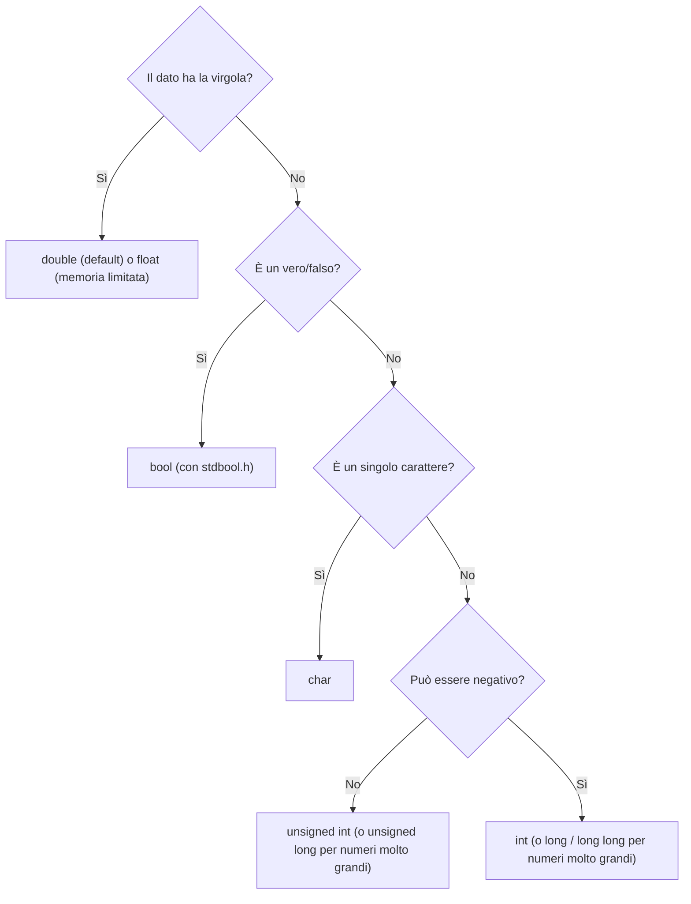

# 🧱 Modulo 5 — Struttura di un Programma C, Variabili e Tipi di Dato

- **Corso:** C Master — Dai Bit al Software
- **Piattaforma:** GCProf Academy
- **Livello:** 🟢 Base (Fase 2 — Il Linguaggio C)
- **Target:** Matricole di Ingegneria, studenti di discipline scientifiche e del triennio tecnico-scientifico, docenti, appassionati
- **Prerequisiti:** Moduli 1–4 (algoritmi, catena di programmazione, bit e sistema binario, architettura del calcolatore)
- **Obiettivo Didattico:** Scrivere un programma C monomodulo corretto e ben organizzato; dichiarare, inizializzare e usare variabili; scegliere il tipo di dato più adatto a ogni informazione, sapendo quanta memoria occupa e quali valori può contenere.

> 🎉 **Benvenuto nella Fase 2!** Da questo modulo in poi smetti di *osservare* la macchina dall'esterno (Fase 1) e cominci a **parlarle direttamente** nella sua lingua di alto livello: il C. Ogni concetto che imparerai da qui in avanti poggia su ciò che già sai: quando dichiarerai un `int`, ricorda che stai riservando 4 byte in quella "via di caselle postali" del Modulo 4; quando userai `&&`, stai richiamando l'algebra di Boole del Modulo 3.

---

<a id="indice"></a>
# 📑 Indice del Modulo 5

1. [Capitolo 1 — Il Linguaggio C: Storia, Filosofia e Standard](#capitolo-1)
2. [Capitolo 2 — Lessico e Sintassi: le Regole del Gioco](#capitolo-2)
3. [Capitolo 3 — Anatomia di un Programma Monomodulo](#capitolo-3)
4. [Capitolo 4 — Variabili: Dichiarazione, Inizializzazione, Memoria](#capitolo-4)
5. [Capitolo 5 — I Tipi di Dato Fondamentali](#capitolo-5)
6. [Capitolo 6 — `sizeof` e i Limiti dei Tipi](#capitolo-6)
7. [Capitolo 7 — Tipi a Larghezza Fissa: `stdint.h`](#capitolo-7)
8. [Capitolo 8 — Costanti: `const` e `#define`](#capitolo-8)
9. [Capitolo 9 — Errori Comuni per Chi Inizia](#capitolo-9)
10. [Capitolo 10 — Sintesi, Laboratorio e Autoverifica](#capitolo-10)

---

<a id="capitolo-1"></a>
## 1. Capitolo 1 — Il Linguaggio C: Storia, Filosofia e Standard

### 📜 Da UNIX al mondo intero

Il **C** nasce tra il 1969 e il 1973 ai **Bell Labs**, per mano di **Dennis Ritchie**, con l'obiettivo preciso di riscrivere il sistema operativo **UNIX** in un linguaggio più portabile dell'assembly usato fino ad allora. Il risultato ha superato ogni aspettativa: più di cinquant'anni dopo, il C è ancora **ovunque**.

* Il **kernel Linux** e gran parte dei sistemi operativi moderni sono scritti in C.
* I **microcontrollori** dei dispositivi embedded (elettrodomestici, automobili, satelliti) lo usano come linguaggio principale.
* Gli **interpreti** di Python, i motori di molte librerie scientifiche e persino parti dell'ecosistema dell'Intelligenza Artificiale hanno un "cuore" scritto in C o C++ (ci torneremo nel Modulo 21).
* Praticamente ogni linguaggio nato dopo (C++, Java, C#, Python stesso...) ne ha ereditato la sintassi delle espressioni e delle strutture di controllo.

### 🎯 La filosofia del C in tre parole

* **Efficienza:** vicino alla macchina (ricordi la scala dei livelli di astrazione, Modulo 4?), senza livelli intermedi costosi.
* **Portabilità:** lo stesso codice sorgente si ricompila, con poche modifiche, su architetture diverse.
* **Fiducia nel programmatore:** il C ti dà **grande libertà e controllo** (accesso diretto alla memoria, nessuna rete di sicurezza automatica), ma questo significa anche **grande responsabilità**: pochi controlli a runtime, molte cose lasciate alla tua correttezza. È lo stesso spirito che, nel Modulo 4, abbiamo osservato "vicino al ferro".

### 📐 Gli standard: il C non è uno solo

Il linguaggio si è evoluto nel tempo attraverso **standard** ufficiali, pubblicati dall'ISO:

| Standard | Anno | Novità principali |
| :--- | :---: | :--- |
| **K&R C** | 1978 | Il C descritto nel libro originale di Kernighan e Ritchie (non uno standard ISO) |
| **C89 / C90 (ANSI C)** | 1989/90 | Prima standardizzazione ufficiale |
| **C99** | 1999 | Commenti `//`, dichiarazioni miste al codice, `stdint.h`, `bool` (con `stdbool.h`) |
| **C11** | 2011 | Miglior supporto alla concorrenza, `_Static_assert` |
| **C17** | 2018 | Correzioni tecniche, nessuna nuova funzionalità rilevante |
| **C23** | 2024 | `bool`/`true`/`false` parole chiave native, letterali binari `0b…` ufficiali, miglioramenti vari |

In questo corso useremo lo standard **C17** come riferimento stabile (con qualche nota su C23 dove utile), compilando sempre con:

```bash
gcc -Wall -Wextra -std=c17 nomefile.c -o eseguibile
```

[🔙 Torna all'indice](#indice)

---

<a id="capitolo-2"></a>
## 2. Capitolo 2 — Lessico e Sintassi: le Regole del Gioco

Come ogni lingua, anche il C ha un **alfabeto** di elementi base e delle **regole grammaticali** per comporli. Le chiamiamo, rispettivamente, **lessico** e **sintassi**.

### 🔑 Le parole chiave (keyword)

Sono parole **riservate**: hanno un significato speciale per il compilatore e **non possono** essere usate come nomi di variabili. Eccone alcune che incontrerai presto (l'elenco completo del C17 ne conta 44):

```text
int    float   double   char   void   const   return
if     else    switch   case   while  for     do
break  continue  struct  typedef  sizeof  enum  static
```

### 🏷️ Gli identificatori: come si chiamano le cose

Un **identificatore** è il nome che assegni a variabili, funzioni, tipi. Le regole sono precise:

* Può contenere **lettere, cifre e underscore** (`_`), ma **non può iniziare con una cifra**.
* **Maiuscole e minuscole sono distinte** (*case-sensitive*): `Totale`, `totale` e `TOTALE` sono tre identificatori diversi.
* Non può coincidere con una parola chiave.
* Il C **non ammette spazi** né simboli come `-`, `@`, `#` nei nomi.

| Identificatore | Valido? | Motivo |
| :--- | :---: | :--- |
| `numero_studenti` | ✅ | Lettere e underscore |
| `Totale2024` | ✅ | Lettere seguite da cifre |
| `2024totale` | ❌ | Inizia con una cifra |
| `numero-studenti` | ❌ | Il trattino non è ammesso |
| `int` | ❌ | È una parola chiave |
| `media_voto` e `Media_Voto` | ✅ (ma **distinti**) | Case-sensitive |

💡 **Convenzione di stile** (che useremo in tutto il corso): nomi in **minuscolo**, parole separate da underscore (`snake_case`): `numero_studenti`, `media_voto`. Le **costanti** si scrivono spesso in **MAIUSCOLO**: `PI_GRECO`, `MAX_UTENTI` (lo vedremo nel Capitolo 8).

### 💬 I commenti

Servono a spiegare il codice a chi lo legge (te compreso, tra qualche mese): il compilatore li **ignora completamente**.

```c
// Commento su una sola riga (disponibile dal C99)

/*
   Commento su più righe.
   Utile per spiegazioni più lunghe o per "disattivare" un blocco di codice.
*/
```

⚠️ I commenti a blocco **non si annidano**: la chiusura di un commento a blocco termina al **primo** simbolo di chiusura incontrato, lasciando "fuori" il resto come codice.

### 🔤 Sensibilità agli spazi bianchi

Il C è **quasi indifferente** a spazi, tabulazioni e a capo: servono solo a **separare** i simboli (non puoi scrivere `intx` al posto di `int x`), non per delimitare le istruzioni. Chi delimita le istruzioni è il **punto e virgola** `;`; chi delimita i blocchi sono le **graffe** `{ }`. Questo significa che l'**indentazione** (i rientri) non è obbligatoria per il compilatore... ma è **fondamentale per la leggibilità umana**: usala sempre, con coerenza (di solito 4 spazi per livello).

[🔙 Torna all'indice](#indice)

---

<a id="capitolo-3"></a>
## 3. Capitolo 3 — Anatomia di un Programma Monomodulo

Nel Modulo 1 hai già scritto ed eseguito il tuo primo `Hello, World!`. Ora lo analizziamo **riga per riga**, con la consapevolezza che hai costruito nei moduli successivi.

```c
// ==================== ESEMPIO 5.1: ANATOMIA COMPLETA DI UN PROGRAMMA C ====================
/*
   Un programma monomodulo (un solo file) tipico: direttive, dichiarazioni di variabili,
   istruzioni, valore di ritorno. Ogni parte è commentata per esteso.
*/

#include <stdio.h>      // DIRETTIVA per il preprocessore (Modulo 1): rende disponibile printf

int main(void)          // PUNTO DI INGRESSO: l'esecuzione parte sempre da qui
{                       // apertura del blocco (corpo) della funzione main

    // ---- Sezione di dichiarazione (le variabili che useremo) ----
    int eta = 19;                 // dichiara E inizializza in un colpo solo
    double altezza_metri = 1.75;  // un numero con la virgola

    // ---- Sezione di elaborazione ed output ----
    printf("Eta': %d anni\n", eta);
    printf("Altezza: %.2f metri\n", altezza_metri);

    return 0;           // restituisce 0 al sistema operativo: "tutto ok" (Modulo 1)

}                       // chiusura del blocco: fine di main
```

**Output:**

```text
Eta': 19 anni
Altezza: 1.75 metri
```

### 🧩 Le parti fondamentali, una alla volta

| Parte | Ruolo |
| :--- | :--- |
| **Direttive** (`#include`, `#define`...) | Istruzioni per il **preprocessore** (Modulo 1), eseguite prima della compilazione vera e propria |
| **`int main(void)`** | La funzione da cui parte **sempre** l'esecuzione (Modulo 12 approfondirà le funzioni in generale) |
| **Blocco `{ }`** | Delimita il **corpo** di una funzione (o di un'altra struttura, come vedremo nei Moduli 8-9) |
| **Dichiarazioni** | Riservano memoria per le variabili che userai |
| **Istruzioni** | Le "azioni" del programma: calcoli, stampe, decisioni |
| **`return 0;`** | Termina `main`, restituendo un codice di uscita al sistema operativo |

### 🧠 Perché `main` restituisce un `int`?

Quel valore intero (per convenzione, `0` = successo, un valore diverso da 0 = errore) viene letto dal **sistema operativo** o da un altro programma che ha lanciato il tuo eseguibile: è un piccolo canale di comunicazione tra il tuo programma e "l'esterno", coerente con l'idea di **processo** vista nel Modulo 1.

### 🌍 Uno sguardo avanti: programmi multi-file

Per ora ogni programma è **monomodulo**: un solo file `.c`. Nel Modulo 20 scoprirai come organizzare progetti più grandi su **più file** (`.c` e `.h`), con compilazione separata e linking (ricordi la catena di programmazione, Modulo 1?). Per ora, concentrati su come **un singolo file ben scritto** già racconta una storia chiara: dichiarazioni, poi elaborazione, poi output.

[🔙 Torna all'indice](#indice)

---

<a id="capitolo-4"></a>
## 4. Capitolo 4 — Variabili: Dichiarazione, Inizializzazione, Memoria

### 📦 Cos'è, davvero, una variabile

Ricordi la "via di caselle postali" del Modulo 4? Una **variabile** è un **nome simbolico** che il compilatore associa a una o più di quelle caselle (byte) di memoria. Tre concetti da tenere ben distinti:

| Concetto | Significato |
| :--- | :--- |
| **Nome** | L'identificatore che usi nel codice (es. `eta`) |
| **Tipo** | Determina **quanti byte** occupa e **come interpretarli** (Modulo 2: bit + regola di interpretazione!) |
| **Valore** | Il contenuto attuale, cioè i bit memorizzati in quei byte |


### ✍️ Dichiarazione e inizializzazione

**Dichiarare** una variabile significa dirne **tipo e nome** al compilatore, che riserva la memoria necessaria. **Inizializzarla** significa darle **subito** un valore iniziale.

```c
int eta;              // SOLA dichiarazione: la memoria è riservata, ma il valore è INDEFINITO
int anno = 2026;      // dichiarazione + inizializzazione: valore noto fin da subito
int a, b, c;          // più variabili dello stesso tipo, separate da virgola
int x = 1, y = 2;      // si può inizializzare solo alcune, o tutte, nella stessa riga
```

⚠️ **Regola d'oro:** una variabile **locale** (dichiarata dentro una funzione) **non viene azzerata automaticamente**. Se non la inizializzi, contiene "spazzatura": qualunque bit fosse rimasto in quella zona di memoria da un uso precedente. Leggerla prima di assegnarle un valore è un **comportamento indefinito** (concetto che approfondiremo nel Modulo 6): **inizializza sempre le tue variabili**.

### 📍 Dove vengono dichiarate le variabili

Dal C99 in poi (e quindi in questo intero corso), puoi dichiarare una variabile **in qualsiasi punto** del blocco, non solo all'inizio: è buona pratica dichiararla **il più vicino possibile** al punto in cui la usi per la prima volta, così il codice si legge come una storia che si sviluppa in ordine.

```c
// ==================== ESEMPIO 5.2: DICHIARAZIONI "MISTE" AL CODICE (C99+) ====================
/*
   Dal C99 non è obbligatorio dichiarare tutte le variabili all'inizio del blocco:
   si può farlo man mano che servono. Rende il codice più leggibile.
*/

#include <stdio.h>

int main(void)
{
    printf("Inizio programma\n");

    int prezzo = 100;                  // dichiarata qui, appena serve
    printf("Prezzo pieno: %d\n", prezzo);

    int sconto_percento = 20;          // dichiarata più avanti, quando serve
    int prezzo_scontato = prezzo - (prezzo * sconto_percento / 100);
    printf("Prezzo scontato del %d%%: %d\n", sconto_percento, prezzo_scontato);

    return 0;
}
```

**Output:**

```text
Inizio programma
Prezzo pieno: 100
Prezzo scontato del 20%: 80
```

*(Nota: `%%` in `printf` stampa un simbolo di percentuale letterale, perché `%` da solo introduce uno specificatore di formato.)*

### 🔄 L'assegnazione: cambiare il valore nel tempo

Una volta dichiarata, una variabile può cambiare valore quante volte serve, con l'operatore `=` (**assegnazione**, non uguaglianza matematica — su questo torneremo con attenzione nel Modulo 6 e nel Modulo 8):

```c
int punteggio = 0;      // valore iniziale
punteggio = 10;         // il valore cambia: ora vale 10
punteggio = punteggio + 5;   // legge il valore attuale (10), somma 5, riassegna: ora vale 15
```

[🔙 Torna all'indice](#indice)

---

<a id="capitolo-5"></a>
## 5. Capitolo 5 — I Tipi di Dato Fondamentali

Nel Modulo 2 hai imparato che **un dato è bit più una regola di interpretazione**. Il **tipo**, in C, è esattamente quella regola: dice al compilatore quanta memoria riservare e come trattare quei bit.

### 🔢 I tipi interi

| Tipo | Contenuto | Dimensione tipica* | Intervallo tipico* |
| :--- | :--- | :---: | :--- |
| `char` | Un carattere (o un piccolo intero) | 1 byte | −128 … 127 (o 0 … 255, dipende dal compilatore) |
| `short` (`short int`) | Intero piccolo | 2 byte | −32.768 … 32.767 |
| `int` | Intero "standard" | 4 byte | −2.147.483.648 … 2.147.483.647 |
| `long` (`long int`) | Intero grande | 4 o 8 byte | dipende dalla piattaforma |
| `long long` | Intero molto grande | 8 byte | ±9,2 · 10¹⁸ (garantito almeno) |

*\*Lo standard C garantisce solo una dimensione **minima** per ciascun tipo (es. `int` almeno 16 bit, in pratica quasi sempre 32); i valori "tipici" qui sopra sono quelli di OnlineGDB e della maggior parte dei sistemi a 64 bit odierni.*

Ogni tipo intero esiste anche in versione **`unsigned`** (senza segno, Modulo 2): `unsigned int`, `unsigned char`, ecc. — solo valori **non negativi**, ma intervallo positivo raddoppiato.

### 🌊 I tipi in virgola mobile

| Tipo | Precisione | Dimensione tipica |
| :--- | :--- | :---: |
| `float` | Singola precisione (~7 cifre) | 4 byte |
| `double` | Doppia precisione (~15-16 cifre) | 8 byte |
| `long double` | Precisione estesa (varia per piattaforma) | 8, 12 o 16 byte |

Ricordi il Modulo 2 (Capitolo 6)? Questi sono **esattamente** i formati IEEE 754 che hai già esplorato bit per bit. 💡 **Regola pratica:** usa **`double`** come scelta di default per i numeri con la virgola; riserva `float` ai casi in cui la memoria è davvero limitata (es. grandi array, sistemi embedded).

### 🔤 Il tipo carattere

`char` è, a tutti gli effetti, un **piccolo intero** (1 byte): il suo valore è il codice ASCII/UTF-8 del carattere (Modulo 2, Capitolo 7).

```c
char lettera = 'A';     // gli apici SINGOLI sono per UN SOLO carattere
// char parola = "ciao";  // ERRORE CONCETTUALE: questa è una stringa (Modulo 11), non un char!
```

⚠️ **Apici singoli `'A'` per un carattere, apici doppi `"testo"` per una stringa**: sono cose diverse, e confonderli è un errore molto comune per chi inizia.

### ✅ Il tipo booleano

Il C, storicamente, non ha un vero tipo "booleano" nativo: usa `int`, dove **0 significa falso** e **qualunque valore diverso da 0 significa vero** (l'hai già visto nel Modulo 3). Dal **C99**, includendo `<stdbool.h>`, si ottiene un tipo `bool` più espressivo, con le costanti `true` (1) e `false` (0):

```c
#include <stdbool.h>

bool trovato = false;   // molto più leggibile di "int trovato = 0;"
trovato = true;
```

*(Dal C23, `bool`, `true` e `false` sono parole chiave native del linguaggio, senza bisogno dell'header — ma `<stdbool.h>` resta compatibile e ampiamente usato.)*

### 🗺️ Come scegliere il tipo giusto: una mappa mentale



```c
// ==================== ESEMPIO 5.3: TUTTI I TIPI FONDAMENTALI ALL'OPERA ====================
/*
   Dichiariamo una variabile per ciascun tipo fondamentale, con un valore plausibile,
   e le stampiamo con lo specificatore di formato corretto.
   %d intero, %u senza segno, %ld long, %f/%lf double, %c carattere.
*/

#include <stdio.h>
#include <stdbool.h>

int main(void)
{
    char iniziale = 'G';                  // un carattere
    short anno_corto = 2026;              // un intero piccolo
    int popolazione_classe = 24;          // un intero "standard"
    long numero_protocollo = 100000000L;  // un intero grande (suffisso L = long)
    unsigned int distanza_km = 42;        // un intero senza segno (mai negativo)
    float pi_breve = 3.14f;               // virgola mobile, precisione singola (suffisso f)
    double pi_greco = 3.14159265358979;   // virgola mobile, precisione doppia
    bool corso_iniziato = true;           // vero/falso

    printf("char           : %c\n", iniziale);
    printf("short          : %hd\n", anno_corto);
    printf("int            : %d\n", popolazione_classe);
    printf("long           : %ld\n", numero_protocollo);
    printf("unsigned int   : %u\n", distanza_km);
    printf("float          : %.2f\n", pi_breve);
    printf("double         : %.11f\n", pi_greco);
    printf("bool           : %d (true = 1, false = 0)\n", corso_iniziato);

    return 0;
}
```

**Output:**

```text
char           : G
short          : 2026
int            : 24
long           : 100000000
unsigned int   : 42
float          : 3.14
double         : 3.14159265359
bool           : 1 (true = 1, false = 0)
```

*Nota sugli specificatori:* `%hd` è quello "corretto" per `short` in `printf`, ma essendo promosso automaticamente a `int` nella chiamata, in pratica **funziona anche `%d`**; useremo comunque la forma corretta per abituarti alla precisione.

[🔙 Torna all'indice](#indice)

---

<a id="capitolo-6"></a>
## 6. Capitolo 6 — `sizeof` e i Limiti dei Tipi

Nel Modulo 2 hai già incontrato `sizeof`. Ora lo mettiamo al servizio delle scelte di programmazione reali.

### 📏 `sizeof`: l'operatore che misura la memoria

`sizeof` non è una funzione: è un **operatore** del linguaggio, valutato **a tempo di compilazione** (quasi sempre) per i tipi base. Restituisce un valore di tipo `size_t` (un intero senza segno), da stampare con `%zu`.

```c
sizeof(int)      // quanti byte occupa il TIPO int
sizeof(variabile)  // quanti byte occupa la VARIABILE (in base al suo tipo)
```

### 📐 `limits.h` e `float.h`: i confini ufficiali

Anziché "immaginare" i limiti di un tipo, il C fornisce **costanti standard** che li dichiarano con precisione, garantite dallo standard su **qualunque** piattaforma:

| Costante (`limits.h`) | Significato |
| :--- | :--- |
| `CHAR_BIT` | Numero di bit in un byte (quasi sempre 8) |
| `INT_MIN`, `INT_MAX` | Minimo e massimo di `int` |
| `LONG_MIN`, `LONG_MAX` | Minimo e massimo di `long` |
| `UINT_MAX` | Massimo di `unsigned int` |

| Costante (`float.h`) | Significato |
| :--- | :--- |
| `FLT_MAX`, `DBL_MAX` | Massimo rappresentabile |
| `FLT_EPSILON`, `DBL_EPSILON` | Più piccola differenza distinguibile vicino a 1.0 (Modulo 2!) |

```c
// ==================== ESEMPIO 5.4: MISURARE E CONOSCERE I LIMITI DEI TIPI ====================
/*
   Uniamo sizeof (Modulo 2) e le costanti di limits.h per un quadro completo,
   piattaforma per piattaforma: MAI dare per scontata la dimensione di un tipo.
*/

#include <stdio.h>
#include <limits.h>

int main(void)
{
    printf("Tipo         Byte   Intervallo\n");
    printf("---------------------------------------------------\n");
    printf("char         %4zu   %d .. %d\n",  sizeof(char),  CHAR_MIN, CHAR_MAX);
    printf("short        %4zu   %d .. %d\n",  sizeof(short), SHRT_MIN, SHRT_MAX);
    printf("int          %4zu   %d .. %d\n",  sizeof(int),   INT_MIN,  INT_MAX);
    printf("long         %4zu   %ld .. %ld\n", sizeof(long),  LONG_MIN, LONG_MAX);
    printf("unsigned int %4zu   0 .. %u\n",   sizeof(unsigned int), UINT_MAX);

    // Cosa succede a superare il massimo di un int? (overflow con segno: comportamento
    // indefinito in linea di principio, ma su quasi tutte le piattaforme "gira" come per unsigned)
    int massimo = INT_MAX;
    printf("\nINT_MAX          = %d\n", massimo);
    printf("INT_MAX + 1      = %d  <-- overflow di un intero CON segno!\n", massimo + 1);

    return 0;
}
```

**Output:**

```text
Tipo         Byte   Intervallo
---------------------------------------------------
char            1   -128 .. 127
short           2   -32768 .. 32767
int             4   -2147483648 .. 2147483647
long            8   -9223372036854775808 .. 9223372036854775807
unsigned int    4   0 .. 4294967295

INT_MAX          = 2147483647
INT_MAX + 1      = -2147483648  <-- overflow di un intero CON segno!
```

⚠️ **Attenzione, come nel Modulo 2:** l'overflow di un intero **con segno** è, secondo lo standard, **comportamento indefinito**: il compilatore *potrebbe* non produrre il "giro" atteso, specialmente con ottimizzazioni aggressive attive. Il risultato qui sopra è quello tipico con `gcc` a ottimizzazione base, non una garanzia assoluta: è un'ottima ragione per scegliere sempre un tipo **abbastanza grande** per i tuoi calcoli.

[🔙 Torna all'indice](#indice)

---

<a id="capitolo-7"></a>
## 7. Capitolo 7 — Tipi a Larghezza Fissa: `stdint.h`

### 🤔 Il problema: `int` non è sempre `int`

Hai visto che `int` è "quasi sempre" 4 byte, ma lo standard garantisce solo **almeno 16 bit**. Su un microcontrollore, o in codice che deve essere **assolutamente portabile** e prevedibile (protocolli di rete, formati di file binari, sistemi embedded — Modulo 21), "quasi sempre" non basta.

### 🎯 La soluzione: tipi a dimensione garantita

L'header **`<stdint.h>`** (introdotto nel C99) definisce tipi il cui **nome dichiara esattamente la dimensione**:

| Tipo | Dimensione garantita | Intervallo |
| :--- | :---: | :--- |
| `int8_t` | esattamente 8 bit | −128 … 127 |
| `uint8_t` | esattamente 8 bit, senza segno | 0 … 255 |
| `int16_t` | esattamente 16 bit | −32.768 … 32.767 |
| `uint16_t` | esattamente 16 bit, senza segno | 0 … 65.535 |
| `int32_t` | esattamente 32 bit | ±2,1 · 10⁹ circa |
| `uint32_t` | esattamente 32 bit, senza segno | 0 … 4.294.967.295 |
| `int64_t` | esattamente 64 bit | ±9,2 · 10¹⁸ circa |
| `uint64_t` | esattamente 64 bit, senza segno | 0 … 1,8 · 10¹⁹ circa |

💡 **Quando usarli:** protocolli di comunicazione, formati binari (Modulo 17), programmazione embedded, e ogni volta che vuoi **essere certo** — a colpo d'occhio dal nome del tipo — di quanti bit stai maneggiando, senza doverlo controllare con `sizeof`.

```c
// ==================== ESEMPIO 5.5: DIMENSIONE GARANTITA CON stdint.h ====================
/*
   Su QUALSIASI piattaforma conforme allo standard, questi tipi hanno SEMPRE
   la stessa dimensione: a differenza di short/int/long, non c'è ambiguità.
   PRIx32 (da inttypes.h) è il modo standard e portabile di stampare un
   uint32_t in esadecimale: è preferibile a "%x" o "%lx", che dipendono dalla piattaforma.
*/

#include <stdio.h>
#include <stdint.h>
#include <inttypes.h>   // per PRId32, PRIu64 e simili specificatori portabili

int main(void)
{
    int8_t  temperatura = -20;              // va bene per un sensore che arriva a -128..127
    uint8_t livello_batteria = 87;          // percentuale: 0..255 è più che sufficiente
    int32_t bilancio_centesimi = -150000;   // esattamente 32 bit su ogni piattaforma
    uint64_t contatore_click = 9999999999ULL;  // un numero enorme, sempre 64 bit garantiti

    printf("sizeof(int8_t)  = %zu byte\n", sizeof(int8_t));
    printf("sizeof(uint64_t) = %zu byte\n", sizeof(uint64_t));

    printf("Temperatura        : %" PRId8 " gradi\n", temperatura);
    printf("Batteria           : %" PRIu8 "%%\n", livello_batteria);
    printf("Bilancio (centesimi): %" PRId32 "\n", bilancio_centesimi);
    printf("Click totali       : %" PRIu64 "\n", contatore_click);

    return 0;
}
```

**Output:**

```text
sizeof(int8_t)  = 1 byte
sizeof(uint64_t) = 8 byte
Temperatura        : -20 gradi
Batteria           : 87%
Bilancio (centesimi): -150000
Click totali       : 9999999999
```

*(Nota: se preferisci evitare `inttypes.h`, per la maggior parte dei compilatori moderni funzionano anche i più familiari `%d`, `%u`, `%ld`, `%llu`, ma con `stdint.h` la forma con `PRI…` è quella davvero portabile su ogni piattaforma.)*

[🔙 Torna all'indice](#indice)

---

<a id="capitolo-8"></a>
## 8. Capitolo 8 — Costanti: `const` e `#define`

Non tutti i valori devono poter cambiare. Un valore che **non deve mai essere modificato** dopo la sua definizione è, per definizione, una **costante**. Il C offre due modi per crearne.

### 🔒 `const`: una variabile "di sola lettura"

```c
const double PI_GRECO = 3.14159265358979;
// PI_GRECO = 3.14;   // ERRORE DI COMPILAZIONE: non si può modificare una variabile const
```

* `const` crea una **vera variabile tipizzata**, che il compilatore controlla: qualunque tentativo di modificarla è un **errore di compilazione**, non un bug silente scoperto solo a runtime.
* Ha un tipo preciso, quindi il compilatore può fare **controlli di tipo** su di essa.
* È visibile al **debugger**, occupa (in genere) memoria reale, e rispetta le regole di visibilità (scope) come ogni altra variabile (le vedremo nel Modulo 12).

### 🔧 `#define`: sostituzione testuale del preprocessore

```c
#define PI_GRECO 3.14159265358979
#define MAX_STUDENTI 30
```

* `#define` è una **direttiva per il preprocessore** (Modulo 1): prima ancora della compilazione, ogni occorrenza di `PI_GRECO` nel codice viene **sostituita letteralmente** con `3.14159265358979`, come un "trova e sostituisci" automatico.
* **Non ha un tipo**: è pura sostituzione di testo, quindi il compilatore non può controllarne la coerenza (per esempio, non sa che dovrebbe essere un `double`).
* Non termina con `;` (altrimenti il punto e virgola verrebbe sostituito anch'esso, ovunque).

### ⚖️ Quale scegliere?

| Situazione | Scelta consigliata |
| :--- | :--- |
| Una costante numerica con un tipo ben preciso (una misura, un pi greco...) | **`const`** |
| Una "dimensione" usata anche per dichiarare array a dimensione fissa (Modulo 10) | **`#define`** (storicamente necessario; con array a dimensione costante moderni, anche `const` in certi contesti può bastare) |
| Vuoi che il **compilatore** ti aiuti a evitare errori di tipo | **`const`** |

💡 **Nel dubbio, in questo corso preferiremo `const`**: dà al compilatore più informazioni per aiutarti, e — coerentemente con la convenzione del Capitolo 2 — scriveremo i nomi delle costanti in **MAIUSCOLO**.

```c
// ==================== ESEMPIO 5.6: const CONTRO #define ====================
/*
   Calcoliamo l'area di un cerchio con entrambe le tecniche, per confrontarle.
   Da notare: MAX_ISCRITTI (define) non ha un tipo; RAGGIO_MASSIMO (const) sì.
*/

#include <stdio.h>

#define MAX_ISCRITTI 30          // sostituzione testuale: nessun ";" alla fine

int main(void)
{
    const double PI_GRECO = 3.14159265358979;   // variabile "di sola lettura", tipizzata
    const double RAGGIO_MASSIMO = 5.0;

    double raggio = 3.0;
    double area = PI_GRECO * raggio * raggio;

    printf("Area del cerchio (raggio %.1f): %.2f\n", raggio, area);
    printf("Raggio massimo consentito: %.1f\n", RAGGIO_MASSIMO);
    printf("Numero massimo di iscritti al corso: %d\n", MAX_ISCRITTI);

    // PI_GRECO = 3.0;    // se decommentata: ERRORE DI COMPILAZIONE (assignment of read-only variable)

    return 0;
}
```

**Output:**

```text
Area del cerchio (raggio 3.0): 28.27
Raggio massimo consentito: 5.0
Numero massimo di iscritti al corso: 30
```

[🔙 Torna all'indice](#indice)

---

<a id="capitolo-9"></a>
## 9. Capitolo 9 — Errori Comuni per Chi Inizia

| Errore | Perché è sbagliato | Come evitarlo |
| :--- | :--- | :--- |
| Usare una variabile non inizializzata | Contiene un valore indefinito ("spazzatura"): il programma può comportarsi in modo imprevedibile | Inizializza **sempre** le variabili alla dichiarazione |
| Confondere `'A'` (char) con `"A"` (stringa) | Apici singoli = un carattere; apici doppi = sequenza di caratteri (Modulo 11) | Usa gli apici giusti in base a cosa vuoi rappresentare |
| Assumere che `int` sia sempre 4 byte | Lo standard garantisce solo un minimo; dipende dal compilatore/piattaforma | Verifica con `sizeof`, o usa `stdint.h` se serve certezza |
| Dimenticare il punto e virgola dopo `#define` | Il valore sostituito include quel `;`, causando errori di sintassi altrove | Le direttive del preprocessore **non** terminano con `;` |
| Usare `%d` per stampare un `unsigned` o un `long` | Specificatore sbagliato: il risultato può essere errato o imprevedibile | Usa `%u` per unsigned, `%ld` per long, `%zu` per `size_t` |
| Dichiarare tutte le variabili in cima al blocco "per abitudine" | Non è più necessario dal C99, e allontana la dichiarazione dal suo uso | Dichiara vicino al primo utilizzo, per un codice più leggibile |
| Scrivere `3.14` pensando che sia un `float` | Un letterale decimale senza suffisso è di tipo `double` per default | Aggiungi il suffisso `f` (`3.14f`) se ti serve davvero un `float` |
| Provare a modificare una variabile `const` | È un errore di compilazione, per definizione | Se un valore deve cambiare, non dichiararlo `const` |

💡 **Consiglio pratico:** quando dichiari una variabile, chiediti sempre: *può essere negativa? quanto può essere grande? ha bisogno di decimali?* Le risposte scelgono da sole il tipo giusto, tra quelli visti in questo modulo.

[🔙 Torna all'indice](#indice)

---

<a id="capitolo-10"></a>
## 10. Capitolo 10 — Sintesi, Laboratorio e Autoverifica

### 💡 Punti Chiave del Modulo 5

1. Il **C** (Ritchie, 1972) unisce efficienza vicina alla macchina e portabilità; useremo lo standard **C17** come riferimento.
2. Il **lessico** definisce parole chiave e identificatori (case-sensitive, niente cifre iniziali); la **sintassi** usa `;` per le istruzioni e `{ }` per i blocchi.
3. Un programma monomodulo si articola in **direttive, `main`, dichiarazioni, istruzioni, `return`**.
4. Una **variabile** ha nome, tipo e valore; dichiararla riserva memoria, inizializzarla le dà un valore noto: **non lasciarla mai non inizializzata**.
5. I **tipi fondamentali**: interi (`char`, `short`, `int`, `long`, `long long`, con e senza segno), in virgola mobile (`float`, `double`), booleano (`bool`, da C99 con `stdbool.h`).
6. **`sizeof`** misura i byte occupati; **`limits.h`** e **`float.h`** danno i limiti ufficiali di ogni tipo.
7. **`stdint.h`** offre tipi a **dimensione garantita** (`int32_t`, `uint8_t`...), utili quando serve certezza assoluta e portabilità.
8. Per le **costanti**: **`const`** crea una variabile tipizzata e controllata dal compilatore; **`#define`** è pura sostituzione testuale del preprocessore, senza tipo.

---

### 📖 Mini-Glossario

| Termine | Significato |
| :--- | :--- |
| **Standard (ISO C)** | Documento ufficiale che definisce le regole del linguaggio (C89, C99, C11, C17, C23...) |
| **Lessico** | L'insieme di parole chiave e identificatori ammessi |
| **Identificatore** | Nome scelto per variabili, funzioni, tipi |
| **Case-sensitive** | Maiuscole e minuscole sono considerate diverse |
| **Variabile** | Nome simbolico associato a una zona di memoria, con un tipo e un valore |
| **Dichiarazione** | Comunicazione al compilatore di nome e tipo di una variabile |
| **Inizializzazione** | Assegnazione del primo valore a una variabile, alla sua dichiarazione |
| **Tipo di dato** | Regola che stabilisce dimensione e interpretazione di un valore |
| **`sizeof`** | Operatore che restituisce la dimensione in byte di un tipo o di una variabile |
| **Tipo a larghezza fissa** | Tipo (da `stdint.h`) con dimensione garantita su ogni piattaforma |
| **Costante** | Valore che non può essere modificato dopo la sua definizione |
| **`const`** | Qualificatore che rende una variabile di sola lettura, controllato dal compilatore |
| **`#define`** | Direttiva del preprocessore per la sostituzione testuale di una macro |

---

### 🧪 Laboratorio Pratico: "Il Cartellino d'Identità"

**Obiettivo:** applicare dichiarazione, inizializzazione e scelta dei tipi in un programma completo.

**Parte A — Progettare**
1. Elenca, in pseudocodice (Modulo 1), i dati di un "cartellino d'identità" per uno studente universitario: matricola, nome, iniziale del cognome, anno di immatricolazione, media dei voti, se è iscritto a tempo pieno (sì/no).
2. Per ciascun dato, scegli il **tipo C più adatto**, motivando la scelta con la mappa mentale del Capitolo 5 (negativo? decimali? vero/falso? un solo carattere?).

**Parte B — Scrivere (OnlineGDB)**
3. Riproduci l'**Esempio 5.1** e trasformalo per stampare il tuo "cartellino d'identità" del punto 1-2, con tutte le variabili correttamente dichiarate, inizializzate e stampate con lo specificatore di formato giusto.
4. Aggiungi una costante (a tua scelta tra `const` e `#define`) per un valore che nel tuo programma non deve cambiare (per esempio la media minima per la lode, o il numero massimo di crediti annuali).

**Parte C — Misurare**
5. Riproduci l'**Esempio 5.4** e aggiungi, alla tabella, anche il tipo `long long` (con `LLONG_MIN` e `LLONG_MAX` da `limits.h`).
6. Riproduci l'**Esempio 5.5** e aggiungi una variabile `int16_t` che rappresenti una temperatura minima ammessa da un sensore (per esempio, −40 °C), stampandola con `PRId16`.

**🚀 Sfida finale**
7. Scrivi un programma che, dati due interi `a` e `b` di tipo `int`, calcoli `a + b` e verifichi (confrontando con `INT_MAX` e `INT_MIN` di `limits.h`, **prima** di eseguire la somma) se l'operazione **andrebbe in overflow**, stampando un messaggio di avviso in tal caso invece di eseguire il calcolo. *(Suggerimento: se `a > 0` e `b > 0`, l'overflow avviene se `a > INT_MAX - b`.)*

*Suggerimento:* riusa la struttura degli Esempi 5.3, 5.4 e 5.6.

---

### ❓ Quiz di Autoverifica

**Domanda 1:** Quale tra questi è un identificatore **valido** in C?
- A) `2corso`
- B) `numero-studenti`
- C) `_totale_voti`
- D) `int`

**Domanda 2:** Cosa contiene una variabile locale dichiarata ma **non inizializzata**?
- A) Sempre il valore 0
- B) Un valore indefinito ("spazzatura"), che dipende da cosa c'era prima in quella memoria
- C) Sempre il valore -1
- D) Il compilatore la inizializza automaticamente al valore massimo del tipo

**Domanda 3:** Quale coppia di apici è corretta per rappresentare, rispettivamente, un singolo carattere e una stringa?
- A) `"A"` per il carattere, `'A'` per la stringa
- B) `'A'` per il carattere, `"A"` per la stringa
- C) Entrambi si scrivono con apici singoli
- D) Entrambi si scrivono con apici doppi

**Domanda 4:** Quale operatore restituisce la dimensione in byte di un tipo o di una variabile?
- A) `size()`
- B) `#sizeof`
- C) `sizeof`
- D) `bytes()`

**Domanda 5:** Perché si usano i tipi di `stdint.h` come `int32_t` o `uint8_t`?
- A) Occupano sempre meno memoria di `int`
- B) Garantiscono una dimensione fissa e portabile su ogni piattaforma
- C) Sono più veloci di `int` su ogni architettura
- D) Sostituiscono `float` e `double`

**Domanda 6:** Qual è la differenza principale tra `const double PI = 3.14;` e `#define PI 3.14`?
- A) Nessuna differenza: sono identici
- B) `const` crea una variabile tipizzata controllata dal compilatore; `#define` è una sostituzione testuale senza tipo
- C) `#define` è più moderno di `const`
- D) `const` non può essere usato con i numeri decimali

**Domanda 7:** Un letterale come `3.14` (senza suffisso), scritto nel codice C, di che tipo è per default?
- A) `float`
- B) `int`
- C) `double`
- D) `char`

---

[🔙 Torna all'indice](#indice)