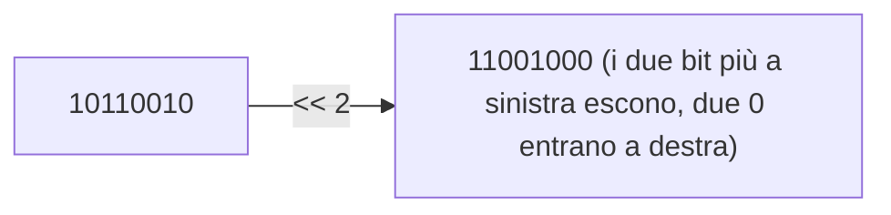

# 🧮 Modulo 6 — Operatori ed Espressioni

- **Corso:** C Master — Dai Bit al Software
- **Piattaforma:** GCProf Academy
- **Livello:** 🟢 Base (Fase 2 — Il Linguaggio C)
- **Target:** Matricole di Ingegneria, studenti di discipline scientifiche e del triennio tecnico-scientifico, docenti, appassionati
- **Prerequisiti:** Modulo 5 (variabili e tipi di dato)
- **Obiettivo Didattico:** Scrivere espressioni corrette applicando precedenza e associatività degli operatori; usare gli operatori aritmetici, relazionali, logici e bit a bit; distinguere conversioni implicite ed esplicite; riconoscere le situazioni di overflow e di comportamento indefinito, per scriverne di meno.

---

<a id="indice"></a>
# 📑 Indice del Modulo 6

1. [Capitolo 1 — Gli Operatori Aritmetici](#capitolo-1)
2. [Capitolo 2 — Il Resto della Divisione: l'Operatore `%`](#capitolo-2)
3. [Capitolo 3 — Incremento, Decremento e Assegnazioni Composte](#capitolo-3)
4. [Capitolo 4 — Operatori Relazionali e Logici](#capitolo-4)
5. [Capitolo 5 — Operatori Bit a Bit e Maschere](#capitolo-5)
6. [Capitolo 6 — Precedenza e Associatività](#capitolo-6)
7. [Capitolo 7 — Conversioni di Tipo: Implicite ed Esplicite](#capitolo-7)
8. [Capitolo 8 — Overflow e Comportamento Indefinito](#capitolo-8)
9. [Capitolo 9 — Errori Comuni per Chi Inizia](#capitolo-9)
10. [Capitolo 10 — Sintesi, Laboratorio e Autoverifica](#capitolo-10)

---

<a id="capitolo-1"></a>
## 1. Capitolo 1 — Gli Operatori Aritmetici

Ora che sai dichiarare variabili (Modulo 5), è il momento di farle **lavorare**: un'**espressione** è una combinazione di variabili, valori letterali e operatori che il compilatore valuta per produrre un risultato.

### ➕ I cinque operatori aritmetici di base

| Operatore | Significato | Esempio | Risultato |
| :---: | :--- | :--- | :---: |
| `+` | Addizione | `5 + 3` | 8 |
| `-` | Sottrazione | `5 - 3` | 2 |
| `*` | Moltiplicazione | `5 * 3` | 15 |
| `/` | Divisione | `5 / 3` | 1 (⚠️ vedi sotto) |
| `%` | Modulo (resto) | `5 % 3` | 2 (Capitolo 2) |

### ⚠️ La divisione intera: la trappola più famosa del C

Se **entrambi** gli operandi di `/` sono interi, il risultato è un **intero**: la parte decimale viene **troncata** (non arrotondata), non scartata per magia ma perché il tipo risultato non ha dove metterla.

```c
int a = 5 / 2;        // vale 2, non 2.5!
double b = 5 / 2;      // vale ANCORA 2.0: la divisione intera avviene PRIMA dell'assegnazione
double c = 5.0 / 2;    // vale 2.5: basta che UN SOLO operando sia in virgola mobile
```

💡 **Regola d'oro:** per ottenere una divisione con i decimali, **almeno uno** dei due operandi deve essere `float` o `double`. Il tipo della variabile di destinazione **non conta**: conta il tipo degli **operandi** nell'espressione, valutata prima dell'assegnazione.

```c
// ==================== ESEMPIO 6.1: DIVISIONE INTERA CONTRO DIVISIONE REALE ====================
/*
   Confrontiamo la stessa divisione (5 e 2) scritta in modi diversi.
   Nota: b vale 2.0 anche se è un double, perché "5 / 2" viene calcolato
   TUTTO in interi PRIMA di essere convertito e assegnato a b.
*/

#include <stdio.h>

int main(void)
{
    int a = 5 / 2;          // divisione intera: risultato 2 (tronca lo 0.5)
    double b = 5 / 2;        // ANCORA divisione intera (5 e 2 sono int): 2, poi convertito a 2.0
    double c = 5.0 / 2;      // divisione REALE: uno dei due operandi è double
    double d = (double)5 / 2;  // cast esplicito (Capitolo 7): stesso effetto di c

    printf("5 / 2       (int)    = %d\n", a);
    printf("5 / 2   in double    = %.1f\n", b);
    printf("5.0 / 2 (double)     = %.1f\n", c);
    printf("(double)5 / 2        = %.1f\n", d);

    return 0;
}
```

**Output:**

```text
5 / 2       (int)    = 2
5 / 2   in double    = 2.0
5.0 / 2 (double)     = 2.5
(double)5 / 2        = 2.5
```

[🔙 Torna all'indice](#indice)

---

<a id="capitolo-2"></a>
## 2. Capitolo 2 — Il Resto della Divisione: l'Operatore `%`

Lo hai già usato nel Modulo 1 (algoritmo di Euclide) e nel Modulo 2 (conversioni tra basi): l'operatore **modulo** `%` restituisce il **resto** di una divisione intera. Funziona **solo con operandi interi** (mai con `float`/`double`: per quelli esiste `fmod()`, nella libreria matematica).

### 🔢 Un uso classico: pari o dispari

```c
if (n % 2 == 0)   // resto della divisione per 2 uguale a 0 -> n è pari
```

### ⚠️ Il resto con numeri negativi

Prima del C99 il comportamento era definito "dall'implementazione"; **dal C99 in poi lo standard fissa una regola precisa**: il resto ha lo **stesso segno del dividendo** (il primo operando), e vale sempre l'identità `a == (a / b) * b + a % b`.

| Espressione | Risultato | Perché |
| :---: | :---: | :--- |
| `10 % 3` | 1 | 10 = 3·3 + 1 |
| `-10 % 3` | **−1** | segno del dividendo (−10) |
| `10 % -3` | **1** | segno del dividendo (10) |
| `-10 % -3` | **−1** | segno del dividendo (−10) |

```c
// ==================== ESEMPIO 6.2: IL RESTO CON I SEGNI ====================
/*
   Verifichiamo la regola del C99: il resto ha sempre il segno del DIVIDENDO
   (il primo operando), indipendentemente dal segno del divisore.
   Verifichiamo anche l'identità a == (a/b)*b + a%b.
*/

#include <stdio.h>

int main(void)
{
    int a = 10, b = 3;

    printf("%d %% %d = %d\n", a, b, a % b);
    printf("%d %% %d = %d\n", -a, b, -a % b);
    printf("%d %% %d = %d\n", a, -b, a % -b);
    printf("%d %% %d = %d\n", -a, -b, -a % -b);

    // Verifica dell'identità fondamentale
    int quoziente = -a / b;
    int resto = -a % b;
    printf("\nVerifica: (%d / %d)*%d + (%d %% %d) = %d*%d + %d = %d\n",
           -a, b, b, -a, b, quoziente, b, resto, quoziente * b + resto);

    return 0;
}
```

**Output:**

```text
10 % 3 = 1
-10 % 3 = -1
10 % -3 = 1
-10 % -3 = -1

Verifica: (-10 / 3)*3 + (-10 % 3) = -3*3 + -1 = -10
```

[🔙 Torna all'indice](#indice)

---

<a id="capitolo-3"></a>
## 3. Capitolo 3 — Incremento, Decremento e Assegnazioni Composte

### ⏫⏬ Incremento e decremento

Aggiungere o togliere 1 a una variabile è così comune da avere una scorciatoia dedicata:

| Operatore | Equivalente a | Nome |
| :---: | :--- | :--- |
| `x++` | `x = x + 1` (ma restituisce il valore **prima** dell'incremento) | Post-incremento |
| `++x` | `x = x + 1` (ma restituisce il valore **dopo** l'incremento) | Pre-incremento |
| `x--` | `x = x - 1` (valore prima del decremento) | Post-decremento |
| `--x` | `x = x - 1` (valore dopo il decremento) | Pre-decremento |

La differenza conta solo quando **usi il valore restituito** nella stessa espressione (per esempio in un `printf` o in un'assegnazione); se scrivi `x++;` da solo, su una riga propria, **non c'è alcuna differenza pratica** — ed è così che li useremo più spesso nei cicli (Modulo 9).

```c
// ==================== ESEMPIO 6.3: PRE E POST INCREMENTO, PASSO PER PASSO ====================
/*
   Osserviamo, un'istruzione alla volta, la differenza tra x++ e ++x.
   NOTA IMPORTANTE: scrivere espressioni come "x++ + ++x" nella stessa istruzione
   è COMPORTAMENTO INDEFINITO in C (l'ordine di valutazione non è garantito):
   qui li separiamo sempre su righe distinte, come si deve fare nel codice reale.
*/

#include <stdio.h>

int main(void)
{
    int x = 5;
    printf("x iniziale        = %d\n", x);

    printf("x++ restituisce    = %d\n", x++);   // stampa 5 (il valore PRIMA), POI x diventa 6
    printf("dopo x++, x        = %d\n", x);      // ora x vale 6

    printf("++x restituisce    = %d\n", ++x);    // x diventa 7 PRIMA, poi stampa 7
    printf("dopo ++x, x        = %d\n", x);      // resta 7

    return 0;
}
```

**Output:**

```text
x iniziale        = 5
x++ restituisce    = 5
dopo x++, x        = 6
++x restituisce    = 7
dopo ++x, x        = 7
```

### 🧮 Le assegnazioni composte

Un'altra famiglia di scorciatoie, per "modifica e riassegna":

| Operatore | Equivalente a |
| :---: | :--- |
| `x += n` | `x = x + n` |
| `x -= n` | `x = x - n` |
| `x *= n` | `x = x * n` |
| `x /= n` | `x = x / n` |
| `x %= n` | `x = x % n` |

*(Esistono anche le forme composte per gli operatori bit a bit — `&=`, `\|=`, `^=`, `<<=`, `>>=` — che vedremo nel Capitolo 5.)*

```c
// ==================== ESEMPIO 6.4: ASSEGNAZIONI COMPOSTE IN SEQUENZA ====================
#include <stdio.h>

int main(void)
{
    int y = 5;
    printf("y iniziale = %d\n", y);

    y += 3;   printf("dopo y += 3, y = %d\n", y);    // 5 + 3 = 8
    y -= 1;   printf("dopo y -= 1, y = %d\n", y);    // 8 - 1 = 7
    y *= 2;   printf("dopo y *= 2, y = %d\n", y);    // 7 * 2 = 14
    y /= 3;   printf("dopo y /= 3, y = %d\n", y);    // 14 / 3 = 4 (divisione intera)
    y %= 2;   printf("dopo y %%= 2, y = %d\n", y);   // 4 % 2 = 0

    return 0;
}
```

**Output:**

```text
y iniziale = 5
dopo y += 3, y = 8
dopo y -= 1, y = 7
dopo y *= 2, y = 14
dopo y /= 3, y = 4
dopo y %= 2, y = 0
```

[🔙 Torna all'indice](#indice)

---

<a id="capitolo-4"></a>
## 4. Capitolo 4 — Operatori Relazionali e Logici

### ⚖️ Gli operatori relazionali (di confronto)

Confrontano due valori e restituiscono **`1`** (vero) o **`0`** (falso) — ricordi la convenzione del C vista nel Modulo 3?

| Operatore | Significato | Esempio |
| :---: | :--- | :--- |
| `==` | Uguale a | `a == b` |
| `!=` | Diverso da | `a != b` |
| `<` | Minore di | `a < b` |
| `>` | Maggiore di | `a > b` |
| `<=` | Minore o uguale a | `a <= b` |
| `>=` | Maggiore o uguale a | `a >= b` |

⚠️ **L'errore più temuto del C:** `==` confronta, `=` assegna. Scrivere `if (a = 5)` **compila** (è un'assegnazione che restituisce 5, valore "vero" perché diverso da 0) ma quasi certamente **non fa quello che pensavi**. Ne parleremo ancora nel Modulo 8; per ora, tienilo bene a mente.

### 🔗 Gli operatori logici (già visti nel Modulo 3!)

| Operatore | Significato | Esempio |
| :---: | :--- | :--- |
| `&&` | AND logico | `a > 0 && b > 0` |
| `\|\|` | OR logico | `a == 0 \|\| b == 0` |
| `!` | NOT logico | `!trovato` |

Ricorda dal Modulo 3: in C, **0 è falso**, **qualsiasi valore diverso da 0 è vero**; `&&` e `||` restituiscono sempre `0` o `1`.

### ⚡ Il corto circuito (short-circuit): una rifinitura pratica

Anticipato nel Modulo 3, qui lo vediamo nel suo habitat naturale:

* **`&&`**: se il **primo** operando è falso, il risultato è già deciso (falso): il **secondo non viene nemmeno valutato**.
* **`||`**: se il **primo** operando è vero, il risultato è già deciso (vero): il **secondo non viene nemmeno valutato**.

Questo non è solo un dettaglio di efficienza: è una tecnica di **programmazione difensiva** molto usata, per esempio per evitare una divisione per zero **prima** che avvenga.

```c
// ==================== ESEMPIO 6.5: RELAZIONALI, LOGICI E CORTO CIRCUITO ====================
#include <stdio.h>

int main(void)
{
    int p = 1, q = 0;

    printf("p && q = %d\n", p && q);   // 0: q è falso
    printf("p || q = %d\n", p || q);   // 1: p è vero
    printf("!p     = %d\n", !p);       // 0: p era vero, negato diventa falso

    // Il corto circuito protegge da una divisione per zero
    int divisore = 0;
    if (divisore != 0 && 100 / divisore > 1)
    {
        printf("Non ci arriviamo mai\n");
    }
    else
    {
        printf("Divisione per zero evitata grazie al corto circuito (&&)\n");
    }

    // Confronto tra uguaglianza (==) e assegnazione (=): MAI confonderli in un if
    int a = 5;
    if (a == 5)      // confronto: vero se a vale 5
    {
        printf("a è proprio 5\n");
    }

    return 0;
}
```

**Output:**

```text
p && q = 0
p || q = 1
!p     = 0
Divisione per zero evitata grazie al corto circuito (&&)
a è proprio 5
```

[🔙 Torna all'indice](#indice)

---

<a id="capitolo-5"></a>
## 5. Capitolo 5 — Operatori Bit a Bit e Maschere

Torniamo agli operatori che lavorano **bit per bit**, già incontrati nel Modulo 3: qui li vediamo **tutti insieme**, con la sintassi completa e il loro impiego pratico.

### 🔩 I sei operatori bit a bit

| Operatore | Nome | Esempio (su 8 bit) |
| :---: | :--- | :--- |
| `&` | AND bit a bit | `0b10110010 & 0x0F` |
| `\|` | OR bit a bit | `0b10110010 \| 0x0F` |
| `^` | XOR bit a bit | `0b10110010 ^ 0xFF` |
| `~` | NOT bit a bit (complemento a 1) | `~0b10110010` |
| `<<` | Scorrimento a sinistra | `x << 2` |
| `>>` | Scorrimento a destra | `x >> 2` |

### ↔️ Gli operatori di scorrimento (shift)

* **`x << n`**: sposta tutti i bit di `x` di `n` posizioni **a sinistra**, riempiendo con `0` a destra. Equivale a **moltiplicare per 2ⁿ** (se non c'è overflow).
* **`x >> n`**: sposta i bit **a destra**. Per un **unsigned**, riempie con `0` a sinistra (equivale a **dividere per 2ⁿ**, troncando). Per un **signed**, il comportamento del bit più a sinistra (il segno) è, in pratica quasi ovunque, di **propagazione del segno**, ma lo standard lo lascia "definito dall'implementazione": per questo, **usa lo shift a destra solo su valori `unsigned`** quando la portabilità conta.



### 🎛️ Le maschere: un ripasso pratico (dal Modulo 3)

| Operazione | Codice | Effetto sul bit *n* |
| :--- | :--- | :--- |
| **Set** | `x \|= (1u << n);` | Diventa 1 |
| **Clear** | `x &= ~(1u << n);` | Diventa 0 |
| **Toggle** | `x ^= (1u << n);` | Si inverte |
| **Test** | `(x >> n) & 1u` | Vale 1 se il bit è 1 |

```c
// ==================== ESEMPIO 6.6: TUTTI GLI OPERATORI BIT A BIT ====================
/*
   flags = 0xB2 = 10110010 in binario.
   Verifichiamo AND, OR, XOR, NOT e i due scorrimenti, confrontando col Modulo 3.
*/

#include <stdio.h>

void stampa_binario(unsigned int valore, int n_bit)     // lo strumento del Modulo 2
{
    for (int i = n_bit - 1; i >= 0; i--)
    {
        putchar(((valore >> i) & 1u) ? '1' : '0');
    }
}

int main(void)
{
    unsigned char flags = 0xB2;    // 10110010

    printf("flags        : "); stampa_binario(flags, 8); printf(" (%u)\n", flags);

    printf("flags & 0x0F : "); stampa_binario(flags & 0x0F, 8);
    printf(" (%u)  -- isola i 4 bit meno significativi\n", flags & 0x0F);

    printf("flags | 0x0F : "); stampa_binario(flags | 0x0F, 8);
    printf(" (%u)  -- accende i 4 bit meno significativi\n", flags | 0x0F);

    printf("flags ^ 0xFF : "); stampa_binario(flags ^ 0xFF, 8);
    printf(" (%u)  -- inverte tutti i bit (come ~flags su 8 bit)\n", flags ^ 0xFF);

    unsigned char negato = (unsigned char)(~flags);
    printf("~flags       : "); stampa_binario(negato, 8); printf(" (%u)\n", negato);

    unsigned char shift_sx = (unsigned char)(flags << 2);
    printf("flags << 2   : "); stampa_binario(shift_sx, 8); printf(" (%u)\n", shift_sx);

    unsigned char shift_dx = flags >> 2;
    printf("flags >> 2   : "); stampa_binario(shift_dx, 8); printf(" (%u)\n", shift_dx);

    return 0;
}
```

**Output:**

```text
flags        : 10110010 (178)
flags & 0x0F : 00000010 (2)  -- isola i 4 bit meno significativi
flags | 0x0F : 10111111 (191)  -- accende i 4 bit meno significativi
flags ^ 0xFF : 01001101 (77)  -- inverte tutti i bit (come ~flags su 8 bit)
~flags       : 01001101 (77)
flags << 2   : 11001000 (200)
flags >> 2   : 00101100 (44)
```

[🔙 Torna all'indice](#indice)

---

<a id="capitolo-6"></a>
## 6. Capitolo 6 — Precedenza e Associatività

### 🥇 Perché servono le regole di precedenza

`3 + 4 * 2` vale **11**, non 14: la **moltiplicazione ha precedenza più alta** dell'addizione, esattamente come in matematica. Ma il C ha **decine** di operatori: serve una tabella di riferimento.

### 📋 Tabella semplificata (dal più al meno prioritario)

| Priorità | Operatori | Associatività |
| :---: | :--- | :---: |
| 1 (più alta) | `()` `[]` (Modulo 10) | Sinistra → destra |
| 2 | `!` `~` `++` `--` (unari, prefissi) `(cast)` (Capitolo 7) | Destra → sinistra |
| 3 | `*` `/` `%` | Sinistra → destra |
| 4 | `+` `-` (binari) | Sinistra → destra |
| 5 | `<<` `>>` | Sinistra → destra |
| 6 | `<` `<=` `>` `>=` | Sinistra → destra |
| 7 | `==` `!=` | Sinistra → destra |
| 8 | `&` | Sinistra → destra |
| 9 | `^` | Sinistra → destra |
| 10 | `\|` | Sinistra → destra |
| 11 | `&&` | Sinistra → destra |
| 12 | `\|\|` | Sinistra → destra |
| 13 | `?:` (ternario, Modulo 8) | Destra → sinistra |
| 14 (più bassa) | `=` `+=` `-=` … | Destra → sinistra |

*(Tabella semplificata: la specifica completa del C ha 15 livelli con qualche operatore in più, che incontrerai più avanti nel corso.)*

### 🧭 Associatività: cosa succede a parità di priorità

Quando due operatori hanno la **stessa priorità**, l'**associatività** decide l'ordine: quasi tutti gli operatori binari sono **da sinistra a destra** (`8 - 3 - 2` si legge `(8 - 3) - 2 = 3`), ma l'**assegnazione** e gli **operatori unari** sono **da destra a sinistra** (`a = b = 5` si legge `a = (b = 5)`: prima si assegna 5 a `b`, poi il risultato — 5 — si assegna anche ad `a`).

### ⚠️ Il caso famoso: `&` e `==` insieme

Ricordi l'errore segnalato nel Modulo 3? `x & 1 == 0` **non** fa quello che sembra: `==` (priorità 7) **precede** `&` (priorità 8), quindi viene letto come `x & (1 == 0)`, cioè `x & 0`. **Nel dubbio, usa sempre le parentesi**: `(x & 1) == 0`. Le parentesi non costano nulla e rendono l'espressione **inequivocabile**, per il compilatore e per chi legge il tuo codice.

```c
// ==================== ESEMPIO 6.7: PRECEDENZA IN AZIONE ====================
#include <stdio.h>

int main(void)
{
    printf("3 + 4 * 2       = %d\n", 3 + 4 * 2);          // moltiplicazione prima: 3 + 8 = 11
    printf("(3 + 4) * 2     = %d\n", (3 + 4) * 2);        // parentesi cambiano l'ordine: 14

    int x = 6;
    printf("x & 1 == 0      = %d   (letto come x & (1==0), cioè x & 0)\n", x & 1 == 0);
    printf("(x & 1) == 0    = %d   (il controllo CORRETTO: x e' pari?)\n", (x & 1) == 0);

    int a, b;
    a = b = 5;               // associatività destra->sinistra: prima b=5, poi a=5
    printf("a = b = 5   ->  a=%d b=%d\n", a, b);

    return 0;
}
```

**Output:**

```text
3 + 4 * 2       = 11
(3 + 4) * 2     = 14
x & 1 == 0      = 0   (letto come x & (1==0), cioè x & 0)
(x & 1) == 0    = 1   (il controllo CORRETTO: x e' pari?)
a = b = 5   ->  a=5 b=5
```

*(Nota: compilando questo esempio, `gcc -Wall` mostra un warning proprio su `x & 1 == 0` — `suggest parentheses around comparison in operand of '&'`. È il compilatore che ti sta segnalando esattamente la trappola appena spiegata: un'ottima conferma che i warning vanno sempre letti con attenzione, come vedremo meglio nel Modulo 20.)*

[🔙 Torna all'indice](#indice)

---

<a id="capitolo-7"></a>
## 7. Capitolo 7 — Conversioni di Tipo: Implicite ed Esplicite

### 🔄 Conversioni implicite (automatiche)

Quando un'espressione mescola **tipi diversi**, il C converte automaticamente gli operandi verso un **tipo comune**, seguendo regole dette di **promozione**: in generale, dal tipo "più piccolo" verso quello "più grande" (`char`/`short` → `int`; `int` → `long`; `long` → `double`; e così via), per non perdere informazione durante il calcolo.

```c
int interi = 5;
double reali = 2.0;
double risultato = interi + reali;   // 'interi' viene convertito in 5.0, poi si somma: 7.0
```

⚠️ Ma la conversione implicita può anche **nascondere insidie**: assegnare un `double` a un `int` **tronca** silenziosamente la parte decimale (nessun errore, nessun avviso a runtime):

```c
int x = 3.9;    // x vale 3: la parte decimale è semplicemente persa
```

### 🎯 Conversioni esplicite: il cast

Un **cast** dichiara *intenzionalmente* una conversione, rendendola visibile a chi legge il codice: `(tipo) espressione`.

```c
double media = (double) somma / numero_elementi;   // forza una divisione reale
int intero = (int) 3.9;                              // tronca esplicitamente (stessa cosa di prima, ma DICHIARATA)
```

💡 **Perché usare il cast anche quando la conversione avverrebbe comunque?** Perché rende **esplicita l'intenzione**: chi legge (e i warning del compilatore, come vedremo nel Modulo 20) capisce che la conversione è **voluta**, non un errore di distrazione.

### 📐 La regola pratica per la divisione con i decimali

Hai già visto la trappola nel Capitolo 1: per dividere `somma` (un `int`) per `numero_elementi` (un altro `int`) ottenendo un risultato con i decimali, il cast va messo **su uno degli operandi, prima della divisione**:

```c
double media = (double) somma / numero_elementi;    // ✅ corretto: somma diventa double PRIMA di dividere
double media_sbagliata = (double) (somma / numero_elementi);  // ❌ la divisione intera è già avvenuta!
```

```c
// ==================== ESEMPIO 6.8: CONVERSIONI IMPLICITE ED ESPLICITE ====================
#include <stdio.h>

int main(void)
{
    // Conversione implicita: int + double
    int interi = 5;
    double reali = 2.5;
    double somma_mista = interi + reali;
    printf("5 (int) + 2.5 (double) = %.1f\n", somma_mista);

    // Troncamento implicito (silenzioso): attenzione!
    int troncato = 3.9;
    printf("int troncato da 3.9    = %d\n", troncato);

    // Cast esplicito per una media corretta
    int somma_voti = 27, numero_voti = 4;
    double media_corretta   = (double) somma_voti / numero_voti;
    double media_sbagliata  = (double) (somma_voti / numero_voti);   // divisione intera già avvenuta!

    printf("Media CORRETTA         = %.2f\n", media_corretta);
    printf("Media SBAGLIATA        = %.2f  (cast messo troppo tardi!)\n", media_sbagliata);

    return 0;
}
```

**Output:**

```text
5 (int) + 2.5 (double) = 7.5
int troncato da 3.9    = 3
Media CORRETTA         = 6.75
Media SBAGLIATA        = 6.00  (cast messo troppo tardi!)
```

[🔙 Torna all'indice](#indice)

---

<a id="capitolo-8"></a>
## 8. Capitolo 8 — Overflow e Comportamento Indefinito

Chiudiamo il cerchio aperto nel Modulo 2 e nel Modulo 5, ora che sai scrivere espressioni complete.

### 🔁 Overflow degli interi **senza segno**: definito

Ricordi il "contachilometri" del Modulo 2? Per i tipi `unsigned`, l'overflow è **ben definito dallo standard**: aritmetica modulo 2ⁿ. È prevedibile, e a volte perfino **sfruttato** intenzionalmente (per esempio in alcuni algoritmi di hashing).

### ⚡ Overflow degli interi **con segno**: comportamento indefinito

Per i tipi **con segno** (`int`, `long`...), l'overflow è invece **comportamento indefinito** (*undefined behavior*, spesso abbreviato **UB**): lo standard **non specifica** cosa debba succedere. In pratica, questo significa che:

* Il compilatore **può assumere che non accada mai**, e sulla base di questa assunzione può applicare ottimizzazioni che, in presenza di un overflow reale, danno risultati **sorprendenti e diversi tra compilatori, tra livelli di ottimizzazione, o perfino tra esecuzioni**.
* Non è "solo teoria": è una delle cause più insidiose di bug **difficili da riprodurre**, perché il programma può sembrare funzionare... finché non lo fa più, magari con un compilatore diverso o un'ottimizzazione più aggressiva.

### 🛡️ Come proteggersi: controllare *prima* di operare

La tecnica corretta non è "sperare che vada bene", ma **verificare le condizioni di overflow prima di eseguire l'operazione**, usando le costanti di `limits.h` (Modulo 5):

```c
if (a > 0 && b > 0 && a > INT_MAX - b)
{
    // la somma a + b andrebbe in overflow: gestiscila (es. errore, oppure usa un tipo più grande)
}
else
{
    int somma = a + b;   // qui siamo certi che è sicura
}
```

```c
// ==================== ESEMPIO 6.9: RICONOSCERE (E PREVENIRE) L'OVERFLOW ====================
/*
   Mostriamo cosa succede "in pratica" con l'overflow di un int, poi la tecnica
   corretta per PREVENIRLO controllando PRIMA di sommare.
   ATTENZIONE DIDATTICA: il risultato di INT_MAX + 1 qui sotto è quello osservato
   con gcc a ottimizzazione base, non una garanzia dello standard C.
*/

#include <stdio.h>
#include <limits.h>

int somma_sicura(int a, int b, int *risultato)
{
    // Controlliamo l'overflow PRIMA di eseguire la somma
    if (a > 0 && b > 0 && a > INT_MAX - b)
    {
        return 0;    // overflow rilevato: la somma non viene eseguita
    }
    if (a < 0 && b < 0 && a < INT_MIN - b)
    {
        return 0;    // overflow anche nel caso simmetrico, verso il basso
    }
    *risultato = a + b;   // qui la somma è garantita sicura
    return 1;
}

int main(void)
{
    printf("INT_MAX          = %d\n", INT_MAX);
    printf("INT_MAX + 1      = %d   <-- comportamento indefinito nella teoria!\n\n", INT_MAX + 1);

    int r;
    if (somma_sicura(INT_MAX, 1, &r))
    {
        printf("2147483647 + 1 = %d\n", r);
    }
    else
    {
        printf("2147483647 + 1 -> OVERFLOW RILEVATO, somma NON eseguita\n");
    }

    if (somma_sicura(100, 200, &r))
    {
        printf("100 + 200      = %d\n", r);
    }
    else
    {
        printf("100 + 200 -> OVERFLOW RILEVATO\n");
    }

    return 0;
}
```

**Output:**

```text
INT_MAX          = 2147483647
INT_MAX + 1      = -2147483648   <-- comportamento indefinito nella teoria!

2147483647 + 1 -> OVERFLOW RILEVATO, somma NON eseguita
100 + 200      = 300
```

*(Anche qui, `gcc -Wall` avvisa: `integer overflow in expression of type 'int'` proprio sulla riga `INT_MAX + 1`. Il compilatore, in questo caso, riesce ad accorgersi a tempo di compilazione che quell'espressione va in overflow: un'ulteriore conferma di quanto sia importante non ignorare mai i warning.

La funzione `somma_sicura` usa un **puntatore** (`int *risultato`) per restituire il valore calcolato: è un'anteprima di un meccanismo che approfondiremo interamente nel Modulo 15 — per ora, basta osservare **il principio**: controllare prima di operare.)*

[🔙 Torna all'indice](#indice)

---

<a id="capitolo-9"></a>
## 9. Capitolo 9 — Errori Comuni per Chi Inizia

| Errore | Perché è sbagliato | Come evitarlo |
| :--- | :--- | :--- |
| `media = somma / numero;` con interi | Divisione intera: tronca i decimali | Fai il cast di **un operando** a `double` **prima** della divisione |
| Confondere `=` e `==` in una condizione | `=` assegna (e "riesce" quasi sempre); `==` confronta | Leggi ad alta voce: "uguale" ha due segni |
| `x & 1 == 0` senza parentesi | `==` ha priorità maggiore di `&`: viene letto `x & (1==0)` | Usa sempre le parentesi con `&`, `\|`, `^` vicino a confronti |
| Scrivere `x++ + ++x` nella stessa espressione | Comportamento indefinito: l'ordine di valutazione non è garantito | Non modificare la stessa variabile più volte nella stessa espressione |
| Usare `>>` su un `int` negativo, aspettandosi un comportamento portabile | Lo standard lascia il risultato "definito dall'implementazione" per i signed | Usa `unsigned` quando ti serve uno shift a destra prevedibile ovunque |
| Ignorare l'overflow di un `int` in un calcolo con numeri grandi | È comportamento indefinito: il risultato può essere imprevedibile | Controlla prima con `limits.h`, o scegli un tipo più capiente (`long long`) |
| Pensare che il cast su un `int` già calcolato "recuperi" i decimali persi | Il cast non può restituire un'informazione già scartata | Applica il cast **prima** dell'operazione che tronca, non dopo |
| Dimenticare che `%` non funziona con `float`/`double` | `%` è definito solo per gli interi | Per il resto tra numeri reali, usa `fmod()` (in `math.h`) |

💡 **Consiglio pratico:** nel dubbio su precedenza o conversioni, **aggiungi parentesi o un cast esplicito**. Non costano nulla in prestazioni e tolgono ogni ambiguità, sia al compilatore sia a chi (tu compreso, tra sei mesi) rileggerà il codice.

[🔙 Torna all'indice](#indice)

---

<a id="capitolo-10"></a>
## 10. Capitolo 10 — Sintesi, Laboratorio e Autoverifica

### 💡 Punti Chiave del Modulo 6

1. Gli **operatori aritmetici** (`+ - * / %`) seguono le regole della matematica, con un'eccezione cruciale: la **divisione tra interi tronca** i decimali.
2. Il **resto `%`** (solo per interi) segue, dal C99, il **segno del dividendo**; vale sempre `a == (a/b)*b + a%b`.
3. **Incremento/decremento** (`++`/`--`) hanno forma **prefissa** (restituisce il valore dopo) e **postfissa** (restituisce il valore prima); le **assegnazioni composte** (`+=`, `-=`...) sono scorciatoie per "modifica e riassegna".
4. Gli **operatori relazionali** (`== != < > <= >=`) confrontano; gli **operatori logici** (`&& || !`) combinano condizioni con il **corto circuito**; **mai confondere `=` con `==`**.
5. Gli **operatori bit a bit** (`& | ^ ~ << >>`) lavorano sui singoli bit; le **maschere** (`1u << n`) permettono di impostare, azzerare, invertire e leggere un bit specifico.
6. **Precedenza e associatività** determinano l'ordine di valutazione di un'espressione con più operatori: **nel dubbio, usa le parentesi**.
7. Le **conversioni implicite** avvengono automaticamente (verso il tipo "più grande"), ma possono nascondere un troncamento silenzioso; il **cast** esplicito (`(tipo) espressione`) rende l'intenzione visibile — e va messo **prima** dell'operazione che tronca.
8. L'overflow degli **interi senza segno** è ben definito (modulo 2ⁿ); l'overflow degli **interi con segno** è **comportamento indefinito**: va **prevenuto**, controllando le condizioni con `limits.h` prima di operare, non "scoperto" a posteriori.

---

### 📖 Mini-Glossario

| Termine | Significato |
| :--- | :--- |
| **Espressione** | Combinazione di valori, variabili e operatori che produce un risultato |
| **Divisione intera** | Divisione tra interi che tronca (non arrotonda) la parte decimale |
| **Operatore modulo (`%`)** | Restituisce il resto di una divisione intera |
| **Pre/post incremento** | `++x` (restituisce dopo l'incremento) contro `x++` (restituisce prima) |
| **Assegnazione composta** | Scorciatoia come `x += n` per `x = x + n` |
| **Corto circuito** | Valutazione di `&&`/`\|\|` che salta il secondo operando quando il risultato è già deciso |
| **Precedenza** | Ordine con cui gli operatori vengono applicati in un'espressione |
| **Associatività** | Direzione di valutazione (sinistra→destra o destra→sinistra) a parità di priorità |
| **Conversione implicita** | Conversione di tipo automatica, decisa dal compilatore |
| **Cast (conversione esplicita)** | Conversione di tipo dichiarata dal programmatore con `(tipo)` |
| **Comportamento indefinito (UB)** | Situazione per cui lo standard C non specifica alcun risultato garantito |

---

### 🧪 Laboratorio Pratico: "Il Calcolatore Consapevole"

**Obiettivo:** applicare operatori, precedenza e conversioni evitando le trappole classiche.

**Parte A — Carta e penna**
1. Calcola a mano, senza eseguire il codice: `17 / 5`, `17 % 5`, `-17 % 5`, `17 % -5`.
2. Applica la tabella di precedenza del Capitolo 6 per calcolare a mano: `2 + 3 * 4 - 6 / 2`; `10 > 5 && 3 < 1 || 2 == 2`.
3. Riscrivi con le parentesi, in modo inequivocabile, l'espressione `y & 1 == 0` per un intero `y`, in modo che controlli davvero se `y` è pari.

**Parte B — Verifica con OnlineGDB**
4. Riproduci l'**Esempio 6.7** e verifica le tue risposte del punto 2 con `printf`.
5. Nell'**Esempio 6.7**, prova `x = 7` al posto di `x = 6` in entrambe le espressioni (`x & 1 == 0` e `(x & 1) == 0`): questa volta i risultati **coincidono ancora, o differiscono**? Spiega perché, ragionando sulla precedenza.
6. Riproduci l'**Esempio 6.8** e scrivi una versione che calcola la media di **5** voti a tua scelta, prima in modo **corretto** poi in modo **sbagliato** (cast applicato troppo tardi), confrontando i risultati.

**Parte C — Bit e overflow**
7. Nell'**Esempio 6.6**, sostituisci `flags = 0xB2` con un valore a tua scelta e ricalcola a mano AND, OR, XOR e i due scorrimenti **prima** di eseguire il programma; poi verifica.
8. Riproduci l'**Esempio 6.9** e prova `somma_sicura(-2147483648, -1, &r)`: cosa restituisce, e perché?

**🚀 Sfida finale**
9. Scrivi una funzione `int moltiplicazione_sicura(int a, int b, int *risultato)` sul modello di `somma_sicura`, che restituisca `0` se `a * b` andrebbe in overflow (suggerimento: se `a != 0`, l'overflow avviene se `b > INT_MAX / a` oppure `b < INT_MIN / a`, con qualche caso speciale da considerare per i segni) e `1` altrimenti, eseguendo la moltiplicazione solo quando è sicura.

*Suggerimento:* riusa la struttura delle funzioni e dei controlli dell'Esempio 6.9.

---

### ❓ Quiz di Autoverifica

**Domanda 1:** Quanto vale `7 / 2` in C, con `7` e `2` di tipo `int`?
- A) 3.5
- B) 3
- C) 4
- D) Errore di compilazione

**Domanda 2:** Quanto vale `-7 % 2` in C (standard C99 e successivi)?
- A) 1
- B) -1
- C) 3
- D) -3

**Domanda 3:** Data `int x = 5;`, cosa stampa `printf("%d", x++);`?
- A) 6
- B) 5
- C) Un valore indefinito
- D) Un errore di compilazione

**Domanda 4:** Come va letta correttamente l'espressione `x & 1 == 0` per un `int x`, secondo le regole di precedenza del C?
- A) `(x & 1) == 0`
- B) `x & (1 == 0)`
- C) `(x & 1) == (0)`, identico al caso A
- D) È un errore di sintassi

**Domanda 5:** Qual è il modo corretto per calcolare la media (con i decimali) tra due interi `somma` e `n`?
- A) `double media = somma / n;`
- B) `double media = (double)(somma / n);`
- C) `double media = (double) somma / n;`
- D) Non è possibile ottenere decimali dividendo due interi

**Domanda 6:** Qual è, secondo lo standard C, la differenza tra l'overflow di un `unsigned int` e quello di un `int`?
- A) Nessuna differenza: si comportano allo stesso modo
- B) L'overflow di `unsigned` è ben definito (aritmetica modulo 2ⁿ); quello di `int` (con segno) è comportamento indefinito
- C) L'overflow avviene solo per i tipi `unsigned`
- D) L'overflow avviene solo per i tipi con segno

**Domanda 7:** Perché è preferibile aggiungere sempre le parentesi in un'espressione con operatori misti (relazionali, logici, bit a bit)?
- A) Perché altrimenti il programma non compila
- B) Perché rendono l'espressione inequivocabile, sia per il compilatore sia per chi legge il codice
- C) Perché rallentano volutamente l'esecuzione, rendendola più sicura
- D) Non serve mai: la precedenza standard basta sempre a evitare ambiguità

---

[🔙 Torna all'indice](#indice)