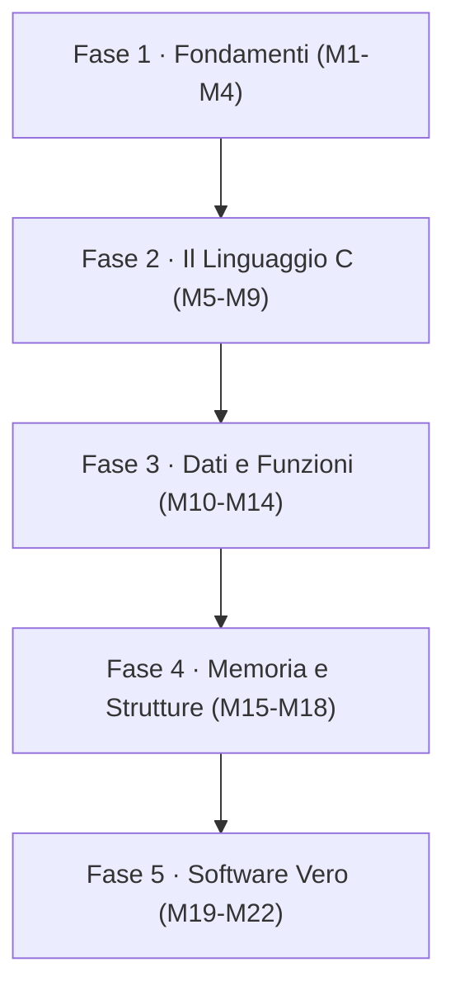

# 🚀 C Master: Dai Bit al Software — La Guida Completa alla Programmazione in C per l'Ingegneria
**Il percorso definitivo di GCProf Academy per capire come funziona davvero un computer — e per dominarlo, riga di codice dopo riga di codice, con il linguaggio che regge il mondo.**

Benvenuto nella preview esclusiva della nuova **Guida Completa alla Programmazione in C** di **GCProf Academy**. Non un semplice manuale di sintassi, ma un **percorso didattico progressivo e modulare** che ti accompagna dal significato stesso di *algoritmo* fino alla costruzione di programmi completi, modulari e robusti, passando per bit, memoria, puntatori e strutture dati dinamiche.

Il C ha più di cinquant'anni e non è mai stato così vivo: è il linguaggio dei **sistemi operativi**, dei **microcontrollori e dei sistemi embedded**, dei **compilatori**, dei **motori sotto cui girano Python e molte librerie di Intelligenza Artificiale**. Chi impara il C non impara "un linguaggio in più": impara **cosa succede davvero dentro la macchina**. È la competenza che distingue chi *usa* la tecnologia da chi la *capisce* — e che ti rende più forte in **qualsiasi** altro linguaggio tu affronti dopo.

Il percorso è pensato per le **matricole di Ingegneria** e parte dalle fondamenta dell'informatica (numeri binari, algebra di Boole, architettura del calcolatore) per arrivare a un **progetto finale completo**. Ogni modulo cresce sul precedente, con esempi commentati riga per riga, eseguibili gratuitamente online, laboratori pratici, quiz di autoverifica e infografiche che rendono visibili anche i concetti più astratti.

**[👉 Iscriviti ora e inizia dal Modulo 1!]**

---

## 🏗️ L'Architettura del Corso

Il corso è strutturato in **5 Fasi** progressive (**22 moduli**), ciascuna con un traguardo concreto:

| Fase | Livello | Cosa saprai fare al termine |
|---|---|---|
| **1. Fondamenti dell'Informatica** | Base | Spiegare cos'è un algoritmo, come il computer rappresenta numeri, testi e immagini, come funziona la logica booleana e cosa accade nella CPU quando un programma viene eseguito |
| **2. Il Linguaggio C** | Base | Scrivere, compilare ed eseguire programmi C corretti: variabili, tipi, operatori, input/output, condizioni e cicli |
| **3. Dati Strutturati e Sottoprogrammi** | Intermedio | Organizzare i dati con array, stringhe e `struct`, scomporre un problema in funzioni e usare la ricorsione con consapevolezza di come lavora la pila |
| **4. Memoria, Puntatori e Strutture Dati** | Avanzato | Padroneggiare puntatori e allocazione dinamica, salvare e leggere dati da file, costruire liste, pile e code, scegliere e confrontare algoritmi di ricerca e ordinamento |
| **5. Dal Codice al Software** | Professionale | Lavorare come uno sviluppatore: progetti multi-file, debug, test, Git, sicurezza del codice, C nel mondo embedded e dell'AI, e un Project Work finale |

---

## 🎯 Cosa Otterrai: Corrispondenza con un Corso Universitario di Fondamenti di Informatica

Il percorso è costruito prendendo spunto dai programmi di **Fondamenti di Informatica del primo anno di Ingegneria**, e li **integra e aggiorna** con strumenti e pratiche che oggi contano nel lavoro reale.

| Competenza attesa al primo anno di Ingegneria | Dove la sviluppi |
|---|---|
| Modello architetturale del calcolatore; rappresentazione di numeri, testi, immagini e multimedia; algebra di Boole; concetti di algoritmo, programma, processo | **M1 – M4** |
| Flusso di progettazione e sviluppo del codice; lessico e sintassi del C; modello di esecuzione di un programma (codice, dati, pila) | **M1, M5 – M9, M13, M16** |
| Risolvere problemi: strategia di soluzione e modellazione corretta dei dati | **M8 – M14, M18 – M19** |
| Codificare un algoritmo in C e validarlo al calcolatore | **M9 – M13, M19 – M20, M22** |
| Usare un ambiente integrato di sviluppo (editor, compilatore, linker, loader) | **M1, M20** |

### ➕ Cosa aggiungiamo rispetto al programma tradizionale
* 🛡️ **Programmazione sicura**: buffer overflow, comportamenti indefiniti e le buone pratiche per evitarli
* 🔍 **Debug e strumenti professionali**: warning del compilatore, `gdb`, sanitizer e test con `assert`
* 🧰 **Workflow da sviluppatore**: progetti multi-file, `Makefile` e primi passi con Git
* 📐 **Standard moderni**: C11/C17, con cenni alle novità di C23
* 🤖 **C e Intelligenza Artificiale**: perché il C è "sotto il cofano" di Python e dell'AI, e come usare gli assistenti AI per programmare *senza smettere di capire*
* 🎨 **Infografiche Mermaid**: memoria, pila, puntatori e liste rappresentati visivamente, non solo descritti

---

## 👥 A chi è rivolto

* 🎓 **Matricole di Ingegneria** (informatica, elettronica, meccanica, gestionale, civile, ambientale…) che affrontano il primo corso di programmazione
* 🧑‍🔬 Studenti di **Informatica, Fisica, Matematica e discipline scientifiche** che vogliono basi solide
* 🏫 Studenti del **triennio delle superiori** a indirizzo tecnico e scientifico (Scienze Applicate incluso) che vogliono anticipare il livello universitario
* 👨‍🏫 **Docenti** che vogliono un percorso già pronto, modulare e utilizzabile in classe in qualsiasi ordine
* 🚀 Chiunque voglia capire come funziona davvero un computer, senza scorciatoie

**Requisiti:** nessuna esperienza di programmazione. Serve solo curiosità, un browser e un minimo di familiarità con l'algebra di base. Gli esempi si eseguono **gratuitamente online** su OnlineGDB, senza installare nulla; per chi vuole, il corso indica anche come lavorare in locale con `gcc`.

---

## 📑 Indice dei Moduli Navigabile

**FASE 1 — LIVELLO BASE: Fondamenti dell'Informatica**
* [Modulo 1: Che cos'è l'Informatica — Algoritmi, Programmi e Catena di Programmazione](#modulo-1)
* [Modulo 2: La Natura dell'Informazione — Sistemi di Numerazione e Rappresentazione dei Dati](#modulo-2)
* [Modulo 3: Algebra di Boole e Logica Digitale](#modulo-3)
* [Modulo 4: Il Calcolatore Elettronico — Architettura ed Esecuzione delle Istruzioni](#modulo-4)

**FASE 2 — LIVELLO BASE: Il Linguaggio C**
* [Modulo 5: Struttura di un Programma C, Variabili e Tipi di Dato](#modulo-5)
* [Modulo 6: Operatori ed Espressioni](#modulo-6)
* [Modulo 7: Input e Output — Dialogare con l'Utente](#modulo-7)
* [Modulo 8: Strutture di Controllo Condizionali — if, else e switch](#modulo-8)
* [Modulo 9: Strutture Iterative — while, do-while e for](#modulo-9)

**FASE 3 — LIVELLO INTERMEDIO: Dati Strutturati e Sottoprogrammi**
* [Modulo 10: Array e Matrici — Collezioni di Dati Omogenei](#modulo-10)
* [Modulo 11: Stringhe e Caratteri](#modulo-11)
* [Modulo 12: Sottoprogrammi — Programmare in Piccolo e in Grande](#modulo-12)
* [Modulo 13: Ricorsione e Record di Attivazione — Come Funziona la Pila](#modulo-13)
* [Modulo 14: Tipi Definiti dall'Utente — struct, enum, typedef e union](#modulo-14)

**FASE 4 — LIVELLO AVANZATO: Memoria, Puntatori e Strutture Dati**
* [Modulo 15: Puntatori — Indirizzi, Memoria e Passaggio per Riferimento](#modulo-15)
* [Modulo 16: Allocazione Dinamica e Modello di Memoria](#modulo-16)
* [Modulo 17: File — Persistenza dei Dati su Disco](#modulo-17)
* [Modulo 18: Strutture Dati Dinamiche — Liste Collegate, Pile e Code](#modulo-18)

**FASE 5 — LIVELLO PROFESSIONALE: Dal Codice al Software**
* [Modulo 19: Algoritmi Fondamentali — Ricerca, Ordinamento e Complessità](#modulo-19)
* [Modulo 20: Programmazione Modulare e Strumenti Professionali](#modulo-20)
* [Modulo 21: Il C nel Mondo Reale — Embedded, Python e Intelligenza Artificiale](#modulo-21)
* [Modulo 22: Project Work Finale — Un'Applicazione C Completa](#modulo-22)

---

## 📚 Dettaglio dei Moduli

### FASE 1 — LIVELLO BASE: Fondamenti dell'Informatica

[🔙 Torna all'indice](#indice)

### Modulo 1: Che cos'è l'Informatica — Algoritmi, Programmi e Catena di Programmazione
Il punto di partenza: da dove viene l'informatica, cosa studia davvero e come un'idea diventa un programma in esecuzione.
* **Argomenti:** panoramica storica (da Babbage e Turing ai microprocessori), definizione e contenuti dell'informatica, il concetto di algoritmo e le sue proprietà, linguaggi di rappresentazione (pseudocodice e diagrammi di flusso), differenza tra algoritmo, programma e processo, la "catena di programmazione" (editor, preprocessore, compilatore, linker, loader), OnlineGDB come ambiente di lavoro, il primo programma `Hello, World!` e i primi errori di compilazione.
* **Al termine saprai:** distinguere problema, algoritmo, programma e processo, descrivere un algoritmo in pseudocodice e con un diagramma di flusso, compilare ed eseguire il tuo primo programma in C.

---

[🔙 Torna all'indice](#indice)

### Modulo 2: La Natura dell'Informazione — Sistemi di Numerazione e Rappresentazione dei Dati
Tutto, dentro un computer, è fatto di 0 e 1: numeri, lettere, foto, canzoni. Qui scopri come.
* **Argomenti:** bit e byte, sistemi posizionali (binario, ottale, esadecimale) e conversioni, interi senza segno e con segno (complemento a 2), overflow, numeri in virgola mobile (standard IEEE 754) ed errori di arrotondamento, codifica dei caratteri (ASCII, Unicode, UTF-8), rappresentazione di immagini (pixel, RGB), suono e contenuti multimediali (campionamento e compressione), cenni sui codici a controllo di parità.
* **Al termine saprai:** convertire numeri tra le basi, rappresentare interi in complemento a 2, spiegare perché `0.1 + 0.2` non è esattamente `0.3` e stimare l'occupazione di memoria di testi, immagini e audio.

---

[🔙 Torna all'indice](#indice)

### Modulo 3: Algebra di Boole e Logica Digitale
La matematica del vero e del falso: il linguaggio con cui sono costruiti sia i circuiti sia le condizioni dei tuoi programmi.
* **Argomenti:** operatori logici AND, OR, NOT (e XOR, NAND, NOR), tabelle di verità, proprietà e leggi di De Morgan, semplificazione di espressioni booleane, porte logiche e circuiti combinatori, il sommatore (half adder e full adder) come esempio di "aritmetica fatta di logica", anteprima degli operatori logici e bit a bit in C.
* **Al termine saprai:** costruire tabelle di verità, semplificare espressioni logiche, progettare un semplice circuito sommatore e collegare l'algebra di Boole alle condizioni e agli operatori del linguaggio C.

---

[🔙 Torna all'indice](#indice)

### Modulo 4: Il Calcolatore Elettronico — Architettura ed Esecuzione delle Istruzioni
Cosa c'è dentro la scatola? Un viaggio dalla CPU alla memoria per capire cosa succede quando "premi Esegui".
* **Argomenti:** architettura di von Neumann, CPU (ALU, registri, unità di controllo), memoria centrale, bus e dispositivi di I/O, il ciclo fetch-decode-execute, linguaggio macchina e assembly (cenni), gerarchia di memoria (registri, cache, RAM, disco), ruolo del sistema operativo, architetture moderne (multicore e acceleratori come le GPU), livelli di astrazione.
* **Al termine saprai:** descrivere passo dopo passo cosa fa la CPU per eseguire un'istruzione, spiegare perché la memoria è organizzata in una gerarchia e collocare il linguaggio C nella scala dei livelli di astrazione.

---

### FASE 2 — LIVELLO BASE: Il Linguaggio C

[🔙 Torna all'indice](#indice)

### Modulo 5: Struttura di un Programma C, Variabili e Tipi di Dato
Le prime vere fondamenta del linguaggio: come è fatto un programma C e come memorizza i dati.
* **Argomenti:** storia e ruolo del C (Dennis Ritchie, UNIX) e standard C11/C17/C23, lessico e sintassi (parole chiave, identificatori, commenti), struttura di un programma monomodulo (`#include`, `main`, `return`), dichiarazione e inizializzazione di variabili, tipi base (`int`, `short`, `long`, `char`, `float`, `double`, `bool`), `sizeof` e i limiti dei tipi (`limits.h`), tipi a larghezza fissa (`stdint.h`), costanti (`const` e `#define`).
* **Al termine saprai:** scrivere un programma monomodulo corretto, scegliere il tipo di dato adatto a ogni variabile e sapere quanta memoria occupa.

---

[🔙 Torna all'indice](#indice)

### Modulo 6: Operatori ed Espressioni
Come far calcolare, confrontare e decidere al computer — e come evitare le trappole più classiche del C.
* **Argomenti:** operatori aritmetici e resto (`%`), incremento e decremento, assegnazioni composte, operatori relazionali e logici (`&&`, `||`, `!`, valutazione a corto circuito), operatori bit a bit (`&`, `|`, `^`, `~`, `<<`, `>>`) e maschere, precedenza e associatività, conversioni implicite ed esplicite (cast), compatibilità tra tipi, overflow e comportamento indefinito.
* **Al termine saprai:** scrivere espressioni corrette applicando precedenza e conversioni di tipo, usare le maschere di bit per manipolare singoli bit e riconoscere le situazioni che producono risultati indefiniti.

---

[🔙 Torna all'indice](#indice)

### Modulo 7: Input e Output — Dialogare con l'Utente
Far parlare il programma con chi lo usa: leggere dati da tastiera e mostrare risultati ben formattati.
* **Argomenti:** `printf` e gli specificatori di formato (`%d`, `%f`, `%c`, `%s`, `%x`, `%p`), larghezza e precisione, `scanf` e l'operatore `&`, il valore di ritorno di `scanf`, `getchar` e `putchar`, il problema del buffer di input e del carattere di invio, validazione di un input semplice, stampa degli errori su `stderr`.
* **Al termine saprai:** costruire programmi interattivi che leggono e verificano i dati inseriti dall'utente, e presentare risultati in modo ordinato e leggibile.

---

[🔙 Torna all'indice](#indice)

### Modulo 8: Strutture di Controllo Condizionali — if, else e switch
Il momento in cui i programmi iniziano a "decidere".
* **Argomenti:** `if`, `else`, `else if`, condizioni annidate, il classico errore `=` contro `==`, l'ambiguità dell'`else` (dangling else), il costrutto `switch` con `case`, `break` e fall-through, l'operatore ternario `?:`, la nozione di vero e falso in C (0 e non-0), `stdbool.h`, scelta dei casi di test e dei valori limite.
* **Al termine saprai:** tradurre in codice decisioni a più rami, scegliere tra `if` e `switch` e collaudare un programma sui casi tipici e sui casi limite.

---

[🔙 Torna all'indice](#indice)

### Modulo 9: Strutture Iterative — while, do-while e for
Insegnare al computer a ripetere: la base di ogni automazione e di ogni algoritmo numerico.
* **Argomenti:** `while`, `do-while` e `for`, `break` e `continue`, cicli annidati, schemi ricorrenti (contatore, accumulatore, sentinella, flag, ricerca di massimo e minimo), cicli infiniti ed errori "off-by-one", traccia dell'esecuzione con tabella di simulazione, primi algoritmi classici (MCD di Euclide, numeri primi, successione di Fibonacci), perché evitare `goto`.
* **Al termine saprai:** scegliere il ciclo giusto per ogni problema, simulare a mano l'esecuzione di un ciclo e realizzare i primi algoritmi numerici completi.

---

### FASE 3 — LIVELLO INTERMEDIO: Dati Strutturati e Sottoprogrammi

[🔙 Torna all'indice](#indice)

### Modulo 10: Array e Matrici — Collezioni di Dati Omogenei
Da una variabile a mille: come gestire insiemi di dati dello stesso tipo.
* **Argomenti:** dichiarazione e inizializzazione, indici che partono da 0, il pericolo dell'accesso fuori dai limiti, scansione con i cicli, media, massimo, minimo e ricerca di un elemento, array multidimensionali e matrici (somma, trasposta, prodotto righe per colonne), array a dimensione costante e VLA, organizzazione in memoria (elementi contigui, ordine per righe).
* **Al termine saprai:** modellare insiemi di dati con array e matrici, elaborarli con i cicli e prevenire gli errori di accesso fuori dai limiti.

---

[🔙 Torna all'indice](#indice)

### Modulo 11: Stringhe e Caratteri
In C il testo non è un tipo a sé: è un array di caratteri con un "terminatore". Capirlo cambia tutto.
* **Argomenti:** stringhe come array di `char` terminati da `'\0'`, funzioni di `ctype.h` e di `string.h` (`strlen`, `strcpy`, `strcmp`, `strcat`, `strncpy`), perché `gets` è stato rimosso e come usare `fgets`, buffer overflow e sicurezza, `snprintf` e `sscanf`, array di stringhe, esempi pratici (palindromi, conteggio di parole, cifrario di Cesare).
* **Al termine saprai:** manipolare il testo in C in modo corretto e sicuro, evitando gli errori che causano malfunzionamenti e vulnerabilità.

---

[🔙 Torna all'indice](#indice)

### Modulo 12: Sottoprogrammi — Programmare in Piccolo e in Grande
Il passo che trasforma una sequenza di istruzioni in un programma organizzato, riutilizzabile e leggibile.
* **Argomenti:** definizione, prototipo e chiamata di funzioni, `return` e funzioni `void`, passaggio dei parametri per valore, array come parametri, variabili locali e globali, regole di visibilità e classi di memorizzazione (`auto`, `static`, `extern`), sviluppo top-down per raffinamenti successivi, decomposizione in funzioni, precondizioni e asserzioni.
* **Al termine saprai:** scomporre un problema complesso in funzioni piccole e riutilizzabili, gestire correttamente parametri e valori di ritorno e progettare un programma con l'approccio top-down.

---

[🔙 Torna all'indice](#indice)

### Modulo 13: Ricorsione e Record di Attivazione — Come Funziona la Pila
Una funzione che richiama se stessa: una delle idee più eleganti (e più fraintese) dell'informatica.
* **Argomenti:** caso base e passo ricorsivo, esempi classici (fattoriale, potenza, Fibonacci, MCD, Torre di Hanoi, ricerca binaria ricorsiva), record di attivazione e pila delle chiamate (con diagrammi Mermaid), stack overflow, confronto tra ricorsione e iterazione, ricorsione in coda.
* **Al termine saprai:** progettare algoritmi ricorsivi corretti, ricostruire a mano l'evoluzione della pila durante l'esecuzione e scegliere tra soluzione ricorsiva e iterativa.

---

[🔙 Torna all'indice](#indice)

### Modulo 14: Tipi Definiti dall'Utente — struct, enum, typedef e union
Modellare la realtà: uno studente, un punto sul piano, un numero complesso non sono semplici numeri.
* **Argomenti:** `struct` e accesso ai campi, array di `struct`, strutture annidate, `struct` come parametri, `typedef`, `enum`, `union` e cenni ai campi di bit, dimensione delle strutture e allineamento in memoria (padding), modellazione di dati reali.
* **Al termine saprai:** definire tipi di dato su misura per il problema, organizzare archivi di record in memoria e progettare funzioni che lavorano su dati strutturati.

---

### FASE 4 — LIVELLO AVANZATO: Memoria, Puntatori e Strutture Dati

[🔙 Torna all'indice](#indice)

### Modulo 15: Puntatori — Indirizzi, Memoria e Passaggio per Riferimento
Il concetto che spaventa più di ogni altro, e che rende il C così potente. Con gli schemi giusti diventa chiarissimo.
* **Argomenti:** la variabile come "indirizzo + contenuto", operatori `&` e `*`, dichiarazione e inizializzazione, `NULL`, passaggio per riferimento (lo `swap`), relazione tra puntatori e array, aritmetica dei puntatori, puntatori a `struct` (operatore `->`), puntatori a puntatori, `const` e puntatori, introduzione ai puntatori a funzione, errori classici (puntatore non inizializzato, dangling pointer).
* **Al termine saprai:** leggere e disegnare la memoria come una sequenza di indirizzi, usare i puntatori per modificare i dati delle funzioni chiamanti e riconoscere gli errori tipici da puntatore.

---

[🔙 Torna all'indice](#indice)

### Modulo 16: Allocazione Dinamica e Modello di Memoria
Chiedere memoria a runtime, usarla bene e restituirla: la responsabilità (e la libertà) del programmatore C.
* **Argomenti:** le aree di memoria di un processo (codice, dati, heap, pila), `malloc`, `calloc`, `realloc` e `free`, controllo del valore `NULL`, memory leak, double free e use-after-free, array e matrici dinamici, strumenti di diagnosi (AddressSanitizer e Valgrind in locale), buone pratiche di gestione della proprietà della memoria.
* **Al termine saprai:** allocare e liberare correttamente la memoria, costruire strutture di dimensione decisa a runtime e individuare con strumenti appositi gli errori di gestione della memoria.

---

[🔙 Torna all'indice](#indice)

### Modulo 17: File — Persistenza dei Dati su Disco
Far vivere i dati oltre la singola esecuzione del programma.
* **Argomenti:** file di testo e file binari, il tipo `FILE *`, `fopen` e `fclose` con le modalità di apertura, `fprintf`, `fscanf`, `fgets`, `fputs`, `fread` e `fwrite`, posizionamento (`fseek`, `ftell`, `rewind`), gestione della fine file e degli errori (`perror`, `errno`), organizzazione logica dei file, integrazione tra strutture dati in memoria centrale e su file (salvataggio e caricamento di archivi di `struct`), lettura di file CSV, argomenti da riga di comando (`argc` e `argv`).
* **Al termine saprai:** leggere e scrivere file di testo e binari, salvare e ricaricare archivi di record e gestire in modo robusto gli errori di I/O.

---

[🔙 Torna all'indice](#indice)

### Modulo 18: Strutture Dati Dinamiche — Liste Collegate, Pile e Code
Quando gli array non bastano più: strutture che crescono e si accorciano con i dati.
* **Argomenti:** limiti degli array, nodi e puntatori, lista singolarmente collegata (inserimento in testa, in coda e ordinato, ricerca, cancellazione), cenni alle liste doppie, pila (stack) e coda (queue) e loro implementazioni, applicazioni concrete (parentesi bilanciate, annulla/ripeti, coda di stampa), cenni agli alberi binari di ricerca, schemi Mermaid dei collegamenti tra nodi.
* **Al termine saprai:** costruire e manipolare liste, pile e code dinamiche, senza perdere memoria né collegamenti, e scegliere la struttura dati più adatta al problema.

---

### FASE 5 — LIVELLO PROFESSIONALE: Dal Codice al Software

[🔙 Torna all'indice](#indice)

### Modulo 19: Algoritmi Fondamentali — Ricerca, Ordinamento e Complessità
Non basta che un algoritmo funzioni: deve funzionare *bene*.
* **Argomenti:** cos'è la complessità e la notazione O-grande (in modo intuitivo), ricerca lineare e binaria, algoritmi di ordinamento (bubble sort, selection sort, insertion sort, merge sort, quick sort), `qsort` della libreria standard e uso dei puntatori a funzione come comparatori, misura dei tempi di esecuzione con `time.h`, confronto sperimentale tra algoritmi.
* **Al termine saprai:** confrontare algoritmi in base alla loro complessità, implementare i principali algoritmi di ricerca e ordinamento e misurarne le prestazioni.

---

[🔙 Torna all'indice](#indice)

### Modulo 20: Programmazione Modulare e Strumenti Professionali
Il salto da "studente che scrive esercizi" a "sviluppatore che costruisce progetti".
* **Argomenti:** il preprocessore (`#include`, `#define`, macro, compilazione condizionale, include guard), programmi multi-file (file `.h` e `.c`), compilazione separata e linking, `Makefile`, opzioni del compilatore (`-Wall`, `-Wextra`), debug con `gdb` e col metodo "a tavolino", sanitizer, collaudo con `assert` e test automatici semplici, primi passi con Git, comportamento indefinito e programmazione difensiva, stile del codice e documentazione.
* **Al termine saprai:** organizzare un progetto C su più file, compilarlo e collaudarlo con metodo, trovare i bug con gli strumenti giusti e scrivere codice leggibile e sicuro.

---

[🔙 Torna all'indice](#indice)

### Modulo 21: Il C nel Mondo Reale — Embedded, Python e Intelligenza Artificiale
Dove vive oggi il C, e perché impararlo ti fa capire (e usare meglio) tutto il resto.
* **Argomenti:** il C nei sistemi operativi e nei sistemi embedded/IoT (microcontrollori, accesso ai registri, `volatile`), il C "sotto il cofano" di Python e delle librerie scientifiche, esempio pratico di un neurone artificiale (perceptron) e di una regressione lineare scritti in C, cenni di interoperabilità C–Python, dal C al C++ (cosa cambia), uso responsabile degli assistenti AI nella programmazione: come farli lavorare per te senza rinunciare a capire, verificare e testare il codice.
* **Al termine saprai:** collocare il C nell'ecosistema tecnologico attuale, capire come algoritmi di AI elementari si traducono in codice a basso livello e usare gli strumenti di AI generativa come supporto, non come stampella.

---

[🔙 Torna all'indice](#indice)

### Modulo 22: Project Work Finale — Un'Applicazione C Completa
Il momento in cui tutto si unisce: dall'idea al programma funzionante, da capo a fondo.
* **Argomenti:** progettazione di un'applicazione multi-file (input/output, strutture di controllo, funzioni, `struct`, memoria dinamica, file, strutture dati, algoritmi), analisi del problema e sviluppo top-down, percorso guidato passo dopo passo con progetto a scelta in base al proprio indirizzo di ingegneria, collaudo, documentazione e presentazione.
* **Al termine saprai:** partire da un problema reale, progettare la soluzione, realizzarla in C e presentarla come un progetto di portfolio, spendibile all'università e nel primo colloquio di lavoro.

---

## 🛠️ La Nostra Metodologia Formativa

In **GCProf Academy** non crediamo nelle lezioni passive. Ogni modulo segue una **struttura didattica coerente**, pensata per essere affrontata in autonomia o guidata dal docente:

*Introduzione ➔ Obiettivi ➔ Prerequisiti ➔ Lezione teorica ➔ Esempi commentati (eseguibili su OnlineGDB) ➔ Laboratorio Pratico ➔ Best Practice ➔ Errori Comuni ➔ Quiz ➔ Riepilogo ➔ Glossario*

### Tipologie di Lezione Interattive
Le lezioni sono unità indipendenti e multimediali composte da:
* 📖 **Guida Teorica Markdown:** con indice navigabile integrato, leggibile sia su Google Colab che su Google Docs.
* 💻 **Esempi Commentati in C:** codice eseguibile online e gratuitamente, ogni riga chiave spiegata nei commenti.
* 🗺️ **Infografiche Mermaid:** memoria, pila, puntatori, liste e flussi degli algoritmi resi visivi.
* 🧪 **Laboratorio Pratico:** esercizi progressivi, dal livello base a quello avanzato, su ogni modulo.
* 🧩 **Quiz:** verifica immediata delle competenze acquisite, modulo per modulo.

---

## 🏆 Project Work e Valutazione Finale

Alla fine di ogni fase, una sfida concreta mette alla prova le competenze acquisite:

* **🏁 Fine Fase 1 — Fondamenti:** un dossier di problem solving: conversioni tra basi e complemento a 2, tabelle di verità, un algoritmo descritto con pseudocodice e diagramma di flusso.
* **🏁 Fine Fase 2 — Il Linguaggio C:** un programma interattivo che converte numeri tra decimale, binario ed esadecimale, con validazione dell'input.
* **🏁 Fine Fase 3 — Dati e Funzioni:** un gestionale di archivio (es. registro voti o anagrafica) con menu, `struct`, stringhe e funzioni dedicate.
* **🏁 Fine Fase 4 — Memoria e Strutture:** un archivio dinamico basato su lista collegata con salvataggio e caricamento da file, senza memory leak.
* **🏁 Fine Fase 5 — Project Work Finale:** un'applicazione C completa e multi-file, con tema a scelta in base al proprio indirizzo:
  * ⚙️ **Ingegneria Meccanica e Gestionale:** un sistema di gestione magazzino con file binari, ordinamento e report
  * ⚡ **Ingegneria Elettronica e dell'Automazione:** un simulatore di acquisizione da sensori con filtro a media mobile e log su file
  * 💻 **Ingegneria Informatica:** un interprete di comandi (mini shell) o un piccolo database in memoria con salvataggio su file
  * 🏗️ **Ingegneria Civile e Ambientale:** una libreria di calcolo numerico su matrici (sistemi lineari, integrazione) applicata a dati reali

---

### 🚀 Pronto a scoprire come funziona davvero un computer?
Grazie all'integrazione con l'ecosistema tecnologico di *GCProf Academy* (dashboard docente, tracciamento con Supabase e quiz automatizzati), questo non è solo un corso di programmazione in C, ma il tuo percorso guidato per costruire basi solide, quelle che restano per tutta la carriera, all'università e nel lavoro.

**[👉 Iscriviti ora e inizia dalla Fase 1!]**

[🔙 Torna all'indice](#indice)