# 🌐 MODULO 3 — Liste, Link e Immagini

### Materiale didattico — Prof. Giuseppe Carnabuci per la piattaforma gcprof-academy.com

### Corso: Web Programming Base — HTML5 & CSS3

---

## Cosa imparerai in questo modulo

In questo modulo imparerai a organizzare contenuti in elenchi ordinati, non ordinati e di definizione; a collegare pagine tra loro e verso l'esterno con gli hyperlink, padroneggiando percorsi relativi e assoluti, link a e-mail, telefono, file scaricabili e ancore interne; infine imparerai a inserire immagini in modo corretto, accessibile e ottimizzato, con didascalie semantiche. Al termine del modulo sarai in grado di costruire pagine ricche di contenuti navigabili e visivamente complete, pronte per essere collegate tra loro in un sito multipagina.

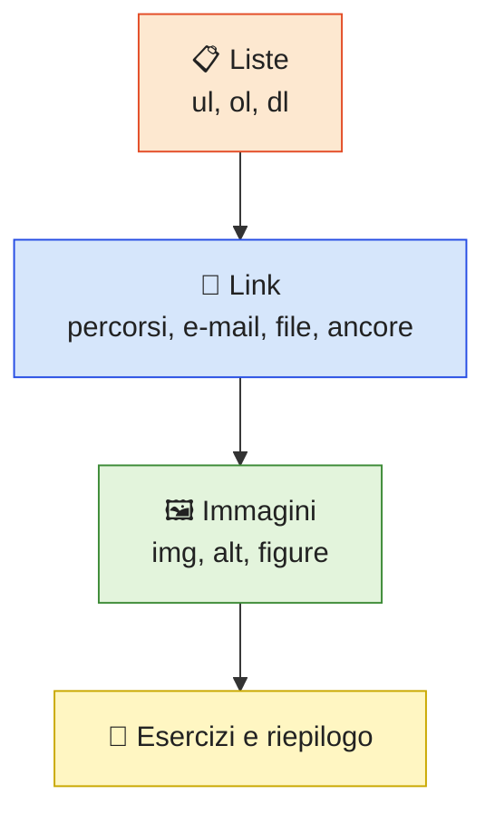

*📊 Il percorso del Modulo 3: liste, collegamenti e immagini.*

---

<a id="indice-modulo"></a>

## Indice del Modulo 3

- [5.1 Perché utilizzare le liste](#51-perche-utilizzare-le-liste)
- [5.2 Liste non ordinate](#52-liste-non-ordinate)
- [5.3 Liste ordinate](#53-liste-ordinate)
- [5.4 Elementi della lista](#54-elementi-della-lista)
- [5.5 Liste annidate](#55-liste-annidate)
- [5.6 Liste di definizione](#56-liste-di-definizione)
- [5.7 Esempio completo](#57-esempio-completo)
- [6.1 Che cos'è un collegamento ipertestuale](#61-che-cose-un-collegamento-ipertestuale)
- [6.2 Il tag `<a>`](#62-il-tag-a)
- [6.3 Collegamento ad un sito Web](#63-collegamento-ad-un-sito-web)
- [6.4 Collegamento ad una pagina interna](#64-collegamento-ad-una-pagina-interna)
- [6.5 Percorsi relativi](#65-percorsi-relativi)
- [6.6 Tornare alla cartella precedente](#66-tornare-alla-cartella-precedente)
- [6.7 Percorsi assoluti](#67-percorsi-assoluti)
- [6.8 Aprire una nuova scheda](#68-aprire-una-nuova-scheda)
- [6.9 Sicurezza dei link esterni](#69-sicurezza-dei-link-esterni)
- [6.10 Collegamento ad una e-mail](#610-collegamento-ad-una-e-mail)
- [6.11 Collegamento telefonico](#611-collegamento-telefonico)
- [6.12 Collegamento ad un file](#612-collegamento-ad-un-file)
- [6.13 Il pulsante Download](#613-il-pulsante-download)
- [6.14 Link all'interno della stessa pagina](#614-link-allinterno-della-stessa-pagina)
- [6.15 Esempio completo](#615-esempio-completo)
- [7.1 Perché utilizzare le immagini](#71-perche-utilizzare-le-immagini)
- [7.2 Il tag ``](#72-il-tag-img)
- [7.3 L'attributo `src`](#73-lattributo-src)
- [7.4 L'attributo `alt`](#74-lattributo-alt)
- [7.5 Dimensioni dell'immagine](#75-dimensioni-dellimmagine)
- [7.6 Cartella immagini](#76-cartella-immagini)
- [7.7 Formati più comuni](#77-formati-piu-comuni)
- [7.8 Immagini esterne](#78-immagini-esterne)
- [7.9 Didascalie con `<figure>`](#79-didascalie-con-figure)
- [7.10 Esempio completo](#710-esempio-completo)
- [Esercizi del Modulo 3](#esercizi-del-modulo-3)
- [Riepilogo del Modulo 3](#riepilogo-del-modulo-3)

---

<a id="51-perche-utilizzare-le-liste"></a>

**⬆️ [Torna all'Indice del Modulo](#indice-modulo)**

## 5.1 Perché utilizzare le liste

Le liste permettono di organizzare le informazioni in maniera ordinata e facilmente leggibile, sia per l'utente sia per il browser e i motori di ricerca, che riconoscono le liste come strutture semantiche precise.

HTML mette a disposizione tre tipologie di liste:

- liste non ordinate (elenchi puntati);
- liste ordinate (elenchi numerati);
- liste di definizione (coppie termine-definizione).

Ecco come scegliere rapidamente la lista giusta:

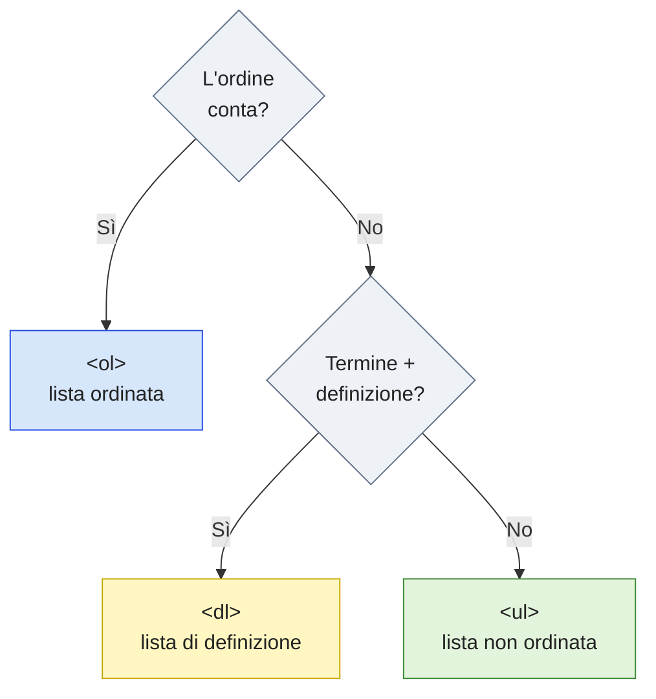

*📊 Quale lista scegliere: dipende dal significato dei contenuti, non dal loro aspetto.*

> 💡 **Approfondimento** — Ogni volta che ti trovi a formattare manualmente un elenco con trattini o numeri scritti a mano dentro un `<p>`, fermati: è quasi sempre il segnale che dovresti usare una vera lista HTML. Il codice risulterà più semantico, più accessibile e più semplice da formattare con il CSS in seguito.

---

<a id="52-liste-non-ordinate"></a>

**⬆️ [Torna all'Indice del Modulo](#indice-modulo)**

## 5.2 Liste non ordinate

Le liste non ordinate utilizzano il tag `<ul>` (*unordered list*). Ogni elemento viene inserito mediante il tag `<li>` (*list item*).

Esempio:

```html
<ul>
  <li>HTML</li>
  <li>CSS</li>
  <li>JavaScript</li>
</ul>
```

Il browser visualizza un elenco puntato, con un pallino davanti a ciascun elemento. Le liste non ordinate sono la scelta corretta quando **l'ordine degli elementi non è rilevante** dal punto di vista logico.

---

<a id="53-liste-ordinate"></a>

**⬆️ [Torna all'Indice del Modulo](#indice-modulo)**

## 5.3 Liste ordinate

Quando è importante mantenere una sequenza precisa si utilizza il tag `<ol>` (*ordered list*).

Esempio:

```html
<ol>
  <li>Aprire Visual Studio Code.</li>
  <li>Creare index.html.</li>
  <li>Scrivere il codice.</li>
  <li>Salvare.</li>
</ol>
```

Il browser numererà automaticamente gli elementi (1, 2, 3, 4...), senza che tu debba scrivere i numeri manualmente. Le liste ordinate sono perfette per rappresentare procedure, classifiche, istruzioni passo-passo: qualunque cosa in cui la sequenza abbia importanza logica.

> 💡 **Approfondimento** — Il tag `<ol>` accetta alcuni attributi utili: `start` per far partire la numerazione da un numero diverso (`<ol start="5">`), `reversed` per numerare al contrario (comodo per le classifiche) e `type` per scegliere lettere o numeri romani (`type="A"`, `type="I"`).

---

<a id="54-elementi-della-lista"></a>

**⬆️ [Torna all'Indice del Modulo](#indice-modulo)**

## 5.4 Elementi della lista

Ogni elemento della lista viene rappresentato dal tag `<li>`. Non importa se la lista è ordinata o non ordinata: gli elementi vengono sempre creati mediante `<li>`, ed è il tag "contenitore" esterno (`<ul>` oppure `<ol>`) a determinare se il browser mostrerà pallini o numeri.

Questo significa che puoi trasformare una lista puntata in una lista numerata semplicemente cambiando `<ul>` in `<ol>` (e viceversa), senza toccare il contenuto interno degli elementi `<li>`.

Ricorda infine che gli unici figli diretti ammessi di `<ul>` e `<ol>` sono gli elementi `<li>`: qualsiasi altro contenuto va inserito *dentro* un `<li>`.

---

<a id="55-liste-annidate"></a>

**⬆️ [Torna all'Indice del Modulo](#indice-modulo)**

## 5.5 Liste annidate

È possibile inserire una lista all'interno di un'altra, per rappresentare strutture gerarchiche a più livelli.

Esempio:

```html
<ul>
  <li>
    Programmazione
    <ul>
      <li>HTML</li>
      <li>CSS</li>
      <li>JavaScript</li>
    </ul>
  </li>
  <li>Database</li>
</ul>
```

Nota bene: la lista interna (`<ul>`) viene inserita **dentro** il tag `<li>` del suo elemento "padre" (Programmazione), non dopo di esso. Le liste annidate vengono spesso utilizzate per rappresentare menu di navigazione a più livelli e mappe del sito.

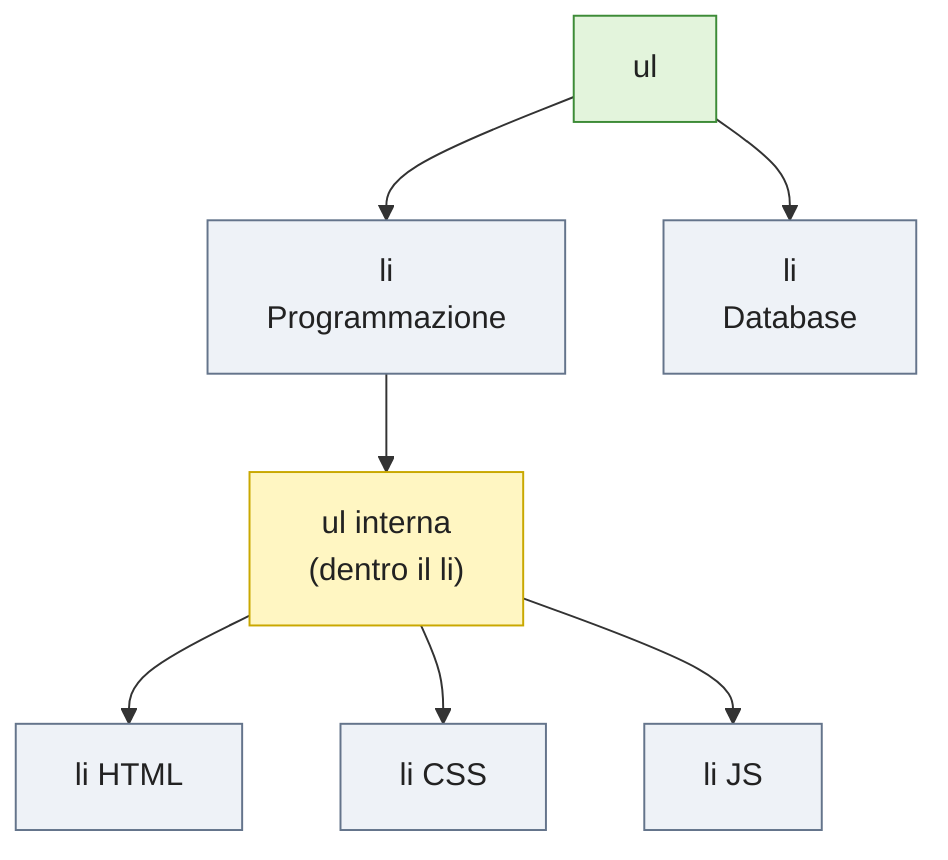

*📊 Nelle liste annidate la lista interna è figlia del `<li>` padre, non della lista esterna.*

---

<a id="56-liste-di-definizione"></a>

**⬆️ [Torna all'Indice del Modulo](#indice-modulo)**

## 5.6 Liste di definizione

Le liste di definizione vengono utilizzate per rappresentare coppie di termini e relative definizioni, come in un piccolo glossario.

Tag utilizzati:

| Tag | Descrizione |
| --- | --- |
| `<dl>` | Lista di definizione (*description list*) |
| `<dt>` | Termine (*description term*) |
| `<dd>` | Definizione (*description details*) |

Esempio:

```html
<dl>
  <dt>HTML</dt>
  <dd>Linguaggio di marcatura utilizzato per la struttura delle pagine.</dd>

  <dt>CSS</dt>
  <dd>Foglio di stile utilizzato per la grafica delle pagine.</dd>
</dl>
```

Questo tipo di lista è ideale per FAQ, glossari tecnici, specifiche di prodotto: ogni volta che devi associare un termine breve a una spiegazione più estesa.

> 💡 **Approfondimento** — Un termine può avere anche più definizioni: basta inserire più elementi `<dd>` consecutivi dopo lo stesso `<dt>`.

---

<a id="57-esempio-completo"></a>

**⬆️ [Torna all'Indice del Modulo](#indice-modulo)**

## 5.7 Esempio completo

```html
<!DOCTYPE html>
<html lang="it">
<head>
    <meta charset="UTF-8">
    <title>Liste HTML</title>
</head>
<body>

    <h1>Tecnologie Web</h1>

    <ul>
        <li>HTML</li>
        <li>CSS</li>
        <li>JavaScript</li>
    </ul>

    <h2>Ordine di studio</h2>

    <ol>
        <li>HTML</li>
        <li>CSS</li>
        <li>JavaScript</li>
    </ol>

</body>
</html>
```

---

## ✅ Best Practice

✔ Utilizzare le liste quando gli elementi sono correlati tra loro.

✔ Preferire le liste ordinate per rappresentare procedure e sequenze.

✔ Utilizzare le liste annidate solo quando realmente necessario.

✔ Scegliere il tipo di lista in base al significato dei contenuti, non al suo aspetto (pallini o numeri si possono cambiare con il CSS).

## ❌ Errori comuni

❌ Inserire testo direttamente dentro `<ul>`, senza racchiuderlo in `<li>`.

❌ Dimenticare il tag `<li>`.

❌ Utilizzare le liste soltanto per ottenere un'impaginazione visiva (compito che spetta al CSS).

❌ Inserire una lista annidata fuori dal `<li>` del suo elemento padre.

---

<a id="61-che-cose-un-collegamento-ipertestuale"></a>

**⬆️ [Torna all'Indice del Modulo](#indice-modulo)**

## 6.1 Che cos'è un collegamento ipertestuale

Una delle caratteristiche fondamentali del Web è la possibilità di collegare tra loro documenti differenti. Questi collegamenti prendono il nome di **Hyperlink**, o più semplicemente **Link**.

Quando l'utente fa clic su un collegamento, il browser richiede una nuova risorsa al server e la visualizza, sostituendo (o affiancando, se apre una nuova scheda) la pagina corrente.

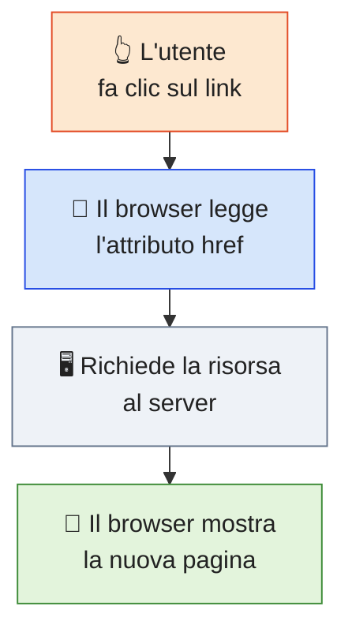

*📊 Cosa accade quando si fa clic su un collegamento ipertestuale.*

L'elemento HTML utilizzato per creare un collegamento è `<a>`. La lettera **a** deriva dalla parola inglese **anchor** (ancora): un'immagine efficace, perché il link "ancora" un punto del documento a un'altra risorsa.

---

<a id="62-il-tag-a"></a>

**⬆️ [Torna all'Indice del Modulo](#indice-modulo)**

## 6.2 Il tag `<a>`

La sintassi generale è la seguente:

```html
<a href="destinazione">
    Testo del collegamento
</a>
```

L'attributo fondamentale è `href` (*hypertext reference*), che indica la destinazione del collegamento. Senza `href`, il tag `<a>` non porta da nessuna parte: è un errore molto comune tra i principianti dimenticarlo.

Nei prossimi paragrafi vedrai che `href` può puntare a destinazioni molto diverse tra loro:

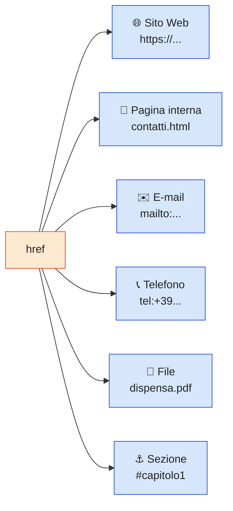

*📊 Un solo attributo, molte destinazioni possibili.*

> 💡 **Approfondimento** — Il contenuto di un collegamento non deve essere necessariamente testo: all'interno di `<a>` puoi inserire anche un'immagine (``, vedi paragrafo 7.2), che diventerà così cliccabile.

---

<a id="63-collegamento-ad-un-sito-web"></a>

**⬆️ [Torna all'Indice del Modulo](#indice-modulo)**

## 6.3 Collegamento ad un sito Web

Esempio:

```html
<a href="https://www.google.it">
    Vai su Google
</a>
```

Facendo clic sul testo "Vai su Google", il browser aprirà il sito indicato dall'attributo `href`.

> ⚠️ **Attenzione** — Scrivi sempre il protocollo (`https://`) nei link verso siti esterni. Un link come `href="www.google.it"` viene interpretato dal browser come un file locale chiamato `www.google.it`, e non porta al sito desiderato.

---

<a id="64-collegamento-ad-una-pagina-interna"></a>

**⬆️ [Torna all'Indice del Modulo](#indice-modulo)**

## 6.4 Collegamento ad una pagina interna

Supponiamo di avere la seguente struttura di progetto:

```
sito/
│
├── index.html
├── contatti.html
└── chi-siamo.html
```

Da `index.html` possiamo collegare la pagina `contatti.html` con un **percorso relativo**, cioè un percorso calcolato a partire dalla posizione del file corrente:

```html
<a href="contatti.html">
    Contatti
</a>
```

---

<a id="65-percorsi-relativi"></a>

**⬆️ [Torna all'Indice del Modulo](#indice-modulo)**

## 6.5 Percorsi relativi

Quando il file di destinazione si trova nella stessa cartella del file corrente, è sufficiente indicarne il nome:

```html
<a href="pagina.html">
```

Se invece si trova in una sottocartella:

```
sito/
│
├── index.html
└── pagine/
    └── contatti.html
```

scriveremo:

```html
<a href="pagine/contatti.html">
```

> ⚠️ **Attenzione** — Nei percorsi maiuscole e minuscole contano: su molti server `Contatti.html` e `contatti.html` sono due file diversi. Per evitare problemi, usa sempre nomi di file tutti minuscoli e senza spazi.

---

<a id="66-tornare-alla-cartella-precedente"></a>

**⬆️ [Torna all'Indice del Modulo](#indice-modulo)**

## 6.6 Tornare alla cartella precedente

Per tornare alla cartella superiore rispetto a quella corrente si utilizza `..` (due punti).

Esempio, con la stessa struttura del paragrafo precedente:

```
sito/
│
├── index.html
└── pagine/
    └── contatti.html
```

Dal file `contatti.html`, che si trova dentro `pagine/`, possiamo tornare alla home in `index.html` risalendo di un livello:

```html
<a href="../index.html">
    Home
</a>
```

In altre parole, `../index.html` significa: "risali di un livello, poi cerca `index.html`".

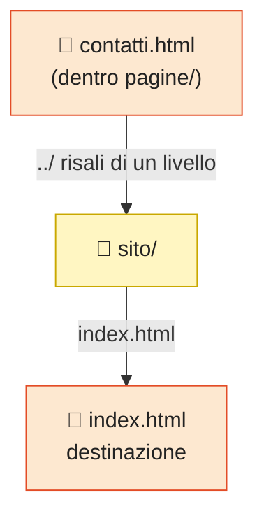

*📊 Il percorso `../index.html` si legge: prima risali di una cartella, poi raggiungi il file.*

> 💡 **Approfondimento** — Puoi concatenare più `../` per risalire di più livelli (es. `../../index.html` per risalire di due cartelle). È un meccanismo molto comune nei siti con struttura a più sezioni.

---

<a id="67-percorsi-assoluti"></a>

**⬆️ [Torna all'Indice del Modulo](#indice-modulo)**

## 6.7 Percorsi assoluti

I percorsi assoluti iniziano sempre con il protocollo, tipicamente `https://`, e puntano a una risorsa indipendentemente da dove si trova il file che contiene il link.

Esempio:

```html
<a href="https://www.wikipedia.org">
    Wikipedia
</a>
```

Usa percorsi assoluti per collegamenti verso siti esterni, e percorsi relativi per collegamenti tra le pagine del tuo stesso sito: in questo modo, se sposti l'intero progetto su un altro dominio, i link interni continueranno a funzionare senza bisogno di modifiche.

Riassumendo, ecco come scegliere il percorso giusto in base alla posizione della destinazione:

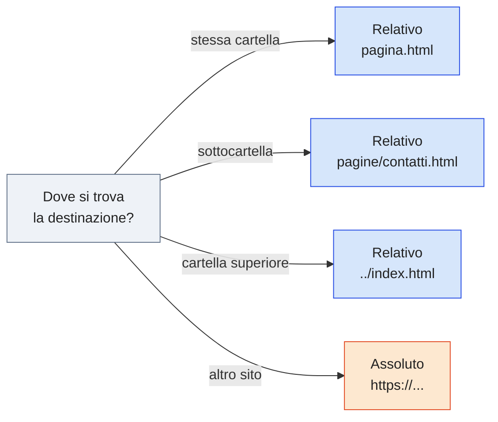

*📊 Percorsi relativi per le pagine del tuo sito, percorsi assoluti per i siti esterni.*

---

<a id="68-aprire-una-nuova-scheda"></a>

**⬆️ [Torna all'Indice del Modulo](#indice-modulo)**

## 6.8 Aprire una nuova scheda

L'attributo `target` permette di scegliere dove aprire il collegamento. Il valore `_blank` apre il link in una nuova scheda del browser:

```html
<a href="https://www.google.it" target="_blank">
    Google
</a>
```

---

<a id="69-sicurezza-dei-link-esterni"></a>

**⬆️ [Torna all'Indice del Modulo](#indice-modulo)**

## 6.9 Sicurezza dei link esterni

Quando utilizziamo `target="_blank"`, è buona norma aggiungere anche l'attributo `rel="noopener noreferrer"`, per motivi di sicurezza: senza di esso, la pagina appena aperta potrebbe in teoria accedere ad alcune informazioni della pagina di origine tramite JavaScript.

Esempio completo:

```html
<a href="https://www.google.it"
   target="_blank"
   rel="noopener noreferrer">
    Google
</a>
```

> 💡 **Approfondimento** — I browser moderni applicano già `noopener` in automatico ai link con `target="_blank"`, ma indicarlo esplicitamente resta una buona pratica e garantisce lo stesso comportamento anche sui browser meno recenti. Il valore `noreferrer`, inoltre, evita di comunicare al sito di destinazione l'indirizzo della pagina di provenienza.

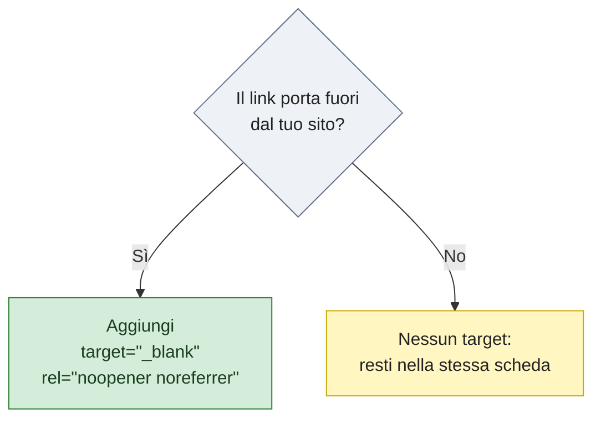

*📊 Quando usare `target="_blank"`: solo per i collegamenti verso l'esterno, sempre insieme a `rel`.*

---

<a id="610-collegamento-ad-una-e-mail"></a>

**⬆️ [Torna all'Indice del Modulo](#indice-modulo)**

## 6.10 Collegamento ad una e-mail

Possiamo far sì che un clic apra automaticamente il programma di posta elettronica predefinito dell'utente, utilizzando il protocollo `mailto:`:

```html
<a href="mailto:info@gcprof-academy.com">
    Scrivici
</a>
```

Puoi anche precompilare l'oggetto del messaggio con il parametro `subject`, scrivendo gli spazi come `%20`:

```html
<a href="mailto:info@gcprof-academy.com?subject=Richiesta%20informazioni">
    Chiedi informazioni
</a>
```

---

<a id="611-collegamento-telefonico"></a>

**⬆️ [Torna all'Indice del Modulo](#indice-modulo)**

## 6.11 Collegamento telefonico

Molto utilizzato nei siti responsive consultati da smartphone, il protocollo `tel:` avvia direttamente una chiamata al numero indicato:

```html
<a href="tel:+390612345678">
    Chiama
</a>
```

> 💡 **Approfondimento** — Scrivi il numero in formato internazionale (con il prefisso, es. `+39` per l'Italia) e senza spazi né trattini: in questo modo il collegamento funziona correttamente da qualsiasi paese. Sui computer privi di funzioni di telefonia, il clic potrebbe non avere alcun effetto oppure aprire un'app di videochiamata.

---

<a id="612-collegamento-ad-un-file"></a>

**⬆️ [Torna all'Indice del Modulo](#indice-modulo)**

## 6.12 Collegamento ad un file

È possibile collegare (e far scaricare) un documento, come un PDF, semplicemente puntando `href` al file:

```html
<a href="documenti/regolamento.pdf">
    Scarica il regolamento
</a>
```

A seconda del tipo di file e delle impostazioni del browser, il documento verrà aperto in una scheda oppure scaricato. Per richiedere esplicitamente il download si utilizza l'attributo visto nel prossimo paragrafo.

---

<a id="613-il-pulsante-download"></a>

**⬆️ [Torna all'Indice del Modulo](#indice-modulo)**

## 6.13 Il pulsante Download

L'attributo `download` suggerisce al browser di scaricare il file invece di aprirlo direttamente nella scheda corrente (comportamento tipico, ad esempio, dei PDF):

```html
<a href="dispensa.pdf" download>
    Scarica PDF
</a>
```

> 💡 **Approfondimento** — Puoi indicare anche il nome con cui il file verrà salvato: `<a href="dispensa.pdf" download="dispensa-html.pdf">`. L'attributo `download` funziona per i file ospitati nello stesso sito: per i file di altri domini i browser lo ignorano.

---

<a id="614-link-allinterno-della-stessa-pagina"></a>

**⬆️ [Torna all'Indice del Modulo](#indice-modulo)**

## 6.14 Link all'interno della stessa pagina

È possibile creare collegamenti che portano a una sezione specifica della stessa pagina, chiamati **ancore interne**. Si assegna un identificatore univoco a un elemento tramite l'attributo `id`:

```html
<h2 id="capitolo1">
    Introduzione
</h2>
```

Successivamente si crea il link facendolo puntare a quell'identificatore, preceduto dal simbolo `#`:

```html
<a href="#capitolo1">
    Vai all'introduzione
</a>
```

> ✅ **Nota** — È proprio questo il meccanismo che abbiamo utilizzato per costruire l'indice cliccabile all'inizio di questo stesso modulo: ogni voce dell'indice è un `<a href="#...">` che punta a un `<a id="...">` posizionato più in basso nella pagina.

> ⚠️ **Attenzione** — Ogni `id` deve essere **unico** all'interno della pagina, non deve contenere spazi e dovrebbe avere un nome significativo (es. `capitolo1`, `contatti`). Puoi anche puntare a una sezione di un'altra pagina, unendo nome del file e identificatore: `<a href="contatti.html#mappa">`.

---

<a id="615-esempio-completo"></a>

**⬆️ [Torna all'Indice del Modulo](#indice-modulo)**

## 6.15 Esempio completo

```html
<!DOCTYPE html>
<html lang="it">
<head>
    <meta charset="UTF-8">
    <title>Link HTML</title>
</head>
<body>

    <h1>I miei collegamenti</h1>

    <p>
        <a href="https://www.google.it">Google</a>
    </p>

    <p>
        <a href="contatti.html">Pagina Contatti</a>
    </p>

    <p>
        <a href="mailto:info@gcprof-academy.com">Invia una mail</a>
    </p>

</body>
</html>
```

---

## ✅ Best Practice

✔ Utilizzare testi di link significativi, che descrivano la destinazione.

✔ Evitare formule generiche come "clicca qui".

✔ Utilizzare `target="_blank"` solo per collegamenti verso siti esterni.

✔ Utilizzare percorsi relativi per le pagine interne al proprio sito.

✔ Indicare sempre il protocollo (`https://`) nei link verso siti esterni.

## ❌ Errori comuni

❌ Dimenticare l'attributo `href`.

❌ Utilizzare URL errati o non aggiornati.

❌ Scrivere `href="www.google.it"` senza protocollo (il browser lo interpreta come un percorso relativo).

❌ Aprire indiscriminatamente tutti i link in nuove schede.

❌ Utilizzare spazi nei nomi dei file collegati (usare trattini, es. `chi-siamo.html`).

---

<a id="71-perche-utilizzare-le-immagini"></a>

**⬆️ [Torna all'Indice del Modulo](#indice-modulo)**

## 7.1 Perché utilizzare le immagini

Le immagini migliorano la comprensione dei contenuti e rendono il sito più gradevole e coinvolgente per chi lo visita. HTML mette a disposizione il tag `` per inserirle all'interno di una pagina.

---

<a id="72-il-tag-img"></a>

**⬆️ [Torna all'Indice del Modulo](#indice-modulo)**

## 7.2 Il tag ``

Sintassi generale:

```html

```

Il tag `` non possiede un tag di chiusura: è un Void Element, esattamente come `<br>` e `<hr>` visti nel Modulo 2.

Gli attributi principali di `` sono tre:

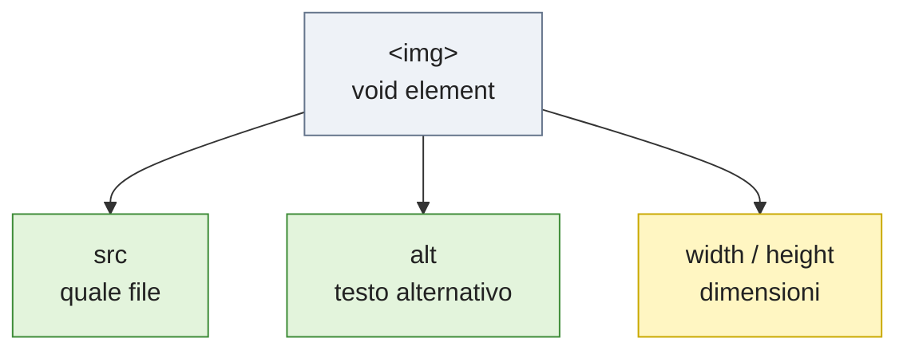

*📊 Attributi di ``: in verde quelli da indicare sempre, in giallo quelli consigliati.*

---

<a id="73-lattributo-src"></a>

**⬆️ [Torna all'Indice del Modulo](#indice-modulo)**

## 7.3 L'attributo `src`

L'attributo `src` (*source*) indica dove si trova il file immagine da caricare.

Esempio:

```html

```

Come per i link, `src` accetta sia percorsi relativi (`images/logo.png`, `../images/logo.png`) sia assoluti (`https://...`), con le stesse regole viste nei paragrafi 6.5, 6.6 e 6.7.

---

<a id="74-lattributo-alt"></a>

**⬆️ [Torna all'Indice del Modulo](#indice-modulo)**

## 7.4 L'attributo `alt`

È uno degli attributi più importanti dell'intero linguaggio HTML dal punto di vista dell'accessibilità:

```html

```

Il testo alternativo (*alt text*) viene utilizzato:

- dagli screen reader, per descrivere l'immagine a persone ipovedenti o non vedenti;
- quando l'immagine non riesce a essere caricata (connessione lenta, file mancante);
- dai motori di ricerca, per indicizzare correttamente il contenuto visivo della pagina.

> ⚠️ **Attenzione** — Un `alt` mancante o poco pertinente non è solo un problema estetico: è una vera e propria barriera di accessibilità per una parte di utenti. Abituati fin da ora a scrivere sempre un `alt` descrittivo e pertinente.

L'unica eccezione riguarda le immagini puramente decorative, che non aggiungono alcuna informazione: si dichiarano con un `alt` vuoto (`alt=""`), così gli screen reader le ignorano. L'attributo, però, deve essere comunque presente.

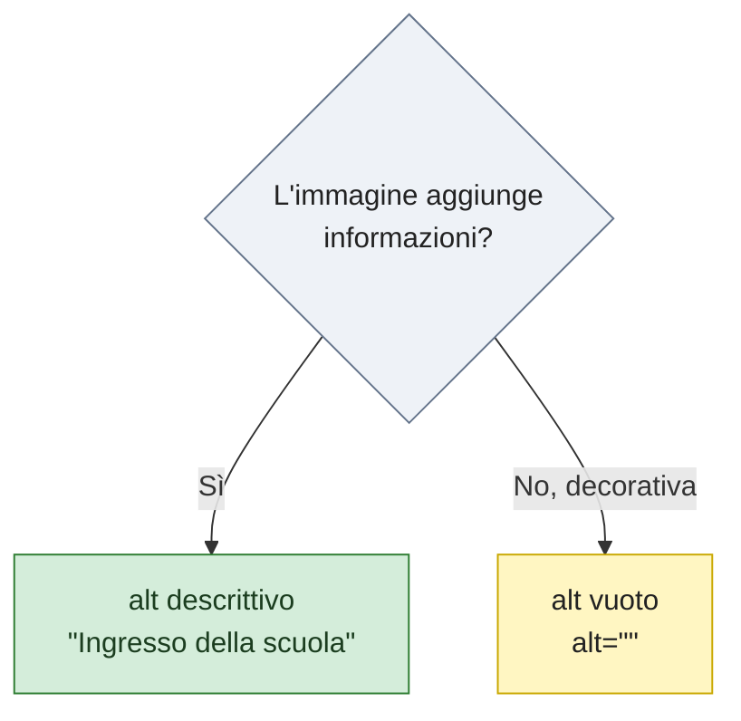

*📊 Come compilare `alt` in base al ruolo dell'immagine.*

Alcuni consigli per scrivere un buon testo alternativo:

- descrivi ciò che l'immagine comunica, non il nome del file (evita `alt="IMG_2043.jpg"`);
- non iniziare con "immagine di..." o "foto di...": lo screen reader annuncia già che si tratta di un'immagine;
- sii breve ma preciso: di norma una frase è sufficiente.

---

<a id="75-dimensioni-dellimmagine"></a>

**⬆️ [Torna all'Indice del Modulo](#indice-modulo)**

## 7.5 Dimensioni dell'immagine

Possiamo specificare larghezza e altezza direttamente nell'HTML, tramite gli attributi `width` e `height`:

```html

```

> 💡 **Approfondimento** — Specificare `width` e `height` nell'HTML aiuta il browser a riservare lo spazio corretto per l'immagine ancora prima che venga completamente caricata, evitando fastidiosi "salti" nel layout della pagina durante il caricamento. Le dimensioni definitive verranno comunque gestite più flessibilmente con il CSS, che vedremo a partire dal Modulo 6.

> ⚠️ **Attenzione** — Indica valori coerenti con le proporzioni reali del file: per un originale da 1200×800 pixel, `width="600" height="400"` mantiene le proporzioni, mentre valori come `width="600" height="200"` deformano l'immagine.

---

<a id="76-cartella-immagini"></a>

**⬆️ [Torna all'Indice del Modulo](#indice-modulo)**

## 7.6 Cartella immagini

È buona norma creare una cartella dedicata alle immagini, come già anticipato nel Modulo 2:

```
progetto/
│
├── index.html
└── images/
    └── logo.png
```

Il codice diventa:

```html

```

---

<a id="77-formati-piu-comuni"></a>

**⬆️ [Torna all'Indice del Modulo](#indice-modulo)**

## 7.7 Formati più comuni

| Formato | Utilizzo |
| --- | --- |
| JPG | Fotografie |
| PNG | Immagini con trasparenza |
| SVG | Loghi e icone (scalabili senza perdita di qualità) |
| WebP | Immagini ottimizzate per il Web (file più leggeri) |
| GIF | Animazioni semplici |

Per scegliere rapidamente il formato più adatto:

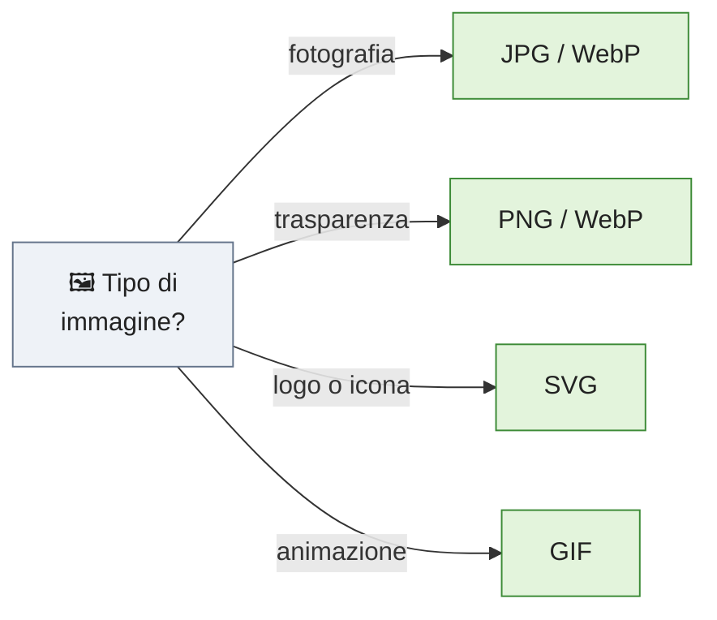

*📊 Il formato giusto in base al tipo di immagine.*

---

<a id="78-immagini-esterne"></a>

**⬆️ [Torna all'Indice del Modulo](#indice-modulo)**

## 7.8 Immagini esterne

È possibile utilizzare immagini ospitate su altri siti, semplicemente indicando l'URL completo nell'attributo `src`:

```html

```

Tuttavia è generalmente preferibile utilizzare immagini ospitate nel proprio sito: il caricamento è più affidabile, non dipende dalla disponibilità di un sito esterno, e non solleva potenziali questioni relative ai diritti d'uso dell'immagine.

---

<a id="79-didascalie-con-figure"></a>

**⬆️ [Torna all'Indice del Modulo](#indice-modulo)**

## 7.9 Didascalie con `<figure>`

HTML5 introduce gli elementi `<figure>` e `<figcaption>`, pensati specificamente per associare un'immagine (o un altro contenuto multimediale) a una didascalia in modo semantico.

Esempio:

```html
<figure>
    
    <figcaption>Laboratorio di Informatica</figcaption>
</figure>
```

Usare `<figure>` e `<figcaption>` è preferibile rispetto a un semplice `` seguito da un `<p>`, perché comunica esplicitamente al browser e ai motori di ricerca che quel testo è una didascalia relativa proprio a quell'immagine.

> 💡 **Approfondimento** — `alt` e `<figcaption>` hanno funzioni diverse: la didascalia è visibile a tutti e accompagna l'immagine, mentre l'`alt` descrive il contenuto visivo a chi non può vederlo. Evita di ripetere lo stesso identico testo in entrambi.

---

<a id="710-esempio-completo"></a>

**⬆️ [Torna all'Indice del Modulo](#indice-modulo)**

## 7.10 Esempio completo

```html
<!DOCTYPE html>
<html lang="it">
<head>
    <meta charset="UTF-8">
    <title>Immagini</title>
</head>
<body>

    <h1>La nostra scuola</h1>

    <figure>
        
        <figcaption>Ingresso principale</figcaption>
    </figure>

</body>
</html>
```

---

## ✅ Best Practice

✔ Utilizzare sempre l'attributo `alt`.

✔ Ridurre il peso delle immagini prima di caricarle sul sito.

✔ Organizzare tutte le immagini nella cartella `images`.

✔ Assegnare ai file nomi descrittivi, in minuscolo e senza spazi (es. `ingresso-scuola.jpg`).

✔ Indicare `width` e `height` coerenti con le proporzioni reali dell'immagine.

✔ Preferire il formato WebP quando possibile, per prestazioni migliori.

## ❌ Errori comuni

❌ Dimenticare l'attributo `alt`.

❌ Inserire immagini enormi e non ottimizzate, che rallentano il caricamento.

❌ Utilizzare spazi nel nome del file (usare trattini o underscore).

❌ Deformare l'immagine indicando `width` e `height` con proporzioni sbagliate.

❌ Salvare le immagini direttamente nella cartella principale del progetto.

---

<a id="esercizi-del-modulo-3"></a>

## 🧪 Esercizi del Modulo 3

Svolgi i seguenti esercizi in ordine, riutilizzando e ampliando la pagina personale creata nel Modulo 2.

1. **Elenco puntato** — Aggiungi alla tua pagina una lista non ordinata (`<ul>`) con almeno quattro voci che rappresentino i tuoi argomenti di studio preferiti.
2. **Elenco numerato** — Crea una lista ordinata (`<ol>`) con i sei passaggi che hai seguito per creare la tua prima pagina Web nel Modulo 2.
3. **Sito a tre pagine** — Crea due nuovi file, `chi-sono.html` e `contatti.html`, nella stessa cartella di `index.html`. Da ciascuna pagina, inserisci dei link `<a>` che permettano di navigare liberamente tra tutte e tre le pagine.
4. **Link esterni e di contatto** — Nella pagina `contatti.html`, aggiungi un link verso un sito Web a tua scelta (aperto in una nuova scheda, con i corretti attributi di sicurezza), un link `mailto:` con una tua e-mail di fantasia, e un link `tel:` con un numero di fantasia.
5. **Galleria fotografica** — Nella pagina `chi-sono.html`, inserisci almeno due immagini (puoi cercarne di libere da diritti online, oppure usarne di tue) racchiuse in `<figure>` con relativa `<figcaption>`, assicurandoti che ogni immagine abbia un `alt` descrittivo corretto.
6. **Indice cliccabile (bonus)** — Nella pagina `chi-sono.html` aggiungi tre sezioni, ciascuna introdotta da un `<h2>` dotato di `id`, e in cima alla pagina un elenco `<ul>` di link ancora che portino alle tre sezioni. Al termine di ogni sezione inserisci un link "Torna su" che riporti al titolo `<h1>` (dotato a sua volta di un `id`).

---

<a id="riepilogo-del-modulo-3"></a>

## 📌 Riepilogo del Modulo 3

In questo modulo hai imparato:

- Come organizzare contenuti con liste non ordinate (`<ul>`), ordinate (`<ol>`) e di definizione (`<dl>`), incluse le liste annidate.
- Come creare collegamenti ipertestuali con il tag `<a>` e l'attributo `href`.
- La differenza tra percorsi relativi e percorsi assoluti, e come risalire tra le cartelle di un progetto.
- Come aprire link in nuove schede in modo sicuro, e come creare link verso e-mail, numeri di telefono e file scaricabili.
- Come creare ancore interne per navigare all'interno della stessa pagina.
- Come inserire immagini con il tag ``, utilizzando correttamente gli attributi `src`, `alt`, `width` e `height`.
- Come associare didascalie semantiche alle immagini con `<figure>` e `<figcaption>`.

Nel prossimo modulo — **Modulo 4: Tabelle e Form** — imparerai a costruire tabelle per dati strutturati e moduli di input per raccogliere informazioni dagli utenti, mettendo subito in pratica quanto imparato con due Mini Progetti guidati.

---
**⬆️ [Torna all'Indice del Modulo](#indice-modulo)**

*Materiale didattico — Prof. Giuseppe Carnabuci per la piattaforma gcprof-academy.com*